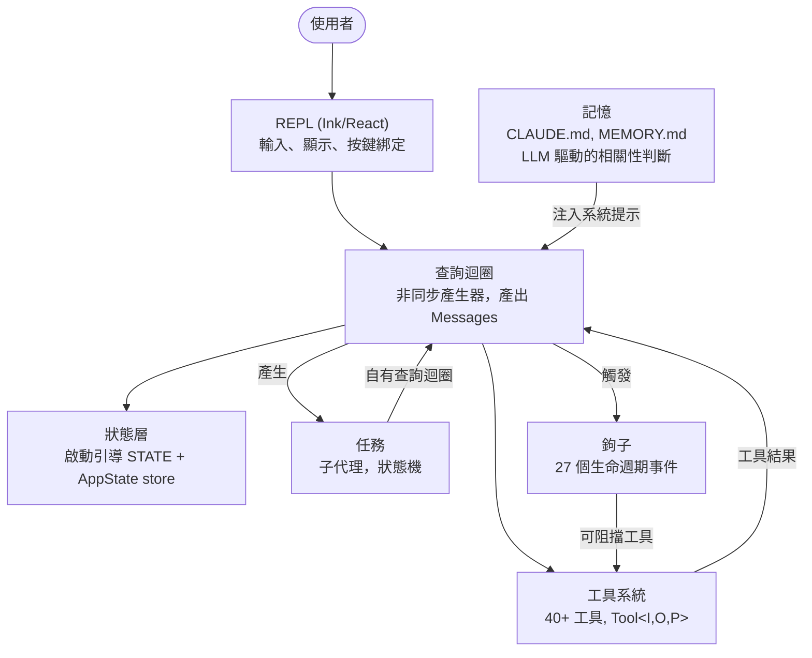
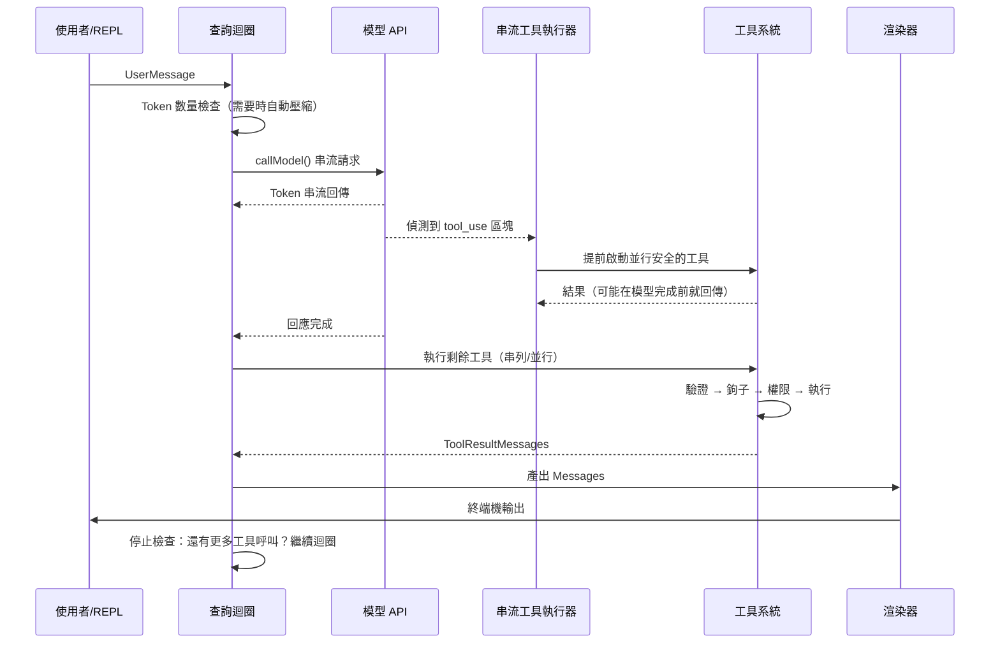
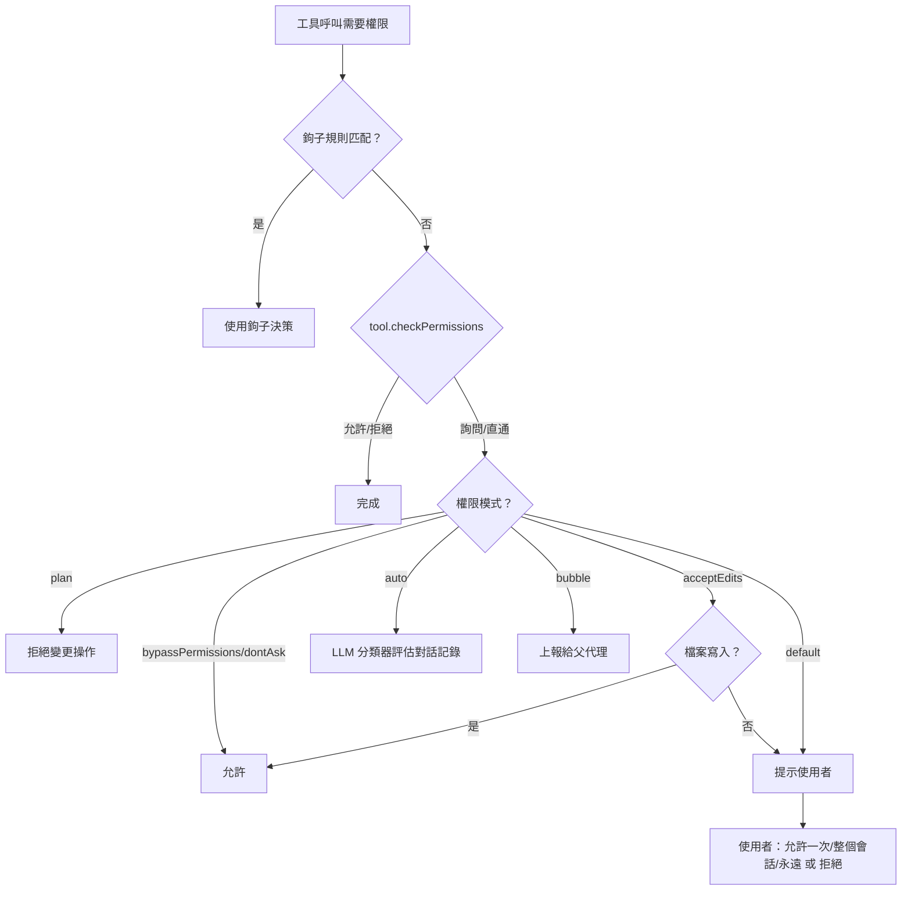
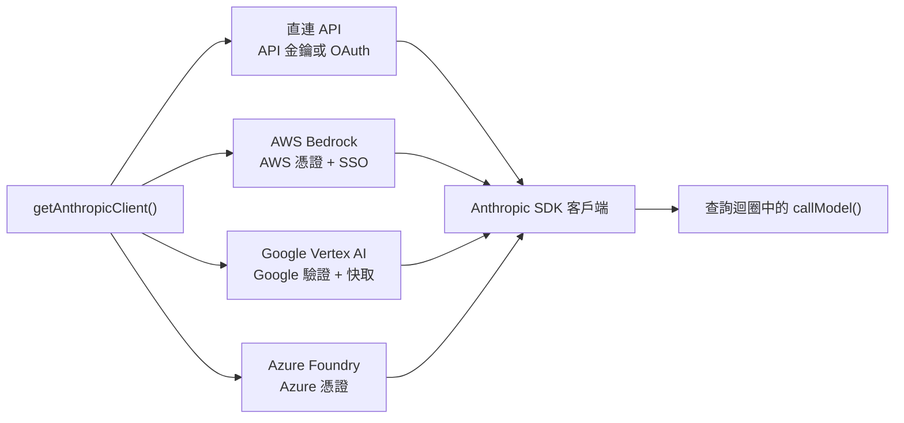
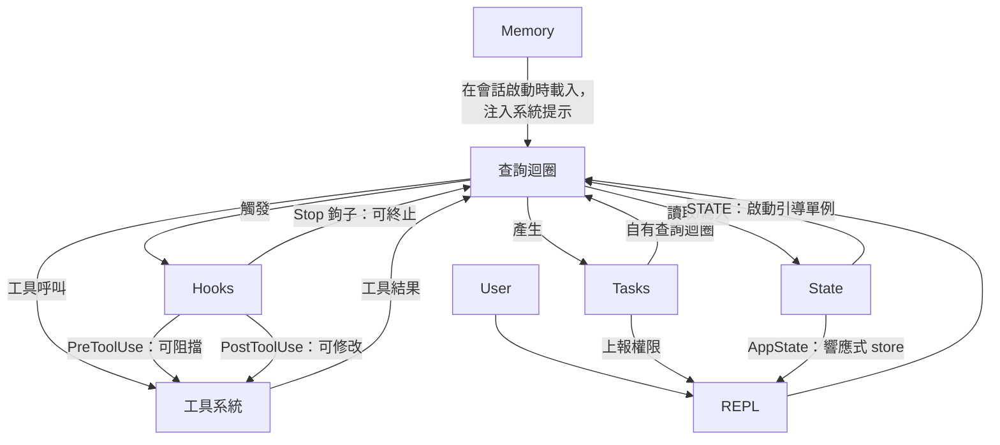

# 第一章：AI 代理的架構

## 你正在看的是什麼

傳統的 CLI 是一個函式。它接收參數、執行工作、然後結束。`grep` 不會自行決定順便執行 `sed`。`curl` 不會打開一個檔案然後根據下載的內容去修補它。契約很簡單：一個命令、一個動作、確定性的輸出。

代理式 CLI 打破了這個契約的每一個部分。它接收自然語言提示，決定要使用什麼工具，以情況所需的任何順序執行它們，評估結果，然後持續迴圈直到任務完成或使用者停止它。這個「程式」不是一個固定的指令序列——它是一個圍繞語言模型的迴圈，在執行期動態產生自己的指令序列。工具呼叫是副作用，模型的推理就是控制流程。

Claude Code 是 Anthropic 對這個理念的生產級實作：一個近兩千個檔案的 TypeScript 單體應用，將終端機轉變為由 Claude 驅動的完整開發環境。它已交付給數十萬名開發者，這意味著每一個架構決策都承載著真實世界的後果。本章給你建立心智模型。六個抽象定義了整個系統。一條資料流將它們串聯起來。一旦你內化了從按鍵到最終輸出的黃金路徑，後續每一章都是對這條路徑某個區段的放大。

接下來的內容是一種回顧式的分解——這六個抽象並非事先在白板上設計出來的。它們是在將生產級代理交付給大量使用者的壓力下逐漸浮現的。以它們現在的樣貌來理解它們，而非以它們被規劃時的樣貌，這為本書其餘部分設定了正確的期望。

---

## 六大核心抽象

Claude Code 建立在六個核心抽象之上。其他所有東西——400 多個工具檔案、分叉的終端渲染器、vim 模擬、成本追蹤器——都是為了支撐這六個而存在。



以下是每一個抽象的功能與存在的理由。

**1. 查詢迴圈**（`query.ts`，約 1,700 行）。一個非同步產生器（async generator），是整個系統的心跳。它串流模型回應、收集工具呼叫、執行它們、將結果附加到訊息歷史，然後迴圈。每一個互動——REPL、SDK、子代理（Sub-Agent）、無頭模式的 `--print`——都流經這個單一函式。它產出（yield）`Message` 物件供 UI 消費。它的回傳型別是一個稱為 `Terminal` 的判別聯合（discriminated union），精確編碼了迴圈停止的原因：正常完成、使用者中斷、token 預算耗盡、停止鉤子介入、最大回合數，或不可恢復的錯誤。產生器模式——而非回呼或事件發射器——提供了自然的背壓（backpressure）、乾淨的取消，以及帶型別的終止狀態。第五章完整涵蓋迴圈的內部機制。

**2. 工具系統**（`Tool.ts`、`tools.ts`、`services/tools/`）。工具（Tool）是代理在世界中能做的任何事：讀取檔案、執行 shell 命令、編輯程式碼、搜尋網路。這份簡潔的目的背後隱藏著大量機制。每個工具實作了一個豐富的介面，涵蓋身份、schema、執行、權限與渲染。工具不只是函式——它們攜帶自己的權限邏輯、並行宣告、進度回報和 UI 渲染。系統將工具呼叫分割為並行和串列批次，而串流執行器在模型尚未完成回應時就開始啟動並行安全的工具。第六章涵蓋完整的工具介面和執行管線（Pipeline）。

**3. 任務（Tasks）**（`Task.ts`、`tasks/`）。任務是背景工作單元——主要是子代理（Sub-Agent）。它們遵循一個狀態機：`pending -> running -> completed | failed | killed`。`AgentTool` 產生一個新的 `query()` 產生器，帶有自己的訊息歷史、工具集和權限模式。任務賦予 Claude Code 遞迴能力：一個代理可以委派給子代理，子代理又可以進一步委派。

**4. 狀態（State）**（兩層）。系統在兩個層級維護狀態。一個可變的單例（`STATE`）持有約 80 個欄位的會話級基礎設施：工作目錄、模型設定、成本追蹤、遙測計數器、會話 ID。它在啟動時設定一次，之後直接修改——沒有響應性。一個極簡的響應式 store（34 行，Zustand 風格）驅動 UI：訊息、輸入模式、工具審批、進度指示。這種分離是刻意的：基礎設施狀態很少變動，不需要觸發重新渲染；UI 狀態持續變動，且必須觸發。第三章深入涵蓋兩層式架構。

**5. 記憶（Memory）**（`memdir/`）。代理跨會話的持久化上下文。三個層級：專案級（倉庫中的 `CLAUDE.md` 檔案）、使用者級（`~/.claude/MEMORY.md`）、以及團隊級（透過符號連結共享）。在會話啟動時，系統掃描所有記憶檔案、解析 frontmatter，然後由 LLM 選擇哪些記憶與當前對話相關。記憶是 Claude Code「記住」你的程式碼庫慣例、架構決策和除錯歷史的方式。

**6. 鉤子（Hooks）**（`hooks/`、`utils/hooks/`）。使用者定義的生命週期攔截器，在 4 種執行類型中的 27 個不同事件上觸發：shell 命令、單次 LLM 提示、多輪代理對話，以及 HTTP webhook。鉤子可以阻擋工具執行、修改輸入、注入額外上下文，或短路整個查詢迴圈。權限系統本身部分透過鉤子實作——`PreToolUse` 鉤子可以在互動式權限提示觸發之前就拒絕工具呼叫。

---

## 黃金路徑：從按鍵到輸出

追蹤一個請求穿過系統的過程。使用者輸入「為登入函式加上錯誤處理」然後按下 Enter。



關於這個流程，有三件事值得注意。

第一，查詢迴圈是一個產生器，不是回呼鏈。REPL 透過 `for await` 從中拉取訊息，這意味著背壓是自然的——如果 UI 跟不上，產生器就暫停。這是刻意選擇了產生器而非事件發射器或可觀察串流。

第二，工具執行與模型串流重疊。`StreamingToolExecutor` 不會等待模型完成才開始啟動並行安全的工具。一個 `Read` 呼叫可以在模型仍在產生其餘回應時就完成並回傳結果。這是推測性執行——如果模型的最終輸出使該工具呼叫無效（罕見但可能），結果會被丟棄。

第三，整個迴圈是可重入的。當模型發出工具呼叫時，結果被附加到訊息歷史，而迴圈用更新後的上下文再次呼叫模型。沒有獨立的「工具結果處理」階段——全都在一個迴圈裡。模型透過不再發出任何工具呼叫來決定何時完成。

---

## 權限系統

Claude Code 在你的機器上執行任意 shell 命令。它編輯你的檔案。它可以產生子行程、發出網路請求、修改你的 git 歷史。沒有權限系統的話，這就是一場安全災難。

系統定義了七種權限模式，從最寬鬆到最嚴格排列：

| 模式 | 行為 |
|------|------|
| `bypassPermissions` | 一切允許。不檢查。僅內部/測試用。 |
| `dontAsk` | 全部允許，但仍記錄。不提示使用者。 |
| `auto` | 對話分類器（LLM）決定允許/拒絕。 |
| `acceptEdits` | 檔案編輯自動批准；其他所有變更操作需提示。 |
| `default` | 標準互動模式。使用者逐一批准每個操作。 |
| `plan` | 唯讀。所有變更操作被阻擋。 |
| `bubble` | 將決策上報給父代理（子代理模式）。 |

當工具呼叫需要權限時，解析遵循一個嚴格的鏈路：



`auto` 模式值得特別關注。它執行一個獨立的、輕量的 LLM 呼叫，將工具調用與對話記錄進行分類。分類器看到工具輸入的精簡表示，然後決定該操作是否與使用者的要求一致。這就是讓 Claude Code 能半自主工作的模式——批准例行操作，同時標記任何看起來偏離使用者意圖的行為。

子代理預設為 `bubble` 模式，這意味著它們無法自行批准自己的危險操作。權限請求向上傳播到父代理或最終到使用者。這防止了子代理靜默執行使用者從未見過的破壞性命令。

---

## 多供應商架構

Claude Code 透過四條不同的基礎設施路徑與 Claude 通訊，對系統其餘部分完全透明。



關鍵洞見是 Anthropic SDK 為每個雲端供應商提供了包裝類別，它們呈現與直連 API 客戶端相同的介面。`getAnthropicClient()` 工廠函式讀取環境變數和設定，以判定使用哪個供應商、建構適當的客戶端、然後回傳。從那一刻起，`callModel()` 和所有其他消費者都將其視為一個通用的 Anthropic 客戶端。

供應商選擇在啟動時確定並儲存在 `STATE` 中。查詢迴圈從不檢查哪個供應商處於活動狀態。這意味著從直連 API 切換到 Bedrock 是一個設定變更，而非程式碼變更——代理迴圈（Agent Loop）、工具系統和權限模型完全與供應商無關。

---

## 建構系統

Claude Code 同時作為 Anthropic 內部工具和公開 npm 套件發布。同一份程式碼庫服務兩者，透過編譯時的功能旗標控制哪些內容被包含。

```typescript
// 由功能旗標守衛的條件式引入
const reactiveCompact = feature('REACTIVE_COMPACT')
  ? require('./services/compact/reactiveCompact.js')
  : null
```

`feature()` 函式來自 `bun:bundle`，Bun 的內建打包器 API。在建構時，每個功能旗標解析為一個布林字面值。打包器的死碼消除隨後在旗標為 false 時完全移除 `require()` 呼叫——模組永遠不會被載入、不會被包含在套件中、也不會被發布。

此模式是一致的：一個頂層的 `feature()` 守衛包裹一個 `require()` 呼叫。使用 `require()` 而非 `import` 是刻意的，因為動態 `require()` 在守衛為 false 時可以被打包器完全消除，而動態 `import()` 則不行（它回傳一個 Promise，打包器必須保留）。

這裡有一個值得一提的諷刺。早期 npm 發布版本附帶的原始碼映射（Source Map）包含了 `sourcesContent`——完整的原始 TypeScript 原始碼，包括僅供內部使用的程式碼路徑。功能旗標成功地移除了執行期程式碼，卻在映射檔中留下了原始碼。這就是 Claude Code 原始碼變得公開可讀的原因。

---

## 各組件如何串聯

六個抽象形成一個依賴圖：



記憶作為系統提示的一部分注入查詢迴圈。查詢迴圈驅動工具執行。工具結果作為訊息回饋到查詢迴圈。任務是帶有隔離訊息歷史的遞迴查詢迴圈。鉤子在定義的時間點攔截查詢迴圈。狀態被所有元件讀寫，響應式 store 則橋接到 UI。

查詢迴圈與工具系統之間的循環依賴是系統的決定性特徵。模型產生工具呼叫。工具執行並產生結果。結果被附加到訊息歷史。模型看到結果並決定下一步做什麼。這個循環持續進行，直到模型停止產生工具呼叫，或外部約束（token 預算、最大回合數、使用者中斷）終止它。

以下是它們如何與後續章節串接：從輸入到輸出的黃金路徑是貫穿整本書的主線。第二章追蹤系統如何啟動引導到這條路徑可以執行的狀態。第三章解釋這條路徑讀寫的兩層式狀態架構。第四章涵蓋查詢迴圈呼叫的 API 層。後續每一章都放大你剛才端到端看過的路徑的某個區段。

---

## 實踐應用

如果你正在建構代理式系統——任何由 LLM 在執行期決定採取什麼行動的系統——以下是 Claude Code 架構中可遷移的模式。

**產生器迴圈模式。** 使用非同步產生器作為你的代理迴圈，而非回呼或事件發射器。產生器提供自然的背壓（消費者按自己的節奏拉取）、乾淨的取消（對產生器呼叫 `.return()`），以及帶型別的終止狀態回傳值。它解決的問題：在基於回呼的代理迴圈中，很難知道迴圈何時「完成」以及為什麼完成。產生器讓終止成為型別系統的一等公民。

**自描述工具介面。** 每個工具應該宣告自己的並行安全性、權限需求和渲染行為。不要將這些邏輯放在一個「了解」每個工具的中央協調器中。它解決的問題：中央協調器會變成一個上帝物件，每次新增工具都必須更新。自描述工具線性擴展——新增第 N+1 個工具不需要修改任何現有程式碼。

**將基礎設施狀態與響應式狀態分離。** 並非所有狀態都需要觸發 UI 更新。會話設定、成本追蹤和遙測屬於一個普通的可變物件。訊息歷史、進度指示器和審批佇列屬於響應式 store。它解決的問題：讓所有東西都變成響應式，會為那些在啟動時設定一次、之後讀取一千次的狀態增加訂閱開銷和複雜性。兩個層級對應兩種存取模式。

**權限模式，而非權限檢查。** 定義一小組命名的模式（plan、default、auto、bypass），並透過模式來解析每一個權限決策。不要在工具實作中散佈 `if (isAllowed)` 檢查。它解決的問題：不一致的權限執行。當每個工具都經過相同的基於模式的解析鏈時，你可以僅透過知道哪個模式處於活動狀態就推理出系統的安全態勢。

**透過任務實現遞迴代理架構。** 子代理應該是同一個代理迴圈的新實例，帶有自己的訊息歷史，而非特殊處理的程式碼路徑。權限提升透過 `bubble` 模式向上流動。它解決的問題：子代理邏輯與主代理迴圈分歧，導致行為和錯誤處理中的微妙差異。如果子代理是同一個迴圈，它就繼承所有相同的保證。
