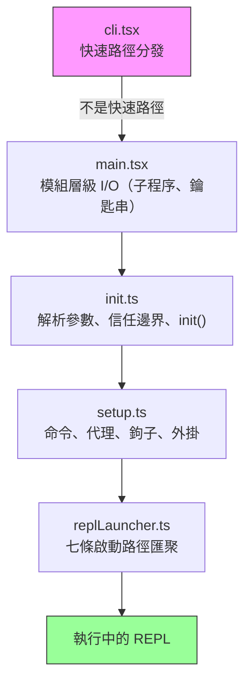
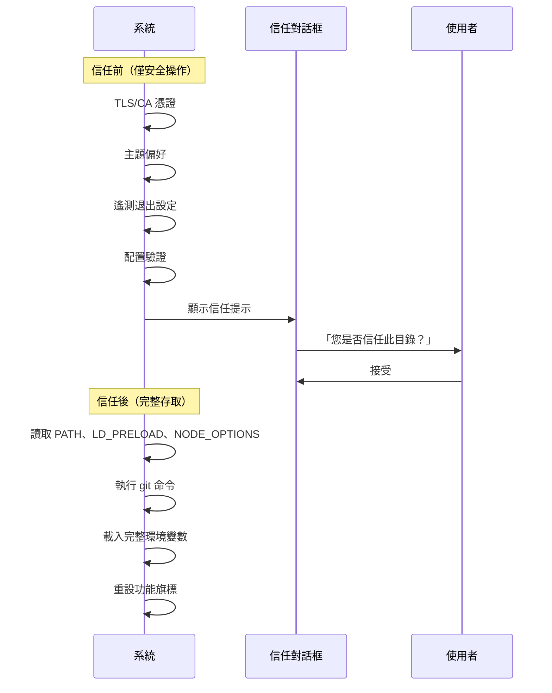

# 第二章：快速啟動 —— 啟動引導管線

如果第一章給了你 Claude Code 架構的地圖，這一章則給你它抵達工作狀態的路線。六大抽象層中的每個元件 —— 查詢迴圈、工具系統、狀態層、鉤子（Hooks）、記憶 —— 都必須在使用者看到游標之前完成初始化。所有這些的時間預算：300 毫秒。

三百毫秒是人類感知工具為「即時」的閾值。超過它，CLI 就會感覺遲鈍。超出太多，開發者就會停止使用。本章中的一切都是為了不超過這條線。

啟動引導（Bootstrap）必須完成四件事：驗證環境、建立安全邊界、配置通訊層，以及渲染 UI。這四件事都必須在 300 毫秒內完成。架構上的洞見是，這四項工作可以部分重疊、精心排序，並積極剪裁，以便塞進對於如此複雜的系統而言看似不可能的預算裡。

關於方法論的說明：本章中的時間戳是近似值，來自程式碼庫自身的效能分析檢查點。它們代表在現代硬體上典型的暖啟動時序。冷啟動會更慢。絕對數值的重要性不如相對結構：哪些操作重疊、哪些阻塞、哪些被延後。

---

## 管線的形狀

啟動管線存在於五個檔案中，依序執行。每個檔案縮小系統接下來需要做的事情的範圍：



每個檔案只做最少的必要工作，然後將控制權交給下一個。`cli.tsx` 試圖在引入任何重量級模組之前就退出。`main.tsx` 在模組求值期間以副作用的方式觸發慢速操作。`init.ts` 解析配置並建立信任邊界。`setup.ts` 註冊各項能力。`replLauncher.ts` 選擇正確的進入點並啟動 UI。

三種平行策略使其快速：

1. **模組層級子程序分發。** 在*模組求值期間*以副作用的方式觸發鑰匙串和 MDM 讀取。這些子程序在剩餘約 135 毫秒的靜態引入載入期間同步執行。
2. **設定階段的 Promise 平行化。** Socket 綁定、鉤子快照、命令載入和代理定義載入全都並行執行。
3. **渲染後延遲預取。** 使用者在輸入第一條訊息之前不需要的所有東西 —— git 狀態、模型能力、AWS 憑證 —— 都在提示符可見之後才執行。

第四種策略較不明顯但同樣重要：**動態引入以延遲模組求值**。程式碼庫在至少十幾個地方使用 `await import('./module.js')` 來避免在需要之前載入程式碼。OpenTelemetry（400KB + 700KB gRPC）只在遙測初始化時載入。React 元件只在渲染時載入。每個動態引入以冷路徑延遲（首次使用時觸發模組求值）換取熱路徑速度（啟動時不需要為可能永遠用不到的模組付出代價）。

---

## 階段 0：快速路徑分發（cli.tsx）

程序進入的第一個檔案 `cli.tsx` 只有一個任務：判斷是否真的需要完整的啟動引導管線。許多呼叫方式 —— `claude --version`、`claude --help`、`claude mcp list` —— 只需要一個特定的回答，別無其他。載入 React、初始化遙測、讀取鑰匙串和設定工具系統都是純粹的浪費。

模式是：檢查 `argv`，動態引入你需要的處理器，然後在系統其餘部分載入之前退出。

```typescript
// 快速路徑模式的虛擬碼
if (args.length === 1 && args[0] === '--version') {
  const { printVersion } = await import('./commands/version.js')
  await printVersion()
  process.exit(0)
}
```

大約有十幾條快速路徑涵蓋版本、幫助、配置、MCP 伺服器管理和更新檢查。具體細節不重要 —— 重要的是模式。每條路徑動態引入恰好一個模組，呼叫一個函式，然後退出。程式碼庫的其餘部分永遠不會載入。

這是啟動引導中反覆出現的一個原則的首次體現：**透過更了解意圖來減少工作**。argv 陣列揭示了使用者的意圖。如果意圖是狹窄的，執行路徑也應該是狹窄的。

如果沒有匹配任何快速路徑，`cli.tsx` 會直接進入完整的 `main.tsx` 引入，真正的啟動開始。

---

## 階段 1：模組層級 I/O（main.tsx）

當 `main.tsx` 被引入時，它的模組層級副作用在求值期間觸發 —— 在檔案中的任何函式被呼叫之前。這是整個啟動引導中最關鍵的效能技巧：

```typescript
// 這些在引入時執行，而非在呼叫時執行
const mdmPromise = startMDMSubprocess()
const keychainPromise = readKeychainCredentials()
```

當 JavaScript 引擎求值 `main.tsx` 及其傳遞性引入的其餘部分（約 138 毫秒的模組求值）時，這兩個 Promise 已經在執行中了。MDM（行動裝置管理）子程序檢查組織的安全策略。鑰匙串讀取擷取已儲存的憑證。兩者都是 I/O 密集型操作，否則會在關鍵路徑上序列化。

洞見是：模組求值不是閒置時間 —— 它是你可以與 I/O 重疊的時間。當 `main.tsx` 的匯出函式首次被呼叫時，這些 Promise 通常已經解析完成了。

這項技巧需要在相關檔案中抑制 ESLint 的 top-level-await 和 side-effect-in-module-scope 規則。程式碼庫有一條專門針對 `process.env` 存取模式的自訂 ESLint 規則，允許在模組範圍內進行受控的副作用，同時防止其他地方出現不受控的副作用。

---

## 階段 2：解析與信任（init.ts）

`init()` 函式是記憶化（memoized）的 —— 多次呼叫是安全的，且返回相同的結果。這很重要，因為多個進入點（REPL、列印模式、SDK 模式）可能各自呼叫 `init()`，而記憶化保證它只執行一次。

此函式透過 Commander 解析命令列參數，從多個來源（全域設定、專案設定、環境變數）載入配置，然後到達管線中最重要的邊界。

### 信任邊界

在信任邊界之前，系統以受限模式運行。通過之後，完整能力可用。這個邊界存在的原因是 Claude Code 會讀取環境變數 —— 而環境變數可以被污染。



信任邊界不是關於使用者信任 Claude Code。而是關於 Claude Code 信任*環境*。惡意的 `.bashrc` 可以設定 `LD_PRELOAD` 將程式碼注入到每個子程序中。信任對話框確保使用者明確同意在一個可能由他人配置的目錄中操作。

系統有十個不同的信任敏感操作。在使用者接受信任對話框之前，只有安全操作會執行：TLS 憑證配置、主題偏好、遙測退出。信任之後，系統讀取可能危險的環境變數（PATH、LD_PRELOAD、NODE_OPTIONS），執行 git 命令，並套用完整的環境配置。

### preAction 鉤子

Commander 的 `preAction` 鉤子是架構的關鍵樞紐。Commander 解析命令結構（旗標、子命令、位置參數）*而不*執行任何東西。`preAction` 鉤子在解析之後、匹配的命令處理器執行之前觸發：

```typescript
program.hook('preAction', async (thisCommand) => {
  await init(thisCommand)
})
```

這種分離意味著快速路徑命令（在 Commander 載入之前在 `cli.tsx` 中處理的命令）永遠不需要付出 `init()` 的代價。只有需要完整環境的命令才會觸發初始化。

---

## 階段 3：設定（setup.ts）

`init()` 完成後，`setup()` 註冊系統所需的所有能力：

```mermaid
gantt
    title 階段 3：平行設定
    dateFormat X
    axisFormat %Lms

    section 循序
    命令註冊   :0, 5
    section 平行
    代理定義      :5, 15
    鉤子註冊      :5, 12
    外掛初始化  :5, 20
    MCP 伺服器連接 :5, 25
```



命令、代理、鉤子和外掛在可能的範圍內全部平行註冊。設定階段是系統從「我知道我的配置」轉變為「我擁有所有能力」的地方。設定完成後，每個工具都已註冊，每個鉤子都已連接，系統準備好處理使用者輸入。

設定階段也處理安全鉤子快照。鉤子配置從磁碟讀取一次，凍結為不可變的快照，並在整個工作階段中使用。之後對磁碟上鉤子配置檔案的修改會被忽略。這防止攻擊者在工作階段開始後修改鉤子規則 —— 凍結的快照是權限決策的唯一真實來源。

---

## 階段 4：啟動（replLauncher.ts）

七條不同的程式碼路徑匯聚在 `replLauncher.ts`：互動式 REPL、列印模式（`--print`）、SDK 模式、恢復（`--resume`）、繼續（`--continue`）、管道模式和無頭模式。啟動器檢查 `init()` 產生的配置，並分發到正確的進入點。

兩個範例展示了這個範圍：

**互動式 REPL** —— 標準情況。啟動器掛載 React/Ink 元件樹、啟動終端渲染器，並進入事件迴圈。使用者看到提示符，可以開始輸入。

**列印模式**（`--print`）—— 從 argv 取得的單一提示。啟動器建立一個沒有 React 樹的無頭查詢迴圈，執行到完成，將輸出串流到 stdout，然後退出。相同的代理迴圈，不同的呈現方式。

重要的細節：所有七條路徑最終都呼叫 `query()` —— 第一章中相同的代理迴圈。啟動路徑決定迴圈*如何*呈現（互動式終端、單次執行、SDK 協定），而非它*做什麼*。這種匯聚使架構可測試且可預測：無論使用者如何呼叫 Claude Code，核心行為都是相同的。

---

## 啟動時間線

以下是完整管線在時間上的樣貌：

```mermaid
gantt
    title 啟動引導時間線（約 240ms）
    dateFormat X
    axisFormat %Lms

    section 階段 0
    快速路徑檢查          :0, 5

    section 階段 1
    模組求值        :5, 143
    MDM 子程序（平行） :8, 60
    鑰匙串讀取（平行）  :8, 50

    section 階段 2
    Commander 解析          :143, 146
    init()                   :146, 160
    信任邊界           :160, 175

    section 階段 3
    setup() + 平行註冊 :175, 210

    section 階段 4
    啟動路徑選擇    :210, 215
    首次渲染             :215, 240
```



關鍵路徑貫穿模組求值（整個最長的單一階段，約 138 毫秒），然後是 Commander 解析、init 和 setup。平行 I/O 操作（MDM、鑰匙串）與模組求值重疊，通常在被需要之前就已解析完成。

### 效能預算

| 階段 | 時間 | 做了什麼 |
|-------|------|-------------|
| 快速路徑檢查 | 約 5ms | 檢查 argv，可能的話提早退出 |
| 模組求值 | 約 138ms | 引入樹，觸發平行 I/O |
| Commander 解析 | 約 3ms | 解析旗標和子命令 |
| init() | 約 14ms | 配置解析、信任邊界 |
| setup() | 約 35ms | 命令、代理、鉤子、外掛 |
| 啟動 + 首次渲染 | 約 25ms | 選擇路徑、掛載 React、首次繪製 |
| **總計** | **約 240ms** | 在 300ms 預算之內 |

在現代機器上總計約 240 毫秒 —— 在 300 毫秒預算下有 60 毫秒的餘裕。冷啟動（重開機後首次執行、OS 快取為空）可能將模組求值推到 200 毫秒以上，使總計更接近上限。

---

## 遷移系統

簡要說明一個在 init 期間執行的子系統：結構描述遷移。Claude Code 將配置和工作階段資料儲存在本地檔案和目錄中。當格式在版本之間變更時，遷移會在啟動時自動執行。

每個遷移是一個帶有版本號的函式。系統檢查當前結構描述版本與最高遷移版本的對比，依序執行待處理的遷移，然後更新版本。遷移是冪等且快速的（操作的是小型本地檔案，而非資料庫）。整個遷移過程通常在 5 毫秒內完成。如果遷移失敗，它會記錄錯誤並繼續 —— 對於本地配置來說，可用性勝過嚴格一致性。

---

## 啟動過程對系統設計的啟示

啟動引導管線是一項關於逐步縮小範圍的研究。每個階段都減少了可能性的空間：

- 階段 0 從「任何 CLI 呼叫」縮小到「需要完整啟動引導」
- 階段 1 從「所有東西都必須載入」縮小到「與 I/O 平行載入」
- 階段 2 從「未知環境」縮小到「受信任的已配置環境」
- 階段 3 從「沒有能力」縮小到「完全註冊」
- 階段 4 從「七種可能的模式」縮小到「一條具體的啟動路徑」

當 REPL 渲染時，每個決定都已經做出。查詢迴圈接收到一個完全配置好的環境，對於它處於什麼模式、哪些工具可用、或適用什麼權限沒有任何模糊之處。300 毫秒的預算不僅是效能目標 —— 它是一個強制函式，防止啟動引導變成一個惰性初始化系統，在那裡決策被延遲並散布在整個程式碼庫中。

---

## 實踐應用

**將 I/O 與初始化重疊。** 在模組求值時觸發慢速操作（子程序啟動、憑證讀取、網路檢查），在它們被需要之前。JavaScript 引擎無論如何都在做同步工作 —— 利用那段時間進行平行 I/O。模式是：在檔案頂部 `const promise = startSlowThing()`，在使用點 `await promise`。

**盡早縮小範圍。** 啟動引導管線的五個檔案形成一個漏斗：每個階段消除後續階段不需要做的工作。快速路徑分發是最戲劇性的例子，但原則適用於各處。如果你能在解析時確定某條程式碼路徑是不必要的，就跳過它。

**明確建立信任邊界。** 如果你的應用程式從它無法控制的環境中讀取（環境變數、配置檔案、shell 設定），在「使用者同意前可以安全讀取」和「只在同意後讀取」之間畫一條清楚的線。信任邊界防止一類攻擊，在這類攻擊中，惡意環境在使用者有機會評估之前就污染了應用程式。

**記憶化你的 init 函式。** 使初始化具有冪等性 —— 呼叫兩次產生相同的結果。這消除了當多個進入點可能各自觸發初始化時的排序錯誤。記憶化模式很簡單，但消除了整類重複初始化的錯誤。

**在讓出控制權之前捕獲早期輸入。** 在事件驅動系統中，初始化期間到達的使用者輸入可能會遺失。Claude Code 在任何非同步工作開始之前從 argv 捕獲初始提示，確保 `claude "fix the bug"` 不會在初始化花費超出預期時丟棄提示。
