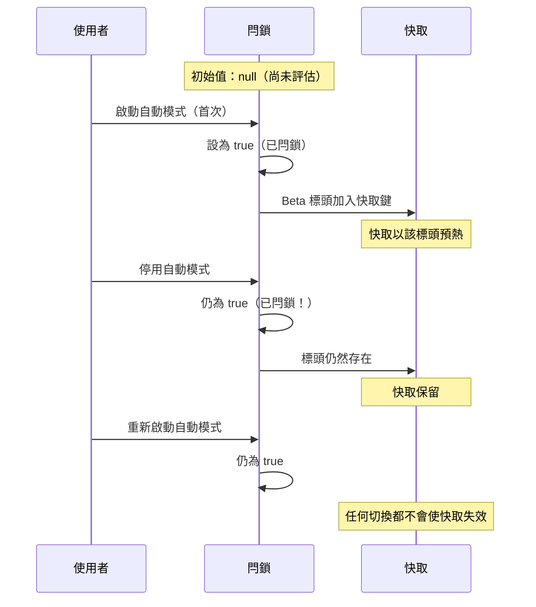
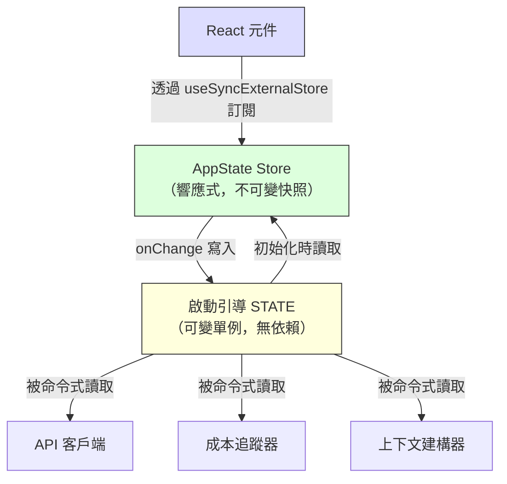

# 第三章：狀態——雙層架構

第二章追蹤了從行程啟動到首次渲染的啟動引導管線。到最後，系統已擁有一個完整配置的環境。但配置了*什麼*？Session ID 存在哪裡？目前的模型呢？訊息歷史？成本追蹤器？權限模式？狀態存在哪裡，又為什麼存在那裡？

每個長時間運行的應用程式最終都會面臨這個問題。對於簡單的 CLI 工具，答案很平凡——`main()` 裡的幾個變數就夠了。但 Claude Code 不是簡單的 CLI 工具。它是一個透過 Ink 渲染的 React 應用程式，行程生命週期橫跨數小時，外掛系統在任意時間載入，API 層必須從快取的上下文構建提示詞，成本追蹤器在行程重啟後依然留存，還有數十個基礎設施模組需要在不互相匯入的情況下讀寫共享資料。

天真的做法——單一全域 store——會立即失敗。如果成本追蹤器更新的 store 同時也驅動 React 的重新渲染，那每次 API 呼叫都會觸發完整的元件樹協調（reconciliation）。基礎設施模組（啟動引導、上下文建構、成本追蹤、遙測）無法匯入 React。它們在 React 掛載之前就執行了。它們在 React 卸載之後還在執行。它們在根本不存在元件樹的上下文中執行。把所有東西都放進 React 感知的 store 會在整個匯入圖中產生循環依賴。

Claude Code 用雙層架構來解決這個問題：一個可變的行程單例用於基礎設施狀態，一個最小的響應式 store 用於 UI 狀態。本章說明兩個層級、橋接它們的副作用系統，以及依賴此基礎的支援子系統。後續每一章都假設你理解狀態存在哪裡，以及為什麼存在那裡。

---

## 3.1 啟動引導狀態——行程單例

### 為什麼用可變單例

啟動引導狀態模組（`bootstrap/state.ts`）是一個在行程啟動時建立一次的單一可變物件：

```typescript
const STATE: State = getInitialState()
```

這一行上方的註解寫著：`AND ESPECIALLY HERE`。型別定義上方兩行則是：`DO NOT ADD MORE STATE HERE - BE JUDICIOUS WITH GLOBAL STATE`。這些註解帶有一種語氣，像是工程師們曾經親身付出了放任全域物件失控的代價。

在這裡，可變單例是正確的選擇，原因有三。第一，啟動引導狀態必須在任何框架初始化之前就可用——在 React 掛載之前、在 store 建立之前、在外掛載入之前。模組作用域初始化是唯一在匯入時就能保證可用性的機制。第二，這些資料本質上是行程範圍的：session ID、遙測計數器、成本累加器、快取路徑。沒有有意義的「先前狀態」可以做差異比對，沒有訂閱者需要通知，沒有復原歷史。第三，這個模組必須是匯入依賴圖中的葉節點。如果它匯入了 React、store 或任何服務模組，就會產生打斷第二章描述的啟動引導順序的循環。由於它只依賴工具型別和 `node:crypto`，它可以從任何地方被匯入。

### 約 80 個欄位

`State` 型別包含大約 80 個欄位。抽樣即可看出其廣度：

**身分識別與路徑** —— `originalCwd`、`projectRoot`、`cwd`、`sessionId`、`parentSessionId`。`originalCwd` 在行程啟動時透過 `realpathSync` 解析並進行 NFC 正規化。之後永不改變。

**成本與指標** —— `totalCostUSD`、`totalAPIDuration`、`totalLinesAdded`、`totalLinesRemoved`。這些在整個 session 中單調遞增地累積，並在退出時持久化到磁碟。

**遙測** —— `meter`、`sessionCounter`、`costCounter`、`tokenCounter`。OpenTelemetry 的控制代碼，全部可為 null（在遙測初始化之前為 null）。

**模型配置** —— `mainLoopModelOverride`、`initialMainLoopModel`。當使用者在 session 中途切換模型時設定 override。

**Session 旗標** —— `isInteractive`、`kairosActive`、`sessionTrustAccepted`、`hasExitedPlanMode`。在 session 期間控制行為的布林值。

**快取優化** —— `promptCache1hAllowlist`、`promptCache1hEligible`、`systemPromptSectionCache`、`cachedClaudeMdContent`。這些存在的目的是防止多餘的運算和提示快取失效。

### Getter/Setter 模式

`STATE` 物件永遠不會被匯出。所有存取都透過大約 100 個獨立的 getter 和 setter 函式：

```typescript
// 虛擬碼——說明此模式
export function getProjectRoot(): string {
  return STATE.projectRoot
}

export function setProjectRoot(dir: string): void {
  STATE.projectRoot = dir.normalize('NFC')  // 每個路徑 setter 都做 NFC 正規化
}
```

這個模式強制實現了封裝、每個路徑 setter 的 NFC 正規化（防止 macOS 上的 Unicode 不匹配）、型別窄化，以及啟動引導隔離。代價是冗長——八十個欄位寫了一百個函式。但在一個隨意修改就可能搞壞 50,000 個 token 提示快取的程式碼庫中，明確性贏了。

### 信號模式

啟動引導無法匯入監聽器（它是 DAG 的葉節點），因此它使用一個叫做 `createSignal` 的最小發布/訂閱原語。`sessionSwitched` 信號恰好有一個消費者：`concurrentSessions.ts`，它負責讓 PID 檔案保持同步。信號以 `onSessionSwitch = sessionSwitched.subscribe` 的形式暴露，讓呼叫者可以註冊自己，而啟動引導不需要知道它們是誰。

### 五個黏性閂鎖

啟動引導狀態中最微妙的欄位是五個布林閂鎖，它們遵循相同的模式：一旦某個特性在 session 中首次被啟動，對應的旗標就在 session 的剩餘時間內保持為 `true`。它們全都為了同一個原因而存在：提示快取的保存。



Claude 的 API 支援伺服器端提示快取。當連續的請求共享相同的系統提示詞前綴時，伺服器會重用已快取的運算結果。但快取鍵包含 HTTP 標頭和請求主體欄位。如果一個 beta 標頭出現在第 N 個請求中但沒出現在第 N+1 個，快取就會失效——即使提示詞內容完全相同。對於超過 50,000 個 token 的系統提示詞，快取未命中的代價非常昂貴。

五個閂鎖：

| 閂鎖 | 它防止什麼 |
|-------|-----------|
| `afkModeHeaderLatched` | Shift+Tab 自動模式切換會使 AFK beta 標頭時開時關 |
| `fastModeHeaderLatched` | 快速模式冷卻期進入/退出會切換快速模式標頭 |
| `cacheEditingHeaderLatched` | 遠端功能旗標的變更會使每個活躍使用者的快取失效 |
| `thinkingClearLatched` | 在確認快取未命中（閒置 >1 小時）後觸發。防止重新啟用思考區塊時使剛預熱的快取失效 |
| `pendingPostCompaction` | 一次性消費旗標，用於遙測：區分因壓縮引起的快取未命中與因 TTL 過期引起的快取未命中 |

五個都使用三態型別：`boolean | null`。初始值 `null` 表示「尚未評估」。`true` 表示「已閂鎖」。一旦設為 `true` 就永遠不會回到 `null` 或 `false`。這就是閂鎖的定義特性。

實作模式：

```typescript
function shouldSendBetaHeader(featureCurrentlyActive: boolean): boolean {
  const latched = getAfkModeHeaderLatched()
  if (latched === true) return true       // 已閂鎖——總是發送
  if (featureCurrentlyActive) {
    setAfkModeHeaderLatched(true)          // 首次啟動——閂鎖它
    return true
  }
  return false                             // 從未啟動——不發送
}
```

為什麼不直接總是發送所有 beta 標頭？因為標頭是快取鍵的一部分。發送一個無法識別的標頭會建立一個不同的快取命名空間。閂鎖確保你只在真正需要時才進入某個快取命名空間，然後就留在那裡。

---

## 3.2 AppState——響應式 Store

### 34 行的實作

UI 狀態 store 位於 `state/store.ts`：

Store 的實作大約 30 行：一個閉包包裹 `state` 變數，一個 `Object.is` 相等性檢查以防止無意義的更新，同步的監聽器通知，以及一個用於副作用的 `onChange` 回呼。骨架看起來像：

```typescript
// 虛擬碼——說明此模式
function makeStore(initial, onTransition) {
  let current = initial
  const subs = new Set()
  return {
    read:      () => current,
    update:    (fn) => { /* Object.is 守衛，然後通知 */ },
    subscribe: (cb) => { subs.add(cb); return () => subs.delete(cb) },
  }
}
```

三十四行。沒有中介軟體、沒有開發者工具、沒有時間旅行除錯、沒有 action 型別。只有一個閉包包裹可變變數，一個監聽器 Set，以及一個 `Object.is` 相等性檢查。這就是不帶函式庫的 Zustand。

值得審視的設計決策：

**更新器函式模式。** 沒有 `setState(newValue)`——只有 `setState((prev) => next)`。每次修改都接收當前狀態並必須產生下一個狀態，消除了來自並行修改的過期狀態 bug。

**`Object.is` 相等性檢查。** 如果更新器回傳相同的參照，修改就是空操作。沒有監聽器觸發。沒有副作用執行。這對效能至關重要——展開再設定但沒有改變值的元件不會產生重新渲染。

**`onChange` 在監聽器之前觸發。** 可選的 `onChange` 回呼接收新舊狀態，並在任何訂閱者被通知之前同步觸發。這用於必須在 UI 重新渲染之前完成的副作用（3.4 節）。

**沒有中介軟體、沒有開發者工具。** 這不是疏忽。當你的 store 恰好需要三個操作（get、set、subscribe）、一個 `Object.is` 相等性檢查和一個同步的 `onChange` 鉤子時，你擁有的 34 行程式碼比一個依賴更好。你控制精確的語義。你可以在三十秒內讀完整個實作。

### AppState 型別

`AppState` 型別（約 452 行）是 UI 渲染所需的一切的形狀。大多數欄位都包裹在 `DeepImmutable<>` 中，明確排除包含函式型別的欄位：

```typescript
export type AppState = DeepImmutable<{
  settings: SettingsJson
  verbose: boolean
  // ... 約 150 個以上的欄位
}> & {
  tasks: { [taskId: string]: TaskState }  // 包含 abort controller
  agentNameRegistry: Map<string, AgentId>
}
```

交叉型別讓大多數欄位保持深度不可變，同時豁免那些持有函式、Map 和可變參照的欄位。完全不可變是預設的，對於型別系統會與執行時語義不相容的地方則有精確的逃生口。

### React 整合

Store 透過 `useSyncExternalStore` 與 React 整合：

```typescript
// 標準 React 模式——useSyncExternalStore 搭配 selector
export function useAppState<T>(selector: (state: AppState) => T): T {
  const store = useContext(AppStoreContext)
  return useSyncExternalStore(
    store.subscribe,
    () => selector(store.getState()),
  )
}
```

Selector 必須回傳一個已存在的子物件參照（而非新建的物件），這樣 `Object.is` 比較才能防止不必要的重新渲染。如果你寫 `useAppState(s => ({ a: s.a, b: s.b }))`，每次渲染都會產生新的物件參照，元件就會在每次狀態變更時重新渲染。這與 Zustand 使用者面臨的限制相同——比較成本更低，但 selector 的作者必須理解參照相等性。

---

## 3.3 兩個層級如何關聯

兩個層級透過明確、狹窄的介面進行通訊。



啟動引導狀態在初始化時流入 AppState：`getDefaultAppState()` 從磁碟讀取設定（啟動引導幫忙定位的路徑）、檢查功能旗標（啟動引導評估過的）、並設定初始模型（啟動引導從 CLI 參數和設定中解析出的）。

AppState 透過副作用回流到啟動引導狀態：當使用者更改模型時，`onChangeAppState` 呼叫啟動引導中的 `setMainLoopModelOverride()`。當設定變更時，啟動引導中的憑證快取會被清除。

但兩個層級永遠不共享參照。匯入啟動引導狀態的模組不需要知道 React 的存在。讀取 AppState 的元件不需要知道行程單例的存在。

一個具體的例子可以釐清資料流。當使用者輸入 `/model claude-sonnet-4`：

1. 命令處理器呼叫 `store.setState(prev => ({ ...prev, mainLoopModel: 'claude-sonnet-4' }))`
2. Store 的 `Object.is` 檢查偵測到變更
3. `onChangeAppState` 觸發，偵測到模型已變更，呼叫 `setMainLoopModelOverride()`（更新啟動引導）以及 `updateSettingsForSource()`（持久化到磁碟）
4. 所有 store 訂閱者觸發——React 元件重新渲染以顯示新的模型名稱
5. 下一次 API 呼叫從啟動引導狀態中的 `getMainLoopModelOverride()` 讀取模型

步驟 1-4 是同步的。步驟 5 中的 API 客戶端可能在數秒後才執行。但它從啟動引導狀態（在步驟 3 中更新）讀取，而非從 AppState。這就是雙層交接：UI store 是使用者選擇了什麼的真實來源，但啟動引導狀態是 API 客戶端使用什麼的真實來源。

DAG 特性——啟動引導不依賴任何東西，AppState 在初始化時依賴啟動引導，React 依賴 AppState——由一條 ESLint 規則強制執行，該規則防止 `bootstrap/state.ts` 匯入其允許集合之外的模組。

---

## 3.4 副作用：onChangeAppState

`onChange` 回呼是兩個層級同步的地方。每次 `setState` 呼叫都會觸發 `onChangeAppState`，它接收先前和新的狀態，並決定要觸發哪些外部效果。

**權限模式同步**是主要的使用情境。在這個集中化處理器出現之前，權限模式只有 8 個以上修改路徑中的 2 個會同步到遠端 session（CCR）。其他六個——Shift+Tab 循環切換、對話選項、斜線命令、回溯、橋接回呼——全都修改了 AppState 卻沒有通知 CCR。外部的中繼資料就此漂移失去同步。

修復方案：停止在各個修改點散佈通知，改為在一個地方掛鉤差異比對。原始碼中的註解列出了每個出問題的修改路徑，並指出「上面那些分散的呼叫點不需要任何改動」。這就是集中化副作用的架構優勢——覆蓋率是結構性的，而非手動的。

**模型變更**讓啟動引導狀態與 UI 渲染的內容保持同步。**設定變更**清除憑證快取並重新套用環境變數。**詳細模式切換**和**展開檢視**被持久化到全域配置。

這個模式——基於可差異比對的狀態轉換的集中化副作用——本質上就是觀察者模式應用在狀態差異的粒度上，而非個別事件。它的擴展性優於分散的事件發射，因為副作用的數量增長遠慢於修改點的數量增長。

---

## 3.5 上下文建構

`context.ts` 中的三個記憶化（memoized）非同步函式建構了每次對話前綴的系統提示詞上下文。每個函式在每個 session 中只計算一次，而非每回合都計算。

`getGitStatus` 平行執行五個 git 命令（`Promise.all`），產生一個包含當前分支、預設分支、最近提交和工作樹狀態的區塊。`--no-optional-locks` 旗標防止 git 取得寫入鎖，避免與另一個終端機中的並行 git 操作發生干擾。

`getUserContext` 載入 CLAUDE.md 的內容並透過 `setCachedClaudeMdContent` 快取到啟動引導狀態中。這個快取打斷了一個循環依賴：自動模式分類器需要 CLAUDE.md 的內容，但 CLAUDE.md 的載入經過檔案系統，檔案系統經過權限系統，權限系統呼叫分類器。透過快取到啟動引導狀態（DAG 的葉節點），循環被打斷了。

三個上下文函式全都使用 Lodash 的 `memoize`（計算一次，永久快取），而非基於 TTL 的快取。原因是：如果 git 狀態每 5 分鐘重新計算一次，變更就會使伺服器端的提示快取失效。系統提示詞甚至告訴模型：「這是對話開始時的 git 狀態。請注意，此狀態是一個時間點的快照。」

---

## 3.6 成本追蹤

每個 API 回應都流經 `addToTotalSessionCost`，它累計每個模型的使用量、更新啟動引導狀態、回報到 OpenTelemetry，並遞迴處理顧問工具使用（回應中的嵌套模型呼叫）。

成本狀態透過儲存和還原到專案配置檔來存活過行程重啟。Session ID 被用作守衛——只有當持久化的 session ID 與正在恢復的 session 匹配時，成本才會被還原。

直方圖使用蓄水池取樣（Algorithm R）來維持有界的記憶體使用量，同時準確地表示分布。1,024 個條目的蓄水池產生 p50、p95 和 p99 百分位數。為什麼不用簡單的移動平均？因為平均值隱藏了分布形狀。一個 95% 的 API 呼叫花 200 毫秒而 5% 花 10 秒的 session，和一個所有呼叫都花 690 毫秒的 session 有相同的平均值，但使用者體驗截然不同。

---

## 3.7 我們學到了什麼

這個程式碼庫已經從一個簡單的 CLI 成長為一個擁有約 450 行狀態型別定義、約 80 個行程狀態欄位、一個副作用系統、多個持久化邊界和快取優化閂鎖的系統。這些都不是事先設計好的。黏性閂鎖是在快取失效成為可量測的成本問題時才添加的。`onChange` 處理器是在發現 8 個權限同步路徑中有 6 個出問題時才集中化的。CLAUDE.md 快取是在循環依賴浮現時才添加的。

這是複雜應用程式中狀態的自然成長模式。雙層架構提供了足夠的結構來容納這種成長——新的啟動引導欄位不會影響 React 渲染，新的 AppState 欄位不會產生匯入循環——同時保持足夠的彈性來容納原始設計中未預見的模式。

---

## 3.8 狀態架構摘要

| 屬性 | 啟動引導狀態 | AppState |
|---|---|---|
| **位置** | 模組作用域單例 | React context |
| **可變性** | 透過 setter 可變 | 透過更新器產生不可變快照 |
| **訂閱者** | 信號（發布/訂閱）用於特定事件 | `useSyncExternalStore` 用於 React |
| **可用時機** | 匯入時（React 之前） | Provider 掛載之後 |
| **持久化** | 行程退出處理器 | 透過 onChange 寫入磁碟 |
| **相等性** | 不適用（命令式讀取） | `Object.is` 參照檢查 |
| **依賴** | DAG 葉節點（不匯入任何東西） | 從整個程式碼庫匯入型別 |
| **測試重設** | `resetStateForTests()` | 建立新的 store 實例 |
| **主要消費者** | API 客戶端、成本追蹤器、上下文建構器 | React 元件、副作用 |

---

## 實踐應用

**依存取模式分離狀態，而非依領域。** Session ID 屬於單例，不是因為它在抽象意義上是「基礎設施」，而是因為它必須在 React 掛載之前就能讀取，且寫入時不需要通知訂閱者。權限模式屬於響應式 store，因為改變它必須觸發重新渲染和副作用。讓存取模式驅動層級選擇，架構自然就跟上了。

**黏性閂鎖模式。** 任何與快取互動的系統（提示快取、CDN、查詢快取）都面臨相同的問題：在 session 中途改變快取鍵的功能開關會導致失效。一旦某個特性被啟動，它對快取鍵的貢獻就在整個 session 中保持啟動。三態型別（`boolean | null`，意謂「尚未評估/開啟/永不關閉」）讓意圖自我記錄。當快取不在你的掌控之下時，這特別有價值。

**在狀態差異上集中化副作用。** 當多個程式碼路徑可以改變相同的狀態時，不要在各個修改點散佈通知。掛鉤 store 的 `onChange` 回呼並偵測哪些欄位發生了變化。覆蓋率變成結構性的（任何修改都觸發效果），而非手動的（每個修改點都必須記得通知）。

**偏好你擁有的 34 行程式碼，而非你不擁有的函式庫。** 當你的需求恰好是 get、set、subscribe 和一個變更回呼時，最小化的實作讓你完全掌控語義。在一個狀態管理 bug 可能花真金白銀的系統中，這種透明度是有價值的。關鍵洞見是認清你什麼時候*不需要*一個函式庫。

**有意識地使用行程退出作為持久化邊界。** 多個子系統在行程退出時持久化狀態。代價是明確的：非優雅終止（SIGKILL、OOM）會丟失累積的資料。這是可接受的，因為這些資料是診斷性的而非交易性的，而且在每次狀態變更時寫入磁碟對於每個 session 遞增數百次的計數器來說代價太高。