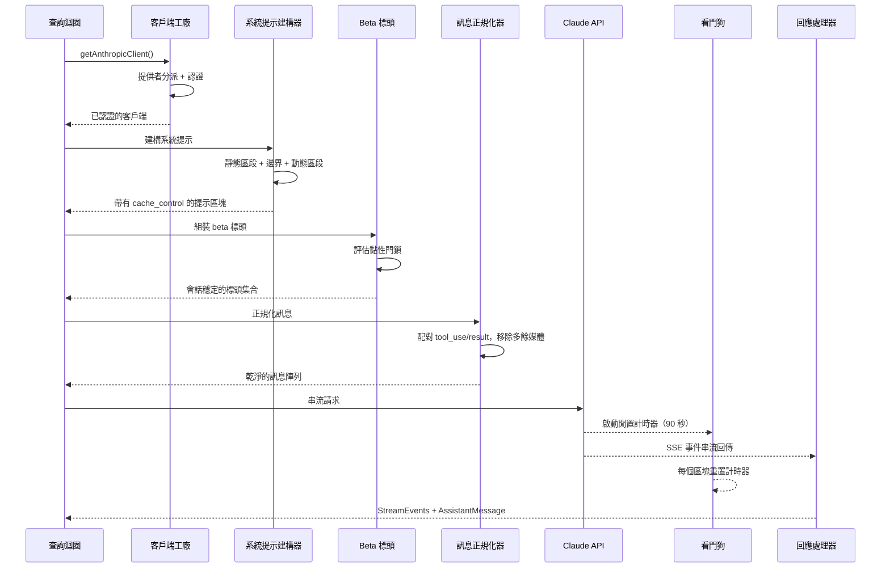
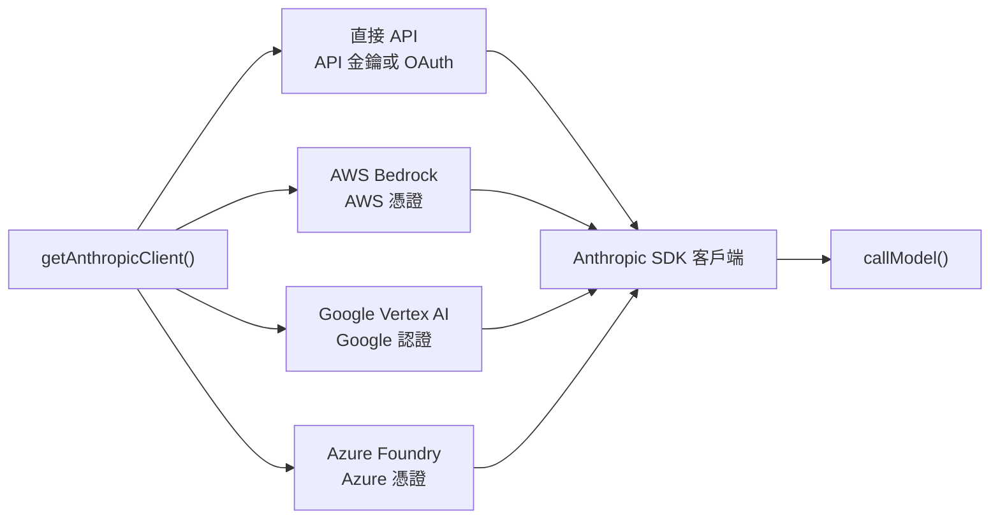
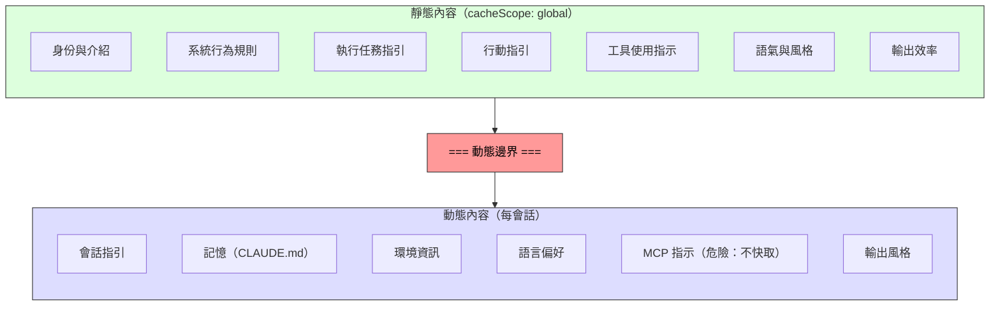

# 第四章：與 Claude 對話 —— API 層

第三章建立了狀態的儲存位置以及兩個層級如何通訊。現在我們追蹤當狀態被實際使用時會發生什麼：系統需要與語言模型對話。Claude Code 中的一切——啟動引導序列、狀態系統、權限框架——都是為了服務這個時刻而存在的。

這個層處理的失敗模式比系統中任何其他部分都多。它必須透過單一透明介面路由四個雲端提供者。它必須以位元組層級的精確度來建構系統提示，清楚了解伺服器的提示快取如何運作，因為一個錯放的區段就能摧毀價值 50,000+ 個 token 的快取。它必須在主動失敗偵測下進行串流回應，因為 TCP 連線會悄無聲息地斷開。而且它必須維護會話穩定的不變量，使得對話進行中的功能旗標變更不會造成隱形的效能斷崖。

讓我們追蹤一次從頭到尾的 API 呼叫。

---

## 多提供者客戶端工廠

`getAnthropicClient()` 函式是所有模型通訊的單一工廠。它回傳一個為目標部署的提供者配置好的 Anthropic SDK 客戶端：

分派完全由環境變數驅動，以固定的優先順序進行評估。所有四個提供者專用的 SDK 類別都透過 `as unknown as Anthropic` 轉型為 `Anthropic`。原始碼中的註解相當坦率：「我們一直在欺騙回傳型別。」這種刻意的型別擦除意味著每個消費者看到的都是統一的介面。程式碼庫的其餘部分從不依據提供者進行分支。

每個提供者 SDK 都是動態匯入的——`AnthropicBedrock`、`AnthropicFoundry`、`AnthropicVertex` 都是帶有各自依賴樹的重量級模組。動態匯入確保未使用的提供者永遠不會被載入。

提供者選擇在啟動時決定並儲存在啟動引導的 `STATE` 中。查詢迴圈從不檢查當前使用的是哪個提供者。從直接 API 切換到 Bedrock 是配置變更，而非程式碼變更。

### buildFetch 包裝器

每個出站的 fetch 都會被包裝以注入一個 `x-client-request-id` 標頭——這是每次請求產生的 UUID。當請求逾時時，伺服器不會為回應分配請求 ID。沒有客戶端的 ID，API 團隊就無法將逾時與伺服端日誌進行關聯。這個標頭彌補了這個缺口。它只會傳送給第一方 Anthropic 端點——第三方提供者可能會拒絕未知的標頭。

---

## 系統提示建構

系統提示是整個系統中對快取最敏感的產物。Claude 的 API 提供伺服端的提示快取：跨請求的相同提示前綴可以被快取，節省延遲和成本。一個 200K token 的對話可能有 50-70K 個 token 與前一輪完全相同。摧毀該快取會迫使伺服器重新處理全部內容。

### 動態邊界標記

提示被建構為一個字串區段的陣列，有一條關鍵的分界線：

邊界之前的所有內容在不同會話、使用者和組織之間都是相同的——它獲得最高層級的伺服端快取。邊界之後的內容包含使用者特定的資料，降級為每會話快取。

區段的命名慣例刻意設計得很醒目。新增區段時必須在 `systemPromptSection`（安全，可快取）和 `DANGEROUS_uncachedSystemPromptSection`（破壞快取，需要原因字串）之間做選擇。`_reason` 參數在執行期未被使用，但作為強制性文件存在——每個破壞快取的區段都在原始碼中攜帶其正當理由。

### 2^N 問題

`prompts.ts` 中的一則註解解釋了為什麼條件區段必須放在邊界之後：

> 這裡的每個條件都是一個執行期位元，否則會導致 Blake2b 前綴雜湊變體呈指數增長（2^N）。

邊界之前的每個布林條件都會使全局快取條目的唯一數量翻倍。三個條件會產生 8 個變體；五個會產生 32 個。靜態區段刻意設計為無條件的。編譯期功能旗標（由打包器解析）可以放在邊界之前。執行期檢查（這是 Haiku 嗎？使用者有啟用自動模式嗎？）必須放在邊界之後。

這是那種在你違反之前都看不見的約束。一位好意的工程師如果在邊界之前新增了一個受使用者設定控制的區段，可能會悄無聲息地碎片化全局快取，並將整個服務叢集的提示處理成本翻倍。

---

## 串流

### 原始 SSE 優先於 SDK 抽象

串流實作使用的是原始的 `Stream<BetaRawMessageStreamEvent>`，而非 SDK 較高階的 `BetaMessageStream`。原因是：`BetaMessageStream` 在每個 `input_json_delta` 事件上都會呼叫 `partialParse()`。對於帶有大量 JSON 輸入的工具呼叫（包含數百行的檔案編輯），這會在每個區塊上從頭重新解析不斷增長的 JSON 字串——O(n²) 的行為。Claude Code 自行處理工具輸入的累積，因此部分解析完全是浪費。

### 閒置看門狗

TCP 連線可能在沒有通知的情況下斷開。伺服器可能當機、負載平衡器可能靜默地切斷連線，或者企業代理伺服器可能逾時。SDK 的請求逾時只涵蓋最初的 fetch——一旦 HTTP 200 到達，逾時就被滿足了。如果串流本體停止傳送，沒有任何機制能捕捉到。

看門狗的機制：一個 `setTimeout`，在每次收到區塊時重置。如果 90 秒內沒有區塊到達，串流就會被中止，系統回退到非串流的重試。在 45 秒標記時會發出警告。當看門狗觸發時，它會記錄事件並附上客戶端請求 ID 以便關聯。

### 非串流回退

當串流在回應途中失敗（網路錯誤、停滯、截斷），系統會回退到同步的 `messages.create()` 呼叫。這處理了代理伺服器故障的模式——代理伺服器回傳 HTTP 200 但帶有非 SSE 的本體，或在串流中途截斷 SSE 串流。

當串流工具執行處於活動狀態時，回退可以被停用，因為回退會重新執行整個請求，並可能導致工具被執行兩次。

---

## 提示快取系統

### 三個層級

提示快取在三個級別上運作：

**臨時快取**（預設）：每會話快取，具有伺服器定義的 TTL（約 5 分鐘）。所有使用者都能使用。

**1 小時 TTL**：符合資格的使用者獲得延長的快取。資格由訂閱狀態決定，並在啟動引導狀態中閂鎖——第三章的 `promptCache1hEligible` 黏性閂鎖確保會話中途的超額切換不會改變 TTL。

**全局範圍**：系統提示快取條目獲得跨會話、跨組織的共享。系統提示的靜態部分對所有 Claude Code 使用者都是相同的，因此單一的快取副本即可服務所有人。當存在 MCP 工具時，全局範圍會被停用，因為 MCP 工具定義是使用者特定的，會將快取碎片化為數百萬個唯一的前綴。

### 黏性閂鎖的實際應用

第三章的五個黏性閂鎖在此處——請求建構期間——被評估。每個閂鎖最初為 `null`，一旦被設為 `true`，就在整個會話中保持 `true`。閂鎖區塊上方的註解很精確：「動態 beta 標頭的黏性開啟閂鎖。每個標頭一旦首次傳送，就會在會話的剩餘時間持續傳送，這樣會話中途的切換就不會改變伺服端的快取鍵並摧毀約 50-70K 個 token。」

參見第三章第 3.1 節，了解閂鎖模式的完整說明、五個具體的閂鎖，以及為什麼「總是傳送所有標頭」不是正確的解決方案。

---

## queryModel 生成器

`queryModel()` 函式是一個非同步生成器（約 700 行），編排整個 API 呼叫的生命週期。它 yield `StreamEvent`、`AssistantMessage` 和 `SystemAPIErrorMessage` 物件。

請求組裝遵循精心排列的順序：

1. **終止開關檢查**——最昂貴模型層級的安全閥
2. **Beta 標頭組裝**——依模型而異，套用黏性閂鎖
3. **工具 schema 建構**——透過 `Promise.all()` 並行處理，延遲工具在被發現之前排除
4. **訊息正規化**——修復孤立的 tool_use/tool_result 不匹配、移除多餘媒體、刪除過時區塊
5. **系統提示區塊建構**——在動態邊界處分割，分配快取範圍
6. **帶有重試包裝的串流**——處理 529（過載）、模型回退、思考降級、OAuth 刷新

### 輸出 Token 上限

預設的輸出上限是 8,000 個 token，而非典型的 32K 或 64K。生產資料顯示 p99 的輸出為 4,911 個 token——標準限制過度保留了 8-16 倍。當回應達到上限時（不到 1% 的請求），它會以 64K 的上限進行一次乾淨的重試。這在服務叢集規模下節省了可觀的成本。

### 錯誤處理與重試

`withRetry()` 函式本身也是一個非同步生成器，它 yield `SystemAPIErrorMessage` 事件，以便 UI 可以顯示重試狀態。重試策略：

- **529（過載）**：等待並重試，可選擇降級快速模式
- **模型回退**：主要模型失敗，嘗試備用方案（例如 Opus 降至 Sonnet）
- **思考降級**：上下文視窗溢出觸發縮減的思考預算
- **OAuth 401**：刷新 token 並重試一次

生成器模式意味著重試進度（「伺服器過載，5 秒後重試...」）作為事件串流的自然組成部分出現，而非作為旁路通知。

---

## 實踐應用

**將提示快取視為架構約束，而非功能開關。** 大多數 LLM 應用程式「開啟」快取。Claude Code 將其視為一種設計約束，形塑了提示順序、區段備忘化、標頭閂鎖和配置管理。良好結構化的提示（50K token 快取命中）與結構不良的提示（每輪完全重新處理）之間的差異，是系統中最大的單一成本槓桿。

**使用 DANGEROUS 命名慣例來標記高成本的逃生口。** 當程式碼庫有一個容易被意外違反的不變量時，用醒目的前綴命名逃生口可以做到三件事：使違反在程式碼審查中可見、強制撰寫文件（必要的原因參數），以及對安全預設值產生心理摩擦。這可以推廣到快取之外的任何具有隱形成本的操作。

**用看門狗建構串流，而不只是用逾時。** SDK 的請求逾時在 HTTP 200 時就被滿足，但回應本體可能在任何時刻停止傳送。一個在每個區塊上重置的 `setTimeout` 能捕捉到這種情況。非串流回退處理了代理伺服器的故障模式（帶有非 SSE 本體的 HTTP 200、串流中途截斷），這些在企業環境中比你預期的更常見。

**將重試策略設計為基於 yield，而非基於例外。** 透過將重試包裝器設計為 yield 狀態事件的非同步生成器，呼叫者可以將重試進度作為事件串流的自然組成部分來顯示。模型回退模式（Opus 失敗，嘗試 Sonnet）對生產環境的韌性特別有用。

**將快速路徑與完整管線分開。** 不是每個 API 呼叫都需要工具搜尋、顧問整合、思考預算和串流基礎設施。Claude Code 的 `queryHaiku()` 函式為內部操作（壓縮、分類）提供了一條精簡路徑，跳過所有代理相關的關注點。一個具有簡化介面的獨立函式可以防止意外的複雜度洩漏。

---

## 展望

API 層是後續一切的基礎。第五章將展示查詢迴圈如何利用串流回應來驅動工具執行——包括工具如何在模型完成回應之前就開始執行。第六章將解釋壓縮系統如何在對話接近上下文限制時保持快取效率。第七章將展示每個代理執行緒如何獲得自己的訊息陣列和請求鏈。

所有這些系統都繼承了此處建立的約束：快取穩定性作為架構不變量、透過客戶端工廠實現提供者透明性，以及透過閂鎖系統實現會話穩定的配置。API 層不僅僅是傳送請求——它定義了其他每個系統運作的規則。