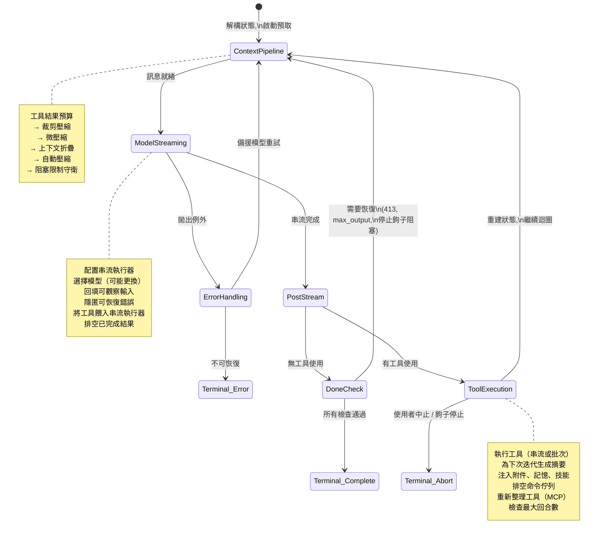
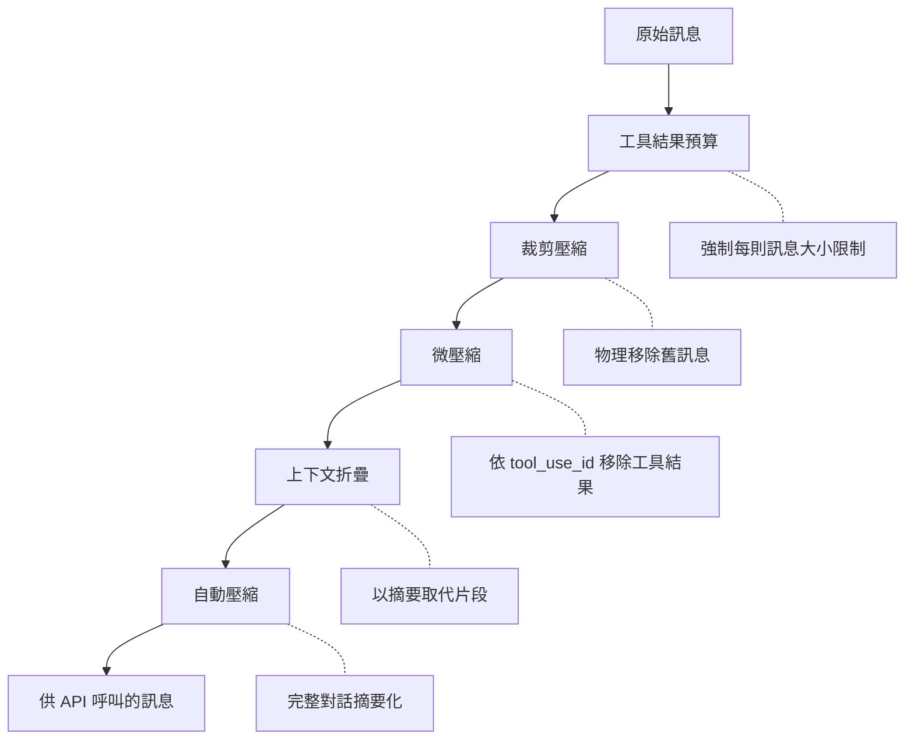
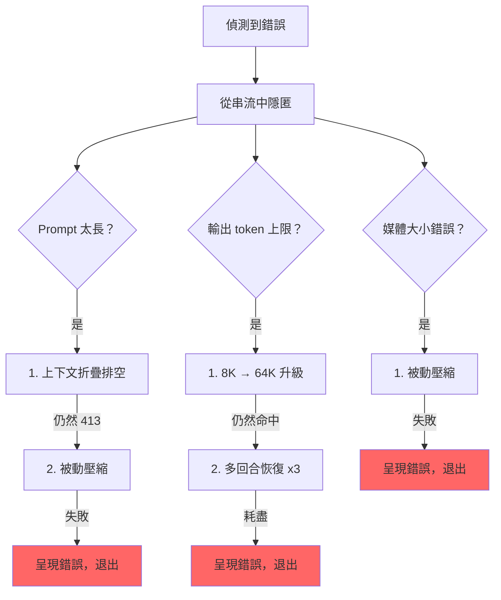

# 第五章：代理迴圈（Agent Loop）

## 跳動的心臟

第四章展示了 API 層如何將配置轉化為串流 HTTP 請求——客戶端如何建構、系統提示詞如何組裝、回應如何以 server-sent events 抵達。那一層處理的是與模型對話的*機制*。但單一的 API 呼叫並不構成代理。代理是一個迴圈：呼叫模型、執行工具、將結果回傳、再次呼叫模型，直到工作完成。

每個系統都有自己的重心。對資料庫而言，是儲存引擎。對編譯器而言，是中間表示法。對 Claude Code 而言，是 `query.ts`——一個 1,730 行的檔案，包含一個 async generator，驅動每一次互動，從 REPL 中第一次按鍵到 headless `--print` 呼叫的最後一個工具調用。

這不是誇張。只有唯一一條程式碼路徑負責與模型對話、執行工具、管理上下文、從錯誤中恢復，以及決定何時停止。這條路徑就是 `query()` 函式。REPL 呼叫它。SDK 呼叫它。子代理呼叫它。headless 執行器呼叫它。如果你正在使用 Claude Code，你就在 `query()` 裡面。

這個檔案很密集，但它的複雜不是那種糾纏的繼承階層式的複雜。它的複雜像潛艇一樣：一個單一的船殼配上許多冗餘系統，每一個都是因為海水找到了滲入的方式才被加上。每個 `if` 分支都有一個故事。每個被隱匿的錯誤訊息都代表一個真實的 bug——某個 SDK 消費者在恢復過程中斷開連線。每個斷路器閾值都是根據真實的會話調校過的，那些會話曾在無限迴圈中燒掉數千次 API 呼叫。

本章追蹤整個迴圈，從頭到尾。讀完之後，你不僅會理解發生了什麼，還會理解每個機制為何存在，以及沒有它會壞掉什麼。

---

## 為什麼用 Async Generator

第一個架構問題：為什麼代理迴圈是 generator 而不是基於回呼的事件發射器？

```typescript
// 簡化——展示概念，非精確型別
async function* agentLoop(params: LoopParams): AsyncGenerator<Message | Event, TerminalReason>
```

實際的簽名會 yield 數種訊息和事件型別，並回傳一個編碼了迴圈停止原因的辨別聯合型別。

三個原因，按重要性排序。

**背壓（Backpressure）。** 事件發射器無論消費者是否準備好都會觸發。Generator 只在消費者呼叫 `.next()` 時才 yield。當 REPL 的 React 渲染器正忙著繪製前一幀時，generator 自然暫停。當 SDK 消費者正在處理工具結果時，generator 等待。沒有緩衝區溢出，沒有丟失訊息，沒有「快速生產者／慢速消費者」問題。

**回傳值語意。** Generator 的回傳型別是 `Terminal`——一個辨別聯合型別，精確編碼迴圈停止的原因。是正常完成？使用者中止？token 預算耗盡？停止鉤子介入？最大輪次限制？不可恢復的模型錯誤？共有 10 種不同的終止狀態。呼叫者不需要訂閱一個「end」事件然後祈禱 payload 裡有原因。他們從 `for await...of` 或 `yield*` 得到一個有型別的回傳值。

**透過 `yield*` 的可組合性。** 外層的 `query()` 函式透過 `yield*` 委託給 `queryLoop()`，透明地轉發每個 yield 的值和最終回傳值。像 `handleStopHooks()` 這樣的子 generator 使用同樣的模式。這創造了一條乾淨的職責鏈，不需要回呼，不需要 promise 包裝 promise，不需要事件轉發的樣板程式碼。

這個選擇有代價——JavaScript 中的 async generator 無法「倒轉」或分叉。但代理迴圈兩者都不需要。它是一個嚴格向前推進的狀態機。

還有一個微妙之處：`function*` 語法讓函式變得*惰性*。函式主體在第一次 `.next()` 呼叫之前不會執行。這代表 `query()` 立即回傳——所有繁重的初始化（配置快照、記憶體預取、預算追蹤器）只在消費者開始拉取值時才發生。在 REPL 中，這意味著 React 渲染管線在迴圈的第一行執行之前就已經設置好了。

---

## 呼叫者提供什麼

在追蹤迴圈之前，先了解輸入內容會有幫助：

```typescript
// 簡化——說明關鍵欄位
type LoopParams = {
  messages: Message[]
  prompt: SystemPrompt
  permissionCheck: CanUseToolFn
  context: ToolUseContext
  source: QuerySource         // 'repl', 'sdk', 'agent:xyz', 'compact' 等
  maxTurns?: number
  budget?: { total: number }  // API 層級的任務預算
  deps?: LoopDeps             // 為測試而注入
}
```

值得注意的欄位：

- **`querySource`**：一個字串辨別值，如 `'repl_main_thread'`、`'sdk'`、`'agent:xyz'`、`'compact'` 或 `'session_memory'`。許多條件分支會根據它來判斷。壓縮代理使用 `querySource: 'compact'`，這樣阻塞限制守衛就不會死鎖（壓縮代理需要執行才能*減少* token 數量）。

- **`taskBudget`**：API 層級的任務預算（`output_config.task_budget`）。與 `+500k` 自動繼續 token 預算功能不同。`total` 是整個代理式回合的預算；`remaining` 在每次迭代中根據累計 API 使用量計算，並在壓縮邊界之間進行調整。

- **`deps`**：可選的依賴注入。預設為 `productionDeps()`。這是測試中替換假模型呼叫、假壓縮和確定性 UUID 的接縫。

- **`canUseTool`**：一個回傳給定工具是否被允許的函式。這是權限層——它檢查信任設定、鉤子決策和當前的權限模式。

---

## 兩層式進入點

公開 API 是真正迴圈的薄封裝：

外層函式包裝內層迴圈，追蹤在該回合中哪些排隊的命令被消費了。內層迴圈完成後，已消費的命令被標記為 `'completed'`。如果迴圈拋出例外或 generator 透過 `.return()` 被關閉，完成通知永遠不會觸發——失敗的回合不應將命令標記為成功處理。在回合中排入的命令（透過 `/` 斜線命令或任務通知）在迴圈內被標記為 `'started'`，在封裝中被標記為 `'completed'`。如果迴圈拋出例外或 generator 透過 `.return()` 被關閉，完成通知永遠不會觸發。這是刻意的——失敗的回合不應將命令標記為成功處理。

---

## 狀態物件

迴圈將其狀態攜帶在一個單一的型別化物件中：

```typescript
// 簡化——說明關鍵欄位
type LoopState = {
  messages: Message[]
  context: ToolUseContext
  turnCount: number
  transition: Continue | undefined
  // ... 加上恢復計數器、壓縮追蹤、待處理摘要等
}
```

十個欄位。每一個都有其存在的意義：

| 欄位 | 存在的原因 |
|------|-----------|
| `messages` | 對話歷史，每次迭代增長 |
| `toolUseContext` | 可變上下文：工具、中止控制器、代理狀態、選項 |
| `autoCompactTracking` | 追蹤壓縮狀態：回合計數器、回合 ID、連續失敗次數、已壓縮旗標 |
| `maxOutputTokensRecoveryCount` | 輸出 token 上限的多回合恢復嘗試次數（最多 3 次） |
| `hasAttemptedReactiveCompact` | 一次性守衛，防止無限的被動壓縮迴圈 |
| `maxOutputTokensOverride` | 在升級期間設為 64K，之後清除 |
| `pendingToolUseSummary` | 來自前一次迭代的 Haiku 摘要 promise，在當前串流期間解析 |
| `stopHookActive` | 在阻塞重試後防止重新執行停止鉤子 |
| `turnCount` | 單調遞增計數器，與 `maxTurns` 對照 |
| `transition` | 前一次迭代為何繼續——首次迭代為 `undefined` |

### 可變迴圈中的不可變轉換

以下是迴圈中每個 `continue` 語句都會出現的模式：

```typescript
const next: State = {
  messages: [...messagesForQuery, ...assistantMessages, ...toolResults],
  toolUseContext: toolUseContextWithQueryTracking,
  autoCompactTracking: tracking,
  turnCount: nextTurnCount,
  maxOutputTokensRecoveryCount: 0,
  hasAttemptedReactiveCompact: false,
  pendingToolUseSummary: nextPendingToolUseSummary,
  maxOutputTokensOverride: undefined,
  stopHookActive,
  transition: { reason: 'next_turn' },
}
state = next
```

每個 continue 站點都構建一個完整的新 `State` 物件。不是 `state.messages = newMessages`。不是 `state.turnCount++`。而是完全重建。好處是每個轉換都是自我文件化的。你可以閱讀任何 `continue` 站點，確切地看到哪些欄位變更了、哪些被保留了。新狀態上的 `transition` 欄位記錄了迴圈*為何*繼續——測試會對此進行斷言，以驗證正確的恢復路徑被觸發。

---

## 迴圈主體

以下是單次迭代的完整執行流程，壓縮為其骨架：



這就是整個迴圈。Claude Code 中的每個功能——從記憶到子代理到錯誤恢復——都是輸入到或消費自這個單一迭代結構。

---

## 上下文管理：四層壓縮

在每次 API 呼叫之前，訊息歷史會通過最多四個上下文管理階段。它們以特定順序執行，而這個順序很重要。



### 第 0 層：工具結果預算

在任何壓縮之前，`applyToolResultBudget()` 對工具結果強制執行每則訊息的大小限制。沒有有限 `maxResultSizeChars` 的工具會被豁免。

### 第 1 層：裁剪壓縮

最輕量的操作。裁剪（Snip）從陣列中物理移除舊訊息，yield 一個邊界訊息以向 UI 通知移除。它回報釋放了多少 token，而這個數字會被傳入自動壓縮的閾值檢查。

### 第 2 層：微壓縮

微壓縮移除不再需要的工具結果，透過 `tool_use_id` 識別。對於快取微壓縮（會編輯 API 快取），邊界訊息會延遲到 API 回應之後。原因是：客戶端的 token 估算不可靠。API 回應中實際的 `cache_deleted_input_tokens` 才能告訴你真正釋放了多少。

### 第 3 層：上下文折疊

上下文折疊以摘要取代對話片段。它在自動壓縮之前執行，而這個順序是刻意的：如果折疊將上下文降到自動壓縮閾值以下，自動壓縮就變成空操作。這樣可以保留細粒度的上下文，而不是將所有東西替換為單一的整體摘要。

### 第 4 層：自動壓縮

最重量級的操作：它分叉整個 Claude 對話來摘要歷史。實作中有一個斷路器——連續失敗 3 次後就停止嘗試。這防止了在生產環境中觀察到的噩夢場景：會話卡在上下文限制之上，每天燒掉 250K 次 API 呼叫，陷入無限的壓縮-失敗-重試迴圈。

### 自動壓縮閾值

閾值由模型的上下文視窗推導：

```
effectiveContextWindow = contextWindow - min(modelMaxOutput, 20000)

閾值（相對於 effectiveContextWindow）：
  自動壓縮觸發：      effectiveWindow - 13,000
  阻塞限制（硬性）：   effectiveWindow - 3,000
```

| 常數 | 值 | 用途 |
|------|-----|------|
| `AUTOCOMPACT_BUFFER_TOKENS` | 13,000 | 在有效視窗下方為自動壓縮觸發保留的剩餘空間 |
| `MANUAL_COMPACT_BUFFER_TOKENS` | 3,000 | 保留空間以確保 `/compact` 仍然可用 |
| `MAX_CONSECUTIVE_AUTOCOMPACT_FAILURES` | 3 | 斷路器閾值 |

13,000 token 的緩衝代表自動壓縮在硬限制之前就會觸發。自動壓縮閾值和阻塞限制之間的間隙是被動壓縮運作的區域——如果主動的自動壓縮失敗或被停用，被動壓縮會在收到 413 錯誤時按需壓縮。

### Token 計數

權威函式 `tokenCountWithEstimation` 結合了來自 API 回報的權威 token 計數（來自最近一次回應）和對該回應之後新增訊息的粗略估算。這個近似值偏向保守——它傾向於較高的計數，這意味著自動壓縮會稍微提早觸發，而非稍微太晚。

---

## 模型串流

### callModel() 迴圈

API 呼叫發生在一個 `while(attemptWithFallback)` 迴圈內，該迴圈啟用模型備援：

```typescript
let attemptWithFallback = true
while (attemptWithFallback) {
  attemptWithFallback = false
  try {
    for await (const message of deps.callModel({ messages, systemPrompt, tools, signal })) {
      // 處理每個串流訊息
    }
  } catch (innerError) {
    if (innerError instanceof FallbackTriggeredError && fallbackModel) {
      currentModel = fallbackModel
      attemptWithFallback = true
      continue
    }
    throw innerError
  }
}
```

啟用時，`StreamingToolExecutor` 會在串流期間 `tool_use` 區塊一到達就開始執行工具——而非等到完整回應完成之後。工具如何被編排成並行批次是第七章的主題。

### 隱匿模式

這是檔案中最重要的模式之一。可恢復的錯誤會從 yield 串流中被抑制：

```typescript
let withheld = false
if (contextCollapse?.isWithheldPromptTooLong(message)) withheld = true
if (reactiveCompact?.isWithheldPromptTooLong(message)) withheld = true
if (isWithheldMaxOutputTokens(message)) withheld = true
if (!withheld) yield yieldMessage
```

為什麼要隱匿？因為 SDK 消費者——Cowork、桌面應用程式——會在收到任何帶有 `error` 欄位的訊息時終止會話。如果你 yield 了一個 prompt-too-long 錯誤然後透過被動壓縮成功恢復，消費者已經斷開了。恢復迴圈繼續運行，但沒有人在聽。所以錯誤被隱匿，推入 `assistantMessages` 以便下游恢復檢查能找到它。如果所有恢復路徑都失敗了，被隱匿的訊息才最終浮出。

### 模型備援

當捕獲到 `FallbackTriggeredError`（主要模型高需求）時，迴圈切換模型並重試。但 thinking 簽名是模型綁定的——將一個受保護的 thinking 區塊從一個模型重播到不同的備援模型會導致 400 錯誤。程式碼在重試前會剝離簽名區塊。所有來自失敗嘗試的孤立助手訊息都會被標記為墓碑（tombstone），好讓 UI 移除它們。

---

## 錯誤恢復：升級階梯

query.ts 中的錯誤恢復不是單一策略。它是一個逐步升級的干預階梯，每一步在前一步失敗時觸發。



### 死亡螺旋守衛

最危險的失敗模式是無限迴圈。程式碼有多重守衛：

1. **`hasAttemptedReactiveCompact`**：一次性旗標。被動壓縮每種錯誤類型只觸發一次。
2. **`MAX_OUTPUT_TOKENS_RECOVERY_LIMIT = 3`**：多回合恢復嘗試的硬上限。
3. **自動壓縮的斷路器**：連續失敗 3 次後，自動壓縮完全停止嘗試。
4. **錯誤回應不執行停止鉤子**：程式碼在最後一則訊息是 API 錯誤時，會在到達停止鉤子之前明確返回。註解解釋道：「error → hook blocking → retry → error → ...（鉤子在每個循環中注入更多 token）。」
5. **跨停止鉤子重試保留 `hasAttemptedReactiveCompact`**：當停止鉤子回傳阻塞錯誤並強制重試時，被動壓縮守衛會被保留。註解記錄了這個 bug：「在這裡重置為 false 導致了一個無限迴圈，燒掉了數千次 API 呼叫。」

每一個守衛都是因為有人在生產環境中觸發了對應的失敗模式才被新增的。

---

## 實際範例：「修復 auth.ts 中的 Bug」

為了讓迴圈更具體，讓我們追蹤一個真實互動的三次迭代。

**使用者輸入：** `Fix the null pointer bug in src/auth/validate.ts`

**迭代 1：模型讀取檔案。**

迴圈進入。上下文管理執行（不需要壓縮——對話很短）。模型串流回應：「讓我看看這個檔案。」它發出一個 `tool_use` 區塊：`Read({ file_path: "src/auth/validate.ts" })`。串流執行器看到一個並行安全的工具並立即啟動它。在模型完成回應文字之前，檔案內容已經在記憶體中了。

後串流處理：模型使用了工具，所以我們進入工具使用路徑。Read 結果（帶行號的檔案內容）被推入 `toolResults`。一個 Haiku 摘要 promise 在背景中啟動。狀態以新訊息重建，`transition: { reason: 'next_turn' }`，迴圈繼續。

**迭代 2：模型編輯檔案。**

上下文管理再次執行（仍在閾值以下）。模型串流：「我在第 42 行看到 bug——`userId` 可能是 null。」它發出 `Edit({ file_path: "src/auth/validate.ts", old_string: "const user = getUser(userId)", new_string: "if (!userId) return { error: 'unauthorized' }\nconst user = getUser(userId)" })`。

Edit 不是並行安全的，所以串流執行器將它排隊直到回應完成。然後 14 步執行管線觸發：Zod 驗證通過，輸入回填展開路徑，PreToolUse 鉤子檢查權限（使用者批准），編輯被套用。迭代 1 的待處理 Haiku 摘要在串流期間解析——其結果作為 `ToolUseSummaryMessage` 被 yield。狀態重建，迴圈繼續。

**迭代 3：模型宣告完成。**

模型串流：「我已經透過新增守衛子句修復了 null 指標 bug。」沒有 `tool_use` 區塊。我們進入「完成」路徑。需要 prompt-too-long 恢復？不需要。Max output tokens？沒有。停止鉤子執行——沒有阻塞錯誤。token 預算檢查通過。迴圈回傳 `{ reason: 'completed' }`。

總計：三次 API 呼叫、兩次工具執行、一次使用者權限提示。迴圈處理了串流工具執行、與 API 呼叫重疊的 Haiku 摘要，以及完整的權限管線——全部透過同一個 `while(true)` 結構。

---

## Token 預算

使用者可以為一個回合請求 token 預算（例如 `+500k`）。預算系統在模型完成回應後決定繼續還是停止。

`checkTokenBudget` 用三個規則做出二元的繼續／停止決策：

1. **子代理總是停止。** 預算只是頂層概念。
2. **完成閾值在 90%。** 如果 `turnTokens < budget * 0.9`，繼續。
3. **邊際遞減偵測。** 在 3 次以上的繼續之後，如果當前和前一次的增量都低於 500 個 token，提前停止。模型每次繼續產生的輸出越來越少。

當決策是「繼續」時，一則推動訊息被注入，告訴模型剩餘多少預算。

---

## 停止鉤子：強制模型繼續工作

停止鉤子在模型完成且未請求任何工具使用時執行——它認為自己完成了。鉤子評估它是否*真的*完成了。

管線執行範本工作分類、觸發背景任務（提示建議、記憶擷取），然後執行停止鉤子本身。當停止鉤子回傳阻塞錯誤——「你說你完成了，但 linter 發現了 3 個錯誤」——錯誤被附加到訊息歷史，迴圈以 `stopHookActive: true` 繼續。這個旗標防止在重試時重新執行相同的鉤子。

當停止鉤子發出 `preventContinuation` 訊號時，迴圈立即以 `{ reason: 'stop_hook_prevented' }` 退出。

---

## 狀態轉換：完整目錄

迴圈的每個出口都是兩種類型之一：`Terminal`（迴圈回傳）或 `Continue`（迴圈迭代）。

### 終止狀態（10 種原因）

| 原因 | 觸發條件 |
|------|---------|
| `blocking_limit` | Token 計數達硬限制，自動壓縮關閉 |
| `image_error` | ImageSizeError、ImageResizeError 或不可恢復的媒體錯誤 |
| `model_error` | 不可恢復的 API／模型例外 |
| `aborted_streaming` | 模型串流期間使用者中止 |
| `prompt_too_long` | 所有恢復耗盡後隱匿的 413 |
| `completed` | 正常完成（無工具使用、預算耗盡、或 API 錯誤） |
| `stop_hook_prevented` | 停止鉤子明確阻止繼續 |
| `aborted_tools` | 工具執行期間使用者中止 |
| `hook_stopped` | PreToolUse 鉤子停止繼續 |
| `max_turns` | 達到 `maxTurns` 限制 |

### 繼續狀態（7 種原因）

| 原因 | 觸發條件 |
|------|---------|
| `collapse_drain_retry` | 上下文折疊在 413 時排空已暫存的折疊 |
| `reactive_compact_retry` | 被動壓縮在 413 或媒體錯誤後成功 |
| `max_output_tokens_escalate` | 命中 8K 上限，升級到 64K |
| `max_output_tokens_recovery` | 64K 仍然命中，多回合恢復（最多 3 次嘗試） |
| `stop_hook_blocking` | 停止鉤子回傳阻塞錯誤，必須重試 |
| `token_budget_continuation` | Token 預算未耗盡，注入推動訊息 |
| `next_turn` | 正常工具使用繼續 |

---

## 孤立工具結果：協定安全網

API 協定要求每個 `tool_use` 區塊後面都跟著一個 `tool_result`。函式 `yieldMissingToolResultBlocks` 為模型發出但從未獲得對應結果的每個 `tool_use` 區塊建立錯誤 `tool_result` 訊息。沒有這個安全網，串流期間的崩潰會留下孤立的 `tool_use` 區塊，導致下一次 API 呼叫出現協定錯誤。

它在三個地方觸發：外層錯誤處理器（模型崩潰）、備援處理器（串流中途切換模型）和中止處理器（使用者中斷）。每條路徑有不同的錯誤訊息，但機制是一樣的。

---

## 中止處理：兩條路徑

中止可以發生在兩個時間點：串流期間和工具執行期間。各自有不同的行為。

**串流期間中止**：串流執行器（如果啟用）排空剩餘結果，為排隊的工具產生合成 `tool_results`。沒有執行器時，`yieldMissingToolResultBlocks` 填補空缺。`signal.reason` 檢查區分硬中止（Ctrl+C）和提交中斷（使用者輸入了新訊息）——提交中斷跳過中斷訊息，因為排隊的使用者訊息本身已經提供了上下文。

**工具執行期間中止**：類似的邏輯，在中斷訊息上帶有 `toolUse: true` 參數，向 UI 發出工具正在進行的訊號。

---

## Thinking 規則

Claude 的 thinking/redacted_thinking 區塊有三條不可違反的規則：

1. 包含 thinking 區塊的訊息必須屬於 `max_thinking_length > 0` 的查詢
2. Thinking 區塊不能是訊息的最後一個區塊
3. Thinking 區塊必須在整個助手軌跡期間被保留

違反任何一條都會產生不透明的 API 錯誤。程式碼在多個地方處理它們：備援處理器剝離簽名區塊（它們是模型綁定的）、壓縮管線保留受保護的尾部，而微壓縮層從不碰 thinking 區塊。

---

## 依賴注入

`QueryDeps` 型別刻意精簡——四個依賴，不是四十個：

四個注入的依賴：模型呼叫器、壓縮器、微壓縮器和 UUID 產生器。測試將 `deps` 傳入迴圈參數以直接注入假物件。使用 `typeof fn` 作為型別定義讓簽名自動保持同步。除了可變的 `State` 和可注入的 `QueryDeps` 之外，不可變的 `QueryConfig` 在 `query()` 進入時快照一次——功能旗標、會話狀態和環境變數一次擷取且永不重讀。三方分離（可變狀態、不可變配置、可注入依賴）讓迴圈可測試，也讓最終重構為純粹的 `step(state, event, config)` reducer 變得直接了當。

---

## 實踐應用：建構你自己的代理迴圈

**使用 generator，而非回呼。** 背壓是免費的。回傳值語意是免費的。透過 `yield*` 的可組合性是免費的。代理迴圈是嚴格向前推進的——你永遠不需要倒轉或分叉。

**讓狀態轉換明確。** 在每個 `continue` 站點重建完整的狀態物件。冗長就是功能——它防止部分更新的 bug，並讓每個轉換自我文件化。

**隱匿可恢復的錯誤。** 如果你的消費者在收到錯誤時斷開連線，不要在確認恢復失敗之前 yield 錯誤。將它們推入內部緩衝區，嘗試恢復，只在耗盡時才浮出。

**分層你的上下文管理。** 輕量操作優先（移除），重量操作放最後（摘要化）。這在可能的情況下保留細粒度的上下文，只在必要時才回退到整體摘要。

**為每個重試增加斷路器。** `query.ts` 中的每個恢復機制都有明確的限制：3 次自動壓縮失敗、3 次 max-output 恢復嘗試、1 次被動壓縮嘗試。沒有這些限制，第一個觸發重試失敗迴圈的生產環境會話會在一夜之間燒掉你的 API 預算。

如果你從零開始，最小的代理迴圈骨架：

```
async function* agentLoop(params) {
  let state = initState(params)
  while (true) {
    const context = compressIfNeeded(state.messages)
    const response = await callModel(context)
    if (response.error) {
      if (canRecover(response.error, state)) { state = recoverState(state); continue }
      return { reason: 'error' }
    }
    if (!response.toolCalls.length) return { reason: 'completed' }
    const results = await executeTools(response.toolCalls)
    state = { ...state, messages: [...context, response.message, ...results] }
  }
}
```

Claude Code 迴圈中的每個功能都是這些步驟之一的延伸。四層壓縮延伸步驟 3（壓縮）。隱匿模式延伸模型呼叫。升級階梯延伸錯誤恢復。停止鉤子延伸「無工具使用」的出口。從這個骨架開始。只在你碰到某個問題時才加入對應的延伸。

---

## 總結

代理迴圈是 1,730 行的單一 `while(true)`，它做所有事情。它串流模型回應、並行執行工具、透過四層壓縮上下文、從五種類別的錯誤中恢復、以邊際遞減偵測追蹤 token 預算、執行可以強制模型回去工作的停止鉤子、管理記憶和技能的預取管線，並產生一個精確記錄為何停止的型別化辨別聯合。

它是系統中最重要的檔案，因為它是唯一碰觸所有其他子系統的檔案。上下文管線輸入到它。工具系統從中輸出。錯誤恢復環繞在它周圍。鉤子攔截它。狀態層透過它持續。UI 從中渲染。

如果你理解了 `query()`，你就理解了 Claude Code。其他一切都是外圍設備。
