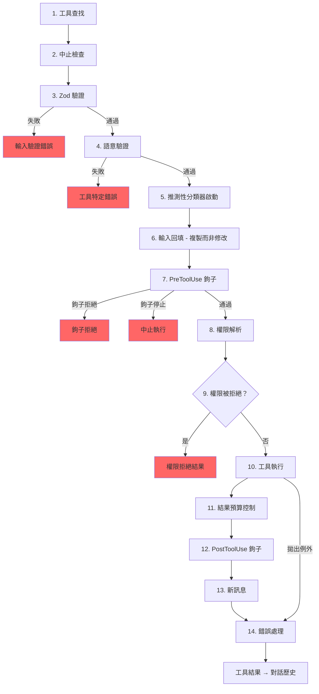

# 第六章：工具（Tool）—— 從定義到執行

## 神經系統

第五章展示了代理迴圈（Agent Loop）—— 那個 `while(true)` 不斷串流模型回應、收集工具呼叫、再把結果餵回去。迴圈是心跳。但如果沒有一套神經系統來將「模型想要執行 `git status`」轉譯為實際的 shell 命令——帶有權限檢查、結果預算控制和錯誤處理——心跳就毫無意義。

工具系統就是那套神經系統。它涵蓋了 40 多個工具實作、一個帶有功能旗標（feature flag）閘控的集中式註冊表、一條 14 步驟的執行管線、一個具備七種模式的權限解析器，以及一個能在模型完成回應之前就啟動工具的串流執行器。

Claude Code 中的每一次工具呼叫——每一次檔案讀取、每一次 shell 命令、每一次 grep、每一次子代理派遣——都流經同一條管線。統一性正是關鍵：無論工具是內建的 Bash 執行器還是第三方 MCP 伺服器，它都得到相同的驗證、相同的權限檢查、相同的結果預算控制、相同的錯誤分類。

`Tool` 介面大約有 45 個成員。聽起來令人望而生畏，但要理解系統如何運作，只有五個是重要的：

1. **`call()`** —— 執行工具
2. **`inputSchema`** —— 驗證並解析輸入
3. **`isConcurrencySafe()`** —— 這個工具可以平行執行嗎？
4. **`checkPermissions()`** —— 這個操作被允許嗎？
5. **`validateInput()`** —— 這個輸入在語意上說得通嗎？

其他所有東西——那 12 個渲染方法、分析鉤子、搜尋提示——都是用來支援 UI 和遙測層的。從這五個開始，其餘的自然水到渠成。

---

## 工具介面

### 三個型別參數

每個工具都以三個型別來參數化：

```typescript
Tool<Input extends AnyObject, Output, P extends ToolProgressData>
```

`Input` 是一個 Zod 物件 schema，身兼二職：它生成發送給 API 的 JSON Schema（讓模型知道該提供哪些參數），同時也在執行時透過 `safeParse` 驗證模型的回應。`Output` 是工具結果的 TypeScript 型別。`P` 是工具在執行期間發出的進度事件型別——BashTool 發出 stdout 片段、GrepTool 發出匹配計數、AgentTool 發出子代理的對話記錄。

### buildTool() 與失敗關閉預設值

沒有任何工具定義會直接建構 `Tool` 物件。每個工具都經過 `buildTool()`，這是一個工廠函式，它將預設物件展開在工具特定定義之下：

```typescript
// 虛擬碼 — 說明失敗關閉（fail-closed）的預設值模式
const SAFE_DEFAULTS = {
  isEnabled:         () => true,
  isParallelSafe:    () => false,   // 失敗關閉：新工具以序列方式執行
  isReadOnly:        () => false,   // 失敗關閉：視為寫入操作
  isDestructive:     () => false,
  checkPermissions:  (input) => ({ behavior: 'allow', updatedInput: input }),
}

function buildTool(definition) {
  return { ...SAFE_DEFAULTS, ...definition }  // 定義覆寫預設值
}
```

在攸關安全的地方，預設值刻意採用失敗關閉策略。一個忘記實作 `isConcurrencySafe` 的新工具會預設為 `false`——它只能序列執行，永遠不會平行。一個忘記 `isReadOnly` 的工具預設為 `false`——系統會把它當作寫入操作。一個忘記 `toAutoClassifierInput` 的工具回傳空字串——自動模式安全性分類器會跳過它，意味著由通用權限系統來處理，而不是由自動化的繞過機制處理。

唯一*不是*失敗關閉的預設值是 `checkPermissions`，它回傳 `allow`。這看似有悖常理，除非你理解了分層權限模型：`checkPermissions` 是工具特定的邏輯，它在通用權限系統已經評估過規則、鉤子和基於模式的策略*之後*才執行。工具從 `checkPermissions` 回傳 `allow` 的意思是「我沒有工具特定的異議」——並不是授予無條件存取。分組到子物件（`options`，具名欄位如 `readFileState`）提供了聚焦介面會提供的結構，而無需在 40 多個呼叫站點上宣告、實作並串接五個獨立的介面型別。

### 並行性取決於輸入

`isConcurrencySafe(input: z.infer<Input>): boolean` 的簽名接受已解析的輸入，因為同一個工具對某些輸入可能是安全的，對其他輸入則不是。BashTool 是經典範例：`ls -la` 是唯讀且可並行安全的，但 `rm -rf /tmp/build` 則不是。工具會解析命令，將每個子命令對照已知安全的集合分類，只有當所有非中性部分都是搜尋或讀取操作時才回傳 `true`。

### ToolResult 回傳型別

每個 `call()` 都回傳一個 `ToolResult<T>`：

```typescript
type ToolResult<T> = {
  data: T
  newMessages?: (UserMessage | AssistantMessage | AttachmentMessage | SystemMessage)[]
  contextModifier?: (context: ToolUseContext) => ToolUseContext
}
```

`data` 是型別化的輸出，會被序列化為 API 的 `tool_result` 內容區塊。`newMessages` 讓工具可以向對話中注入額外的訊息——AgentTool 用它來附加子代理的對話記錄。`contextModifier` 是一個函式，用來為後續工具修改 `ToolUseContext`——這就是 `EnterPlanMode` 切換權限模式的方式。上下文修改器只對非並行安全的工具生效；如果你的工具是平行執行的，它的修改器會被排隊等到批次完成後才套用。

---

## ToolUseContext：上帝物件

`ToolUseContext` 是貫穿每個工具呼叫的龐大上下文包。它大約有 40 個欄位。以任何合理的定義來看，它就是一個上帝物件。它之所以存在，是因為替代方案更糟。

像 BashTool 這樣的工具需要中止控制器、檔案狀態快取、應用程式狀態、訊息歷史、工具集合、MCP 連線，以及半打 UI 回呼。如果把這些作為獨立參數傳遞，會產生 15 個以上參數的函式簽名。務實的解決方案是單一上下文物件，按關注點分組：

**配置**（`options` 子物件）：工具集合、模型名稱、MCP 連線、除錯旗標。在查詢開始時設定一次，大部分是不可變的。

**執行狀態**：用於取消的 `abortController`、作為 LRU 檔案快取的 `readFileState`、完整對話歷史的 `messages`。這些在執行期間會變化。

**UI 回呼**：`setToolJSX`、`addNotification`、`requestPrompt`。只在互動式（REPL）上下文中接線。SDK 和無頭模式會讓它們保持未定義。

**代理上下文**：`agentId`、`renderedSystemPrompt`（為分叉子代理凍結的父提示——重新渲染可能因功能旗標的暖機而產生分歧，進而破壞快取）。

子代理變體的 `ToolUseContext` 特別值得關注。當 `createSubagentContext()` 為子代理建構上下文時，它會刻意選擇哪些欄位要共享、哪些要隔離：`setAppState` 對非同步代理變成空操作（no-op）、`localDenialTracking` 取得一個全新的物件、`contentReplacementState` 從父代理複製。每一個選擇都編碼了一個從生產環境錯誤中學到的教訓。

---

## 註冊表

### getAllBaseTools()：唯一真實來源

函式 `getAllBaseTools()` 回傳目前程序中可能存在的所有工具的完整清單。永遠存在的工具排在前面，然後是由功能旗標閘控的條件式工具：

```typescript
const SleepTool = feature('PROACTIVE') || feature('KAIROS')
  ? require('./tools/SleepTool/SleepTool.js').SleepTool
  : null
```

從 `bun:bundle` 匯入的 `feature()` 在打包時期解析。當 `feature('AGENT_TRIGGERS')` 靜態為 false 時，打包器會消除整個 `require()` 呼叫——死碼消除讓二進位檔保持精簡。

### assembleToolPool()：合併內建與 MCP 工具

最終送達模型的工具集來自 `assembleToolPool()`：

1. 取得內建工具（經過拒絕規則過濾、REPL 模式隱藏和 `isEnabled()` 檢查）
2. 依拒絕規則過濾 MCP 工具
3. 將每個分區依名稱字母順序排序
4. 串接內建工具（前綴）+ MCP 工具（後綴）

先排序再串接的做法不是出於美感偏好。API 伺服器在最後一個內建工具之後放置提示快取斷點。如果對所有工具做扁平排序，會把 MCP 工具交錯插入內建清單中，而新增或移除某個 MCP 工具就會移動內建工具的位置，導致快取失效。

---

## 14 步驟執行管線

函式 `checkPermissionsAndCallTool()` 是意圖變為行動的地方。每一次工具呼叫都經過這 14 個步驟。



### 步驟 1-4：驗證

**工具查找**會退回到 `getAllBaseTools()` 進行別名匹配，處理來自舊版本工作階段——其中工具已被更名——的對話記錄。**中止檢查**防止在 Ctrl+C 傳播之前就已排隊的工具呼叫浪費運算。**Zod 驗證**捕捉型別不匹配；對於延遲載入的工具，錯誤會附加一個提示，建議先呼叫 ToolSearch。**語意驗證**超越了 schema 一致性——FileEditTool 拒絕空操作的編輯，BashTool 在 MonitorTool 可用時阻止單獨的 `sleep`。

### 步驟 5-6：準備

**推測性分類器啟動**為 Bash 命令平行啟動自動模式安全性分類器，在常見路徑上節省數百毫秒。**輸入回填**複製已解析的輸入並添加衍生欄位（將 `~/foo.txt` 展開為絕對路徑），供鉤子和權限使用，同時保留原始輸入以確保對話記錄的穩定性。

### 步驟 7-9：權限

**PreToolUse 鉤子**是擴充機制——它們可以做出權限決策、修改輸入、注入上下文，或完全停止執行。**權限解析**橋接鉤子和通用權限系統：如果鉤子已經做出決定，那就是最終結果；否則 `canUseTool()` 會觸發規則匹配、工具特定檢查、基於模式的預設值和互動式提示。**權限拒絕處理**構建錯誤訊息並執行 `PermissionDenied` 鉤子。

### 步驟 10-14：執行與清理

**工具執行**使用原始輸入執行實際的 `call()`。**結果預算控制**將超大輸出持久化到 `~/.claude/tool-results/{hash}.txt` 並用預覽替換。**PostToolUse 鉤子**可以修改 MCP 輸出或阻止繼續執行。**新訊息**被附加（子代理對話記錄、系統提醒）。**錯誤處理**為遙測分類錯誤，從可能被混淆的名稱中提取安全字串，並發出 OTel 事件。

---

## 權限系統

### 七種模式

| 模式 | 行為 |
|------|------|
| `default` | 工具特定檢查；對無法識別的操作提示使用者 |
| `acceptEdits` | 自動允許檔案編輯；對其他操作提示 |
| `plan` | 唯讀——拒絕所有寫入操作 |
| `dontAsk` | 自動拒絕任何正常情況下會提示的操作（背景代理） |
| `bypassPermissions` | 允許所有操作，不提示 |
| `auto` | 使用對話記錄分類器來決定（由功能旗標控制） |
| `bubble` | 子代理用的內部模式，將權限請求上報給父代理 |

### 解析鏈

當一個工具呼叫到達權限解析時：

1. **鉤子決策**：如果一個 PreToolUse 鉤子已經回傳了 `allow` 或 `deny`，那就是最終結果。
2. **規則匹配**：三組規則集——`alwaysAllowRules`、`alwaysDenyRules`、`alwaysAskRules`——按工具名稱和可選的內容模式進行匹配。`Bash(git *)` 匹配任何以 `git` 開頭的 Bash 命令。
3. **工具特定檢查**：工具的 `checkPermissions()` 方法。大多數回傳 `passthrough`。
4. **基於模式的預設值**：`bypassPermissions` 允許所有操作。`plan` 拒絕寫入。`dontAsk` 拒絕提示。
5. **互動式提示**：在 `default` 和 `acceptEdits` 模式下，未解析的決策會顯示提示。
6. **自動模式分類器**：兩階段分類器（快速模型，然後對模稜兩可的情況使用延伸思考）。

`safetyCheck` 變體有一個 `classifierApprovable` 布林值：`.claude/` 和 `.git/` 的編輯是 `classifierApprovable: true`（不尋常但有時合理），而 Windows 路徑繞過嘗試是 `classifierApprovable: false`（幾乎總是惡意的）。

### 權限規則與匹配

權限規則以 `PermissionRule` 物件儲存，包含三個部分：追蹤來源的 `source`（userSettings、projectSettings、localSettings、cliArg、policySettings、session 等）、`ruleBehavior`（allow、deny、ask）以及帶有工具名稱和可選內容模式的 `ruleValue`。

`ruleContent` 欄位啟用了細粒度匹配。`Bash(git *)` 允許任何以 `git` 開頭的 Bash 命令。`Edit(/src/**)` 只允許對 `/src` 內的檔案進行編輯。`Fetch(domain:example.com)` 允許從特定網域擷取。沒有 `ruleContent` 的規則匹配該工具的所有呼叫。

BashTool 的權限匹配器透過 `parseForSecurity()`（一個 bash AST 解析器）解析命令，並將複合命令拆分為子命令。如果 AST 解析失敗（帶有 heredoc 或巢狀子 shell 的複雜語法），匹配器回傳 `() => true`——失敗安全（fail-safe），意味著鉤子總是會執行。其假設是：如果命令複雜到無法解析，就複雜到無法有信心地排除在安全檢查之外。

### 子代理的氣泡模式

協調者-工作者模式中的子代理無法顯示權限提示——它們沒有終端機。`bubble` 模式使權限請求向上傳播到父上下文。運行在主執行緒且擁有終端機存取權的協調者代理處理提示，並將決策傳回。

---

## 工具延遲載入

帶有 `shouldDefer: true` 的工具會以 `defer_loading: true` 發送給 API——只有名稱和描述，沒有完整的參數 schema。這減少了初始提示的大小。要使用延遲載入的工具，模型必須先呼叫 `ToolSearchTool` 來載入其 schema。失敗模式很有啟發性：呼叫延遲工具而不先載入它會導致 Zod 驗證失敗（所有型別化參數都以字串形式到達），系統會附加一個有針對性的恢復提示。

延遲載入也改善了快取命中率：以 `defer_loading: true` 發送的工具只將其名稱貢獻到提示中，因此新增或移除一個延遲載入的 MCP 工具只會改變提示中幾個 token，而不是數百個。

---

## 結果預算控制

### 每個工具的大小限制

每個工具宣告 `maxResultSizeChars`：

| 工具 | maxResultSizeChars | 原因 |
|------|-------------------|------|
| BashTool | 30,000 | 對大多數有用的輸出已足夠 |
| FileEditTool | 100,000 | 差異檔可以很大，但模型需要它們 |
| GrepTool | 100,000 | 帶有上下文行的搜尋結果累加很快 |
| FileReadTool | Infinity | 透過自身的 token 限制來自我約束；持久化會造成循環的 Read 迴圈 |

當結果超過閾值時，完整內容會儲存到磁碟並替換為包含預覽和檔案路徑的 `<persisted-output>` 包裝。模型之後可以在需要時使用 `Read` 來存取完整輸出。

### 每次對話的聚合預算

除了每個工具的限制外，`ContentReplacementState` 追蹤整個對話的聚合預算，防止千刀萬剮——許多工具各自回傳其個別限制的 90% 仍然可以壓垮上下文視窗。

---

## 個別工具亮點

### BashTool：最複雜的工具

BashTool 是系統中迄今為止最複雜的工具。它解析複合命令、將子命令分類為唯讀或寫入、管理背景任務、透過魔術位元組偵測影像輸出，並實作 sed 模擬以進行安全的編輯預覽。

複合命令解析特別有趣。`splitCommandWithOperators()` 將像 `cd /tmp && mkdir build && ls build` 這樣的命令拆分為個別子命令。每個子命令會對照已知安全的命令集合（`BASH_SEARCH_COMMANDS`、`BASH_READ_COMMANDS`、`BASH_LIST_COMMANDS`）進行分類。一個複合命令只有在所有非中性部分都安全時才是唯讀的。中性集合（echo、printf）被忽略——它們不會讓命令變成唯讀，但也不會讓命令變成寫入。

sed 模擬（`_simulatedSedEdit`）值得特別關注。當使用者在權限對話框中核准一個 sed 命令時，系統會預先在沙箱中執行該 sed 命令並擷取輸出來計算結果。預先計算的結果作為 `_simulatedSedEdit` 注入到輸入中。當 `call()` 執行時，它直接套用編輯，繞過 shell 執行。這保證了使用者預覽的內容就是實際寫入的內容——而不是重新執行後可能因為檔案在預覽和執行之間發生變化而產生不同結果。

### FileEditTool：過期偵測

FileEditTool 與 `readFileState` 整合，後者是在對話期間維護的檔案內容和時間戳記的 LRU 快取。在套用編輯之前，它會檢查檔案自模型上次讀取以來是否已被修改。如果檔案已過期——被背景程序、另一個工具或使用者修改——編輯會被拒絕，並附帶一則訊息告訴模型先重新讀取檔案。

`findActualString()` 中的模糊匹配處理了模型在空白處理上略有偏差的常見情況。它在匹配之前標準化空白和引號樣式，因此目標為帶有尾隨空格的 `old_string` 的編輯仍然可以匹配檔案的實際內容。`replace_all` 旗標啟用批次替換；沒有它，非唯一的匹配會被拒絕，要求模型提供足夠的上下文來識別單一位置。

### FileReadTool：萬用讀取器

FileReadTool 是唯一 `maxResultSizeChars: Infinity` 的內建工具。如果 Read 的輸出被持久化到磁碟，模型就需要 Read 那個被持久化的檔案，而那個檔案本身可能超過限制，造成無限迴圈。這個工具改為透過 token 估算來自我約束，並在來源端截斷。

這個工具用途非常廣泛：它讀取帶行號的文字檔案、影像（回傳 base64 多模態內容區塊）、PDF（透過 `extractPDFPages()`）、Jupyter notebook（透過 `readNotebook()`）以及目錄（退回到 `ls`）。它阻擋危險的裝置路徑（`/dev/zero`、`/dev/random`、`/dev/stdin`），並處理 macOS 螢幕截圖檔名的怪癖（「Screen Shot」檔名中的 U+202F 窄不換行空格 vs 普通空格）。

### GrepTool：透過 head_limit 分頁

GrepTool 包裝了 `ripGrep()` 並透過 `head_limit` 添加了分頁機制。預設值為 250 個條目——足以產生有用的結果，但又小到能避免上下文膨脹。當截斷發生時，回應會包含 `appliedLimit: 250`，提示模型在下一次呼叫中使用 `offset` 來分頁。明確的 `head_limit: 0` 會完全停用限制。

GrepTool 自動排除六個版本控制系統目錄（`.git`、`.svn`、`.hg`、`.bzr`、`.jj`、`.sl`）。搜尋 `.git/objects` 內部幾乎永遠不是模型想要的，而意外包含二進位 pack 檔案會直接突破 token 預算。

### AgentTool 與上下文修改器

AgentTool 產生子代理，子代理運行自己的查詢迴圈。它的 `call()` 回傳包含子代理對話記錄的 `newMessages`，以及可選的 `contextModifier` 將狀態變更傳播回父代理。因為 AgentTool 預設不是並行安全的，單一回應中的多個 Agent 工具呼叫會序列執行——每個子代理的上下文修改器在下一個子代理啟動之前就被套用。在協調者模式中，模式會反轉：協調者為獨立任務派遣子代理，而 `isAgentSwarmsEnabled()` 檢查會解鎖平行代理執行。

---

## 工具如何與訊息歷史互動

工具結果不僅僅是將資料回傳給模型。它們作為結構化訊息參與對話。

API 期望工具結果是透過 ID 參照原始 `tool_use` 區塊的 `ToolResultBlockParam` 物件。大多數工具序列化為文字。FileReadTool 可以序列化為影像內容區塊（base64 編碼）以支援多模態回應。BashTool 透過檢查 stdout 中的魔術位元組來偵測影像輸出，並相應地切換為影像區塊。

`ToolResult.newMessages` 是工具在簡單的呼叫與回應模式之外擴充對話的方式。**代理對話記錄**：AgentTool 將子代理的訊息歷史注入為附件訊息。**系統提醒**：記憶工具注入出現在工具結果之後的系統訊息——在下一輪對模型可見，但在 `normalizeMessagesForAPI` 邊界被剝離。**附件訊息**：鉤子結果、額外上下文和錯誤詳情攜帶結構化的中繼資料，模型可以在後續輪次中參照。

`contextModifier` 函式是工具改變執行環境的機制。當 `EnterPlanMode` 執行時，它回傳一個將權限模式設定為 `'plan'` 的修改器。當 `ExitWorktree` 執行時，它修改工作目錄。這些修改器是工具影響後續工具的唯一途徑——直接修改 `ToolUseContext` 是不可能的，因為上下文在每次工具呼叫之前都會被展開複製。序列限制由編排層強制執行：如果兩個並行工具都修改工作目錄，哪一個贏？

---

## 實踐應用：設計工具系統

**失敗關閉的預設值。** 新工具應該保持保守，直到被明確標記為其他狀態。忘記設定旗標的開發者會得到安全的行為，而不是危險的行為。

**取決於輸入的安全性。** `isConcurrencySafe(input)` 和 `isReadOnly(input)` 接受已解析的輸入，因為同一個工具在不同輸入下有不同的安全性設定檔。一個將 BashTool 標記為「永遠序列」的工具註冊表是正確的，但是浪費的。

**分層你的權限。** 工具特定檢查、基於規則的匹配、基於模式的預設值、互動式提示和自動化分類器各自處理不同的情況。沒有任何單一機制是足夠的。

**預算控制結果，而非只是輸入。** 對輸入的 token 限制是標準做法。但工具結果可以是任意大小的，且它們會跨輪次累積。每個工具的限制防止個別爆炸。對話的聚合限制防止累積性溢位。

**讓錯誤分類對遙測安全。** 在經過最小化的建置中，`error.constructor.name` 會被混淆。`classifyToolError()` 函式提取最有資訊量的安全字串——對遙測安全的訊息、errno 代碼、穩定的錯誤名稱——而不會將原始錯誤訊息記錄到分析系統中。

---

## 接下來

本章追蹤了一次工具呼叫如何從定義流經驗證、權限、執行和結果預算控制。但模型很少一次只請求一個工具。工具如何被編排成並行批次，是第七章的主題。
