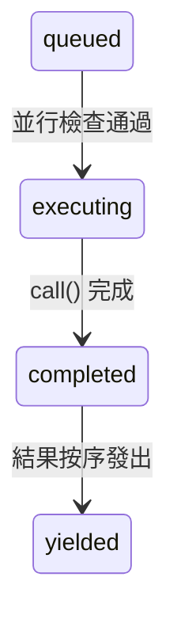

# 第七章：並行工具執行

## 等待的代價

第六章追蹤了單一工具呼叫的生命週期——從 API 回應中的原始 `tool_use` 區塊，經過輸入驗證、權限檢查、執行，到結果格式化。那條管線處理的是一個工具。但模型很少只請求一個。

典型的 Claude Code 互動每個回合涉及三到五個工具呼叫。「讀取這兩個檔案，grep 搜尋這個模式，然後編輯這個函式。」模型在單一回應中發出所有這些請求。如果每個工具需要 200 毫秒，循序執行就要花整整一秒。如果 Read 和 Grep 呼叫是獨立的——它們確實是——並行執行可以將時間壓縮到 200 毫秒。五比一的提升，免費的。

但並非所有工具都是獨立的。修改 `config.ts` 的 Edit 不能與另一個修改 `config.ts` 的 Edit 並行執行。建立目錄的 Bash 命令必須在向該目錄寫入檔案的 Bash 命令之前完成。並行性不是工具的全域屬性，而是特定工具呼叫搭配特定輸入的屬性。

這就是驅動整個並行系統的洞見：**安全性是逐呼叫判定的，而非逐工具類型判定的。** `Bash("ls -la")` 可以安全地並行化。`Bash("rm -rf build/")` 則不行。相同的工具，不同的輸入，不同的並行分類。系統必須在決定之前檢查輸入。

Claude Code 實作了兩層並行優化。第一層是**批次編排**：在模型的回應完全接收後，將工具呼叫分區為並行和序列群組，然後適當地執行每個群組。第二層是**推測性執行**：在*模型仍在串流回應的同時*就開始執行工具，在回應完成之前就收割結果。這兩個機制結合起來，消除了大部分原本會花在等待上的掛鐘時間。

---

## 分區演算法

入口點是 `toolOrchestration.ts` 中的 `partitionToolCalls()`。它接收一個有序的 `ToolUseBlock` 訊息陣列，產生一個批次陣列，其中每個批次要嘛是「全部並行安全」，要嘛是「單一序列工具」。

```typescript
// 虛擬碼 — 示意分區演算法
type Group = { parallel: boolean; calls: ToolCall[] }

function groupBySafety(calls: ToolCall[], registry: ToolRegistry): Group[] {
  return calls.reduce((groups, call) => {
    const def = registry.lookup(call.name)
    const input = def?.schema.safeParse(call.input)
    // 失敗封閉：解析失敗或例外 → 序列
    const safe = input?.success
      ? tryCatch(() => def.isParallelSafe(input.data), false)
      : false
    // 將連續的安全呼叫合併到同一群組
    if (safe && groups.at(-1)?.parallel) {
      groups.at(-1)!.calls.push(call)
    } else {
      groups.push({ parallel: safe, calls: [call] })
    }
    return groups
  }, [] as Group[])
}
```

演算法從左到右走訪陣列。對於每個工具呼叫：

1. **依名稱查找工具定義。**
2. **用工具的 Zod schema 透過 `safeParse()` 解析輸入。** 如果解析失敗，該工具會被保守地歸類為非並行安全。
3. **呼叫工具定義上的 `isConcurrencySafe(parsedInput)`。** 這是逐輸入分類發生的地方。Bash 工具解析命令字串，檢查每個子命令是否為唯讀（`ls`、`grep`、`cat`、`git status`），並且只有在整個複合命令都是純讀取時才回傳 `true`。Read 工具總是回傳 `true`。Edit 工具總是回傳 `false`。呼叫被包在 try-catch 中——如果 `isConcurrencySafe` 拋出例外（比方說 Bash 命令字串無法被 shell-quote 函式庫解析），該工具預設為序列。
4. **合併或建立批次。** 如果當前工具是並行安全的，且最近的批次也是並行安全的，就附加到該批次。否則，開始一個新批次。

結果是一個在並行群組和個別序列項目之間交替的批次序列。走過一個具體範例：

```
模型請求：[Read, Read, Grep, Edit, Read]

步驟 1：Read  → 並行安全   → 新批次    {safe, [Read]}
步驟 2：Read  → 並行安全   → 附加      {safe, [Read, Read]}
步驟 3：Grep  → 並行安全   → 附加      {safe, [Read, Read, Grep]}
步驟 4：Edit  → 非安全     → 新批次    {serial, [Edit]}
步驟 5：Read  → 並行安全   → 新批次    {safe, [Read]}

結果：3 個批次
  批次 1：[Read, Read, Grep]  — 並行執行
  批次 2：[Edit]              — 單獨執行
  批次 3：[Read]              — 並行執行（僅一個工具）
```

分區是貪婪且保序的。連續的安全工具累積到單一批次中。任何不安全的工具都會中斷累積並開始新批次。這意味著模型發出工具呼叫的順序很重要——如果它在兩個 Read 之間穿插一個 Write，你會得到三個批次而非兩個。在實踐中，模型傾向於將讀取操作聚集在一起，這正是演算法所優化的常見情況。

---

## 批次執行

`runTools()` 生成器遍歷分區後的批次，並將每個批次分派到適當的執行器。

### 並行批次

對於並行批次，`runToolsConcurrently()` 使用 `all()` 工具函式並行發射所有工具，該函式將活躍生成器數量限制在並行上限內：

```typescript
// 虛擬碼 — 示意並行分派模式
async function* dispatchParallel(calls, context) {
  yield* boundedAll(
    calls.map(async function* (call) {
      context.markInProgress(call.id)
      yield* executeSingle(call, context)
      context.markComplete(call.id)
    }),
    MAX_CONCURRENCY,  // 預設：10
  )
}
```

並行上限預設為 10，可透過 `CLAUDE_CODE_MAX_TOOL_USE_CONCURRENCY` 設定。十是很寬裕的——你很少在單一模型回應中看到超過五到六個工具呼叫。這個限制是作為病態情況的安全閥存在的，而非典型約束。

`all()` 工具函式是 `Promise.all` 的生成器感知版本，帶有有界並行。它同時啟動最多 N 個生成器，從最先完成的那個 yield 結果，並在每個完成時啟動下一個排隊的生成器。機制類似於信號量守護的任務池，但適應了會 yield 中間結果的非同步生成器。

**上下文修改器排隊**是微妙之處。某些工具會產生*上下文修改器*——轉換後續工具的 `ToolUseContext` 的函式。當工具並行執行時，你不能立即套用這些修改器，因為同一批次中的其他工具正在讀取相同的上下文。取而代之的是，修改器被收集在一個以工具使用 ID 為鍵的 map 中：

```typescript
const queuedContextModifiers: Record<
  string,
  ((context: ToolUseContext) => ToolUseContext)[]
> = {}
```

在整個並行批次完成後，修改器按工具順序（而非完成順序）套用，保持確定性的上下文演進：

```typescript
for (const block of blocks) {
  const modifiers = queuedContextModifiers[block.id]
  if (!modifiers) continue
  for (const modifier of modifiers) {
    currentContext = modifier(currentContext)
  }
}
```

實際上，目前沒有任何並行安全的工具會產生上下文修改器——程式碼庫中的註解明確承認了這一點。但基礎設施之所以存在，是因為工具可以由 MCP 伺服器新增，而自訂的唯讀 MCP 工具可能合理地需要修改上下文（例如更新「已查看檔案」集合）。

### 序列批次

序列執行很直觀。每個工具執行，其上下文修改器立即套用，下一個工具就能看到更新後的上下文：

```typescript
for (const toolUse of toolUseMessages) {
  for await (const update of runToolUse(toolUse, /* ... */)) {
    if (update.contextModifier) {
      currentContext = update.contextModifier.modifyContext(currentContext)
    }
    yield { message: update.message, newContext: currentContext }
  }
}
```

這是關鍵差異。序列工具可以為後續工具改變世界。Edit 修改檔案；下一個 Read 看到的是修改後的版本。Bash 命令建立目錄；下一個 Bash 命令寫入該目錄。上下文修改器是這種依賴關係的形式化：它們讓工具說「執行環境已經改變了，以下是改變的方式。」

---

## 串流工具執行器

批次編排消除了模型回應*到達後*不必要的序列化。但有一個更大的機會：模型的回應需要時間串流。典型的多工具回應可能需要 2-3 秒才能完全到達。第一個工具呼叫在 500 毫秒後就可以解析了。為什麼要等剩下的 2 秒？

`StreamingToolExecutor` 類別實作了推測性執行。當模型串流其回應時，每個 `tool_use` 區塊在完全解析的瞬間就被交給執行器。執行器立即開始執行它——而模型仍在產生下一個工具呼叫。當回應完成串流時，可能已有數個工具完成了。

```mermaid
gantt
    title 循序 vs 串流工具執行
    dateFormat X
    axisFormat %Ls

    section 循序
    模型串流回應               :a1, 0, 2500
    工具 1 (0.2s)              :a2, after a1, 200
    工具 2 (0.3s)              :a3, after a2, 300
    工具 3 (0.1s)              :a4, after a3, 100

    section 串流執行器
    模型串流回應               :b1, 0, 2500
    工具 1 在 0.5s 啟動        :b2, 500, 700
    工具 2 在 1.2s 啟動        :b3, 1200, 1500
    工具 3 串流後排空          :b4, 2500, 2600
```



循序總計：3.1 秒。串流總計：2.6 秒——工具 1 和 2 在串流期間完成，節省了 16% 的掛鐘時間。

節省效果會累積。當模型請求五個唯讀工具且回應需要 3 秒串流時，所有五個工具都可以在那 3 秒內啟動並完成。串流後的排空階段無事可做。使用者幾乎在模型回應的最後一個字元出現後就立即看到結果。

### 工具生命週期

執行器追蹤的每個工具會經歷四種狀態：



- **queued（排隊）**：`tool_use` 區塊已被解析並註冊。等待並行條件允許執行。
- **executing（執行中）**：工具的 `call()` 函式正在執行。結果累積在緩衝區中。
- **completed（已完成）**：執行完畢。結果準備好被 yield 到對話中。
- **yielded（已產出）**：結果已被發出。終態。

### addTool()：串流期間的排隊

```typescript
addTool(block: ToolUseBlock, assistantMessage: AssistantMessage): void
```

每當一個完整的 `tool_use` 區塊到達時，由串流回應解析器呼叫。此方法：

1. 查找工具定義。如果找不到，立即建立一個帶有錯誤訊息的 `completed` 項目——排隊一個不存在的工具沒有意義。
2. 解析輸入並使用與 `partitionToolCalls()` 相同的邏輯判定 `isConcurrencySafe`。
3. 推入一個狀態為 `'queued'` 的 `TrackedTool`。
4. 呼叫 `processQueue()`——這可能會立即啟動該工具。

對 `processQueue()` 的呼叫是即發即忘的（`void this.processQueue()`）。執行器不會 await 它。這是刻意的：`addTool()` 是從串流解析器的事件處理器中呼叫的，在那裡阻塞會使回應解析停滯。工具在背景開始執行，同時解析器繼續消費串流。

### processQueue()：准入檢查

准入檢查是一個單一述詞：

```typescript
// 虛擬碼 — 示意互斥規則
canRun = noToolsRunning || (newToolIsSafe && allRunningAreSafe)
```

一個工具可以開始執行，若且唯若：
- **目前沒有工具在執行**（佇列為空），或
- **新工具和所有正在執行的工具都是並行安全的。**

這是一個互斥契約。非並行工具需要獨佔存取——其他什麼都不能在執行。並行工具可以與其他並行工具共享跑道，但執行集合中單一個非並行工具就會阻擋所有人。

`processQueue()` 方法按順序遍歷所有工具。對於每個排隊的工具，它檢查 `canExecuteTool()`。如果工具可以執行，就啟動它。如果一個非並行工具還不能執行，迴圈會 *break*——它完全停止檢查後續工具，因為非並行工具必須維持排序。如果一個並行工具不能執行（被正在執行的非並行工具阻擋），迴圈會 *continue*——但實際上這很少有幫助，因為非並行阻擋者之後的並行工具通常依賴於它的結果。

### executeTool()：核心執行迴圈

這個方法是真正複雜度所在之處。它管理中斷控制器、錯誤級聯、進度回報和上下文修改器。

**子中斷控制器。** 每個工具都有自己的 `AbortController`，是共享的兄弟層級控制器的子項。

這個層次結構有三層深度：查詢層級控制器（由 REPL 擁有，在使用者按 Ctrl+C 時觸發）是兄弟控制器（由串流執行器擁有，在 Bash 錯誤時觸發）的父項，而兄弟控制器又是每個工具的個別控制器的父項。中斷兄弟控制器會終止所有正在執行的工具。中斷工具的個別控制器只會終止該工具——但如果中斷原因不是兄弟錯誤，它也會向上冒泡到查詢控制器。這個向上冒泡防止系統在例如權限拒絕應該結束整個回合時，靜默地丟棄執行器。

這個向上冒泡對權限拒絕至關重要。當使用者在權限對話框中拒絕一個工具時，該工具的中斷控制器觸發。該信號必須到達查詢迴圈，使其能夠結束回合。沒有它，查詢迴圈會繼續執行，就好像什麼都沒發生一樣，向模型發送一個過時的拒絕訊息。

**兄弟錯誤級聯。** 當一個工具產生錯誤結果時，執行器檢查是否要取消兄弟工具。規則：**只有 Bash 錯誤會級聯。** 當 shell 命令出錯時，執行器記錄失敗，捕獲出錯工具的描述，並中斷兄弟控制器——這會取消批次中所有其他正在執行的工具。

這個理由是務實的。Bash 命令經常形成隱式的依賴鏈：`mkdir build && cp src/* build/ && tar -czf dist.tar.gz build/`。如果 `mkdir` 失敗，執行 `cp` 和 `tar` 是毫無意義的。立即取消兄弟可以節省時間並避免令人困惑的錯誤訊息。

相比之下，Read 和 Grep 的錯誤是獨立的。如果某個檔案讀取因為檔案被刪除而失敗，這對正在搜尋不同目錄的並行 grep 沒有任何影響。取消 grep 會無謂地浪費工作。

錯誤級聯為兄弟工具產生合成的錯誤訊息：

```
Cancelled: parallel tool call Bash(mkdir build) errored
```

描述包含出錯工具的命令或檔案路徑的前 40 個字元，給模型足夠的上下文來理解發生了什麼。

**進度訊息**與結果分開處理。結果會被緩衝並按序 yield，而進度訊息（如「正在讀取檔案...」或「搜尋中...」等狀態更新）則進入 `pendingProgress` 陣列，並透過 `getCompletedResults()` 立即 yield。一個 resolve 回呼在新進度到達時喚醒 `getRemainingResults()` 迴圈，防止 UI 在長時間執行的工具期間看起來凍結。

**佇列重新處理。** 每個工具完成後，`processQueue()` 會再次被呼叫：

```typescript
void promise.finally(() => {
  void this.processQueue()
})
```

這就是被並行批次阻擋的序列工具如何被啟動的。當最後一個並行工具完成時，後續非並行工具的 `canExecuteTool()` 檢查通過，它就開始執行。

### 結果收割

串流執行器公開兩個收割方法，為回應生命週期的兩個不同階段而設計。

**`getCompletedResults()` — 串流中收割。** 這是一個同步生成器，在串流 API 回應的區塊之間呼叫。它按順序走訪工具陣列，並為任何已完成的工具 yield 結果：

`getCompletedResults()` 是一個同步生成器，按提交順序走訪工具陣列。對於每個工具，它首先排空任何待處理的進度訊息。如果工具已完成，它 yield 結果並將其標記為已產出。關鍵規則：如果一個非並行工具仍在執行，走訪會 **break**——它之後的任何東西都不能被 yield，即使後續工具已經完成。序列工具之後的結果可能依賴於其上下文修改，因此必須等待。對於並行工具，此限制不適用；迴圈跳過正在執行的並行工具並繼續檢查後續項目。

這個 break 就是保序機制。如果一個非並行工具仍在執行，它之後的任何東西都不能被 yield——即使後續工具已經完成。序列工具之後的結果可能依賴於其上下文修改，因此必須等待。對於並行工具，此限制不適用；迴圈跳過正在執行的並行工具並繼續檢查後續項目。

**`getRemainingResults()` — 串流後排空。** 在模型的回應完全接收後呼叫。這個非同步生成器迴圈直到每個工具都被 yield：

`getRemainingResults()` 是串流後排空。它迴圈直到每個工具都被 yield。每次迭代中，它處理佇列（啟動任何新解除阻擋的工具），透過 `getCompletedResults()` yield 任何已完成的結果，然後——如果工具仍在執行但沒有新的完成——使用 `Promise.race` 空閒等待最先完成的那個：任何正在執行的工具的 promise，或進度可用信號。這避免了忙碌輪詢，同時仍在有事發生的瞬間醒來。當沒有工具完成且沒有新的可以啟動時，執行器等待任何正在執行的工具完成（或進度到達）。這避免了忙碌輪詢，同時仍在有事發生的瞬間醒來。

### 保序

結果按工具*接收*的順序 yield，而非*完成*的順序。這是一個刻意的設計選擇。

考慮一個模型回應請求 `[Read("a.ts"), Read("b.ts"), Read("c.ts")]`。三個都並行啟動。`c.ts` 最先完成（它比較小），然後是 `a.ts`，然後是 `b.ts`。如果結果按完成順序 yield，對話會顯示：

```
工具結果：c.ts 內容
工具結果：a.ts 內容
工具結果：b.ts 內容
```

但模型是按 a-b-c 順序發出它們的。對話歷史必須符合模型的預期，否則下一個回合會搞不清楚哪個結果對應哪個請求。透過按到達順序 yield，對話保持連貫：

```
工具結果：a.ts 內容  （第二個完成，第一個 yield）
工具結果：b.ts 內容  （第三個完成，第二個 yield）
工具結果：c.ts 內容  （第一個完成，第三個 yield）
```

代價很小：如果工具 1 很慢而工具 2-5 很快，快速的結果會待在緩衝區直到工具 1 完成。但替代方案——對話不連貫——遠比這糟糕得多。

### discard()：串流回退的逃生艙口

當 API 回應串流在中途失敗（網路錯誤、伺服器斷線）時，系統會用新的 API 呼叫重試。但串流執行器可能已經從失敗的嘗試中啟動了工具。那些結果現在是孤兒——它們對應的是一個從未完全接收的回應。

```typescript
discard(): void {
  this.discarded = true
}
```

設定 `discarded = true` 會導致：
- `getCompletedResults()` 立即返回，不帶任何結果。
- `getRemainingResults()` 立即返回，不帶任何結果。
- 任何開始執行的工具會檢查 `getAbortReason()`，看到 `streaming_fallback`，並得到一個合成錯誤而非真正執行。

被丟棄的執行器被棄置。一個新的執行器為重試嘗試而建立。

---

## 工具並行屬性

每個內建工具透過 `isConcurrencySafe()` 方法宣告其並行特性。這個分類不是任意的——它反映了工具對共享狀態的實際影響。

| 工具 | 並行安全 | 條件 | 理由 |
|------|---------|------|------|
| **Read** | 總是 | -- | 純讀取。無副作用。 |
| **Grep** | 總是 | -- | 純讀取。封裝 ripgrep。 |
| **Glob** | 總是 | -- | 純讀取。檔案列表。 |
| **Fetch** | 總是 | -- | HTTP GET。無本地副作用。 |
| **WebSearch** | 總是 | -- | 對搜尋提供者的 API 呼叫。 |
| **Bash** | 有時 | 僅唯讀命令 | `isReadOnly()` 解析命令並分類子命令。`ls`、`git status`、`cat`、`grep` 是安全的。`rm`、`mkdir`、`mv` 則不是。 |
| **Edit** | 從不 | -- | 修改檔案。兩個並行編輯同一檔案會損壞它。 |
| **Write** | 從不 | -- | 建立或覆寫檔案。相同的損壞風險。 |
| **NotebookEdit** | 從不 | -- | 修改 `.ipynb` 檔案。 |

Bash 工具的分類值得細說。它使用 `splitCommandWithOperators()` 來分解複合命令（`&&`、`||`、`;`、`|`），然後將每個子命令與已知安全集合進行分類：

- **搜尋命令**：`grep`、`rg`、`find`、`fd`、`ag`、`ack`
- **讀取命令**：`cat`、`head`、`tail`、`wc`、`jq`、`less`、`file`、`stat`
- **列表命令**：`ls`、`tree`、`du`、`df`
- **中性命令**：`echo`、`printf`（無副作用但不算「讀取」）

複合命令只有在每個非中性子命令都在搜尋、讀取或列表集合中時才是唯讀的。`ls -la && cat README.md` 是安全的。`ls -la && rm -rf build/` 則不是——`rm` 污染了整個命令。

---

## 中斷行為契約

當工具正在執行時，使用者可以輸入新訊息。應該發生什麼？答案取決於工具。

每個工具宣告一個 `interruptBehavior()` 方法，回傳 `'cancel'` 或 `'block'`：

- **`'cancel'`**：立即停止工具，丟棄部分結果，並處理新的使用者訊息。用於部分執行無害的工具（讀取、搜尋）。
- **`'block'`**：保持工具執行到完成。使用者的新訊息等待。用於中斷會使系統處於不一致狀態的工具（進行中的寫入、長時間執行的 bash 命令）。這是預設值。

串流執行器追蹤當前工具集合的可中斷狀態：

可中斷狀態透過檢查所有正在執行的工具來更新：只有當每個正在執行的工具都支援取消時，集合才是可中斷的。如果哪怕只有一個工具的中斷行為是 `'block'`，整個集合就被視為不可中斷。

UI 只在所有正在執行的工具都支援取消時才顯示「可中斷」指示器。如果哪怕只有一個工具是 `'block'`，整個集合就被視為不可中斷。這是保守但正確的：你無法有意義地中斷一個其中一個工具無論如何都會繼續執行的批次。

當使用者確實中斷且所有工具都可取消時，中斷控制器以原因 `'interrupt'` 觸發。執行器的 `getAbortReason()` 方法逐一檢查每個工具的中斷行為——`'cancel'` 工具得到一個合成的 `user_interrupted` 錯誤，而 `'block'` 工具（在完全可中斷的集合中不會出現，但程式碼處理了這個邊界情況）繼續執行。

---

## 上下文修改器：僅序列契約

上下文修改器是類型為 `(context: ToolUseContext) => ToolUseContext` 的函式。它們讓工具說「我改變了執行環境的某些東西，後續工具需要知道這件事。」

契約很簡單：**上下文修改器只為序列（非並行安全）工具套用。** 這在原始碼中被明確說明：

```typescript
// 注意：我們目前不支援並行工具的上下文修改器。
//       目前沒有在使用中，但如果我們想在並行工具中使用
//       它們，我們需要在這裡支援。
if (!tool.isConcurrencySafe && contextModifiers.length > 0) {
  for (const modifier of contextModifiers) {
    this.toolUseContext = modifier(this.toolUseContext)
  }
}
```

在批次編排路徑（`toolOrchestration.ts`）中，並行批次的修改器在批次完成後，按工具提交順序收集和套用。這意味著同一批次內的並行工具看不到彼此的上下文變更，但它們之後的批次可以。

這種不對稱是刻意的。如果工具 A 修改上下文而工具 B 讀取該上下文，它們就有資料依賴。資料依賴意味著它們不能並行執行。按定義，如果兩個工具是並行安全的，任何一方都不應該依賴另一方的上下文修改。系統透過延遲套用來強制執行這一點。

---

## 實踐應用

Claude Code 中的並行模式可以推廣到任何編排多個獨立操作的系統。有三個原則值得提取。

**依安全性分區，而非依類型分區。** `isConcurrencySafe(input)` 方法接收的是解析後的輸入，而非僅僅是工具名稱。這種逐呼叫的分類比靜態的「此工具類型總是安全的」宣告更精確。在你自己的系統中，在決定是否並行化之前先檢查操作的引數。資料庫讀取可以安全地並行化；對同一行的資料庫寫入則不行。單靠操作類型不能告訴你足夠的資訊。

**在 I/O 等待期間進行推測性執行。** 串流執行器在 API 回應仍在到達時就開始工具。相同的模式適用於任何有慢生產者和快消費者的場景：在後續項目仍在產生時就開始處理早期項目。HTTP/2 伺服器推送、編譯器管線並行化和推測性 CPU 執行都共享這個結構。關鍵要求是你能在完整的指令集可用之前就識別出獨立的工作。

**在結果中保持提交順序。** 按完成順序 yield 結果很誘人——它能最小化到第一個結果的延遲。但如果消費者（在這個案例中是語言模型）期望結果以特定順序呈現，重新排序會造成混亂，而解決這種混亂所花的時間比延遲節省還要多。緩衝已完成的結果，並按請求的順序釋放它們。實作成本只是一個簡單的陣列走訪；正確性的收益是絕對的。

串流執行器模式對代理系統特別強大。任何時候你的代理迴圈涉及一個「思考，然後行動」的循環，而思考階段產生多個獨立的動作，你都可以將思考的尾部與行動的開頭重疊。節省的程度與思考時間對行動時間的比例成正比。對於語言模型代理，思考時間（API 回應產生）佔主導地位，節省相當可觀。

---

## 總結

Claude Code 的並行系統在兩個層級運作。分區演算法（`partitionToolCalls`）將連續的並行安全工具分組為並行執行的批次，同時將不安全的工具隔離到序列批次中，其中每個工具能看到前一個的效果。串流工具執行器（`StreamingToolExecutor`）更進一步，在模型回應串流期間推測性地啟動到達的工具，讓工具執行與回應產生重疊。

安全模型在設計上是保守的。並行安全性透過檢查解析後的輸入逐呼叫判定。未知工具預設為序列。解析失敗預設為序列。安全檢查中的例外預設為序列。系統從不猜測某東西可以安全地並行化——工具必須肯定地宣告它。

錯誤處理遵循工具的依賴結構。Bash 錯誤級聯到兄弟，因為 shell 命令經常形成隱式的管線。Read 和搜尋錯誤是隔離的，因為它們是獨立操作。中斷控制器層次結構——查詢控制器、兄弟控制器、逐工具控制器——給予每個層級取消其範圍而不干擾上層的能力。

結果是一個從模型的工具請求中提取最大並行性的系統，同時維持對話歷史反映連貫、有序的動作序列這一不變量。模型按它請求的順序看到結果。使用者看到工具以底層操作允許的最快速度完成。這兩者之間的差距——執行速度對上呈現順序——由緩衝來彌合，而那個緩衝是整個系統中最簡單的部分。
