# 第八章：產生子代理（Sub-Agent）

## 智能的倍增

單一代理已經很強大。它能讀取檔案、編輯程式碼、執行測試、搜尋網頁，並對結果進行推理。但在單一對話中，一個代理能做的事有一個硬上限：上下文視窗會被填滿、任務會分岔到需要不同能力的方向，而工具執行的序列本質會成為瓶頸。解決方案不是更大的模型，而是更多的代理。

Claude Code 的子代理（Sub-Agent）系統讓模型能夠請求協助。當父代理遇到一個適合委派的任務——一個不應該汙染主對話的程式碼庫搜尋、一個需要對抗性思維的驗證步驟、一組可以平行執行的獨立編輯——它會呼叫 `Agent` 工具。該呼叫會產生一個子代理：一個完全獨立的代理，擁有自己的對話迴圈、自己的工具集、自己的權限邊界，以及自己的中止控制器。子代理完成工作並回傳結果。父代理永遠看不到子代理的內部推理，只看到最終輸出。

這不是一個便利功能。它是從平行檔案探索到協調者——工作者階層體系再到多代理群集團隊等一切的架構基礎。而且一切都流經兩個檔案：`AgentTool.tsx` 定義了模型面對的介面，而 `runAgent.ts` 實作了生命週期。

設計挑戰是顯著的。子代理需要足夠的上下文來完成工作，但又不能多到在無關資訊上浪費 token。它需要足夠嚴格以確保安全但又足夠靈活以維持實用性的權限邊界。它需要能清理它接觸過的所有資源的生命週期管理，而不需要呼叫者記得要清理什麼。而且所有這些都必須適用於各種代理類型——從廉價、快速、唯讀的 Haiku 搜尋器，到昂貴、徹底的 Opus 驅動的驗證代理，在背景中執行對抗性測試。

本章追蹤從模型的「我需要幫助」到一個完全運作的子代理的路徑。我們將檢視模型看到的工具定義、建立執行環境的十五步驟生命週期、六種內建代理類型及各自的最佳化方向、讓使用者定義自訂代理的 frontmatter 系統，以及從所有這些中浮現的設計原則。

術語說明：在本章中，「父代理」指的是呼叫 `Agent` 工具的代理，「子代理」指的是被產生的代理。父代理通常（但不總是）是頂層 REPL 代理。在協調者模式中，協調者產生工作者，工作者就是子代理。在巢狀場景中，子代理本身可以產生孫代理——同樣的生命週期遞迴適用。

協調層橫跨大約 40 個檔案，分佈在 `tools/AgentTool/`、`tasks/`、`coordinator/`、`tools/SendMessageTool/` 和 `utils/swarm/` 中。本章聚焦於產生機制——AgentTool 定義和 runAgent 生命週期。下一章涵蓋執行期：進度追蹤、結果擷取，以及多代理協調模式。

---

## AgentTool 定義

`AgentTool` 以名稱 `"Agent"` 註冊，並帶有一個遺留別名 `"Task"` 以向後相容舊的 transcript、權限規則和鉤子設定。它使用標準的 `buildTool()` 工廠建構，但它的 schema 比系統中任何其他工具都更具動態性。

### 輸入 Schema

輸入 schema 透過 `lazySchema()` 延遲建構——這是我們在第六章看過的模式，將 zod 編譯延遲到首次使用時。有兩個層次：一個基礎 schema 和一個加入多代理及隔離參數的完整 schema。

基礎欄位始終存在：

| 欄位 | 類型 | 必填 | 用途 |
|------|------|------|------|
| `description` | `string` | 是 | 任務的 3-5 字簡短摘要 |
| `prompt` | `string` | 是 | 給代理的完整任務描述 |
| `subagent_type` | `string` | 否 | 使用哪種專門代理 |
| `model` | `enum('sonnet','opus','haiku')` | 否 | 此代理的模型覆寫 |
| `run_in_background` | `boolean` | 否 | 非同步啟動 |

完整 schema 加入了多代理參數（當群集功能啟用時）和隔離控制：

| 欄位 | 類型 | 用途 |
|------|------|------|
| `name` | `string` | 使代理可透過 `SendMessage({to: name})` 定址 |
| `team_name` | `string` | 產生時的團隊上下文 |
| `mode` | `PermissionMode` | 產生的隊友的權限模式 |
| `isolation` | `enum('worktree','remote')` | 檔案系統隔離策略 |
| `cwd` | `string` | 工作目錄的絕對路徑覆寫 |

多代理欄位啟用了第九章涵蓋的群集模式：具名代理可以在並行執行時透過 `SendMessage({to: name})` 互相發送訊息。隔離欄位啟用檔案系統安全：worktree 隔離建立一個臨時 git worktree，讓代理在儲存庫的副本上操作，防止多個代理同時在同一程式碼庫上工作時產生衝突的編輯。

使這個 schema 不尋常的是它**由功能旗標動態塑形**：

```typescript
// 虛擬碼 — 展示功能旗標控制的 schema 模式
inputSchema = lazySchema(() => {
  let schema = baseSchema()
  if (!featureEnabled('ASSISTANT_MODE')) schema = schema.omit({ cwd: true })
  if (backgroundDisabled || forkMode)    schema = schema.omit({ run_in_background: true })
  return schema
})
```

當 fork 實驗啟用時，`run_in_background` 完全從 schema 中消失，因為在該路徑下所有產生都被強制為非同步。當背景任務被停用時（透過 `CLAUDE_CODE_DISABLE_BACKGROUND_TASKS`），該欄位也會被移除。當 KAIROS 功能旗標關閉時，`cwd` 被省略。模型永遠看不到它不能使用的欄位。

這是一個微妙但重要的設計選擇。Schema 不僅僅是驗證——它是模型的使用手冊。Schema 中的每個欄位都在模型讀取的工具定義中描述。移除模型不應該使用的欄位比在提示中加上「不要使用這個欄位」更有效。模型無法誤用它看不到的東西。

### 輸出 Schema

輸出是一個可判別的聯合類型（discriminated union），有兩個公開變體：

- `{ status: 'completed', prompt, ...AgentToolResult }` —— 同步完成，包含代理的最終輸出
- `{ status: 'async_launched', agentId, description, prompt, outputFile }` —— 背景啟動確認

另外還有兩個內部變體（`TeammateSpawnedOutput` 和 `RemoteLaunchedOutput`），但它們被排除在匯出的 schema 之外，以在外部建置中啟用死碼消除。打包器在對應的功能旗標停用時會移除這些變體及其關聯的程式碼路徑，使分發的二進位檔更小。

`async_launched` 變體值得注意的是它包含了什麼：代理結果完成時將被寫入的 `outputFile` 路徑。這讓父代理（或任何其他消費者）可以輪詢或監看該檔案以取得結果，提供一個能在程序重啟後存活的基於檔案系統的通訊通道。

### 動態提示

`AgentTool` 的提示由 `getPrompt()` 產生，且是上下文敏感的。它根據可用代理（內嵌列出或作為附件以避免破壞提示快取）、fork 是否啟用（加入「何時 fork」指引）、工作階段是否處於協調者模式（精簡提示，因為協調者系統提示已涵蓋用法）、以及訂閱層級來調適。非專業版使用者會得到一條關於同時啟動多個代理的說明。

基於附件的代理列表值得強調。程式碼庫的註解提到「大約 10.2% 的 fleet cache_creation token」是由動態工具描述造成的。將代理列表從工具描述移到附件訊息中，可以保持工具描述為靜態，這樣連接 MCP 伺服器或載入外掛程式就不會在每次後續 API 呼叫時破壞提示快取。

這個模式值得內化，適用於任何使用帶有動態內容的工具定義的系統。Anthropic API 快取提示前綴——系統提示、工具定義和對話歷史——並在後續共享相同前綴的請求中重用快取的計算。如果工具定義在 API 呼叫之間改變（因為加入了代理或連接了 MCP 伺服器），整個快取就會失效。將易變內容從工具定義（它是快取前綴的一部分）移到附件訊息（它附加在快取部分之後），可以在仍然向模型傳遞資訊的同時保留快取。

理解了工具定義後，我們現在可以追蹤模型實際呼叫它時會發生什麼。

### 功能閘控

子代理系統擁有程式碼庫中最複雜的功能閘控。至少十二個功能旗標和 GrowthBook 實驗控制哪些代理可用、哪些參數出現在 schema 中、以及走哪條程式碼路徑：

| 功能閘門 | 控制內容 |
|----------|----------|
| `FORK_SUBAGENT` | Fork 代理路徑 |
| `BUILTIN_EXPLORE_PLAN_AGENTS` | Explore 和 Plan 代理 |
| `VERIFICATION_AGENT` | 驗證代理 |
| `KAIROS` | `cwd` 覆寫、助理強制非同步 |
| `TRANSCRIPT_CLASSIFIER` | 交接分類、`auto` 模式覆寫 |
| `PROACTIVE` | 主動模組整合 |

每個閘門使用 Bun 的死碼消除系統中的 `feature()`（編譯時期）或 GrowthBook 的 `getFeatureValue_CACHED_MAY_BE_STALE()`（執行時期 A/B 測試）。編譯時期的閘門在建置期間進行字串替換——當 `FORK_SUBAGENT` 為 `'ant'` 時，整個 fork 程式碼路徑被包含；當它為 `'external'` 時，可能被完全排除。GrowthBook 閘門允許即時實驗：`tengu_amber_stoat` 實驗可以 A/B 測試移除 Explore 和 Plan 代理是否改變使用者行為，而無需發布新的二進位檔。

### call() 決策樹

在 `runAgent()` 被呼叫之前，`AgentTool.tsx` 中的 `call()` 方法將請求路由通過一個決策樹，該樹決定要產生*什麼類型*的代理以及*如何*產生它：

```
1. 這是隊友產生嗎？（team_name + name 都有設定）
   是 -> spawnTeammate() -> 回傳 teammate_spawned
   否 -> 繼續

2. 解析有效代理類型
   - 提供了 subagent_type -> 使用它
   - 未提供 subagent_type，fork 啟用 -> undefined（fork 路徑）
   - 未提供 subagent_type，fork 停用 -> "general-purpose"（預設）

3. 這是 fork 路徑嗎？（effectiveType === undefined）
   是 -> 遞迴 fork 守衛檢查 -> 使用 FORK_AGENT 定義

4. 從 activeAgents 列表解析代理定義
   - 依權限拒絕規則過濾
   - 依 allowedAgentTypes 過濾
   - 若未找到或被拒絕則拋出錯誤

5. 檢查必要的 MCP 伺服器（等待待處理的最多 30 秒）

6. 解析隔離模式（參數覆寫代理定義）
   - "remote" -> teleportToRemote() -> 回傳 remote_launched
   - "worktree" -> createAgentWorktree()
   - null -> 正常執行

7. 判斷同步 vs 非同步
   shouldRunAsync = run_in_background || selectedAgent.background ||
                    isCoordinator || forceAsync || isProactiveActive

8. 組裝工作者工具池

9. 建構系統提示和提示訊息

10. 執行（非同步 -> registerAsyncAgent + void 生命週期；同步 -> 迭代 runAgent）
```

步驟 1 到 6 是純路由——還沒有建立任何代理。實際的生命週期從 `runAgent()` 開始，同步路徑直接迭代它，非同步路徑將它包裝在 `runAsyncAgentLifecycle()` 中。

路由在 `call()` 而非 `runAgent()` 中完成是有原因的：`runAgent()` 是一個純粹的生命週期函式，不知道隊友、遠端代理或 fork 實驗的存在。它接收一個已解析的代理定義並執行它。決定要解析*哪個*定義、*如何*隔離代理、以及*是否*同步或非同步執行屬於上層。這種分離使 `runAgent()` 可測試且可重用——它從正常的 AgentTool 路徑和從恢復背景代理時的非同步生命週期包裝器中都會被呼叫。

步驟 3 中的 fork 守衛值得關注。Fork 子代理在其工具池中保留 `Agent` 工具（為了與父代理保持快取相同的工具定義），但遞迴 fork 將是病態的。兩個守衛防止這種情況：`querySource === 'agent:builtin:fork'`（設定在子代理的上下文選項上，在 autocompact 後仍然存在）和 `isInForkChild(messages)`（掃描對話歷史尋找 `<fork-boilerplate>` 標籤作為後備）。雙重保險——主要守衛快速且可靠；後備守衛捕捉 querySource 未被串接的邊界情況。

---

## runAgent 生命週期

`runAgent.ts` 中的 `runAgent()` 是一個非同步產生器，驅動子代理的整個生命週期。它在代理工作時 yield `Message` 物件。每個子代理——fork、內建、自訂、協調者工作者——都流經這個單一函式。該函式大約 400 行，每一行都有其存在的理由。

函式簽名揭示了問題的複雜度：

```typescript
export async function* runAgent({
  agentDefinition,       // 什麼類型的代理
  promptMessages,        // 告訴它什麼
  toolUseContext,        // 父代理的執行上下文
  canUseTool,           // 權限回呼
  isAsync,              // 背景還是阻塞？
  canShowPermissionPrompts,
  forkContextMessages,  // 父代理的歷史（僅 fork）
  querySource,          // 來源追蹤
  override,             // 系統提示、中止控制器、代理 ID 覆寫
  model,                // 呼叫者的模型覆寫
  maxTurns,             // 回合限制
  availableTools,       // 預先組裝的工具池
  allowedTools,         // 權限範圍
  onCacheSafeParams,    // 背景摘要的回呼
  useExactTools,        // Fork 路徑：使用父代理的精確工具
  worktreePath,         // 隔離目錄
  description,          // 人類可讀的任務描述
  // ...
}: { ... }): AsyncGenerator<Message, void>
```

十七個參數。每一個都代表生命週期必須處理的一個變化維度。這不是過度工程——它是一個函式同時服務 fork 代理、內建代理、自訂代理、同步代理、非同步代理、worktree 隔離代理和協調者工作者的自然結果。替代方案會是七個不同的生命週期函式加上重複的邏輯，那更糟。

`override` 物件特別重要——它是 fork 代理和恢復代理的逃生口，需要將預先計算的值（系統提示、中止控制器、代理 ID）注入生命週期而不重新衍生它們。

以下是十五個步驟。

### 步驟 1：模型解析

```typescript
const resolvedAgentModel = getAgentModel(
  agentDefinition.model,                    // 代理聲明的偏好
  toolUseContext.options.mainLoopModel,      // 父代理的模型
  model,                                    // 呼叫者的覆寫（來自輸入）
  permissionMode,                           // 目前的權限模式
)
```

解析鏈是：**呼叫者覆寫 > 代理定義 > 父代理模型 > 預設值**。`getAgentModel()` 函式處理特殊值如 `'inherit'`（使用父代理正在用的）和特定代理類型的 GrowthBook 閘控覆寫。例如，Explore 代理對外部使用者預設使用 Haiku——最便宜且最快的模型，適合每週執行 3,400 萬次的唯讀搜尋專家。

為什麼這個順序很重要：呼叫者（父模型）可以透過在工具呼叫中傳入 `model` 參數來覆寫代理定義的偏好。這讓父代理能在特別複雜的搜尋中將通常廉價的代理提升到更強大的模型，或在任務簡單時降級昂貴的代理。但代理定義的模型是預設值，而不是父代理的——一個 Haiku Explore 代理不應該僅僅因為沒有人指定而意外繼承父代理的 Opus 模型。

理解模型解析鏈很重要，因為它建立了一個在整個生命週期中反覆出現的設計原則：**明確的覆寫優先於宣告，宣告優先於繼承，繼承優先於預設值。** 同樣的原則管轄權限模式、中止控制器和系統提示。這種一致性使系統可預測——一旦你理解了一條解析鏈，你就理解了所有的。

### 步驟 2：代理 ID 建立

```typescript
const agentId = override?.agentId ? override.agentId : createAgentId()
```

代理 ID 遵循 `agent-<hex>` 模式，其中 hex 部分衍生自 `crypto.randomUUID()`。品牌類型 `AgentId` 在類型層級防止意外的字串混淆。覆寫路徑存在於需要為 transcript 連續性保持原始 ID 的恢復代理。

### 步驟 3：上下文準備

Fork 代理和全新代理在這裡分岔：

```typescript
const contextMessages: Message[] = forkContextMessages
  ? filterIncompleteToolCalls(forkContextMessages)
  : []
const initialMessages: Message[] = [...contextMessages, ...promptMessages]

const agentReadFileState = forkContextMessages !== undefined
  ? cloneFileStateCache(toolUseContext.readFileState)
  : createFileStateCacheWithSizeLimit(READ_FILE_STATE_CACHE_SIZE)
```

對於 fork 代理，父代理的整個對話歷史被克隆到 `contextMessages` 中。但有一個關鍵過濾器：`filterIncompleteToolCalls()` 移除任何缺少匹配 `tool_result` 區塊的 `tool_use` 區塊。沒有這個過濾器，API 會拒絕格式錯誤的對話。這發生在父代理在 fork 的那一刻正在執行工具中途——tool_use 已經發出但結果尚未到達。

檔案狀態快取遵循同樣的 fork 或全新模式。Fork 子代理得到父代理快取的克隆（它們已經「知道」哪些檔案已被讀取）。全新代理從空開始。克隆是淺拷貝——檔案內容字串透過引用共享，而非複製。這對記憶體很重要：一個擁有 50 個檔案快取的 fork 子代理不會複製 50 份檔案內容，它複製的是 50 個指標。LRU 逐出行為是獨立的——每個快取根據自己的存取模式進行逐出。

### 步驟 4：CLAUDE.md 移除

像 Explore 和 Plan 這樣的唯讀代理在其定義中有 `omitClaudeMd: true`：

```typescript
const shouldOmitClaudeMd =
  agentDefinition.omitClaudeMd &&
  !override?.userContext &&
  getFeatureValue_CACHED_MAY_BE_STALE('tengu_slim_subagent_claudemd', true)
const { claudeMd: _omittedClaudeMd, ...userContextNoClaudeMd } = baseUserContext
const resolvedUserContext = shouldOmitClaudeMd
  ? userContextNoClaudeMd
  : baseUserContext
```

CLAUDE.md 檔案包含關於提交訊息、PR 慣例、lint 規則和編碼標準的專案特定指示。一個唯讀搜尋代理不需要這些——它不能提交、不能建立 PR、不能編輯檔案。父代理擁有完整的上下文並會解讀搜尋結果。在此處移除 CLAUDE.md 每週在整個 fleet 上節省數十億 token——這是一個累計的成本降低，足以證明條件式上下文注入的額外複雜度是值得的。

類似地，Explore 和 Plan 代理從系統上下文中移除了 `gitStatus`。在工作階段開始時擷取的 git 狀態快照可能高達 40KB，而且明確標記為過時的。如果這些代理需要 git 資訊，它們可以自己執行 `git status` 取得新鮮資料。

這些不是過早最佳化。以每週 3,400 萬次 Explore 產生來計算，每個不必要的 token 都會累積成可衡量的成本。終止開關（`tengu_slim_subagent_claudemd`）預設為 true，但如果移除導致迴歸可以透過 GrowthBook 翻轉。

### 步驟 5：權限隔離

這是最複雜的步驟。每個代理得到一個自訂的 `getAppState()` 包裝器，將其權限設定疊加在父代理的狀態之上：

```typescript
const agentGetAppState = () => {
  const state = toolUseContext.getAppState()
  let toolPermissionContext = state.toolPermissionContext

  // 覆寫模式，除非父代理處於 bypassPermissions、acceptEdits 或 auto
  if (agentPermissionMode && canOverride) {
    toolPermissionContext = {
      ...toolPermissionContext,
      mode: agentPermissionMode,
    }
  }

  // 對無法顯示 UI 的代理自動拒絕提示
  const shouldAvoidPrompts =
    canShowPermissionPrompts !== undefined
      ? !canShowPermissionPrompts
      : agentPermissionMode === 'bubble'
        ? false
        : isAsync
  if (shouldAvoidPrompts) {
    toolPermissionContext = {
      ...toolPermissionContext,
      shouldAvoidPermissionPrompts: true,
    }
  }

  // 限定工具允許規則的範圍
  if (allowedTools !== undefined) {
    toolPermissionContext = {
      ...toolPermissionContext,
      alwaysAllowRules: {
        cliArg: state.toolPermissionContext.alwaysAllowRules.cliArg,
        session: [...allowedTools],
      },
    }
  }

  return { ...state, toolPermissionContext, effortValue }
}
```

有四個不同的關注點分層在一起：

**權限模式級聯。** 如果父代理處於 `bypassPermissions`、`acceptEdits` 或 `auto` 模式，父代理的模式始終勝出——代理定義無法弱化它。否則，套用代理定義的 `permissionMode`。這防止自訂代理在使用者已為工作階段明確設定寬鬆模式時降級安全。

**提示迴避。** 背景代理無法顯示權限對話框——沒有終端附著。所以 `shouldAvoidPermissionPrompts` 被設為 `true`，導致權限系統自動拒絕而非阻塞。例外是 `bubble` 模式：這些代理將提示浮現到父代理的終端，所以無論同步/非同步狀態如何它們都可以顯示提示。

**自動檢查排序。** *能*顯示提示的背景代理（bubble 模式）設定 `awaitAutomatedChecksBeforeDialog`。這意味著分類器和權限鉤子先執行；只有在自動解析失敗時才中斷使用者。對於背景工作，多等一秒等分類器完成是可以的——使用者不應該被不必要地中斷。

**工具權限範圍限定。** 當提供了 `allowedTools` 時，它完全取代工作階段級別的允許規則。這防止父代理的核准洩漏到有範圍限定的代理。但 SDK 級別的權限（來自 `--allowedTools` CLI 旗標）被保留——那些代表嵌入應用程式的明確安全策略，應該到處適用。

### 步驟 6：工具解析

```typescript
const resolvedTools = useExactTools
  ? availableTools
  : resolveAgentTools(agentDefinition, availableTools, isAsync).resolvedTools
```

Fork 代理使用 `useExactTools: true`，將父代理的工具陣列原封不動地傳遞。這不僅僅是方便——它是一個快取最佳化。不同的工具定義序列化方式不同（不同的權限模式產生不同的工具元資料），任何工具區塊的差異都會破壞提示快取。Fork 子代理需要位元組相同的前綴。

對於普通代理，`resolveAgentTools()` 套用一個分層過濾器：
- `tools: ['*']` 表示所有工具；`tools: ['Read', 'Bash']` 表示只有那些
- `disallowedTools: ['Agent', 'FileEdit']` 從池中移除那些
- 內建代理和自訂代理有不同的基礎不允許工具集
- 非同步代理通過 `ASYNC_AGENT_ALLOWED_TOOLS` 過濾

結果是每種代理類型只看到它應該擁有的工具。Explore 代理不能呼叫 FileEdit。驗證代理不能呼叫 Agent（不允許從驗證器遞迴產生）。自訂代理比內建代理有更嚴格的預設拒絕列表。

### 步驟 7：系統提示

```typescript
const agentSystemPrompt = override?.systemPrompt
  ? override.systemPrompt
  : asSystemPrompt(
      await getAgentSystemPrompt(
        agentDefinition, toolUseContext,
        resolvedAgentModel, additionalWorkingDirectories, resolvedTools
      )
    )
```

Fork 代理透過 `override.systemPrompt` 接收父代理預先渲染的系統提示。這從 `toolUseContext.renderedSystemPrompt` 串接而來——父代理在其上次 API 呼叫中使用的精確位元組。透過 `getSystemPrompt()` 重新計算系統提示可能會產生差異。GrowthBook 功能可能在父代理的呼叫和子代理的呼叫之間從冷變熱。系統提示中的單一位元組差異就會破壞整個提示快取前綴。

對於普通代理，`getAgentSystemPrompt()` 呼叫代理定義的 `getSystemPrompt()` 函式，然後用環境細節增強——絕對路徑、表情符號指引（Claude 在某些上下文中傾向於過度使用表情符號），以及模型特定的指示。

### 步驟 8：中止控制器隔離

```typescript
const agentAbortController = override?.abortController
  ? override.abortController
  : isAsync
    ? new AbortController()
    : toolUseContext.abortController
```

三行程式碼，三種行為：

- **覆寫**：用於恢復背景代理或特殊的生命週期管理。優先採用。
- **非同步代理得到一個新的、未連結的控制器。** 當使用者按 Escape 時，父代理的中止控制器觸發。非同步代理應該存活下來——它們是使用者選擇委派的背景工作。它們的獨立控制器意味著它們繼續執行。
- **同步代理共享父代理的控制器。** Escape 同時終止兩者。子代理正在阻塞父代理；如果使用者想停止，他們想停止一切。

這是那些事後看起來顯而易見但如果做錯會是災難性的決策之一。一個在父代理中止時也中止的非同步代理，每次使用者按 Escape 問後續問題時都會丟失所有工作。一個忽略父代理中止的同步代理則會讓使用者盯著一個凍結的終端。

### 步驟 9：鉤子註冊

```typescript
if (agentDefinition.hooks && hooksAllowedForThisAgent) {
  registerFrontmatterHooks(
    rootSetAppState, agentId, agentDefinition.hooks,
    `agent '${agentDefinition.agentType}'`, true
  )
}
```

代理定義可以在 frontmatter 中宣告自己的鉤子（PreToolUse、PostToolUse 等）。這些鉤子透過 `agentId` 限定範圍到代理的生命週期——它們只在此代理的工具呼叫中觸發，並在代理終止時的 `finally` 區塊中自動清理。

`isAgent: true` 旗標（最後的 `true` 參數）將 `Stop` 鉤子轉換為 `SubagentStop` 鉤子。子代理觸發 `SubagentStop` 而非 `Stop`，所以轉換確保鉤子在正確的事件上觸發。

安全性在此很重要。當鉤子的 `strictPluginOnlyCustomization` 啟用時，只有外掛程式、內建和策略設定的代理鉤子會被註冊。使用者控制的代理（來自 `.claude/agents/`）的鉤子會被靜默跳過。這防止惡意或設定錯誤的代理定義注入繞過安全控制的鉤子。

### 步驟 10：技能預載

```typescript
const skillsToPreload = agentDefinition.skills ?? []
if (skillsToPreload.length > 0) {
  const allSkills = await getSkillToolCommands(getProjectRoot())
  // 解析名稱，載入內容，前置到 initialMessages
}
```

代理定義可以在其 frontmatter 中指定 `skills: ["my-skill"]`。解析嘗試三種策略：精確匹配、以代理的外掛程式名稱為前綴（例如 `"my-skill"` 變成 `"plugin:my-skill"`）、以及 `":skillName"` 的後綴匹配來處理外掛程式命名空間的技能。三種策略的解析確保技能引用無論代理作者使用的是全限定名稱、短名稱還是外掛程式相對名稱都能運作。

載入的技能成為前置到代理對話的使用者訊息。這意味著代理在看到任務提示之前「閱讀」其技能指示——與主 REPL 中斜線命令使用的相同機制，被重新用於自動化技能注入。技能內容透過 `Promise.all()` 並行載入，以在指定多個技能時最小化啟動延遲。

### 步驟 11：MCP 初始化

```typescript
const { clients: mergedMcpClients, tools: agentMcpTools, cleanup: mcpCleanup } =
  await initializeAgentMcpServers(agentDefinition, toolUseContext.options.mcpClients)
```

代理可以在 frontmatter 中定義自己的 MCP 伺服器，作為父代理客戶端的附加。支援兩種形式：

- **按名稱引用**：`"slack"` 查找現有的 MCP 設定並取得一個共享的、記憶化的客戶端
- **內聯定義**：`{ "my-server": { command: "...", args: [...] } }` 建立一個新客戶端，在代理結束時清理

只有新建立的（內聯的）客戶端會被清理。共享客戶端在父代理層級被記憶化，並在代理的生命週期之後持續存在。這個區別防止代理意外拆除其他代理或父代理仍在使用的 MCP 連線。

MCP 初始化發生在鉤子註冊和技能預載*之後*但在上下文建立*之前*。這個順序很重要：MCP 工具必須在 `createSubagentContext()` 將工具快照到代理的選項之前合併到工具池中。重新排序這些步驟將意味著代理要麼沒有 MCP 工具，要麼有了但它們不在其工具池中。

### 步驟 12：上下文建立

```typescript
const agentToolUseContext = createSubagentContext(toolUseContext, {
  options: agentOptions,
  agentId,
  agentType: agentDefinition.agentType,
  messages: initialMessages,
  readFileState: agentReadFileState,
  abortController: agentAbortController,
  getAppState: agentGetAppState,
  shareSetAppState: !isAsync,
  shareSetResponseLength: true,
  criticalSystemReminder_EXPERIMENTAL:
    agentDefinition.criticalSystemReminder_EXPERIMENTAL,
  contentReplacementState,
})
```

`utils/forkedAgent.ts` 中的 `createSubagentContext()` 組裝新的 `ToolUseContext`。關鍵的隔離決策：

- **同步代理與父代理共享 `setAppState`**。狀態變更（如權限核准）對兩者立即可見。使用者看到一個一致的狀態。
- **非同步代理得到隔離的 `setAppState`**。父代理的副本對子代理的寫入是空操作。但 `setAppStateForTasks` 觸及根存儲——子代理仍然可以更新 UI 觀察到的任務狀態（進度、完成）。
- **兩者共享 `setResponseLength`** 用於回應指標追蹤。
- **Fork 代理繼承 `thinkingConfig`** 以實現快取相同的 API 請求。普通代理得到 `{ type: 'disabled' }` ——思考（延伸推理 token）被停用以控制輸出成本。父代理付出思考的代價；子代理負責執行。

`createSubagentContext()` 函式值得檢視它*隔離*什麼與*共享*什麼。隔離邊界不是全有或全無——它是一組精心選擇的共享和隔離通道：

| 關注點 | 同步代理 | 非同步代理 |
|--------|----------|------------|
| `setAppState` | 共享（父代理看到變更） | 隔離（父代理的副本是空操作） |
| `setAppStateForTasks` | 共享 | 共享（任務狀態必須到達根） |
| `setResponseLength` | 共享 | 共享（指標需要全域視圖） |
| `readFileState` | 自有快取 | 自有快取 |
| `abortController` | 父代理的 | 獨立 |
| `thinkingConfig` | Fork：繼承 / 普通：停用 | Fork：繼承 / 普通：停用 |
| `messages` | 自有陣列 | 自有陣列 |

`setAppState`（非同步隔離）和 `setAppStateForTasks`（始終共享）之間的不對稱是一個關鍵設計決策。非同步代理不能將狀態變更推送到父代理的響應式存儲——那會導致父代理的 UI 意外跳動。但代理仍然必須能夠更新全域任務註冊表，因為那是父代理知道背景代理已完成的方式。分離的通道同時解決了兩個需求。

### 步驟 13：快取安全參數回呼

```typescript
if (onCacheSafeParams) {
  onCacheSafeParams({
    systemPrompt: agentSystemPrompt,
    userContext: resolvedUserContext,
    systemContext: resolvedSystemContext,
    toolUseContext: agentToolUseContext,
    forkContextMessages: initialMessages,
  })
}
```

此回呼由背景摘要服務消費。當非同步代理正在執行時，摘要服務可以 fork 代理的對話——使用這些精確的參數來建構快取相同的前綴——並產生週期性的進度摘要而不干擾主對話。這些參數是「快取安全的」，因為它們產生與代理正在使用的相同 API 請求前綴，最大化快取命中率。

### 步驟 14：查詢迴圈

```typescript
try {
  for await (const message of query({
    messages: initialMessages,
    systemPrompt: agentSystemPrompt,
    userContext: resolvedUserContext,
    systemContext: resolvedSystemContext,
    canUseTool,
    toolUseContext: agentToolUseContext,
    querySource,
    maxTurns: maxTurns ?? agentDefinition.maxTurns,
  })) {
    // 轉發 API 請求開始以供指標使用
    // Yield 附件訊息
    // 記錄到側鏈 transcript
    // Yield 可記錄的訊息給呼叫者
  }
}
```

第三章的同一個 `query()` 函式驅動子代理的對話。子代理的訊息被 yield 回給呼叫者——同步代理的 `AgentTool.call()`（內聯迭代產生器）或非同步代理的 `runAsyncAgentLifecycle()`（在分離的非同步上下文中消費產生器）。

每個 yield 的訊息透過 `recordSidechainTranscript()` 記錄到側鏈 transcript——每個代理一個追加式 JSONL 檔案。這啟用了恢復功能：如果工作階段被中斷，代理可以從其 transcript 重建。記錄是每個訊息 `O(1)` 的，只附加新訊息並帶有對前一個 UUID 的引用以維持鏈的連續性。

### 步驟 15：清理

`finally` 區塊在正常完成、中止或錯誤時執行。它是程式碼庫中最全面的清理序列：

```typescript
finally {
  await mcpCleanup()                              // 拆除代理特定的 MCP 伺服器
  clearSessionHooks(rootSetAppState, agentId)      // 移除代理範圍的鉤子
  cleanupAgentTracking(agentId)                    // 提示快取追蹤狀態
  agentToolUseContext.readFileState.clear()         // 釋放檔案狀態快取記憶體
  initialMessages.length = 0                        // 釋放 fork 上下文（GC 提示）
  unregisterPerfettoAgent(agentId)                 // Perfetto 追蹤階層
  clearAgentTranscriptSubdir(agentId)              // Transcript 子目錄映射
  rootSetAppState(prev => {                        // 移除代理的待辦項目
    const { [agentId]: _removed, ...todos } = prev.todos
    return { ...prev, todos }
  })
  killShellTasksForAgent(agentId, ...)             // 終止孤立的 bash 程序
}
```

代理在其生命週期中接觸過的每個子系統都會被清理。MCP 連線、鉤子、快取追蹤、檔案狀態、Perfetto 追蹤、待辦項目和孤立的 shell 程序。關於「whale sessions」產生數百個代理的註解很能說明問題——沒有這個清理，每個代理都會留下小的洩漏，在長時間工作階段中累積成可衡量的記憶體壓力。

`initialMessages.length = 0` 這行是一個手動的 GC 提示。對於 fork 代理，`initialMessages` 包含父代理的整個對話歷史。將長度設為零釋放這些引用，讓垃圾回收器可以回收記憶體。在一個擁有 200K token 上下文並產生五個 fork 子代理的工作階段中，每個子代理就是一百萬位元組的重複訊息物件。

這裡有一個關於長時間執行代理系統中資源管理的教訓。每個清理步驟都處理不同類型的洩漏：MCP 連線（檔案描述符）、鉤子（應用程式狀態存儲中的記憶體）、檔案狀態快取（記憶體中的檔案內容）、Perfetto 註冊（追蹤元資料）、待辦項目（響應式狀態鍵）和 shell 程序（作業系統級別程序）。代理在其生命週期中與許多子系統互動，每個子系統在代理完成時都必須被通知。`finally` 區塊是所有這些通知發生的單一位置，而產生器協議保證它會執行。這就是為什麼基於產生器的架構不只是一種便利——它是一個正確性需求。

### 產生器鏈

在檢視內建代理類型之前，值得退後一步看看使所有這些運作的結構模式。整個子代理系統建立在非同步產生器之上。鏈的流向：

```mermaid
graph TD
    subgraph 同步路徑
        S1[AgentTool.call] -->|內聯迭代| S2[runAgent 產生器]
        S2 -->|yield* query| S3[子代理查詢迴圈]
        S3 -->|訊息| S2
        S2 -->|最終結果| S1
        S1 -->|tool_result| S4[父代理查詢迴圈]
    end

    subgraph 非同步路徑
        A1[AgentTool.call] -->|分離| A2[runAsyncAgentLifecycle]
        A2 -->|包裝| A3[runAgent 產生器]
        A3 -->|yield* query| A4[子代理查詢迴圈]
        A1 -->|立即回傳| A5[父代理繼續]
        A4 -->|完成| A6[任務通知]
        A6 -->|注入| A5
    end

    subgraph Fork 路徑
        F1[AgentTool.call] -->|分離，強制非同步| F2[runAsyncAgentLifecycle]
        F2 -->|包裝| F3[runAgent 產生器]
        F3 -->|yield* query 帶\n位元組相同前綴| F4[子代理查詢迴圈]
        F1 -->|立即回傳| F5[父代理繼續]
        F4 -->|完成| F6[任務通知]
    end
```



這種基於產生器的架構啟用了四個關鍵能力：

**串流（Streaming）。** 訊息在系統中遞增流動。父代理（或非同步生命週期包裝器）可以在每個訊息產生時觀察它——更新進度指示器、轉發指標、記錄 transcript——而不需要緩衝整個對話。

**取消。** 回傳非同步迭代器會觸發 `runAgent()` 中的 `finally` 區塊。無論代理是正常完成、被使用者中止還是拋出錯誤，十五步清理都會執行。JavaScript 的非同步產生器協議保證這一點。

**背景化。** 一個執行過久的同步代理可以在執行中途被背景化。迭代器從前景（`AgentTool.call()` 正在迭代它的地方）移交到非同步上下文（`runAsyncAgentLifecycle()` 接管的地方）。代理不會重新啟動——它從中斷的地方繼續。

**進度追蹤。** 每個 yield 的訊息都是一個觀察點。非同步生命週期包裝器使用這些觀察點來更新任務狀態機、計算進度百分比，並在代理完成時產生通知。

---

## 內建代理類型

內建代理透過 `builtInAgents.ts` 中的 `getBuiltInAgents()` 註冊。註冊表是動態的——哪些代理可用取決於功能旗標、GrowthBook 實驗和工作階段的進入點類型。六種內建代理隨系統出貨，各自針對特定類別的工作進行最佳化。

### 通用代理（General-Purpose）

`subagent_type` 被省略且 fork 未啟用時的預設代理。完整工具存取、不省略 CLAUDE.md、模型由 `getDefaultSubagentModel()` 決定。它的系統提示將其定位為一個以完成為導向的工作者：「完全完成任務——不要鍍金，但也不要留下半成品。」它包含搜尋策略的指引（先廣後窄）和檔案建立紀律（除非任務需要，否則永遠不要建立檔案）。

這是主力。當模型不知道它需要什麼類型的代理時，它得到一個可以做父代理能做的一切的通用代理，但不能產生自己的子代理。「不能產生」這個限制很重要：沒有它，通用子代理可以產生自己的子代理，而那些子代理又可以產生自己的，造成指數級扇出，在幾秒內燒光 API 預算。`Agent` 工具在預設不允許列表中是有充分理由的。

### Explore

一個唯讀搜尋專家。使用 Haiku（最便宜、最快的模型）。省略 CLAUDE.md 和 git 狀態。從其工具池中移除了 `FileEdit`、`FileWrite`、`NotebookEdit` 和 `Agent`，在工具層級和透過系統提示中的 `=== CRITICAL: READ-ONLY MODE ===` 區段雙重強制執行。

Explore 代理是最積極最佳化的內建代理，因為它是最頻繁產生的——整個 fleet 每週 3,400 萬次。它被標記為一次性代理（`ONE_SHOT_BUILTIN_AGENT_TYPES`），這意味著 agentId、SendMessage 指示和使用尾部從其提示中被省略，每次呼叫節省大約 135 個字元。在 3,400 萬次呼叫下，這 135 個字元每週累計約 46 億個字元的已節省提示 token。

可用性受 `BUILTIN_EXPLORE_PLAN_AGENTS` 功能旗標和 `tengu_amber_stoat` GrowthBook 實驗的閘控，後者 A/B 測試移除這些專門代理是否改變使用者行為。

### Plan

一個軟體架構師代理。與 Explore 相同的唯讀工具集，但模型使用 `'inherit'`（與父代理相同的能力）。它的系統提示引導它通過一個結構化的四步流程：理解需求、徹底探索、設計解決方案、詳述計畫。它必須以「實作關鍵檔案」列表結尾。

Plan 代理繼承父代理的模型，因為架構需要與實作相同的推理能力。你不會希望一個 Haiku 等級的模型做出一個 Opus 等級的模型必須執行的設計決策。模型不匹配會產生執行代理無法遵循的計畫——或者更糟，產生聽起來合理但以只有更強大的模型才能捕捉的方式巧妙地出錯的計畫。

與 Explore 相同的可用性閘門（`BUILTIN_EXPLORE_PLAN_AGENTS` + `tengu_amber_stoat`）。

### 驗證（Verification）

對抗性測試者。唯讀工具、`'inherit'` 模型、始終在背景執行（`background: true`）、在終端中以紅色顯示。它的系統提示是所有內建代理中最精心設計的，約 130 行。

驗證代理有趣之處在於它的反迴避程式設計。提示明確列出模型可能尋找的藉口，並指示它「辨識它們並做相反的事」。每個檢查都必須包含一個帶有實際終端輸出的「Command run」區塊——不要含糊、不要「這應該可以運作」。代理必須包含至少一個對抗性探測（並行、邊界、冪等性、孤立清理）。而且在報告失敗之前，它必須檢查行為是否是有意的或在別處處理的。

`criticalSystemReminder_EXPERIMENTAL` 欄位在每個工具結果後注入提醒，強調這僅限於驗證。這是一個防止模型從「驗證」漂移到「修復」的護欄——這種傾向會破壞獨立驗證環節的全部目的。語言模型有很強的傾向要幫忙，在大多數上下文中「幫忙」意味著「修復問題」。驗證代理的整個價值主張取決於抵抗這種傾向。

`background: true` 旗標意味著驗證代理始終異步運行。父代理不等待驗證結果——它在驗證者在背景探測時繼續工作。當驗證者完成時，一個帶有結果的通知出現。這鏡像了人類程式碼審查的運作方式：開發者不會在審查者閱讀他們的 PR 時停止寫程式。

可用性受 `VERIFICATION_AGENT` 功能旗標和 `tengu_hive_evidence` GrowthBook 實驗的閘控。

### Claude Code 指南（Guide）

一個用於關於 Claude Code 本身、Claude Agent SDK 和 Claude API 問題的文件擷取代理。使用 Haiku，以 `dontAsk` 權限模式執行（不需要使用者提示——它只讀取文件），並有兩個寫死的文件 URL。

它的 `getSystemPrompt()` 是獨特的，因為它接收 `toolUseContext` 並動態地包含關於專案自訂技能、自訂代理、配置的 MCP 伺服器、外掛程式命令和使用者設定的上下文。這讓它能透過知道已配置了什麼來回答「我如何配置 X？」。

當進入點是 SDK（TypeScript、Python 或 CLI）時被排除，因為 SDK 使用者不會問 Claude Code 如何使用 Claude Code。他們正在基於它構建自己的工具。

Guide 代理是一個有趣的代理設計案例研究，因為它是只有它的系統提示以依賴使用者專案的方式動態變化的內建代理。它需要知道配置了什麼才能有效地回答「我如何配置 X？」。這使得它的 `getSystemPrompt()` 函式比其他代理更複雜，但這個權衡是值得的——一個不知道使用者已經設定了什麼的文件代理比一個知道的給出更差的答案。

### 狀態列設定（Statusline Setup）

一個專門用於配置終端狀態列的代理。使用 Sonnet，以橙色顯示，僅限於 `Read` 和 `Edit` 工具。知道如何將 shell PS1 跳脫序列轉換為 shell 命令、寫入 `~/.claude/settings.json`，以及處理 `statusLine` 命令的 JSON 輸入格式。

這是範圍最窄的內建代理——它的存在是因為狀態列配置是一個自包含的領域，有特定的格式化規則，這些規則會使通用代理的上下文變得混亂。始終可用，無功能閘門。

狀態列設定代理說明了一個重要原則：**有時候一個專門代理比一個擁有更多上下文的通用代理更好。** 一個被給予狀態列文件作為上下文的通用代理可能會正確配置它。但它也會更昂貴（更大的模型）、更慢（更多上下文要處理），而且更容易被狀態列語法和手頭任務之間的互動搞混。一個使用 Read 和 Edit 工具和焦點系統提示的專用 Sonnet 代理能更快、更便宜、更可靠地完成工作。

### 工作者代理（協調者模式）

不在 `built-in/` 目錄中，但在協調者模式啟用時動態載入：

```typescript
if (isEnvTruthy(process.env.CLAUDE_CODE_COORDINATOR_MODE)) {
  const { getCoordinatorAgents } = require('../../coordinator/workerAgent.js')
  return getCoordinatorAgents()
}
```

工作者代理在協調者模式中取代所有標準內建代理。它只有一種類型 `"worker"` 和完整的工具存取。這種簡化是刻意的——當協調者在編排工作者時，協調者決定每個工作者做什麼。工作者不需要 Explore 或 Plan 的專門化；它需要做協調者分配的任何事情的靈活性。

---

## Fork 代理

Fork 代理——子代理繼承父代理的完整對話歷史、系統提示和工具陣列以利用提示快取——是第九章的主題。當模型在 Agent 工具呼叫中省略 `subagent_type` 且 fork 實驗啟用時，fork 路徑觸發。Fork 系統中每個設計決策都追溯到一個單一目標：跨平行子代理位元組相同的 API 請求前綴，使共享上下文能獲得 90% 的快取折扣。

---

## 來自 Frontmatter 的代理定義

使用者和外掛程式可以透過在 `.claude/agents/` 中放置 markdown 檔案來定義自訂代理。Frontmatter schema 支援完整範圍的代理配置：

```yaml
---
description: "何時使用此代理"
tools:
  - Read
  - Bash
  - Grep
disallowedTools:
  - FileWrite
model: haiku
permissionMode: dontAsk
maxTurns: 50
skills:
  - my-custom-skill
mcpServers:
  - slack
  - my-inline-server:
      command: node
      args: ["./server.js"]
hooks:
  PreToolUse:
    - command: "echo validating"
      event: PreToolUse
color: blue
background: false
isolation: worktree
effort: high
---

# 我的自訂代理

你是一個專門用於...的代理
```

Markdown 主體成為代理的系統提示。Frontmatter 欄位直接映射到 `runAgent()` 消費的 `AgentDefinition` 介面。`loadAgentsDir.ts` 中的載入管線驗證 frontmatter 是否符合 `AgentJsonSchema`、解析來源（使用者、外掛程式或策略），並在可用代理列表中註冊該代理。

代理定義有四個來源，按優先順序排列：

1. **內建代理** —— 以 TypeScript 寫死，始終可用（受功能閘門約束）
2. **使用者代理** —— `.claude/agents/` 中的 markdown 檔案
3. **外掛程式代理** —— 透過 `loadPluginAgents()` 載入
4. **策略代理** —— 透過組織策略設定載入

當模型以 `subagent_type` 呼叫 `Agent` 時，系統根據這個合併列表解析名稱，依權限規則（對 `Agent(AgentName)` 的拒絕規則）和工具規格中的 `allowedAgentTypes` 過濾。如果請求的代理類型未找到或被拒絕，工具呼叫以錯誤失敗。

這個設計意味著組織可以透過外掛程式發布自訂代理（程式碼審查代理、安全稽核代理、部署代理），並使它們與內建代理無縫地出現在一起。模型在同一個列表中看到它們，使用相同的介面，並以相同的方式委派給它們。

Frontmatter 定義的代理的強大之處在於它們完全不需要 TypeScript。一個想要「PR 審查」代理的團隊主管寫一個帶有正確 frontmatter 的 markdown 檔案，把它放在 `.claude/agents/` 中，它就會在下一次工作階段出現在每個團隊成員的代理列表中。系統提示是 markdown 主體。工具限制、模型偏好和權限模式在 YAML 中宣告。`runAgent()` 生命週期處理其他一切——同樣的十五個步驟、同樣的清理、同樣的隔離保證。

這也意味著代理定義與程式碼庫一起版本控制。一個儲存庫可以發布針對其架構、慣例和工具量身定製的代理。代理隨程式碼一起演進。當團隊採用新的測試框架時，驗證代理的提示在加入框架依賴的同一個提交中更新。

有一個重要的安全考量：信任邊界。使用者代理（來自 `.claude/agents/`）是使用者控制的——它們的鉤子、MCP 伺服器和工具配置在這些策略啟用時受 `strictPluginOnlyCustomization` 限制約束。外掛程式代理和策略代理是管理員信任的，繞過這些限制。內建代理是 Claude Code 二進位檔本身的一部分。系統精確追蹤每個代理定義的 `source`，以便安全策略可以區分「使用者寫了這個」和「組織核准了這個」。

`source` 欄位不只是元資料——它控制實際行為。當 MCP 的僅限外掛程式策略啟用時，宣告 MCP 伺服器的使用者代理 frontmatter 被靜默跳過（MCP 連線不會建立）。當鉤子的僅限外掛程式策略啟用時，使用者代理 frontmatter 鉤子不會被註冊。代理仍然執行——它只是在沒有不受信任的擴充的情況下執行。這是一個優雅降級的原則：即使代理的完整能力被策略限制，它仍然是有用的。

---

## 實踐應用：設計代理類型

內建代理展示了一種代理設計的模式語言。如果你正在構建一個產生子代理的系統——無論是直接使用 Claude Code 的 AgentTool 還是設計你自己的多代理架構——設計空間分解為五個維度。

### 維度 1：它能看到什麼？

`omitClaudeMd`、git 狀態移除和技能預載的組合控制代理的感知。唯讀代理看到更少（它們不需要專案慣例）。專門代理看到更多（預載技能注入領域知識）。

關鍵洞察是上下文並非免費。系統提示、使用者上下文或對話歷史中的每個 token 都要花錢並佔用工作記憶體。Claude Code 從 Explore 代理移除 CLAUDE.md 不是因為那些指示有害，而是因為它們無關——而在每週 3,400 萬次產生的規模下，無關性成為基礎設施帳單上的一個行項目。當設計你自己的代理類型時，問：「這個代理需要知道什麼才能完成它的工作？」然後移除其他一切。

### 維度 2：它能做什麼？

`tools` 和 `disallowedTools` 欄位設定硬邊界。驗證代理不能編輯檔案。Explore 代理不能寫任何東西。通用代理可以做一切，除了產生自己的子代理。

工具限制服務兩個目的：**安全性**（驗證代理不能意外「修復」它發現的問題，保持其獨立性）和**聚焦**（擁有更少工具的代理花更少時間決定使用哪個工具）。將工具級別限制與系統提示指引（Explore 的 `=== CRITICAL: READ-ONLY MODE ===`）結合的模式是縱深防禦——工具機械性地強制邊界，提示解釋邊界*為什麼*存在，讓模型不會浪費回合嘗試繞過它。

### 維度 3：它如何與使用者互動？

`permissionMode` 和 `canShowPermissionPrompts` 設定決定代理是否請求權限、自動拒絕，還是將提示浮現到父代理的終端。不能中斷使用者的背景代理必須在預先核准的邊界內工作，或者冒泡（bubble）。

`awaitAutomatedChecksBeforeDialog` 設定是一個值得理解的細微之處。*能*顯示提示的背景代理（bubble 模式）在中斷使用者之前等待分類器和權限鉤子執行。這意味著使用者只有在真正模稜兩可的權限時才被中斷——而不是自動系統本可以解決的事情。在五個背景代理同時執行的多代理系統中，這就是可用介面和權限提示轟炸之間的差別。

### 維度 4：它與父代理是什麼關係？

同步代理阻塞父代理並共享其狀態。非同步代理透過自己的中止控制器獨立執行。Fork 代理繼承完整的對話上下文。這個選擇同時塑造使用者體驗（父代理是否等待？）和系統行為（按 Escape 是否終止子代理？）。

步驟 8 中的中止控制器決策將此具體化：同步代理共享父代理的控制器（Escape 終止兩者），非同步代理得到自己的（Escape 讓它們繼續執行）。Fork 代理更進一步——它們繼承父代理的系統提示、工具陣列和訊息歷史以最大化提示快取共享。每種關係類型都有明確的使用場景：同步用於序列委派（「做這個然後我會繼續」）、非同步用於平行工作（「在我做其他事的時候做這個」）、fork 用於上下文密集的委派（「你知道我知道的一切，現在去處理這部分」）。

### 維度 5：它有多昂貴？

模型選擇、思考配置和上下文大小都對成本有貢獻。Haiku 用於廉價的唯讀工作。Sonnet 用於中等任務。從父代理繼承用於需要父代理推理能力的任務。非 fork 代理的思考被停用以控制輸出 token 成本——父代理付出推理的代價；子代理負責執行。

經濟維度在多代理系統設計中常常是事後才想到的，但它是 Claude Code 架構的核心。一個使用 Opus 而非 Haiku 的 Explore 代理對任何單一呼叫都能正常運作。但以每週 3,400 萬次呼叫來計算，模型選擇是一個乘數級的成本因子。每次 Explore 呼叫節省 135 個字元的一次性最佳化轉化為每週 46 億個字元的已節省提示 token。這些不是微最佳化——它們是一個可行產品和一個負擔不起的產品之間的差別。

### 統一生命週期

`runAgent()` 生命週期透過其十五個步驟實作所有五個維度，從同一組構建區塊為每種代理類型組裝一個獨特的執行環境。結果是一個系統，其中產生子代理不是「再跑一份父代理的副本。」它是一個精確限定範圍、資源控制、隔離的執行上下文的建立——針對手頭的工作量身定製，並在工作完成時完全清理。

架構的優雅在於其統一性。無論代理是一個 Haiku 驅動的唯讀搜尋器還是一個擁有完整工具存取和冒泡權限的 Opus 驅動的 fork 子代理，它都流經同樣的十五個步驟。這些步驟不會基於代理類型分支——它們參數化。模型解析選擇正確的模型。上下文準備選擇正確的檔案狀態。權限隔離選擇正確的模式。代理類型不是編碼在控制流程中；它是編碼在配置中。這就是使系統可擴展的原因：新增一種代理類型意味著撰寫一個定義，而不是修改生命週期。

### 設計空間總結

六種內建代理涵蓋了一個光譜：

| 代理 | 模型 | 工具 | 上下文 | 同步/非同步 | 用途 |
|------|------|------|--------|------------|------|
| 通用 | 預設 | 全部 | 完整 | 皆可 | 主力委派 |
| Explore | Haiku | 唯讀 | 精簡 | 同步 | 快速、廉價的搜尋 |
| Plan | 繼承 | 唯讀 | 精簡 | 同步 | 架構設計 |
| 驗證 | 繼承 | 唯讀 | 完整 | 始終非同步 | 對抗性測試 |
| Guide | Haiku | 讀取 + 網頁 | 動態 | 同步 | 文件查找 |
| 狀態列 | Sonnet | 讀取 + 編輯 | 最小 | 同步 | 設定任務 |

沒有兩個代理在所有五個維度上做出相同的選擇。每個都針對其特定的使用場景進行最佳化。而 `runAgent()` 生命週期透過同樣的十五個步驟處理所有代理，由代理定義參數化。這就是架構的力量：生命週期是一台通用機器，而代理定義是在它上面執行的程式。

下一章深入檢視 fork 代理——使平行委派在經濟上可行的提示快取利用機制。第十章接著涵蓋協調層：非同步代理如何透過任務狀態機報告進度、父代理如何擷取結果，以及協調者模式如何編排數十個代理朝單一目標工作。如果本章是關於*建立*代理，第九章是關於讓它們變便宜，第十章是關於*管理*它們。
