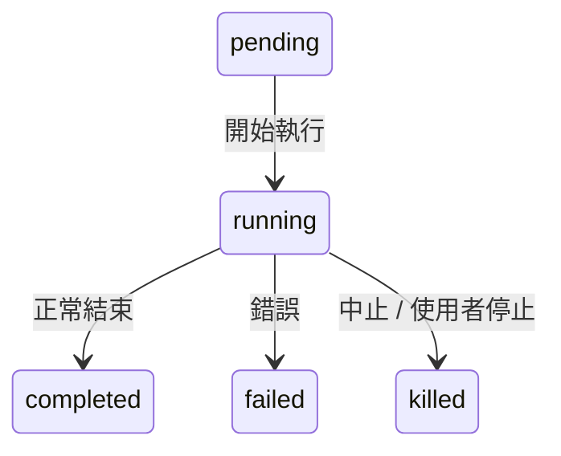
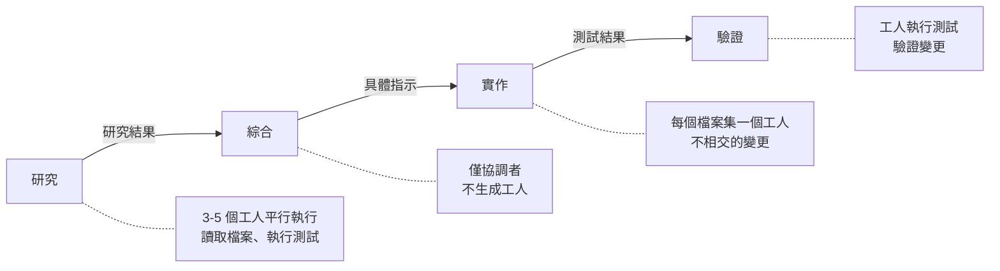
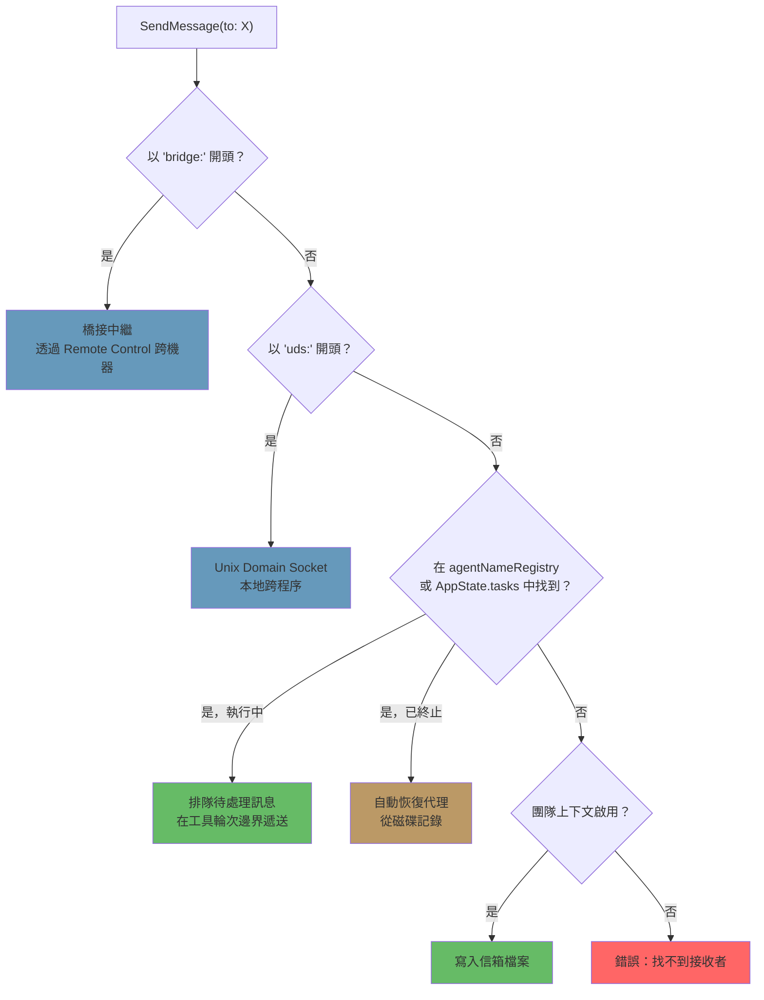

# 第十章：任務、協調與群集

## 單一執行緒的極限

第八章展示了如何建立子代理——從代理定義構建隔離執行上下文的十五步驟生命週期。第九章展示了如何透過利用提示快取，讓平行生成變得經濟實惠。但建立代理和管理代理是不同的問題。本章要處理的是後者。

單一代理迴圈——一個模型、一段對話、一次一個工具——能完成的工作量令人驚嘆。它可以讀取檔案、編輯程式碼、執行測試、搜尋網路，以及推理複雜問題。但它會碰到天花板。

天花板不是智力，而是平行性和作用範圍。一個開發者在進行大規模重構時，需要更新 40 個檔案、在每批修改後執行測試，並驗證沒有東西壞掉。一次程式碼遷移會同時涉及前端、後端和資料庫層。一次徹底的程式碼審查要在背景執行測試套件的同時閱讀數十個檔案。這些不是更難的問題——而是更寬的問題。它們需要同時做多件事的能力、將工作委派給專家的能力，以及協調結果的能力。

Claude Code 對此問題的答案不是單一機制，而是一個分層的編排模式堆疊，每一層適合不同形態的工作。背景任務用於發射後不管的指令。協調者模式用於管理者-工人的階層架構。群集團隊用於點對點協作。而一套統一的通訊協定將它們全部串在一起。

編排層大約橫跨 40 個檔案，分佈在 `tools/AgentTool/`、`tasks/`、`coordinator/`、`tools/SendMessageTool/` 和 `utils/swarm/` 之中。儘管覆蓋範圍如此廣泛，設計仍錨定於一個所有模式共用的單一狀態機。理解那個狀態機——`Task.ts` 中的 `Task` 抽象——是理解其他一切的先決條件。

本章從基礎的任務狀態機開始追蹤整個堆疊，一路到最精密的多代理拓撲。

---

## 任務狀態機

Claude Code 中的每個背景操作——一個 shell 指令、一個子代理、一個遠端會話、一個工作流腳本——都被追蹤為一個*任務*。任務抽象存在於 `Task.ts` 中，提供了其餘編排層所依賴的統一狀態模型。

### 七種類型

系統定義了七種任務類型，每種代表不同的執行模型：

這七種任務類型是：`local_bash`（背景 shell 指令）、`local_agent`（背景子代理）、`remote_agent`（遠端會話）、`in_process_teammate`（群集隊友）、`local_workflow`（工作流腳本執行）、`monitor_mcp`（MCP 伺服器監控）和 `dream`（推測性背景思考）。

`local_bash` 和 `local_agent` 是工作主力——分別是背景 shell 指令和背景子代理。`in_process_teammate` 是群集原語。`remote_agent` 橋接到遠端 Claude Code Runtime 環境。`local_workflow` 執行多步驟腳本。`monitor_mcp` 監控 MCP 伺服器健康狀態。`dream` 是最不尋常的——一個讓代理在等待使用者輸入時進行推測性思考的背景任務。

每種類型都有一個單字元 ID 前綴，用於即時的視覺辨識：

| 類型 | 前綴 | 範例 ID |
|------|--------|------------|
| `local_bash` | `b` | `b4k2m8x1` |
| `local_agent` | `a` | `a7j3n9p2` |
| `remote_agent` | `r` | `r1h5q6w4` |
| `in_process_teammate` | `t` | `t3f8s2v5` |
| `local_workflow` | `w` | `w6c9d4y7` |
| `monitor_mcp` | `m` | `m2g7k1z8` |
| `dream` | `d` | `d5b4n3r6` |

任務 ID 使用單字元前綴（a 表示代理、b 表示 bash、t 表示隊友等等）加上 8 個隨機英數字元，取自大小寫不敏感安全字母表（數字加小寫字母）。這產生了約 2.8 兆種組合——足以抵抗針對磁碟上任務輸出檔案的暴力符號連結攻擊。

當你在日誌行中看到 `a7j3n9p2`，你立刻知道這是一個背景代理。當你看到 `b4k2m8x1`，是一個 shell 指令。前綴對人類讀者是一個微型最佳化，但在一個可能有數十個並行任務的系統中，這很重要。

### 五種狀態

生命週期是一個簡單的有向圖，沒有循環：



`pending` 是註冊和首次執行之間的短暫狀態。`running` 表示任務正在積極工作。三個終止狀態是 `completed`（成功）、`failed`（錯誤）和 `killed`（由使用者、協調者或中止訊號明確停止）。一個輔助函式防止與已終止的任務互動：

```typescript
export function isTerminalTaskStatus(status: TaskStatus): boolean {
  return status === 'completed' || status === 'failed' || status === 'killed'
}
```

這個函式無處不在——出現在訊息注入守衛、驅逐邏輯、孤兒清理，以及 SendMessage 路由決定要排隊訊息還是恢復已終止代理的邏輯中。

### 基礎狀態

每個任務狀態都擴展自 `TaskStateBase`，它承載所有七種類型共享的欄位：

```typescript
export type TaskStateBase = {
  id: string              // 帶前綴的隨機 ID
  type: TaskType          // 區分器
  status: TaskStatus      // 目前生命週期位置
  description: string     // 人類可讀的摘要
  toolUseId?: string      // 產生此任務的 tool_use 區塊
  startTime: number       // 建立時間戳
  endTime?: number        // 終止狀態時間戳
  totalPausedMs?: number  // 累計暫停時間
  outputFile: string      // 串流輸出的磁碟路徑
  outputOffset: number    // 增量輸出的讀取游標
  notified: boolean       // 是否已回報完成給父代理
}
```

有兩個欄位值得注意。`outputFile` 是非同步執行和父代理對話之間的橋樑——每個任務將其輸出寫入磁碟上的檔案，父代理可以透過 `outputOffset` 增量讀取它。`notified` 防止重複的完成訊息；一旦父代理被告知任務已完成，旗標就翻轉為 `true`，通知永遠不會再次發送。如果沒有這個守衛，一個在兩次連續輪詢通知佇列之間完成的任務會產生重複通知，讓模型誤以為兩個任務完成了，而實際上只有一個。

### 代理任務狀態

`LocalAgentTaskState` 是最複雜的變體，承載管理背景子代理完整生命週期所需的一切：

```typescript
export type LocalAgentTaskState = TaskStateBase & {
  type: 'local_agent'
  agentId: string
  prompt: string
  selectedAgent?: AgentDefinition
  agentType: string
  model?: string
  abortController?: AbortController
  pendingMessages: string[]       // 透過 SendMessage 排隊
  isBackgrounded: boolean         // 這原本是前景代理嗎？
  retain: boolean                 // UI 正在持有此任務
  diskLoaded: boolean             // 側鏈記錄已載入
  evictAfter?: number             // GC 截止期限
  progress?: AgentProgress
  lastReportedToolCount: number
  lastReportedTokenCount: number
  // ... 其他生命週期欄位
}
```

三個欄位揭示了重要的設計決策。`pendingMessages` 是收件匣——當 `SendMessage` 針對一個正在執行的代理時，訊息會被排入此處而非立即注入。訊息在工具輪次邊界被排空，這保留了代理的回合結構。`isBackgrounded` 區分了天生就是非同步的代理和那些最初作為前景同步代理啟動、後來由使用者按鍵轉入背景的代理。`evictAfter` 是垃圾回收機制：未被保留的已完成任務在寬限期後其狀態會從記憶體中清除。

所有任務狀態都儲存在 `AppState.tasks` 中，作為 `Record<string, TaskState>`，以帶前綴的 ID 為鍵。這是一個扁平的映射，不是樹——系統不在狀態儲存中建模父子關係。父子關係隱含在對話流中：父代理持有產生子代理的 `toolUseId`。

### 任務註冊表

每種任務類型背後都有一個具有最小介面的 `Task` 物件：

```typescript
export type Task = {
  name: string
  type: TaskType
  kill(taskId: string, setAppState: SetAppState): Promise<void>
}
```

註冊表收集所有任務實作：

```typescript
export function getAllTasks(): Task[] {
  return [
    LocalShellTask,
    LocalAgentTask,
    RemoteAgentTask,
    DreamTask,
    ...(LocalWorkflowTask ? [LocalWorkflowTask] : []),
    ...(MonitorMcpTask ? [MonitorMcpTask] : []),
  ]
}
```

注意條件式包含——`LocalWorkflowTask` 和 `MonitorMcpTask` 受功能閘控，在執行期可能不存在。`Task` 介面刻意保持最小。早期的迭代包含 `spawn()` 和 `render()` 方法，但當團隊意識到生成和渲染從未被多型地呼叫時，這些方法就被移除了。每種任務類型都有自己的生成邏輯、自己的狀態管理和自己的渲染。唯一真正需要按類型分派的操作是 `kill()`，所以介面只要求這一個方法。

這是一個透過減法進行介面演化的範例。最初的設計想像所有任務類型會共享一個通用的生命週期介面。在實踐中，各類型的差異足夠大，以至於共享介面變成了虛構——shell 指令的 `spawn()` 和程序內隊友的 `spawn()` 幾乎沒有共同點。與其維護一個有洩漏的抽象，團隊移除了除真正從多型中受益的那一個方法以外的所有東西。

---

## 通訊模式

一個在背景執行的任務，只有在父代理能觀察其進度並接收其結果時才有用。Claude Code 支援三種通訊通道，每種針對不同的存取模式進行最佳化。

### 前景：生成器鏈

當代理同步執行時，父代理直接迭代其 `runAgent()` 非同步生成器，將每個訊息沿呼叫堆疊向上產出。這裡有趣的機制是背景逃逸出口——同步迴圈在「來自代理的下一個訊息」和「背景訊號」之間競跑：

```typescript
const agentIterator = runAgent({ ...params })[Symbol.asyncIterator]()

while (true) {
  const nextMessagePromise = agentIterator.next()
  const raceResult = backgroundPromise
    ? await Promise.race([nextMessagePromise.then(...), backgroundPromise])
    : { type: 'message', result: await nextMessagePromise }

  if (raceResult.type === 'background') {
    // 使用者觸發了背景化——轉換為非同步
    await agentIterator.return(undefined)
    void runAgent({ ...params, isAsync: true })
    return { data: { status: 'async_launched' } }
  }

  agentMessages.push(message)
}
```

如果使用者在執行過程中決定同步代理應該變成背景任務，前景迭代器會被乾淨地返回（觸發其 `finally` 區塊進行資源清理），然後代理以相同 ID 被重新生成為非同步任務。轉換是無縫的——不會丟失任何工作，代理從中斷處繼續，使用一個與父代理 ESC 鍵脫鉤的非同步中止控制器。

這是一個真正難以做對的狀態轉換。前景代理共用父代理的中止控制器（ESC 同時終止兩者）。背景代理需要自己的控制器（ESC 不應該終止它）。代理的訊息需要從前景生成器串流轉移到背景通知系統。任務狀態需要翻轉 `isBackgrounded`，這樣 UI 才知道要在背景面板中顯示它。所有這些都必須原子性地發生——轉換中不能丟失訊息，不能留下殭屍迭代器繼續執行。`Promise.race` 在下一個訊息和背景訊號之間的競跑，就是使這一切成為可能的機制。

### 背景：三個通道

背景代理透過磁碟、通知和排隊訊息進行通訊。

**磁碟輸出檔案。** 每個任務都寫入一個 `outputFile` 路徑——一個指向代理記錄的 JSONL 格式符號連結。父代理（或任何觀察者）可以使用 `outputOffset` 增量讀取此檔案，該偏移量追蹤檔案已被消費到哪裡。`TaskOutputTool` 將此暴露給模型：

```typescript
inputSchema = z.strictObject({
  task_id: z.string(),
  block: z.boolean().default(true),
  timeout: z.number().default(30000),
})
```

當 `block: true` 時，工具會輪詢直到任務達到終止狀態或逾時到期。這是協調者生成工人並等待其結果的主要機制。

**任務通知。** 當背景代理完成時，系統會生成一個 XML 通知並將其排入佇列，準備送入父代理的對話：

```xml
<task-notification>
  <task-id>a7j3n9p2</task-id>
  <tool-use-id>toolu_abc123</tool-use-id>
  <output-file>/path/to/output</output-file>
  <status>completed</status>
  <summary>代理「調查認證 bug」已完成</summary>
  <result>在 src/auth/validate.ts:42 發現空指標...</result>
  <usage>
    <total_tokens>15000</total_tokens>
    <tool_uses>8</tool_uses>
    <duration_ms>12000</duration_ms>
  </usage>
</task-notification>
```

通知作為 user-role 訊息注入父代理的對話中，這意味著模型在其正常的訊息流中就能看到它。它不需要特殊的工具來檢查完成狀態——它們以上下文的形式到達。任務狀態上的 `notified` 旗標防止重複遞送。

**命令佇列。** `LocalAgentTaskState` 上的 `pendingMessages` 陣列是第三個通道。當 `SendMessage` 針對一個正在執行的代理時，訊息會被排隊：

```typescript
if (isLocalAgentTask(task) && task.status === 'running') {
  queuePendingMessage(agentId, input.message, setAppState)
  return { data: { success: true, message: 'Message queued...' } }
}
```

這些訊息由 `drainPendingMessages()` 在工具輪次邊界排空，並作為使用者訊息注入代理的對話。這是一個至關重要的設計選擇——訊息在工具輪次之間到達，而非在執行中途。代理完成其當前的思考後，才接收新的資訊。沒有競態條件，沒有損壞的狀態。

### 進度追蹤

`ProgressTracker` 提供對代理活動的即時可見性：

```typescript
export type ProgressTracker = {
  toolUseCount: number
  latestInputTokens: number        // 累計的（最新值，非加總）
  cumulativeOutputTokens: number   // 跨回合加總
  recentActivities: ToolActivity[] // 最近 5 次工具使用
}
```

輸入和輸出 token 追蹤之間的區別是刻意的，反映了 API 計費模型的一個細微之處。輸入 token 是每次 API 呼叫的累計值，因為完整對話每次都會重新發送——第 15 個回合包含前 14 個回合的所有內容，所以 API 回報的輸入 token 計數已經反映了總數。保留最新值才是正確的聚合方式。輸出 token 是每回合的——模型每次都生成新的 token——所以加總才是正確的聚合方式。搞錯這一點會導致要嘛大幅高估（加總累計的輸入 token），要嘛大幅低估（僅保留最新的輸出 token）。

`recentActivities` 陣列（上限為 5 筆）提供了代理正在做什麼的人類可讀串流：「讀取 src/auth/validate.ts」、「Bash: npm test」、「編輯 src/auth/validate.ts」。這會出現在 VS Code 子代理面板和終端機的背景任務指示器中，讓使用者無需閱讀完整記錄就能看到代理的工作。

對於背景代理，進度透過 `updateAsyncAgentProgress()` 寫入 `AppState`，並透過 `emitTaskProgress()` 作為 SDK 事件發送。VS Code 子代理面板消費這些事件來渲染即時的進度條、工具計數和活動串流。進度追蹤不只是裝飾性的——它是告訴使用者背景代理是在取得進展還是陷入迴圈的主要回饋機制。

---

## 協調者模式

協調者模式將 Claude Code 從一個帶有背景助手的單一代理，轉變為真正的管理者-工人架構。它是系統中最具主見的編排模式，其設計揭示了關於 LLM 應該如何以及不應該如何委派工作的深思熟慮。

### 協調者模式解決的問題

標準代理迴圈有一段對話和一個上下文視窗。當它生成一個背景代理時，背景代理獨立執行並透過任務通知回報結果。這對簡單的委派很有效——「在我繼續編輯時執行測試」——但對複雜的多步驟工作流就會失效。

考慮一次程式碼遷移。代理需要：(1) 理解 200 個檔案中的當前模式，(2) 設計遷移策略，(3) 對每個檔案套用變更，(4) 驗證沒有東西壞掉。步驟 1 和 3 受益於平行化。步驟 2 需要綜合步驟 1 的結果。步驟 4 依賴步驟 3。單一代理依序執行這些，會將大部分 token 預算花在重新讀取檔案上。多個背景代理在沒有協調的情況下做這些，會產生不一致的變更。

協調者模式透過將「思考」代理和「執行」代理分離來解決這個問題。協調者處理步驟 1 和 2（派遣研究工人，然後綜合）。工人處理步驟 3 和 4（套用變更、執行測試）。協調者看到全貌；工人只看到自己的特定任務。

### 啟動

一個環境變數就能切換開關：

```typescript
export function isCoordinatorMode(): boolean {
  if (feature('COORDINATOR_MODE')) {
    return isEnvTruthy(process.env.CLAUDE_CODE_COORDINATOR_MODE)
  }
  return false
}
```

在會話恢復時，`matchSessionMode()` 會檢查已恢復會話的儲存模式是否與當前環境匹配。如果它們不一致，環境變數會被翻轉以匹配。這防止了令人困惑的場景——協調者會話以普通代理恢復（丟失對其工人的感知），或者普通會話以協調者恢復（丟失對其工具的存取）。會話的模式是事實的來源；環境變數是執行期訊號。

### 工具限制

協調者的力量不是來自擁有更多工具，而是來自擁有更少的工具。在協調者模式中，協調者代理恰好獲得三個工具：

- **Agent** —— 生成工人
- **SendMessage** —— 與現有工人通訊
- **TaskStop** —— 終止執行中的工人

就這樣。沒有檔案讀取。沒有程式碼編輯。沒有 shell 指令。協調者不能直接碰程式碼庫。這個限制不是一種缺陷——而是核心設計原則。協調者的工作是思考、計劃、分解和綜合。工人做實際的工作。

相反地，工人獲得完整的工具集，扣除內部協調工具：

```typescript
const INTERNAL_WORKER_TOOLS = new Set([
  TEAM_CREATE_TOOL_NAME,
  TEAM_DELETE_TOOL_NAME,
  SEND_MESSAGE_TOOL_NAME,
  SYNTHETIC_OUTPUT_TOOL_NAME,
])
```

工人不能生成自己的子團隊或向同儕發送訊息。他們透過正常的任務完成機制回報結果，由協調者跨工人進行綜合。

### 370 行系統提示詞

協調者系統提示詞，就行數而言，是程式碼庫中關於如何使用 LLM 進行編排最具教育意義的文件。它大約有 370 行，編碼了關於委派模式的寶貴經驗教訓。關鍵教學：

**「絕不委派理解。」** 這是核心論點。協調者必須將研究發現綜合為具體的提示，包含檔案路徑、行號和確切的變更。提示明確指出反模式，例如「根據你的研究發現，修復這個 bug」——一個將*理解*委派給工人的提示，迫使它重新推導協調者已經擁有的上下文。正確的模式是：「在 `src/auth/validate.ts` 第 42 行，`userId` 參數在從 OAuth 流程呼叫時可以是 null。加入一個 null 檢查，回傳 401 回應。」

**「平行性是你的超能力。」** 提示建立了一個清晰的並行模型。唯讀任務可以自由平行執行——研究、探索、檔案讀取。寫入密集的任務按檔案集序列化。協調者被期望推理哪些任務可以重疊、哪些必須按順序。一個好的協調者同時生成五個研究工人，等待它們全部完成，綜合，然後生成三個處理不相交檔案集的實作工人。一個差的協調者生成一個工人，等待，再生成下一個，再等待——將本可平行的工作序列化。

**任務工作流階段。** 提示定義了四個階段：



1. **研究** —— 工人平行探索程式碼庫，讀取檔案、執行測試、收集資訊
2. **綜合** —— 協調者（不是工人）讀取所有研究結果並建立統一的理解
3. **實作** —— 工人接收從綜合中得出的精確指示
4. **驗證** —— 工人執行測試並驗證變更

協調者不應跳過階段。最常見的失敗模式是從研究直接跳到實作而沒有綜合。當這種情況發生時，協調者將理解委派給了實作工人——每個工人都必須從頭重新推導上下文，導致不一致的變更和浪費的 token。

**繼續 vs 生成的決策。** 當一個工人完成而協調者有後續工作時，它應該向現有工人發送訊息（透過 SendMessage）還是生成一個新的（透過 Agent）？決策是上下文重疊程度的函式：

- **高重疊，相同檔案**：繼續。工人的上下文中已經有檔案內容，理解模式，可以在之前的工作基礎上建構。重新生成會強制重新讀取相同的檔案和重新推導相同的理解。
- **低重疊，不同領域**：生成新的。一個剛調查完認證系統的工人裝載了 20,000 token 的認證專用上下文，這些對 CSS 重構任務來說是無用的負擔。乾淨地重新開始更便宜。
- **高重疊但工人失敗了**：生成新的，附帶關於出了什麼問題的明確指引。繼續使用一個失敗的工人通常意味著與混亂的上下文對抗。帶著「前一次嘗試因為 X 失敗了，避免 Y」的全新開始更可靠。
- **後續工作需要工人的輸出**：繼續，在 SendMessage 中包含輸出。工人不需要重新推導自己的結果。

**工人提示的撰寫和反模式。** 提示教協調者如何撰寫有效的工人提示，並明確標記不良模式：

反模式：*「根據你的研究發現，實作修復。」* 這委派了理解。工人不是做研究的那個——是協調者讀了研究結果。

反模式：*「修復認證模組中的 bug。」* 沒有檔案路徑，沒有行號，沒有 bug 的描述。工人必須從頭搜尋整個程式碼庫。

反模式：*「對所有其他檔案做同樣的變更。」* 哪些檔案？什麼變更？協調者知道；它應該列舉出來。

好的模式：*「在 `src/auth/validate.ts` 第 42 行，`userId` 參數在從 `src/oauth/callback.ts:89` 呼叫時可以是 null。加入一個 null 檢查：如果 `userId` 為 null，回傳 `{ error: 'unauthorized', status: 401 }`。然後更新 `src/auth/__tests__/validate.test.ts` 中的測試以覆蓋 null 的情況。」*

撰寫具體提示的成本由協調者承擔一次。其益處——工人第一次就正確執行——是巨大的。模糊的提示創造了一種虛假的經濟效益：協調者省了 30 秒的提示撰寫時間，工人浪費了 5 分鐘的探索時間。

### 工人上下文

協調者將可用工具的資訊注入自己的上下文中，這樣模型就知道工人能做什麼：

```typescript
export function getCoordinatorUserContext(mcpClients, scratchpadDir?) {
  return {
    workerToolsContext: `Workers spawned via Agent have access to: ${workerTools}`
      + (mcpClients.length > 0
        ? `\nWorkers also have MCP tools from: ${serverNames}` : '')
      + (scratchpadDir ? `\nScratchpad: ${scratchpadDir}` : '')
  }
}
```

暫存目錄（由 `tengu_scratch` 功能旗標閘控）是一個共享的檔案系統位置，工人可以在不需要權限提示的情況下進行讀寫。它實現了持久的跨工人知識共享——一個工人的研究筆記成為另一個工人的輸入，透過檔案系統而非透過協調者的 token 視窗來中介。

這很重要，因為它解決了協調者模式的一個根本限制。沒有暫存目錄時，所有資訊都流經協調者：工人 A 產生發現，協調者透過 TaskOutput 讀取它們，將它們綜合成工人 B 的提示。協調者的上下文視窗成為瓶頸——它必須持有所有中間結果足夠長的時間來綜合它們。有了暫存目錄，工人 A 將發現寫入 `/tmp/scratchpad/auth-analysis.md`，協調者告訴工人 B：「讀取 `/tmp/scratchpad/auth-analysis.md` 中的認證分析，並將該模式套用到 OAuth 模組。」協調者透過引用而非透過值來移動資訊。

### 與 Fork 的互斥

協調者模式和基於 fork 的子代理是互斥的：

```typescript
export function isForkSubagentEnabled(): boolean {
  if (feature('FORK_SUBAGENT')) {
    if (isCoordinatorMode()) return false
    // ...
  }
}
```

衝突是根本性的。分叉代理繼承父代理的整個對話上下文——它們是共享提示快取的廉價複製品。協調者工人是具有全新上下文和特定指示的獨立代理。這是對立的委派哲學，系統在功能旗標層級強制執行這個選擇。

---

## 群集系統

協調者模式是階層式的：一個管理者、多個工人、自上而下的控制。群集系統是點對點的替代方案——多個 Claude Code 實例作為一個團隊工作，由一個領導者透過訊息傳遞來協調多個隊友。

### 團隊上下文

團隊由 `teamName` 識別，追蹤在 `AppState.teamContext` 中：

```typescript
teamContext?: {
  teamName: string
  teammates: {
    [id: string]: { name: string; color?: string; ... }
  }
}
```

每個隊友都有一個名字（用於定址）和一個顏色（用於 UI 中的視覺區分）。團隊檔案持久化在磁碟上，這樣團隊成員資格在程序重啟後仍然存在。

### 代理名稱註冊表

背景代理可以在生成時被指定名字，這使得它們可以透過人類可讀的識別符而非隨機任務 ID 來定址：

```typescript
if (name) {
  rootSetAppState(prev => {
    const next = new Map(prev.agentNameRegistry)
    next.set(name, asAgentId(asyncAgentId))
    return { ...prev, agentNameRegistry: next }
  })
}
```

`agentNameRegistry` 是一個 `Map<string, AgentId>`。當 `SendMessage` 解析 `to` 欄位時，會先檢查註冊表：

```typescript
const registered = appState.agentNameRegistry.get(input.to)
const agentId = registered ?? toAgentId(input.to)
```

這意味著你可以向 `"researcher"` 發送訊息，而不是 `a7j3n9p2`。這個間接層很簡單，但它讓協調者能以角色而非 ID 來思考——這對模型推理多代理工作流的能力是一個重大改進。

### 程序內隊友

程序內隊友在與領導者相同的 Node.js 程序中執行，透過 `AsyncLocalStorage` 隔離。它們的狀態以團隊特定欄位擴展基礎：

```typescript
export type InProcessTeammateTaskState = TaskStateBase & {
  type: 'in_process_teammate'
  identity: TeammateIdentity
  prompt: string
  messages?: Message[]                  // 上限為 50
  pendingUserMessages: string[]
  isIdle: boolean
  shutdownRequested: boolean
  awaitingPlanApproval: boolean
  permissionMode: PermissionMode
  onIdleCallbacks?: Array<() => void>
  currentWorkAbortController?: AbortController
}
```

`messages` 上限為 50 筆值得解釋。在開發過程中，分析顯示每個程序內代理在 500+ 回合時累積約 20MB 的 RSS。鯨魚級會話——長時間執行工作流的重度使用者——被觀察到在 2 分鐘內啟動 292 個代理，將 RSS 推到 36.8GB。UI 表示的 50 條訊息上限是一個記憶體安全閥。代理實際的對話以完整歷史繼續；只有面向 UI 的快照被截斷。

`isIdle` 旗標啟用了工作竊取模式。一個閒置的隊友不消耗 token 或 API 呼叫——它只是在等待下一則訊息。`onIdleCallbacks` 陣列讓系統能在從活躍到閒置的轉換中掛鉤，實現「等待所有隊友完成，然後繼續」之類的編排模式。

`currentWorkAbortController` 與隊友的主要中止控制器不同。中止當前工作控制器會取消隊友正在進行的回合，但不會終止隊友。這啟用了一種「重導向」模式：領導者發送一則更高優先級的訊息，隊友當前的工作被中止，隊友接收新的訊息。主要中止控制器被中止時，會完全終止隊友。兩個層級的中斷對應兩個層級的意圖。

`shutdownRequested` 旗標實現了協作式終止。當領導者發送關閉請求時，這個旗標被設定。隊友可以在自然的停止點檢查它並優雅地收尾——完成當前的檔案寫入、提交變更，或發送最終的狀態更新。這比硬終止更溫和，硬終止可能會讓檔案處於不一致的狀態。

### 信箱

隊友透過基於檔案的信箱系統進行通訊。當 `SendMessage` 針對一個隊友時，訊息會被寫入接收者的磁碟信箱檔案：

```typescript
await writeToMailbox(recipientName, {
  from: senderName,
  text: content,
  summary,
  timestamp: new Date().toISOString(),
  color: senderColor,
}, teamName)
```

訊息可以是純文字、結構化協定訊息（關閉請求、計劃核准），或廣播（`to: "*"` 發送給所有團隊成員，排除發送者）。一個輪詢鉤子處理收到的訊息，並將它們路由到隊友的對話中。

基於檔案的方法是刻意簡單的。沒有訊息代理，沒有事件匯流排，沒有共享記憶體通道。檔案是持久的（在程序崩潰後存活）、可檢視的（你可以 `cat` 一個信箱）、而且成本低廉（沒有基礎設施依賴）。對於一個訊息量以每個會話數十則而非每秒數千則來衡量的系統，這是正確的取捨。一個 Redis 支援的訊息佇列會增加營運複雜度、一個依賴項和失敗模式——全都是為了一個檔案系統呼叫就能輕鬆處理的吞吐量需求。

廣播機制值得一提。當訊息發送到 `"*"` 時，發送者會從團隊檔案迭代所有團隊成員，跳過自己（不區分大小寫的比較），然後分別寫入每個成員的信箱：

```typescript
for (const member of teamFile.members) {
  if (member.name.toLowerCase() === senderName.toLowerCase()) continue
  recipients.push(member.name)
}
for (const recipientName of recipients) {
  await writeToMailbox(recipientName, { from: senderName, text: content, ... }, teamName)
}
```

沒有扇出最佳化——每個接收者都是一次單獨的檔案寫入。同樣，在代理團隊的規模下（通常 3-8 個成員），這完全足夠。如果一個團隊有 100 個成員，這就需要重新思考。但防止 36GB RSS 場景的 50 條訊息記憶體上限，也隱含地限制了有效的團隊大小。

### 權限轉發

群集工人以受限的權限運作，但可以在需要批准敏感操作時向領導者升級：

```typescript
const request = createPermissionRequest({
  toolName, toolUseId, input, description, permissionSuggestions
})
registerPermissionCallback({ requestId, toolUseId, onAllow, onReject })
void sendPermissionRequestViaMailbox(request)
```

流程是：工人遇到一個需要權限的工具，bash 分類器嘗試自動批准，如果失敗，請求透過信箱系統轉發給領導者。領導者在其 UI 中看到請求，可以核准或拒絕。回呼觸發，工人繼續。這讓工人能對安全操作自主運作，同時對危險操作維持人類監督。

---

## 代理間通訊：SendMessage

`SendMessageTool` 是通用的通訊原語。它透過單一工具介面處理四種不同的路由模式，由 `to` 欄位的形式來選擇。

### 輸入結構

```typescript
inputSchema = z.object({
  to: z.string(),
  // "teammate-name", "*", "uds:<socket>", "bridge:<session-id>"
  summary: z.string().optional(),
  message: z.union([
    z.string(),
    z.discriminatedUnion('type', [
      z.object({ type: z.literal('shutdown_request'), reason: z.string().optional() }),
      z.object({ type: z.literal('shutdown_response'), request_id, approve, reason }),
      z.object({ type: z.literal('plan_approval_response'), request_id, approve, feedback }),
    ]),
  ]),
})
```

`message` 欄位是純文字和結構化協定訊息的聯合型別。這意味著 SendMessage 身兼雙職——它既是非正式的聊天通道（「這是我的發現」），也是正式的協定層（「我核准你的計劃」/「請關閉」）。

### 路由分派

`call()` 方法遵循一個按優先順序的分派鏈：



**1. 橋接訊息**（`bridge:<session-id>`）。透過 Anthropic 的 Remote Control 伺服器進行跨機器通訊。這是最廣的觸及範圍——兩個 Claude Code 實例在不同的機器上，可能在不同的大陸，透過中繼進行通訊。系統在發送橋接訊息前需要明確的使用者同意——這是一個安全檢查，防止一個代理單方面與遠端實例建立通訊。沒有這個閘門，一個被入侵或困惑的代理可能會將資訊洩漏到遠端會話。同意檢查使用 `postInterClaudeMessage()`，它處理透過 Remote Control 中繼的序列化和傳輸。

**2. UDS 訊息**（`uds:<socket-path>`）。透過 Unix Domain Socket 的本地跨程序通訊。這是用於在同一台機器上但在不同程序中執行的 Claude Code 實例——例如，一個 VS Code 擴展功能託管一個實例，一個終端機託管另一個。UDS 通訊速度快（沒有網路往返）、安全（檔案系統權限控制存取）且可靠（核心處理遞送）。`sendToUdsSocket()` 函式序列化訊息並寫入 `to` 欄位中指定的 socket 路徑。對等端透過 `ListPeers` 工具掃描活躍的 UDS 端點來發現彼此。

**3. 程序內子代理路由**（純名稱或代理 ID）。這是最常見的路徑。路由邏輯：

- 在 `agentNameRegistry` 中查找 `input.to`
- 如果找到且正在執行：`queuePendingMessage()` —— 訊息等待下一個工具輪次邊界
- 如果找到但處於終止狀態：`resumeAgentBackground()` —— 代理被透明地重新啟動
- 如果不在 `AppState` 中：嘗試從磁碟記錄恢復

**4. 團隊信箱**（當團隊上下文啟用時的備用路徑）。具名接收者的訊息被寫入其信箱檔案。`"*"` 萬用字元觸發向所有團隊成員的廣播。

### 結構化協定

除了純文字，SendMessage 還承載兩個正式的協定。

**關閉協定。** 領導者向隊友發送 `{ type: 'shutdown_request', reason: '...' }`。隊友回應 `{ type: 'shutdown_response', request_id, approve: true/false, reason }`。如果核准，程序內隊友中止其控制器；基於 tmux 的隊友收到 `gracefulShutdown()` 呼叫。協定是協作式的——如果隊友正在處理關鍵工作，它可以拒絕關閉請求，領導者必須處理這種情況。

**計劃核准協定。** 以計劃模式運作的隊友在執行前必須獲得核准。它們提交一個計劃，領導者回應 `{ type: 'plan_approval_response', request_id, approve, feedback }`。只有團隊領導者可以發出核准。這創造了一個審查閘門——領導者可以在任何檔案被修改之前檢查工人的預期方法，及早捕捉誤解。

### 自動恢復模式

路由系統最優雅的特性是透明的代理恢復。當 `SendMessage` 針對一個已完成或已終止的代理時，它不會回傳錯誤，而是復活該代理：

```typescript
if (task.status !== 'running') {
  const result = await resumeAgentBackground({
    agentId,
    prompt: input.message,
    toolUseContext: context,
    canUseTool,
  })
  return {
    data: {
      success: true,
      message: `Agent "${input.to}" was stopped; resumed with your message`
    }
  }
}
```

`resumeAgentBackground()` 函式從其磁碟記錄重建代理：

1. 讀取側鏈 JSONL 記錄
2. 重建訊息歷史，過濾孤立的思考區塊和未解決的工具使用
3. 重建內容替換狀態以維持提示快取穩定性
4. 從儲存的中繼資料解析原始代理定義
5. 以全新的中止控制器重新註冊為背景任務
6. 以恢復的歷史加上新訊息作為提示呼叫 `runAgent()`

從協調者的角度來看，向一個已終止的代理發送訊息和向一個存活的代理發送訊息是相同的操作。路由層處理複雜性。這意味著協調者不需要追蹤哪些代理是存活的——它們只管發送訊息，系統自行解決。

其含義是重大的。沒有自動恢復，協調者需要維護一個關於代理存活狀態的心理模型：「`researcher` 還在執行嗎？讓我檢查一下。它完成了。我需要生成一個新的代理。但等等，我應該用同一個名字嗎？它會有相同的上下文嗎？」有了自動恢復，所有這些都化簡為：「向 `researcher` 發送一則訊息。」如果它活著，訊息被排隊。如果它已終止，它會帶著完整歷史被復活。協調者的提示複雜度大幅降低。

當然有其代價。從磁碟記錄恢復意味著重新讀取可能數千則訊息、重建內部狀態，以及用完整的上下文視窗進行新的 API 呼叫。對於長期存活的代理，這在延遲和 token 上都可能很昂貴。但替代方案——要求協調者手動管理代理生命週期——更糟。協調者是一個 LLM。它擅長推理問題和撰寫指示。它不擅長簿記。自動恢復透過完全消除一整類簿記工作，發揮了 LLM 的強項。

---

## TaskStop：終止開關

`TaskStopTool` 是 Agent 和 SendMessage 的互補——它終止執行中的任務：

```typescript
inputSchema = z.strictObject({
  task_id: z.string().optional(),
  shell_id: z.string().optional(),  // 已棄用的向後相容
})
```

實作委派給 `stopTask()`，它根據任務類型分派：

1. 在 `AppState.tasks` 中查找任務
2. 呼叫 `getTaskByType(task.type).kill(taskId, setAppState)`
3. 對於代理：中止控制器，設定狀態為 `'killed'`，啟動驅逐計時器
4. 對於 shell：終止程序群組

該工具有一個遺留別名 `"KillShell"` ——這提醒我們任務系統是從更簡單的起源演化而來的，當時唯一的背景操作就是 shell 指令。

終止機制因任務類型而異，但模式是一致的。對於代理，終止意味著中止中止控制器（這導致 `query()` 迴圈在下一個 yield 點退出）、設定狀態為 `'killed'`，以及啟動驅逐計時器以便在寬限期後清理任務狀態。對於 shell，終止意味著向程序群組發送訊號——先是 `SIGTERM`，然後如果程序在逾時內沒有退出則發送 `SIGKILL`。對於程序內隊友，終止還會觸發向團隊的關閉通知，讓其他成員知道該隊友已離開。

驅逐計時器值得注意。當代理被終止時，其狀態不會被立即清除。它在 `AppState.tasks` 中停留一個寬限期（由 `evictAfter` 控制），這樣 UI 可以顯示已終止的狀態、任何最終輸出可以被讀取，以及透過 SendMessage 的自動恢復仍然可行。寬限期結束後，狀態被垃圾回收。這與已完成任務使用的模式相同——系統區分「已完成」（結果可用）和「已遺忘」（狀態已清除）。

---

## 在模式之間選擇

（關於命名的說明：程式碼庫中還包含 `TaskCreate`/`TaskGet`/`TaskList`/`TaskUpdate` 工具，用於管理結構化的待辦事項清單——這是一個與此處描述的背景任務狀態機完全不同的系統。`TaskStop` 操作 `AppState.tasks`；`TaskUpdate` 操作專案追蹤資料儲存。命名上的重疊是歷史遺留問題，也是模型困惑的反覆來源。）

有三種編排模式可用——背景委派、協調者模式和群集團隊——自然的問題是何時使用哪一種。

**簡單委派**（Agent 工具搭配 `run_in_background: true`）適用於父代理有一兩個獨立任務要卸載的情況。在繼續編輯的同時在背景執行測試。在等待建置的同時搜尋程式碼庫。父代理保持控制，在準備好時檢查結果，不需要複雜的通訊協定。開銷最小——一個任務狀態條目，一個磁碟輸出檔案，完成時一個通知。

**協調者模式**適用於問題分解為研究階段、綜合階段和實作階段——並且協調者需要在多個工人的結果之間推理後才能指導下一步。協調者不能碰檔案，這強制了關注點的清晰分離：思考在一個上下文中發生，執行在另一個上下文中發生。370 行的系統提示詞不是儀式——它編碼了防止 LLM 委派最常見失敗模式的模式，即委派理解而非委派行動。

**群集團隊**適用於代理需要點對點通訊的長期協作會話、工作是持續性而非批次導向的、以及代理可能需要根據收到的訊息閒置和恢復的情況。信箱系統支援協調者模式（同步的生成-等待-綜合）不支援的非同步模式。計劃核准閘門增加了審查層。權限轉發在不需要每個代理都有完整權限的情況下維持安全性。

一個實用的決策表：

| 場景 | 模式 | 原因 |
|----------|---------|-----|
| 在編輯時執行測試 | 簡單委派 | 一個背景任務，不需要協調 |
| 搜尋程式碼庫中的所有用法 | 簡單委派 | 發射後不管，完成時讀取輸出 |
| 跨 3 個模組重構 40 個檔案 | 協調者 | 研究階段找出模式，綜合階段規劃變更，工人按模組平行執行 |
| 帶有審查閘門的多日功能開發 | 群集 | 長期存活的代理、計劃核准協定、同儕通訊 |
| 修復已知位置的 bug | 都不用——單一代理 | 編排開銷超過了聚焦、循序工作的收益 |
| 遷移資料庫結構 + 更新 API + 更新前端 | 協調者 | 在共享的研究/規劃階段之後的三個獨立工作流 |
| 帶有使用者監督的配對程式設計 | 群集搭配計劃模式 | 工人提議，領導者核准，工人執行 |

這些模式在原則上不互斥，但在實踐中是互斥的。協調者模式停用分叉子代理。群集團隊有自己的通訊協定，不會與協調者任務通知混合。選擇在會話啟動時透過環境變數和功能旗標做出，它塑造了整個互動模型。

最後一個觀察：最簡單的模式幾乎總是正確的起點。大多數任務不需要協調者模式或群集團隊。一個帶有偶爾背景委派的單一代理就能處理絕大多數的開發工作。複雜的模式存在於那 5% 的情況——問題真正是寬廣的、真正是平行的、或真正是長期執行的。對一個單一檔案的 bug 修復使用協調者模式，就像為一個靜態網站部署 Kubernetes——技術上可行，架構上不恰當。

---

## 編排的代價

在審視編排層在哲學上揭示了什麼之前，值得承認它在實務上的代價。

每個背景代理都是一次獨立的 API 對話。它有自己的上下文視窗、自己的 token 預算，以及自己的提示快取槽位。一個生成 5 個研究工人的協調者正在進行 6 個並行的 API 呼叫，每個都有自己的系統提示詞、工具定義和 CLAUDE.md 注入。token 開銷不是微不足道的——光是系統提示詞就可能有數千個 token，而且每個工人重新讀取其他工人可能已經讀過的檔案。

通訊通道增加延遲。磁碟輸出檔案需要檔案系統 I/O。任務通知在工具輪次邊界遞送，而非即時。命令佇列引入完整的往返延遲——協調者發送訊息，訊息等待工人完成其當前的工具使用，工人處理訊息，結果被寫入磁碟供協調者讀取。

狀態管理增加複雜性。七種任務類型、五種狀態，以及每個任務狀態數十個欄位。驅逐邏輯、垃圾回收計時器、記憶體上限——所有這些都存在，因為無界的狀態增長導致了真實的生產事故（36.8GB RSS）。

這些都不意味著編排是錯的。它意味著編排是一個有代價的工具，代價應該與收益相權衡。執行 5 個平行工人來搜尋程式碼庫，當搜尋循序執行需要 5 分鐘時是值得的。執行一個協調者來修復一個檔案中的錯字就是純粹的開銷。

---

## 編排層揭示了什麼

這個系統最有趣的方面不是任何單一機制——任務狀態、信箱和通知 XML 都是直接的工程。有趣的是從它們如何組合在一起所浮現的*設計哲學*。

協調者提示詞中的「絕不委派理解」不只是 LLM 編排的好建議。它是對基於上下文視窗進行推理之根本限制的陳述。一個擁有全新上下文視窗的工人，無法理解協調者在讀取 50 個檔案並綜合三份研究報告後所理解的東西。彌合這個差距的唯一方法是讓協調者將其理解提煉為一個具體、可行動的提示。模糊的委派不只是低效的——它在資訊理論上是有損的。

SendMessage 中的自動恢復模式揭示了一種偏好：*表面的簡單性優於實際的簡單性*。實作很複雜——讀取磁碟記錄、重建內容替換狀態、重新解析代理定義。但介面是微不足道的：發送一則訊息，無論接收者是活的還是死的，它都能工作。複雜性被基礎設施吸收，這樣模型（和使用者）就能用更簡單的術語來推理。

而程序內隊友的 50 條訊息記憶體上限，則提醒我們編排系統在真實的物理限制下運作。292 個代理在 2 分鐘內達到 36.8GB RSS 不是一個理論上的顧慮——它在生產中發生過。抽象是優雅的，但它們在記憶體有限的硬體上執行，系統必須在使用者推到極限時優雅地降級。

分層架構本身也包含一個教訓。任務狀態機是不可知的——它不知道協調者或群集的存在。通訊通道是不可知的——SendMessage 不知道它是被協調者、群集領導者還是獨立代理呼叫。協調者提示詞疊加在上面，增加方法論而不改變底層機制。每一層都可以獨立理解、獨立測試和獨立演化。當團隊增加群集系統時，他們不需要修改任務狀態機。當他們增加協調者提示詞時，他們不需要修改 SendMessage。

這是良好分解的編排的標誌：原語是通用的，模式從它們組合而成。協調者只是一個具有限制工具和詳細系統提示詞的代理。群集領導者只是一個具有團隊上下文和信箱存取的代理。背景工人只是一個具有獨立中止控制器和磁碟輸出檔案的代理。七種任務類型、五種狀態和四種路由模式組合產生的編排模式，大於其各部分之和。

編排層是 Claude Code 從單一執行緒的工具執行者轉變為更接近開發團隊的地方。任務狀態機提供簿記。通訊通道提供資訊流。協調者提示詞提供方法論。群集系統為不適合嚴格階層的問題提供點對點拓撲。它們共同使得語言模型能做到單次模型調用無法做到的事：在平行環境中、帶有協調地處理寬廣的問題。

下一章探討權限系統——決定這些代理中的哪些可以做什麼、以及危險操作如何從工人升級到人類的安全層。沒有權限控制的編排將是錯誤的力量倍增器。權限系統確保更多代理意味著更多功能，而非更多風險。
