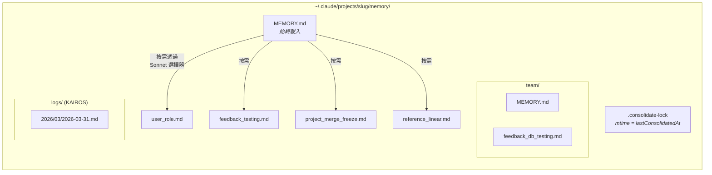
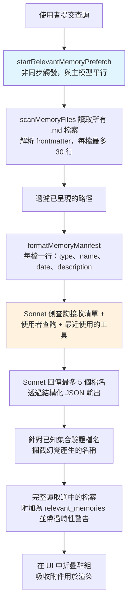
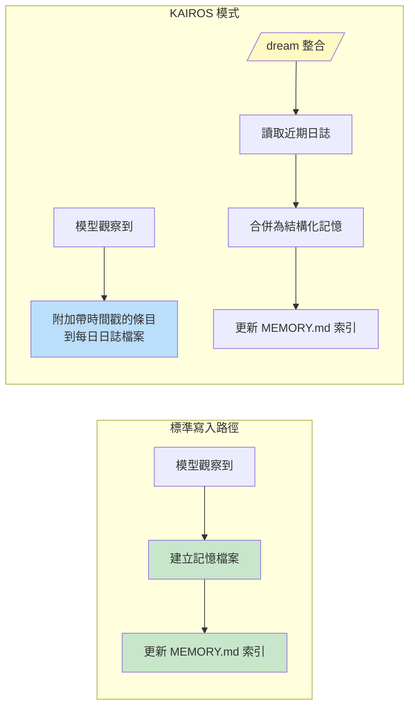

# 第十一章：記憶（Memory）——跨對話學習

## 無狀態問題

到目前為止的每一章描述的都是存在於單一工作階段內的機制。代理迴圈運行、工具執行、子代理協調，而當程序退出時，一切都消失了。下一次對話以相同的系統提示、相同的工具定義、相同的模型啟動——對之前發生過什麼毫無所知。

這是無狀態架構的根本限制。開發者在週一糾正了模型的測試方式，到了週二模型又犯了同樣的錯誤。使用者解釋了他們的角色、專案的限制、偏好的程式碼風格，而每次新的工作階段都需要他們重新解釋一遍。模型不是健忘——它從來就不知道。每次對話都是一個獨立的宇宙。

這個問題不是理論上的。它以具體的方式表現出來，侵蝕信任。使用者說「記住，我們在測試中使用真實的資料庫實例，而不是 mock」——下週模型卻生成了使用 mock 的測試。使用者解釋自己是資深工程師，不需要初學者級別的說明——下一個工作階段卻以教學級別的導覽開場。沒有記憶，每次工作階段都從零開始。代理永遠是第一天上班的新人。

業界的標準解決方案是檢索增強生成（RAG）：將文件嵌入為向量，儲存在向量資料庫中，在查詢時檢索相關片段。這對知識庫效果很好——文件、FAQ、參考資料。但對於代理實際需要跨工作階段記住的東西，它在架構上是不匹配的。代理的記憶不是知識庫。它是一組觀察：使用者是誰、他們曾糾正過什麼、專案目前的限制是什麼、在哪裡能找到東西。這些觀察很小、經常變化，而且必須是人類可編輯的。向量資料庫解決的是錯誤的問題。

Claude Code 的記憶系統是一個完全不同的賭注：磁碟上的檔案、Markdown 格式、LLM 驅動的回憶、零基礎設施。這個賭注是，儲存的簡單性加上檢索的智慧，能產生比兩者都追求複雜性更好的系統。

這個設計哲學帶來的後果塑造了整個系統：

- **人類可讀。** 想查看 Claude Code 記住了什麼的使用者可以在任何文字編輯器中打開 `~/.claude/projects/<slug>/memory/MEMORY.md`。不需要特殊工具、不需要解密、不需要匯出指令。
- **人類可編輯。** 過時的記憶可以用 vim 修正。錯誤的記憶可以用 `rm` 刪除。使用者對代理的知識擁有完全的主控權。
- **可版本控制。** 團隊記憶可以提交到 git。記憶變更的 diff 很乾淨，因為它們是 Markdown。
- **零基礎設施。** 記憶系統可以離線工作、不需要伺服器、在任何有檔案系統的作業系統上都能運作。不存在遷移路徑，因為沒有 schema。
- **可除錯。** 當記憶的行為出乎意料時，診斷路徑是 `ls` 和 `cat`，而不是查詢日誌和資料庫檢查。

模型使用 `FileWriteTool` 和 `FileEditTool` 來讀寫記憶——與它用來編輯原始碼的工具相同（在第六章介紹過）。不存在特殊的記憶 API。系統提示教會模型一個兩步驟寫入協定（建立檔案、更新索引），模型在新的指令下使用其既有能力來執行。這是將工具重用作為架構原則——記憶系統不是螺栓接在代理上的子系統，而是代理使用其既有能力所產生的湧現行為。

基於檔案的選擇在此行得通有一個更深層的原因。對 AI 代理而言，記憶與傳統應用程式中的記憶根本不同。傳統應用程式的資料庫保存權威狀態——系統資料的唯一真實來源。代理的記憶保存的是*觀察*——在某個時間點為真、可能仍為真也可能不再為真的事物。檔案自然地傳達了這種認識論狀態。它們有修改時間，揭示觀察何時被記錄。它們可以被知道觀察有誤的人類讀取、編輯和刪除。資料庫暗示永久性和權威性；Markdown 檔案暗示的是某人寫下的筆記，可能需要更新。儲存媒介傳達了資料的本質——這些是工作筆記，不是聖經。

### 逐專案範圍界定

記憶的範圍界定是基於 git 儲存庫根目錄，而非工作目錄。如果使用者在 `src/components/` 開一個終端機，在 `tests/` 開另一個，兩個工作階段共享相同的記憶目錄。解析邏輯首先找到規範的 git 根目錄，退而求其次使用專案根目錄：

基礎路徑解析首先找到規範的 git 根目錄，退而求其次使用專案根目錄。這確保同一儲存庫的所有 git worktree 共享單一的記憶目錄。

`findCanonicalGitRoot` 呼叫確保同一儲存庫的所有 git worktree 共享單一的記憶目錄。git 根目錄被清理（斜線變成破折號，透過 `sanitizePath()` ）以產生扁平的目錄名稱：

```
~/.claude/projects/-Users-alex-code-myapp/memory/
```

一個完整填充的記憶目錄揭示了系統的結構：



命名慣例是語義化的：`<type>_<topic>.md`。類型前綴不由程式碼強制，而是提示指令的一部分，使得目視掃描目錄並理解記憶全貌變得容易。

---

## 四類型分類法

不是所有東西都值得記住。記憶系統將所有記憶嚴格限制為四種類型：

這四種類型是：**user**（使用者）、**feedback**（回饋）、**project**（專案）和 **reference**（參考）。

分類法是圍繞一個單一標準設計的：**這個知識能否從目前的專案狀態推導出來？** 程式碼模式、架構、檔案結構、git 歷史——這些都可以透過讀取程式碼庫重新推導。它們被排除在外。這四種類型捕獲的是無法重新推導的知識。

**使用者記憶**記錄關於人的資訊：他們的角色、目標、職責、專業程度。一位精通 Go 但初學 React 的資深工程師得到的解釋，與一位初次接觸程式設計的人不同。

**回饋記憶**捕獲關於如何處理工作的指導——包括糾正和確認。系統明確指示模型記錄兩者：「如果你只保存糾正，你會偏離使用者已經驗證過的方式。」每條回饋記憶有特定結構：規則本身，然後是一行 `**Why:**` 說明原因（通常是過去的事件），再然後是一行 `**How to apply:**` 說明觸發條件。

**專案記憶**記錄進行中的工作上下文——誰在做什麼、為什麼、截止日期。提示強調將相對日期轉換為絕對日期：「Thursday」變成「2026-03-05」，這樣記憶在幾週後仍然可解讀。

**參考記憶**是書籤——指向資訊在外部系統中位置的指標。一個 Linear 專案 URL、一個 Grafana 儀表板、一個 Slack 頻道。這些告訴模型該去哪裡找，而不是找什麼。

### 分類法作為過濾器

這四種類型不僅是分類——它們是過濾器。透過精確定義什麼算記憶，系統隱含地定義了什麼不算。沒有這個分類法，一個急切的模型會保存所有東西：程式碼模式、架構圖、錯誤訊息。這些全部可以從程式碼庫推導。保存它們會建立一個平行的、可能過時的資訊副本，而這些資訊最好從其來源取得。

分類法也防止了一個更微妙的失敗：記憶作為拐杖。如果模型把架構決策保存為記憶，它就不再去讀程式碼庫來理解架構了。透過排除可推導的資訊，系統迫使模型保持紮根於程式碼的當前狀態。

排除清單是明確的：程式碼模式、git 歷史、除錯解法、CLAUDE.md 中的任何內容、臨時任務細節。這些排除即使在使用者明確要求保存時也適用。如果使用者說「記住這個 PR 清單」，模型被指示回推——「其中*令人驚訝*或*非顯而易見*的部分是什麼？」那個令人驚訝的部分值得保留。原始清單不值得。這條指令通過了 eval 驗證，從 0/2 提升到 3/3，是在加入排除覆蓋指令後達成的。

### Frontmatter 作為契約

每個記憶檔案使用帶有三個必填欄位的 YAML frontmatter：

```markdown
---
name: {{記憶名稱}}
description: {{一行描述——用於判斷相關性}}
type: {{user, feedback, project, reference}}
---
```

`description` 是最承重的欄位。它是相關性選擇器（一個 Sonnet 側查詢，下文討論）用來決定是否呈現此記憶的依據。一個模糊的描述如「testing stuff」要麼匹配得太廣泛，要麼完全不匹配。一個具體的描述如「Integration tests must hit real DB, not mocks -- burned by mock divergence Q4」恰好匹配那些它真正重要的對話。描述就是記憶的搜尋索引——不是被搜尋引擎消費，而是被一個能理解細微差異、上下文和意圖的語言模型消費。

frontmatter 也是掃描系統在回憶過程中唯一讀取的部分。`scanMemoryFiles()` 讀取每個檔案僅讀前 30 行來擷取標頭。正文在檔案被明確選中並載入之前是私有的。

---

## 寫入路徑

寫入記憶是一個使用標準檔案工具執行的兩步驟過程。

**步驟 1：寫入記憶檔案。** 模型在記憶目錄中建立一個帶有 YAML frontmatter 的 `.md` 檔案：

```markdown
---
name: Testing Policy
description: Integration tests must hit real DB, not mocks
type: feedback
---

Don't mock the database in integration tests.

**Why:** We got burned last quarter when mocked tests passed but production
queries hit edge cases the mocks didn't cover.

**How to apply:** Any test file under `__tests__/` that touches database
operations should use the real PGlite instance from test-utils.
```

**步驟 2：更新索引。** 模型在 `MEMORY.md` 中新增一行指標：

```markdown
- [Testing Policy](feedback_testing.md) -- integration tests must hit real DB
```

每個條目必須保持在大約 150 個字元以內。索引是目錄，不是知識庫。

當模型學到修改既有記憶的新資訊時，它使用 `FileEditTool` 來更新既有檔案，而不是建立重複的。系統不會在內部對記憶進行版本控制——檔案在本地檔案系統上，如果使用者想要版本控制，他們有 `git`。在提示構建之前，`ensureMemoryDirExists()` 會建立記憶目錄，而提示會告訴模型目錄已經存在，避免在 `ls` 和 `mkdir -p` 上浪費輪次。

---

## 回憶路徑

寫入記憶是必要的，但不夠。更難的問題是檢索：給定使用者的查詢，潛在的數百個記憶檔案中哪些應該被載入模型的上下文？載入全部會耗盡 token 預算。不載入會失去意義。載入錯誤的會在無關資訊上浪費 token，同時錯過那些本會改變模型行為的知識。

回憶系統以兩層運作。`MEMORY.md` 索引在工作階段開始時始終載入上下文，提供方向。個別記憶檔案則透過 LLM 驅動的相關性查詢按需呈現，每輪最多選擇五個記憶。

### 完整回憶管線



步驟 2 中的非同步預取是關鍵的效能決策。等到主模型到達需要回憶上下文的時刻，側查詢通常已經完成。使用者不會感受到額外的延遲。

### Sonnet 側查詢

清單被作為側查詢發送給 Sonnet 模型。這個選擇器的系統提示是精確的：

選擇器的系統提示指示它要保守：只包含對當前查詢有用的記憶，不確定時跳過，避免為已在使用中的工具選擇 API/使用說明文件（因為模型已經載入了那些工具）——但仍然要呈現關於那些工具的警告、注意事項或已知問題。

回應使用結構化輸出——`{ selected_memories: string[] }`——檔名會針對已知集合進行驗證。

這種方法以延遲換取精確度，而權衡分析具有啟發性。**關鍵字匹配**會很快但無法理解上下文——它無法表達「不要為已在使用中的工具選擇記憶」。**嵌入相似度**能處理語義匹配但引入了基礎設施（嵌入模型、向量儲存、更新管線），而且在否定句上表現不佳——「do NOT use database mocks」的嵌入向量與「use database mocks」非常接近。**Sonnet 側查詢**理解語義相關性、能推理上下文、處理否定句，且不需要任何基礎設施。延遲成本是有界的（數百毫秒）且被隱藏在主模型的初始處理之後。

遙測系統即使在沒有選擇任何記憶時也會追蹤選擇率。0/150 的選擇率與 0/3 意味著不同的事——前者表示精確度問題，後者表示覆蓋率問題。

---

## 過時性

過時性系統解決的是從實際使用中浮現的一個失敗模式。使用者報告說，舊的記憶——包含指向已更改程式碼的 file:line 引用——被模型當作事實來斷言。引用使得過時的聲明聽起來*更*權威，而非更不權威。

解決方案不是過期。舊記憶不會被刪除——它們可能包含數年有效的制度知識。取而代之的是，系統附加年齡警告：

過時性函數計算記憶的年齡（天數）。今天或昨天的記憶不會得到警告（函數回傳空字串）。更舊的所有記憶都會在記憶內容旁邊注入一段附帶說明：一條訊息說明年齡天數，並警告程式碼行為聲明或 file:line 引用可能已過時，建議對照當前程式碼進行驗證。

今天或昨天的記憶不會得到警告。更舊的所有記憶都會在記憶內容旁邊注入過時性附帶說明。人類可讀的格式——「today」、「yesterday」、「47 days ago」——存在的原因是模型在日期運算上表現不佳。原始的 ISO 時間戳不會像「47 days ago」那樣觸發過時性推理。這是一個關於模型行為的經驗觀察，通過 eval 驗證：行動提示式的措辭「Before recommending from memory」得分 3/3，而更抽象的「Trusting what you recall」得分 0/3，正文內容完全相同。

有一個值得點名的哲學張力。過時性系統將記憶視為假說，而非事實。但模型的自然傾向是自信地呈現資訊。過時性警告是在對抗模型自己的聲音——利用模型的指令遵循能力來覆蓋其信心生成傾向。

---

## MEMORY.md 作為始終載入的索引

每次對話都以 `MEMORY.md` 在上下文中開始。它不是一個記憶——它是一個索引，是實際記憶檔案的目錄。

索引有兩個硬性上限：

索引有兩個硬性上限：200 行和 25,000 位元組。

200 行上限捕獲正常增長。25KB 位元組上限捕獲一個觀察到的失敗模式：使用者塞入長行，行數低於 200 行但消耗了大量的 token 預算。在第 97 百分位，一個只有 197 行的 MEMORY.md 佔了 197KB。當任一上限觸發時，可操作的指引會告訴使用者該修什麼：「Keep index entries to one line under ~200 chars; move detail into topic files.」

這種兩層式架構——輕量的始終啟用索引加上按需的重量級內容——是讓記憶得以擴展的設計。一個擁有 150 條記憶的專案有一個 150 行的索引，消耗大約 3,000 個 token，而不是 150 個完整檔案消耗 100,000 個。

---

從個人記憶到共享知識的轉變是自然的。一條測試策略、一個部署慣例、一個建置系統中已知的陷阱——這些都需要在團隊中共享。

## 團隊記憶

團隊記憶是自動記憶目錄下的一個子目錄，位於 `<autoMemPath>/team/`，由功能旗標控制，且要求啟用自動記憶。這種架構上的巢狀是刻意的：停用自動記憶會連帶停用團隊記憶。

### 縱深防禦

團隊記憶引入了個人記憶所沒有的攻擊面。團隊同步的檔案來自其他使用者，而惡意的團隊成員可能嘗試路徑穿越。安全模型使用三層防禦。

**第一層：輸入清理。** `sanitizePathKey()` 函數驗證是否存在空位元組、URL 編碼的穿越（`%2e%2e%2f`）、Unicode 正規化攻擊（全形字元正規化後變成 `../`）、反斜線和絕對路徑。

**第二層：字串層級路徑驗證。** 清理後，`path.resolve()` 正規化剩餘的 `..` 片段，並將解析後的路徑與團隊目錄前綴進行比對（包含尾端分隔符以防止 `team-evil/` 匹配到 `team/`）。

**第三層：符號連結解析。** `realpathDeepestExisting()` 對最深的既存祖先解析符號連結，捕獲字串層級驗證無法偵測到的攻擊。如果 `team/evil` 是一個指向 `/etc/` 的符號連結，字串驗證看到的是有效前綴，但 `realpath` 揭示了真正的目標。

所有驗證失敗都產生 `PathTraversalError`。沒有部分成功、沒有退路。失敗即關閉。

### 範圍指引

提示教會模型區分私有和共享記憶。使用者記憶始終是私有的。參考記憶通常是團隊的。回饋記憶預設為私有，除非它們代表全專案的慣例。交叉檢查指令——「在保存私有回饋記憶之前，檢查它是否與團隊回饋記憶矛盾」——防止衝突的指導因哪個記憶先被回憶而不可預測地浮現。

---

## KAIROS 模式：僅附加的每日日誌

標準記憶假設離散的工作階段。KAIROS 模式（Claude Code 的助理模式）打破了這個假設——工作階段是長期存活的，可能運行數天。兩步驟寫入模式無法擴展到持續運作。

解決方案是捕獲和整合之間的架構分離：



在 KAIROS 模式中，模型附加到以日期命名的日誌檔案（`<autoMemPath>/logs/YYYY/MM/YYYY-MM-DD.md`）。每個條目是一個簡短的帶時間戳的項目符號。模型被指示：「不要重寫或重組日誌」——在捕獲過程中重組會失去整合所需的時間順序訊號。

提示中的路徑被描述為一個*模式*而非今天的字面日期。這是一個快取最佳化：記憶提示被快取，不會在午夜日期變更時失效。模型從單獨的 `date_change` 附件推導當前日期。

### /dream 整合

整合分四個階段運行：**定向**（列出目錄、讀取索引、瀏覽既有檔案）、**收集**（搜尋日誌、檢查已漂移的記憶）、**整合**（寫入或更新檔案、合併而非複製）、**修剪**（將索引更新到 200 行以下、移除過時指標）。強調合併到既有檔案而非建立新檔案是重要的——沒有這樣做的話，記憶目錄會隨使用量線性增長。

### 整合鎖

鎖定檔案 `.consolidate-lock` 有雙重用途：其內容是持有者的 PID（互斥），其 mtime *就是* `lastConsolidatedAt`（排程狀態）。自動 dream 在三個閘門通過時觸發，按成本從低到高評估：距上次整合超過 24 小時、之後修改的工作階段超過 5 個、且沒有其他程序持有鎖。崩潰恢復透過 `process.kill(pid, 0)` 偵測死掉的 PID，並以一小時的過時超時作為 PID 重用的防禦。

---

## 背景擷取

主代理有完整的指令來主動寫入記憶。但代理是不完美的——而且這種不完美是可預測的。當使用者說「記住要始終使用整合測試」然後立即問「現在修復登入的 bug」，模型的注意力完全轉移到 bug 上。記憶保存指令被處理了，但可能不會執行。

在每個完整的查詢迴圈結束時，一個分叉的代理——共享父代理的提示快取——分析近期的訊息並寫入主代理遺漏的任何記憶。當主代理已在當前輪次範圍內寫入記憶時，擷取代理會跳過該範圍。擷取代理有受限的工具預算：唯讀工具加上僅對記憶目錄路徑的寫入存取權。其提示指示一個兩輪策略：第 1 輪平行讀取，第 2 輪平行寫入。

這種互動是合作的，不是競爭的。主代理的提示始終包含完整的保存指令。當主代理保存時，背景代理退讓。當主代理沒保存時，背景代理填補空缺。這種模式——帶有背景安全網的主要路徑——使記憶捕獲更可靠，而不增加主要互動的負擔。兩者單獨都不夠。

---

## 路徑解析與安全性

自動記憶路徑透過一個優先順序鏈解析：

1. **`CLAUDE_COWORK_MEMORY_PATH_OVERRIDE`** —— Cowork 的完整路徑覆蓋。
2. **settings.json 中的 `autoMemoryDirectory`** —— 僅信任的設定來源。專案設定被刻意排除。
3. **預設計算路徑** —— `~/.claude/projects/<sanitized-git-root>/memory/`。

排除專案設定是一個安全決策。惡意儲存庫可能提交 `.claude/settings.json` 並設定 `autoMemoryDirectory: "~/.ssh"`，而記憶檔案的權限豁免會授予模型對 SSH 金鑰的自動寫入存取權。透過將覆蓋限制在 policy、flag、local 和 user 設定——這些都不可提交到儲存庫——這個攻擊向量就被關閉了。

`isAutoMemPath()` 函數在前綴檢查前正規化路徑以防止穿越，而尾端分隔符的慣例確保前綴匹配需要目錄邊界。

### 啟用/停用鏈

自動記憶是否啟用由 `isAutoMemoryEnabled()` 決定，實作了自己的優先順序鏈：環境變數、bare 模式、無持久儲存的 CCR、設定、預設啟用。停用時，提示段落會被丟棄（因此模型不會收到記憶指令）而且背景程序會停止（extract-memories、auto-dream、team sync）。兩個閘門必須對齊——僅移除提示不會停止擷取代理，因為它有自己的提示。

---

## 實踐應用：設計代理記憶

記憶系統的複雜性在於行為層——提示指令、LLM 驅動的回憶、過時性管理、背景擷取——而非儲存基礎設施。這種複雜性的分佈本身就是一個設計原則。

**基於檔案的方式勝過資料庫作為代理記憶。** 檔案是可檢視的、可編輯的、可版本控制的。透明度建立信任。當替代方案是使用者無法輕鬆讀取的資料庫時，檔案僅憑信任就贏了。

**限制保存什麼，而不僅是怎麼保存。** 可推導性測試——這個知識能否從目前的專案狀態重新推導？——排除了大多數潛在記憶，同時保留了真正重要的那些。

**使用 LLM 進行回憶，而非關鍵字或嵌入。** LLM 側查詢理解上下文、推理已有的可用資訊、處理否定句，且不需要索引維護。延遲成本是真實的，但有界的，且被隱藏在主模型的處理之後。

**警告過時性，不要過期。** 制度知識可能數年有效。附加年齡警告讓模型將舊記憶視為假說而非事實。人類可讀的年齡格式以原始時間戳不會的方式觸發正確的推理。

**為捕獲建立安全網。** 主代理會遺漏記憶。一個審查近期對話的背景擷取代理使系統更可靠，而不增加主要互動的負擔。當主代理保存時，背景代理退讓。

---

代理現在可以跨工作階段學習——累積關於其使用者、他們的偏好、專案狀態以及他們所做的糾正的知識。記憶系統做出了一個哲學承諾：代理與使用者的關係應該隨時間深化，而不是每次互動都重置。基於檔案的實作使這個承諾變得具體——在磁碟上可見、由人類可編輯、與程式碼一起進行版本控制。代理的記憶不是黑盒子。它是資料夾中的一組筆記，用模型和人類都能讀懂的語言書寫。

下一章將探討 Claude Code 如何擴展其核心之外的能力：教會模型新行為的技能系統，以及讓外部程式碼在超過二十個生命週期節點上約束和修改這些行為的鉤子系統。
