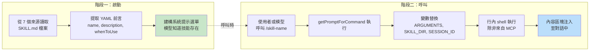
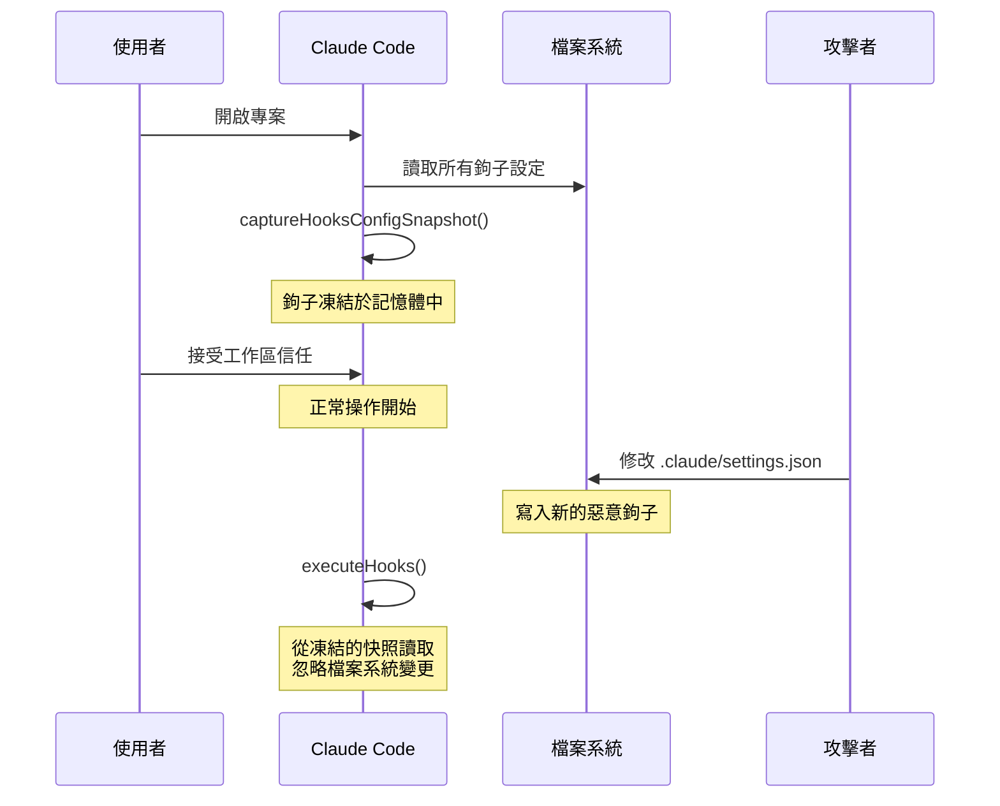
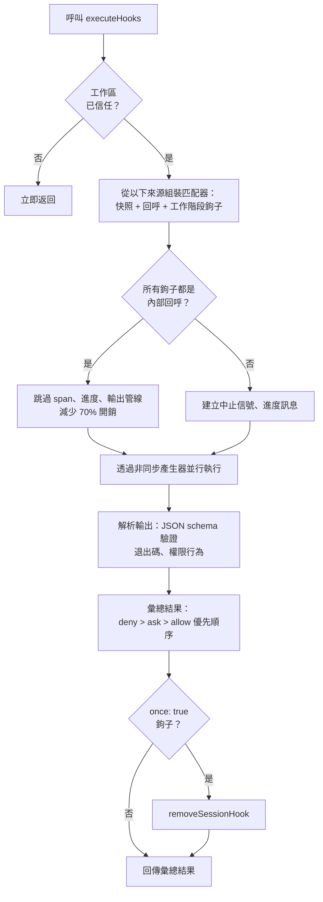

# 第十二章：可擴展性 —— 技能（Skills）與鉤子（Hooks）

## 擴展的兩個維度

每個可擴展性系統都在回答兩個問題：系統能做什麼，以及何時去做。大多數框架把這兩者混為一談——一個外掛在同一個物件中同時註冊功能和生命週期回呼，而「新增功能」與「攔截功能」之間的界線模糊成了單一的註冊 API。

Claude Code 將它們清楚地分開。技能（Skills）擴展模型能做的事。它們是 markdown 檔案，會變成斜線命令，在被呼叫時將新指令注入對話。鉤子（Hooks）擴展事情發生的時機和方式。它們是生命週期攔截器，在工作階段期間超過二十多個不同的時間點觸發，執行任意程式碼來阻擋動作、修改輸入、強制繼續，或靜默觀察。

這種分離並非偶然。技能（Skills）是內容——它們透過添加提示文字來擴展模型的知識和能力。鉤子（Hooks）是控制流——它們修改執行路徑而不改變模型所知道的東西。一個技能可能教模型如何執行你團隊的部署流程。一個鉤子可能確保沒有通過測試套件就不能執行部署命令。技能增加能力；鉤子增加約束。

本章深入介紹這兩個系統，然後檢視它們的交會之處：技能宣告的鉤子，在技能被呼叫時註冊為工作階段範圍的生命週期攔截器。

---

## 技能（Skills）：教會模型新把戲

### 兩階段載入

技能系統的核心最佳化在於：前言（frontmatter）在啟動時載入，但完整內容只在呼叫時才載入。



**階段一**讀取每個 `SKILL.md` 檔案，將 YAML 前言從 markdown 本體中分離，並提取中繼資料。前言欄位會成為系統提示的一部分，讓模型知道該技能存在。markdown 本體被捕獲在閉包中但不會處理。一個有 50 個技能的專案只付出 50 段簡短描述的 token 成本，而非 50 份完整文件。

**階段二**在模型或使用者呼叫技能時觸發。`getPromptForCommand` 前綴基礎目錄、替換變數（`$ARGUMENTS`、`${CLAUDE_SKILL_DIR}`、`${CLAUDE_SESSION_ID}`），然後執行行內 shell 命令（以 `!` 為前綴的反引號）。結果以內容區塊的形式注入對話。

### 七個來源與優先順序

技能來自七個不同的來源，並行載入後按優先順序合併：

| 優先順序 | 來源 | 位置 | 備註 |
|----------|------|------|------|
| 1 | 受管理（策略） | `<MANAGED_PATH>/.claude/skills/` | 企業控制 |
| 2 | 使用者 | `~/.claude/skills/` | 個人用，隨處可用 |
| 3 | 專案 | `.claude/skills/`（向上遍歷至 home） | 簽入版本控制 |
| 4 | 額外目錄 | `<add-dir>/.claude/skills/` | 透過 `--add-dir` 旗標 |
| 5 | 舊版命令 | `.claude/commands/` | 向下相容 |
| 6 | 內建 | 編譯進二進位檔 | 功能門控 |
| 7 | MCP | MCP 伺服器提示 | 遠端、不受信任 |

去重使用 `realpath` 來解析符號連結和重疊的父目錄。先出現的來源優先。`getFileIdentity` 函式透過 `realpath` 解析為正規路徑而非依賴 inode 值，因為 inode 在容器/NFS 掛載和 ExFAT 上並不可靠。

### 前言契約

控制技能行為的關鍵前言欄位：

| YAML 欄位 | 用途 |
|-----------|------|
| `name` | 面向使用者的顯示名稱 |
| `description` | 顯示在自動完成和系統提示中 |
| `when_to_use` | 供模型發現的詳細使用情境 |
| `allowed-tools` | 技能可使用哪些工具 |
| `disable-model-invocation` | 阻擋模型自主使用 |
| `context` | `'fork'` 以子代理方式執行 |
| `hooks` | 呼叫時註冊的生命週期鉤子 |
| `paths` | 條件性啟用的 glob 模式 |

`context: 'fork'` 選項將技能作為子代理執行，擁有自己的上下文視窗，這對需要大量工作但不想污染主對話 token 預算的技能至關重要。`disable-model-invocation` 和 `user-invocable` 欄位控制兩條不同的存取路徑——同時設為 true 會讓技能不可見，適用於僅含鉤子的技能。

### MCP 安全邊界

變數替換完成後，行內 shell 命令便會執行。安全邊界是絕對的：**MCP 技能永遠不會執行行內 shell 命令。**MCP 伺服器是外部系統。如果允許的話，一個包含 `` !`rm -rf /` `` 的 MCP 提示會以使用者的完整權限執行。系統將 MCP 技能視為純內容。這個信任邊界與第十五章討論的更廣泛 MCP 安全模型相連。

### 動態發現

技能不只在啟動時載入。當模型碰觸檔案時，`discoverSkillDirsForPaths` 會從每個路徑向上遍歷，尋找 `.claude/skills/` 目錄。帶有 `paths` 前言的技能儲存在 `conditionalSkills` 映射中，只在碰觸的路徑匹配其模式時才啟用。一個宣告 `paths: "packages/database/**"` 的技能在模型讀取或編輯資料庫檔案之前保持不可見——上下文感知的能力擴展。

---

## 鉤子（Hooks）：控制事情發生的時機

鉤子（Hooks）是 Claude Code 在生命週期節點攔截和修改行為的機制。主要執行引擎超過 4,900 行。系統服務三類受眾：個人開發者（自訂 linting、驗證）、團隊（簽入專案的共享品質門檻），以及企業（策略管理的合規規則）。

### 真實世界的鉤子：防止提交到 Main

在深入機制之前，先看看鉤子在實務中的樣子。假設你的團隊想要防止模型直接提交到 `main` 分支。

**步驟一：settings.json 設定：**

```json
{
  "hooks": {
    "PreToolUse": [
      {
        "matcher": "Bash",
        "hooks": [
          {
            "type": "command",
            "command": "/path/to/check-not-main.sh",
            "if": "Bash(git commit*)"
          }
        ]
      }
    ]
  }
}
```

**步驟二：Shell 腳本：**

```bash
#!/bin/bash
BRANCH=$(git rev-parse --abbrev-ref HEAD 2>/dev/null)
if [ "$BRANCH" = "main" ]; then
  echo "Cannot commit directly to main. Create a feature branch first." >&2
  exit 2  # Exit 2 = 阻擋錯誤
fi
exit 0
```

**步驟三：模型的體驗。**當模型嘗試在 `main` 分支上 `git commit` 時，鉤子在命令執行前觸發。腳本檢查分支，寫入 stderr，然後以退出碼 2 結束。模型看到一條系統訊息：「Cannot commit directly to main. Create a feature branch first.」提交永遠不會執行。模型改為建立分支並在那裡提交。

`if: "Bash(git commit*)"` 條件意味著腳本只對 git commit 命令執行——不是每次 Bash 呼叫都觸發。退出碼 2 阻擋；退出碼 0 通過；任何其他退出碼產生非阻擋警告。這就是完整的協定。

### 四種使用者可設定的類型

Claude Code 定義了六種鉤子類型——四種使用者可設定，兩種內部使用。

**命令鉤子（Command hooks）**產生一個 shell 程序。鉤子輸入 JSON 透過管道傳入 stdin；鉤子透過退出碼和 stdout/stderr 回傳結果。這是主力類型。

**提示鉤子（Prompt hooks）**進行單次 LLM 呼叫，回傳 `{"ok": true}` 或 `{"ok": false, "reason": "..."}`。輕量級的 AI 驅動驗證，無需完整的代理迴圈。

**代理鉤子（Agent hooks）**執行多輪代理迴圈（最多 50 輪，`dontAsk` 權限，思考停用）。每個都有自己的工作階段範圍。這是「驗證測試套件通過並涵蓋新功能」的重型機制。

**HTTP 鉤子**將鉤子輸入 POST 到一個 URL。實現遠端策略伺服器和稽核日誌，無需本地程序產生。

兩種內部類型是**回呼鉤子（callback hooks）**（以程式方式註冊，透過跳過 span 追蹤的快速路徑減少 70% 開銷）和**函式鉤子（function hooks）**（工作階段範圍的 TypeScript 回呼，用於代理鉤子中的結構化輸出強制）。

### 五個最重要的生命週期事件

鉤子系統在超過二十多個生命週期節點觸發。五個在真實世界使用中佔主導地位：

**PreToolUse** —— 在每次工具執行前觸發。可以阻擋、修改輸入、自動核准，或注入上下文。權限行為遵循嚴格的優先順序：deny > ask > allow。最常見的品質門檻鉤子點。

**PostToolUse** —— 在成功執行後觸發。可以注入上下文或完全替換 MCP 工具輸出。適用於對工具結果的自動化回饋。

**Stop** —— 在 Claude 結束回應前觸發。阻擋鉤子強制繼續。這是自動化驗證迴圈的機制：「你真的完成了嗎？」

**SessionStart** —— 在工作階段開始時觸發。可以設定環境變數、覆寫第一條使用者訊息，或註冊檔案監視路徑。無法阻擋（鉤子不能阻止工作階段啟動）。

**UserPromptSubmit** —— 在使用者提交提示時觸發。可以阻擋處理，實現模型看到內容前的輸入驗證或內容過濾。

**參考表 —— 其餘事件：**

| 類別 | 事件 |
|------|------|
| 工具生命週期 | PostToolUseFailure, PermissionDenied, PermissionRequest |
| 工作階段 | SessionEnd（1.5 秒逾時）, Setup |
| 子代理 | SubagentStart, SubagentStop |
| 壓縮 | PreCompact, PostCompact |
| 通知 | Notification, Elicitation, ElicitationResult |
| 設定 | ConfigChange, InstructionsLoaded, CwdChanged, FileChanged, TaskCreated, TaskCompleted, TeammateIdle |

阻擋的不對稱性是刻意的。代表可恢復決策的事件（工具呼叫、停止條件）支持阻擋。代表不可逆事實的事件（工作階段已啟動、API 失敗）則不支持。

### 退出碼語義

對於命令鉤子，退出碼帶有特定含義：

| 退出碼 | 含義 | 阻擋 |
|--------|------|------|
| 0 | 成功，stdout 作為 JSON 解析 | 否 |
| 2 | 阻擋錯誤，stderr 作為系統訊息顯示 | 是 |
| 其他 | 非阻擋警告，僅向使用者顯示 | 否 |

退出碼 2 是刻意選擇的。退出碼 1 太常見——任何未處理的例外、斷言失敗或語法錯誤都會產生退出碼 1。使用退出碼 2 防止意外的強制執行。

### 六個鉤子來源

| 來源 | 信任層級 | 備註 |
|------|----------|------|
| `userSettings` | 使用者 | `~/.claude/settings.json`，最高優先順序 |
| `projectSettings` | 專案 | `.claude/settings.json`，版本控制 |
| `localSettings` | 本地 | `.claude/settings.local.json`，已 gitignore |
| `policySettings` | 企業 | 無法被覆寫 |
| `pluginHook` | 外掛 | 優先順序 999（最低） |
| `sessionHook` | 工作階段 | 僅存於記憶體，由技能註冊 |

---

## 快照安全模型

鉤子執行任意程式碼。專案的 `.claude/settings.json` 可以定義在每次工具呼叫前觸發的鉤子。如果惡意倉庫在使用者接受工作區信任對話後修改其鉤子，會發生什麼？

什麼都不會。鉤子設定在啟動時就被凍結了。



`captureHooksConfigSnapshot()` 在啟動時呼叫一次。從那一刻起，`executeHooks()` 從快照讀取，永遠不會隱式地重新讀取設定檔。快照僅透過明確的管道更新：`/hooks` 命令或檔案監視器偵測，兩者都透過 `updateHooksConfigSnapshot()` 重建。

策略強制執行瀑布：策略設定中的 `disableAllHooks` 清除一切。`allowManagedHooksOnly` 排除使用者和專案鉤子。使用者可以透過設定 `disableAllHooks` 來停用自己的鉤子，但無法停用企業管理的鉤子。策略層永遠勝出。

信任檢查本身（`shouldSkipHookDueToTrust()`）是在兩個漏洞之後引入的：SessionEnd 鉤子在使用者*拒絕*信任對話時仍然執行，以及 SubagentStop 鉤子在信任提示出現前就觸發。兩者共享同一根本原因——鉤子在使用者尚未同意工作區程式碼執行的生命週期狀態下觸發。修復方式是在 `executeHooks()` 頂部加入一個集中化的閘門。

---

## 執行流程



內部回呼的快速路徑是一項重要最佳化。當所有匹配的鉤子都是內部的（檔案存取分析、提交歸屬），系統會跳過 span 追蹤、中止信號建立、進度訊息和完整的輸出處理管線。大多數 PostToolUse 呼叫只命中內部回呼。

鉤子輸入 JSON 透過惰性的 `getJsonInput()` 閉包序列化一次，並在所有並行鉤子間重複使用。環境注入設定 `CLAUDE_PROJECT_DIR`、`CLAUDE_PLUGIN_ROOT`，以及對於特定事件，設定 `CLAUDE_ENV_FILE` 讓鉤子可以寫入環境匯出。

---

## 整合：技能（Skills）與鉤子（Hooks）的交會

當技能被呼叫時，其前言宣告的鉤子會註冊為工作階段範圍的鉤子。`skillRoot` 成為鉤子 shell 命令的 `CLAUDE_PLUGIN_ROOT`：

```
my-skill/
  SKILL.md          # 技能內容
  validate.sh       # 由前言中宣告的 PreToolUse 鉤子呼叫
```

技能的前言宣告：

```yaml
hooks:
  PreToolUse:
    - matcher: "Bash"
      hooks:
        - type: command
          command: "${CLAUDE_PLUGIN_ROOT}/validate.sh"
          once: true
```

當使用者呼叫 `/my-skill` 時，技能內容載入對話中，同時 PreToolUse 鉤子也會註冊。下一次 Bash 工具呼叫觸發 `validate.sh`。因為設定了 `once: true`，鉤子在第一次成功執行後自行移除。

對於代理，前言中宣告的 `Stop` 鉤子會自動轉換為 `SubagentStop` 鉤子，因為子代理觸發 `SubagentStop` 而非 `Stop`。沒有這個轉換，代理的停止驗證鉤子永遠不會觸發。

### 權限行為優先順序

`executePreToolHooks()` 可以阻擋（透過 `blockingError`）、自動核准（透過 `permissionBehavior: 'allow'`）、強制詢問（透過 `'ask'`）、拒絕（透過 `'deny'`）、修改輸入（透過 `updatedInput`），或添加上下文（透過 `additionalContext`）。當多個鉤子回傳不同行為時，deny 永遠勝出。這對安全相關的決策來說是正確的預設值。

### Stop 鉤子：強制繼續

當 Stop 鉤子回傳退出碼 2 時，stderr 會作為回饋顯示給模型，對話則繼續。這將單次的提示-回應轉變為目標導向的迴圈。Stop 鉤子可以說是整個系統中最強大的整合點。

---

## 實踐應用：設計可擴展性系統

**將內容與控制流分離。**技能（Skills）添加能力；鉤子（Hooks）約束行為。混淆兩者使你無法推斷外掛做了什麼與它阻止了什麼。

**在信任邊界凍結設定。**快照機制在同意的瞬間捕獲鉤子，永遠不會隱式地重新讀取。如果你的系統執行使用者提供的程式碼，這可以消除 TOCTOU 攻擊。

**使用不常見的退出碼作為語義信號。**退出碼 1 是雜訊——每個未處理的錯誤都會產生它。退出碼 2 作為阻擋信號可以防止意外的強制執行。選擇需要刻意意圖的信號。

**在套接字層驗證，而非應用層。**SSRF 防護在 DNS 查詢時執行，而非作為預檢查。這消除了 DNS 重新綁定的時間窗口。驗證網路目的地時，檢查必須與連線原子化。

**針對常見情況最佳化。**內部回呼快速路徑（減少 70% 開銷）認識到大多數鉤子呼叫只命中內部回呼。兩階段技能載入認識到大多數技能在給定的工作階段中從未被呼叫。每項最佳化都針對實際的使用分佈。

這個可擴展性系統反映了對能力與安全之間張力的成熟理解。技能（Skills）賦予模型新能力，受 MCP 安全線限制（第十五章）。鉤子（Hooks）給予外部程式碼對模型行為的影響力，受快照機制、退出碼語義和策略瀑布的約束。兩個系統都不信任對方——而正是這種相互不信任，使得這種組合可以安全地大規模部署。

下一章轉向視覺層：Claude Code 如何以 60fps 渲染反應式終端機 UI，並跨五種終端協定處理輸入。