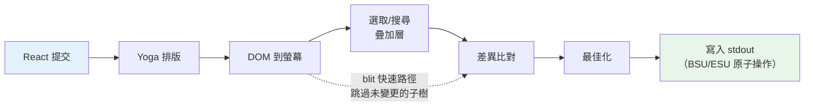
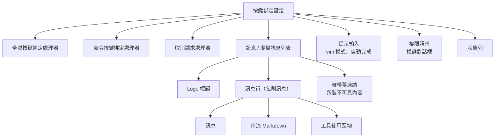

# 第十三章：終端機 UI

## 為什麼要自建渲染器？

終端不是瀏覽器。沒有 DOM、沒有 CSS 引擎、沒有合成器、沒有保留模式圖形管線。只有一條流向 stdout 的位元組串流，和一條來自 stdin 的位元組串流。這兩條串流之間的一切——排版、樣式、差異比對、命中測試、捲動、選取——都得從零開始發明。

Claude Code 需要一個反應式 UI。它有提示輸入、串流 Markdown 輸出、權限對話框、進度旋轉指示器、可捲動的訊息列表、搜尋高亮，以及一個 vim 模式編輯器。React 是宣告這類元件樹的明顯選擇。但 React 需要一個宿主環境來渲染，而終端不提供。

Ink 是標準答案：一個用於終端的 React 渲染器，基於 Yoga 實現 flexbox 排版。Claude Code 最初使用 Ink，然後將其 fork 到面目全非。原版每個畫格對每個儲存格分配一個 JavaScript 物件——在 200x120 的終端上，那是每 16ms 建立並回收 24,000 個物件。它在字串層級做差異比對，比較整行 ANSI 編碼文字。沒有 blit 最佳化的概念、沒有雙緩衝、沒有儲存格級別的髒標記追蹤。對於一個每秒刷新一次的簡單 CLI 儀表板，這沒問題。但對於一個以 60fps 串流 token 的 LLM 代理，同時使用者在一個有數百條訊息的對話中捲動，這完全不可行。

Claude Code 中保留下來的是一個自訂渲染引擎，它與 Ink 共享概念上的 DNA——React 調和器、Yoga 排版、ANSI 輸出——但重新實作了關鍵路徑：用壓縮型別陣列取代每儲存格一個物件、用基於池的字串駐留取代每畫格一個字串、用雙緩衝渲染搭配儲存格級別差異比對，以及一個將相鄰終端寫入合併為最少轉義序列的最佳化器。

結果是在 200 欄的終端上串流 Claude 的 token 時達到 60fps。要理解如何做到，我們需要審視四個層：React 調和的自訂 DOM、將該 DOM 轉換為終端輸出的渲染管線、讓系統在數小時的長時間會話中不被垃圾回收淹沒的基於池的記憶體管理，以及將一切串聯起來的元件架構。

---

## 自訂 DOM

React 的調和器需要某些東西來進行調和。在瀏覽器中，那是 DOM。在 Claude Code 的終端中，那是一棵自訂的記憶體內樹，有七種元素類型和一種文字節點類型。

這些元素類型直接對應到終端渲染概念：

- **`ink-root`** ——文件根節點，每個 Ink 實例一個
- **`ink-box`** ——一個 flexbox 容器，終端中等同於 `<div>`
- **`ink-text`** ——一個帶有 Yoga 量測函式的文字節點，用於自動換行
- **`ink-virtual-text`** ——巢狀在另一個文字節點內的帶樣式文字（在文字上下文中時自動從 `ink-text` 提升）
- **`ink-link`** ——超連結，透過 OSC 8 轉義序列渲染
- **`ink-progress`** ——進度指示器
- **`ink-raw-ansi`** ——具有已知尺寸的預渲染 ANSI 內容，用於語法高亮的程式碼區塊

每個 `DOMElement` 攜帶渲染管線所需的狀態：

```typescript
// 示意用——實際介面遠比這複雜
interface DOMElement {
  yogaNode: YogaNode;           // Flexbox 排版節點
  style: Styles;                // 類似 CSS 的屬性映射到 Yoga
  attributes: Map<string, DOMNodeAttribute>;
  childNodes: (DOMElement | TextNode)[];
  dirty: boolean;               // 是否需要重新渲染
  _eventHandlers: EventHandlerMap; // 與 attributes 分離
  scrollTop: number;            // 命令式捲動狀態
  pendingScrollDelta: number;
  stickyScroll: boolean;
  debugOwnerChain?: string;     // 用於除錯的 React 元件堆疊
}
```

將 `_eventHandlers` 與 `attributes` 分離是刻意的。在 React 中，handler 的身份在每次渲染時都會改變（除非手動 memoize）。如果 handler 儲存為 attributes，每次渲染都會將節點標記為髒並觸發完整重繪。透過分開儲存，調和器的 `commitUpdate` 可以更新 handler 而不弄髒節點。

`markDirty()` 函式是 DOM 變更與渲染管線之間的橋樑。當任何節點的內容改變時，`markDirty()` 向上遍歷每個祖先，在每個元素上設定 `dirty = true`，並在葉文字節點上呼叫 `yogaNode.markDirty()`。這就是一個深層巢狀文字節點中的單一字元變更如何排程整條路徑到根節點的重新渲染的方式——但僅限於那條路徑。兄弟子樹保持乾淨，可以從前一個畫格 blit 過來。

`ink-raw-ansi` 元素類型值得特別說明。當一個程式碼區塊已經經過語法高亮處理（產生 ANSI 轉義序列），重新解析那些序列以提取字元和樣式會很浪費。取而代之的是，預高亮的內容被包裝在一個 `ink-raw-ansi` 節點中，其 `rawWidth` 和 `rawHeight` 屬性告訴 Yoga 精確的尺寸。渲染管線直接將原始 ANSI 內容寫入輸出緩衝區，而不將其分解為個別帶樣式的字元。這使得語法高亮的程式碼區塊在初始高亮處理之後基本上是零成本的——UI 中最昂貴的視覺元素也是渲染最便宜的。

`ink-text` 節點的量測函式值得理解，因為它在 Yoga 的排版過程中執行，而該過程是同步且阻塞的。函式接收可用寬度並必須返回文字的尺寸。它執行自動換行（尊重 `wrap` 樣式屬性：`wrap`、`truncate`、`truncate-start`、`truncate-middle`），顧及字素叢集邊界（因此不會將多碼位的 emoji 跨行分割），正確量測 CJK 全形字元（每個計為 2 欄），並從寬度計算中剝離 ANSI 轉義碼（轉義序列的視覺寬度為零）。所有這些都必須在每個節點以微秒級完成，因為一個有 50 個可見文字節點的對話意味著每次排版過程有 50 次量測函式呼叫。

---

## React Fiber 容器

調和器橋接使用 `react-reconciler` 建立自訂宿主配置。這與 React DOM 和 React Native 使用的是同一個 API。關鍵差異：Claude Code 在 `ConcurrentRoot` 模式下執行。

```typescript
createContainer(rootNode, ConcurrentRoot, ...)
```

ConcurrentRoot 啟用了 React 的並行功能——用 Suspense 延遲載入語法高亮，用 transition 在串流期間進行非阻塞狀態更新。替代方案 `LegacyRoot` 會強制同步渲染，在大量 Markdown 重新解析時阻塞事件迴圈。

宿主配置方法將 React 操作映射到自訂 DOM：

- **`createInstance(type, props)`** 透過 `createNode()` 建立一個 `DOMElement`，套用初始樣式和屬性，附加事件 handler，並捕捉 React 元件的擁有者鏈以用於除錯歸因。擁有者鏈儲存為 `debugOwnerChain`，在 `CLAUDE_CODE_DEBUG_REPAINTS` 模式中用於將全螢幕重設歸因到特定元件
- **`createTextInstance(text)`** 建立一個 `TextNode`——但僅在文字上下文中。調和器強制要求原始字串必須包裝在 `<Text>` 中。嘗試在文字上下文之外建立文字節點會拋出例外，在調和時而非渲染時捕捉這類錯誤
- **`commitUpdate(node, type, oldProps, newProps)`** 透過淺比較對舊新 props 進行差異比對，然後僅套用變更的部分。樣式、屬性和事件 handler 各有其獨自的更新路徑。如果沒有任何變更，差異比對函式返回 `undefined`，完全避免不必要的 DOM 變更
- **`removeChild(parent, child)`** 從樹中移除節點，遞迴釋放 Yoga 節點（在 `free()` 之前呼叫 `unsetMeasureFunc()` 以避免存取已釋放的 WASM 記憶體），並通知焦點管理器
- **`hideInstance(node)` / `unhideInstance(node)`** 切換 `isHidden`，並在 Yoga 節點的 `Display.None` 和 `Display.Flex` 之間切換。這是 React 用於 Suspense 後備過渡的機制
- **`resetAfterCommit(container)`** 是關鍵鉤子：它呼叫 `rootNode.onComputeLayout()` 來執行 Yoga，然後呼叫 `rootNode.onRender()` 來排程終端繪製

調和器在每個提交週期追蹤兩個效能計數器：Yoga 排版時間（`lastYogaMs`）和總提交時間（`lastCommitMs`）。這些流入 Ink 類別報告的 `FrameEvent`，使生產環境中的效能監控成為可能。

事件系統映射了瀏覽器的捕獲/冒泡模型。`Dispatcher` 類別實作了完整的事件傳播，包含三個階段：捕獲（從根到目標）、目標處，以及冒泡（從目標到根）。事件類型映射到 React 的排程優先級——離散事件用於鍵盤和點擊（最高優先級，立即處理），連續事件用於捲動和調整大小（可延遲）。分發器將所有事件處理包裝在 `reconciler.discreteUpdates()` 中以實現正確的 React 批次處理。

當你在終端中按下一個鍵時，產生的 `KeyboardEvent` 會透過自訂 DOM 樹進行分發，從聚焦元素向上冒泡到根節點，與鍵盤事件通過瀏覽器 DOM 元素冒泡的方式完全相同。路徑上的任何 handler 都可以呼叫 `stopPropagation()` 或 `preventDefault()`，語義與瀏覽器規範完全一致。

---

## 渲染管線

每個畫格經歷七個階段，每個單獨計時：



每個階段都單獨計時並報告在 `FrameEvent.phases` 中。這種逐階段的檢測對於診斷效能問題至關重要：當一個畫格花費 30ms 時，你需要知道瓶頸是 Yoga 重新量測文字（階段 2）、渲染器遍歷大型髒子樹（階段 3），還是慢速終端造成的 stdout 背壓（階段 7）。答案決定了修復方式。

**階段 1：React 提交和 Yoga 排版。** 調和器處理狀態更新並呼叫 `resetAfterCommit`。這將根節點的寬度設為 `terminalColumns` 並執行 `yogaNode.calculateLayout()`。Yoga 在一次遍歷中計算整個 flexbox 樹，遵循 CSS flexbox 規範：它解析所有節點的 flex-grow、flex-shrink、padding、margin、gap、alignment 和 wrapping。結果——`getComputedWidth()`、`getComputedHeight()`、`getComputedLeft()`、`getComputedTop()`——按節點快取。對於 `ink-text` 節點，Yoga 在排版期間呼叫自訂量測函式（`measureTextNode`），該函式透過自動換行和字素量測計算文字尺寸。這是每個節點最昂貴的操作：它必須處理 Unicode 字素叢集、CJK 全形字元、emoji 序列，以及嵌入在文字內容中的 ANSI 轉義碼。

**階段 2：DOM 到螢幕。** 渲染器以深度優先方式遍歷 DOM 樹，將字元和樣式寫入 `Screen` 緩衝區。每個字元成為一個壓縮的儲存格。輸出是一個完整的畫格：終端上的每個儲存格都有一個定義好的字元、樣式和寬度。

**階段 3：疊加層。** 文字選取和搜尋高亮在螢幕緩衝區中就地修改，翻轉匹配儲存格上的樣式 ID。選取套用反轉顯示以建立熟悉的「高亮文字」外觀。搜尋高亮套用更強烈的視覺處理：當前匹配使用反轉 + 黃色前景 + 粗體 + 底線，其他匹配僅使用反轉。這會污染緩衝區——以 `prevFrameContaminated` 旗標追蹤，讓下一個畫格知道要跳過 blit 快速路徑。這種污染是刻意的取捨：就地修改緩衝區避免了分配一個獨立的疊加層緩衝區（在 200x120 的終端上節省 48KB），代價是在疊加層清除後多一個全損壞畫格。

**階段 4：差異比對。** 新螢幕與前端畫格的螢幕逐儲存格比較。只有變更的儲存格產生輸出。比較是每個儲存格兩次整數比較（兩個壓縮的 `Int32` 字組），差異比對遍歷損壞矩形而非整個螢幕。在穩態畫格中（只有旋轉指示器在跳動），這可能在 24,000 個儲存格中只產生 3 個修補。每個修補是一個 `{ type: 'stdout', content: string }` 物件，包含游標移動序列和 ANSI 編碼的儲存格內容。

**階段 5：最佳化。** 同一行上相鄰的修補被合併為單次寫入。冗餘的游標移動被消除——如果修補 N 結束在第 10 欄而修補 N+1 從第 11 欄開始，游標已經在正確位置，不需要移動序列。樣式轉換透過 `StylePool.transition()` 快取預先序列化，所以從「粗體紅色」變為「暗淡綠色」是單次快取字串查找，而非差異比對再序列化操作。最佳化器與樸素的逐儲存格輸出相比，通常將位元組數減少 30-50%。

**階段 6：寫入。** 最佳化後的修補被序列化為 ANSI 轉義序列，並在單次 `write()` 呼叫中寫入 stdout，在支援的終端上包裝在同步更新標記（BSU/ESU）中。BSU（Begin Synchronized Update，`ESC [ ? 2026 h`）告訴終端緩衝所有後續輸出，而 ESU（`ESC [ ? 2026 l`）告訴它刷新。這在支援該協定的終端上消除了可見的撕裂——整個畫格以原子方式呈現。

每個畫格透過 `FrameEvent` 物件報告其時間分解：

```typescript
interface FrameEvent {
  durationMs: number;
  phases: {
    renderer: number;    // DOM 到螢幕
    diff: number;        // 螢幕比較
    optimize: number;    // 修補合併
    write: number;       // stdout 寫入
    yoga: number;        // 排版計算
  };
  yogaVisited: number;   // 遍歷的節點數
  yogaMeasured: number;  // 執行了 measure() 的節點數
  yogaCacheHits: number; // 使用快取排版的節點數
  flickers: FlickerEvent[];  // 全螢幕重設歸因
}
```

當 `CLAUDE_CODE_DEBUG_REPAINTS` 啟用時，全螢幕重設會透過 `findOwnerChainAtRow()` 歸因到其來源 React 元件。這是終端版的 React DevTools「Highlight Updates」——它顯示哪個元件導致了整個螢幕重繪，而這是渲染管線中可能發生的最昂貴的事情。

blit 最佳化值得特別關注。當一個節點不是髒的，且其位置自前一個畫格以來沒有改變（透過節點快取檢查），渲染器會直接從 `prevScreen` 複製儲存格到當前螢幕，而不是重新渲染子樹。這使得穩態畫格極其便宜——在一個典型的畫格中，只有旋轉指示器在跳動，blit 覆蓋了 99% 的螢幕，只有旋轉指示器的 3-4 個儲存格從頭重新渲染。

blit 在三種條件下會被停用：

1. **`prevFrameContaminated` 為 true** ——選取疊加層或搜尋高亮就地修改了前端畫格的螢幕緩衝區，因此那些儲存格不能被信任為「正確的」前一狀態
2. **一個絕對定位節點被移除** ——絕對定位意味著該節點可能已經繪製覆蓋了非兄弟儲存格，那些儲存格需要從實際擁有它們的元素重新渲染
3. **排版位移** ——任何節點的快取位置與其當前計算位置不同，意味著 blit 會將儲存格複製到錯誤的座標

損壞矩形（`screen.damage`）追蹤渲染期間所有已寫入儲存格的邊界框。差異比對只檢查此矩形內的行，跳過完全未改變的區域。在一個 120 行的終端上，串流訊息佔據第 80-100 行時，差異比對檢查 20 行而非 120 行——比較工作減少了 6 倍。

---

## 雙緩衝渲染和畫格排程

Ink 類別維護兩個畫格緩衝區：

```typescript
private frontFrame: Frame;  // 當前顯示在終端上的
private backFrame: Frame;   // 正在渲染的
```

每個 `Frame` 包含：

- `screen: Screen` ——儲存格緩衝區（壓縮的 `Int32Array`）
- `viewport: Size` ——渲染時的終端尺寸
- `cursor: { x, y, visible }` ——終端游標停放位置
- `scrollHint` ——alt-screen 模式下的 DECSTBM（捲動區域）最佳化提示
- `scrollDrainPending` ——ScrollBox 是否還有剩餘的捲動增量待處理

每次渲染後，畫格交換：`backFrame = frontFrame; frontFrame = newFrame`。舊的前端畫格成為下一個後端畫格，為 blit 最佳化提供 `prevScreen`，為儲存格級別的差異比對提供基線。

這種雙緩衝設計消除了分配。渲染器不是每個畫格建立一個新的 `Screen`，而是重用後端畫格的緩衝區。交換只是一個指標賦值。這個模式借鑑自圖形程式設計，其中雙緩衝透過確保顯示端從一個完整的畫格讀取，而渲染器寫入另一個，來防止撕裂。在終端上下文中，撕裂不是問題（BSU/ESU 協定處理了這個）；問題是每 16ms 分配和丟棄包含 48KB+ 型別陣列的 `Screen` 物件所造成的 GC 壓力。

渲染排程使用 lodash `throttle`，間隔 16ms（大約 60fps），啟用前緣和後緣：

```typescript
const deferredRender = () => queueMicrotask(this.onRender);
this.scheduleRender = throttle(deferredRender, FRAME_INTERVAL_MS, {
  leading: true,
  trailing: true,
});
```

微任務延遲不是偶然的。`resetAfterCommit` 在 React 的 layout effects 階段之前執行。如果渲染器在此同步執行，它會錯過在 `useLayoutEffect` 中設定的游標宣告。微任務在 layout effects 之後但在同一事件迴圈 tick 內執行——終端看到的是單一、一致的畫格。

對於捲動操作，一個獨立的 `setTimeout` 以 4ms（FRAME_INTERVAL_MS >> 2）提供更快的捲動畫格，而不干擾 throttle。捲動變更完全繞過 React：`ScrollBox.scrollBy()` 直接修改 DOM 節點屬性，呼叫 `markDirty()`，並透過微任務排程渲染。沒有 React 狀態更新、沒有調和開銷、不會因為單一滾輪事件而重新渲染整個訊息列表。

**調整大小的處理**是同步的，不做防抖。當終端調整大小時，`handleResize` 立即更新尺寸以保持排版一致。對於 alt-screen 模式，它重設畫格緩衝區並將 `ERASE_SCREEN` 延遲到下一個原子 BSU/ESU 繪製區塊中，而非立即寫入。同步寫入擦除會讓螢幕在渲染耗費的約 80ms 期間保持空白；延遲到原子區塊意味著舊內容保持可見，直到新畫格完全準備好。

**alt-screen 管理**新增了另一層。`AlternateScreen` 元件在掛載時進入 DEC 1049 替代螢幕緩衝區，將高度限制為終端行數。它使用 `useInsertionEffect`——而非 `useLayoutEffect`——來確保 `ENTER_ALT_SCREEN` 轉義序列在第一個渲染畫格之前到達終端。使用 `useLayoutEffect` 會太晚：第一個畫格會渲染到主螢幕緩衝區，在切換之前產生可見的閃爍。`useInsertionEffect` 在 layout effects 之前和瀏覽器（或終端）繪製之前執行，使過渡無縫。

---

## 基於池的記憶體：為什麼駐留很重要

一個 200 欄乘 120 行的終端有 24,000 個儲存格。如果每個儲存格都是一個帶有 `char` 字串、`style` 字串和 `hyperlink` 字串的 JavaScript 物件，那就是每個畫格 72,000 次字串分配——加上儲存格本身的 24,000 次物件分配。以 60fps 計算，那是每秒 576 萬次分配。V8 的垃圾回收器可以處理這個，但不是沒有停頓的，而這些停頓表現為掉畫格。GC 停頓通常為 1-5ms，但它們不可預測：它們可能在串流 token 更新期間發生，在使用者正在觀看輸出時造成可見的卡頓。

Claude Code 透過壓縮型別陣列和三個駐留池完全消除了這個問題。結果：儲存格緩衝區的每畫格物件分配為零。唯一的分配在池本身中（攤銷的，因為大多數字元和樣式在第一個畫格時就被駐留並在之後重用）以及差異比對產生的修補字串中（這不可避免，因為 stdout.write 需要字串或 Buffer 引數）。

**儲存格佈局**使用每個儲存格兩個 `Int32` 字組，儲存在連續的 `Int32Array` 中：

```
word0: charId        （32 位元，CharPool 的索引）
word1: styleId[31:17] | hyperlinkId[16:2] | width[1:0]
```

一個覆蓋同一緩衝區的平行 `BigInt64Array` 視圖使批次操作成為可能——清除一行只需對 64 位元字組進行單次 `fill()` 呼叫，而不是逐個欄位歸零。

**CharPool** 將字元字串駐留為整數 ID。它對 ASCII 有一條快速路徑：一個 128 個項目的 `Int32Array` 將字元碼直接映射到池索引，完全避免 `Map` 查找。多位元組字元（emoji、CJK 表意文字）回退到 `Map<string, number>`。索引 0 始終是空格，索引 1 始終是空字串。

```typescript
export class CharPool {
  private strings: string[] = [' ', '']
  private ascii: Int32Array = initCharAscii()

  intern(char: string): number {
    if (char.length === 1) {
      const code = char.charCodeAt(0)
      if (code < 128) {
        const cached = this.ascii[code]!
        if (cached !== -1) return cached
        const index = this.strings.length
        this.strings.push(char)
        this.ascii[code] = index
        return index
      }
    }
    // 多位元組字元的 Map 回退
    ...
  }
}
```

**StylePool** 將 ANSI 樣式碼陣列駐留為整數 ID。巧妙之處在於：每個 ID 的第 0 位元編碼該樣式是否對空格字元有可見效果（背景色、反轉、底線）。僅前景的樣式得到偶數 ID；對空格可見的樣式得到奇數 ID。這讓渲染器可以透過單次位元遮罩檢查跳過不可見的空格——`if (!(styleId & 1) && charId === 0) continue`——而無需查找樣式定義。池還在任意兩個樣式 ID 之間快取預序列化的 ANSI 轉換字串，所以從「粗體紅色」轉換為「暗淡綠色」是一次快取字串串接，而非差異比對再序列化操作。

**HyperlinkPool** 駐留 OSC 8 超連結 URI。索引 0 表示沒有超連結。

所有三個池在前端和後端畫格之間共享。這是一個關鍵的設計決策。因為池是共享的，駐留的 ID 在畫格之間是有效的：blit 最佳化可以直接從 `prevScreen` 複製壓縮的儲存格字組到當前螢幕而不需要重新駐留。差異比對可以將 ID 作為整數比較而不需要字串查找。如果每個畫格有自己的池，blit 就需要重新駐留每個複製的儲存格（透過舊 ID 查找字串，然後在新池中駐留），這會抵消 blit 的大部分效能優勢。

池會週期性重設（每 5 分鐘），以防止在長時間會話中無限制增長。一個遷移過程會將前端畫格的活躍儲存格重新駐留到新池中。

**CellWidth** 用 2 位元分類處理全形字元：

| 值 | 含義 |
|-------|---------|
| 0（Narrow） | 標準單欄字元 |
| 1（Wide） | CJK/emoji 頭儲存格，佔兩欄 |
| 2（SpacerTail） | 全形字元的第二欄 |
| 3（SpacerHead） | 軟換行續行標記 |

這儲存在 `word1` 的低 2 位元中，使壓縮儲存格的寬度檢查免費——常見情況下不需要欄位提取。

額外的逐儲存格元資料存在平行陣列中，而非壓縮的儲存格中：

- **`noSelect: Uint8Array`** ——逐儲存格旗標，將內容排除在文字選取之外。用於不應出現在複製文字中的 UI 裝飾（邊框、指示器）
- **`softWrap: Int32Array`** ——逐行標記，指示自動換行續行。當使用者選取跨越軟換行行的文字時，選取邏輯知道不在換行點插入換行符
- **`damage: Rectangle`** ——當前畫格中所有已寫入儲存格的邊界框。差異比對只檢查此矩形內的行，跳過完全未改變的區域

這些平行陣列避免了擴大壓縮儲存格格式（這會增加差異比對內迴圈中的快取壓力），同時提供選取、複製和最佳化所需的元資料。

`Screen` 還公開了一個 `createScreen()` 工廠方法，接受尺寸和池參照。建立螢幕時透過 `BigInt64Array` 視圖的 `fill(0n)` 將 `Int32Array` 歸零——一次原生呼叫就能在微秒內清除整個緩衝區。這在調整大小（需要新的畫格緩衝區時）和池遷移（舊螢幕的儲存格被重新駐留到新池時）中使用。

---

## REPL 元件

REPL（`REPL.tsx`）大約有 5,000 行。它是程式碼庫中最大的單一元件，原因充分：它是整個互動體驗的編排者。所有東西都流經它。

該元件大致組織為九個區段：

1. **匯入**（約 100 行）——引入啟動引導狀態、命令、歷史紀錄、hooks、元件、按鍵綁定、成本追蹤、通知、群集/團隊支援、語音整合
2. **Feature flag 匯入** ——透過 `feature()` 保護搭配 `require()` 的條件式載入，用於語音整合、主動模式、簡要工具和協調者代理
3. **狀態管理** ——大量的 `useState` 呼叫，涵蓋訊息、輸入模式、待處理權限、對話框、成本閾值、會話狀態、工具狀態和代理狀態
4. **QueryGuard** ——管理活躍 API 呼叫的生命週期，防止並行請求互相干擾
5. **訊息處理** ——處理來自查詢迴圈的傳入訊息，正規化排序，管理串流狀態
6. **工具權限流程** ——協調工具使用區塊和 PermissionRequest 對話框之間的權限請求
7. **會話管理** ——恢復、切換、匯出對話
8. **按鍵綁定設定** ——連接按鍵綁定提供者：`KeybindingSetup`、`GlobalKeybindingHandlers`、`CommandKeybindingHandlers`
9. **渲染樹** ——從上述所有內容組合最終的 UI

其渲染樹在全螢幕模式下組合了完整的介面：



`OffscreenFreeze` 是特定於終端渲染的效能最佳化。當一則訊息捲動到視窗之上時，其 React 元素被快取且子樹被凍結。這防止了離螢幕訊息中基於計時器的更新（旋轉指示器、經過時間計數器）觸發終端重設。沒有這個，第 3 則訊息中的旋轉指示器會導致完整重繪，即使使用者正在看第 47 則訊息。

元件全程由 React Compiler 編譯。不再需要手動的 `useMemo` 和 `useCallback`，編譯器使用槽陣列插入逐表達式的 memoization：

```typescript
const $ = _c(14);  // 14 個 memoization 槽
let t0;
if ($[0] !== dep1 || $[1] !== dep2) {
  t0 = expensiveComputation(dep1, dep2);
  $[0] = dep1; $[1] = dep2; $[2] = t0;
} else {
  t0 = $[2];
}
```

這個模式出現在程式碼庫中的每個元件中。它提供了比 `useMemo`（在 hook 層級 memoize）更細的粒度——渲染函式中的個別表達式各有自己的依賴追蹤和快取。對於像 REPL 這樣 5,000 行的元件，這消除了每次渲染中數百次潛在的不必要重新計算。

---

## 選取和搜尋高亮

文字選取和搜尋高亮作為螢幕緩衝區疊加層運作，在主渲染之後但差異比對之前套用。

**文字選取**僅在 alt-screen 中運作。Ink 實例持有一個 `SelectionState`，追蹤錨點和焦點位置、拖曳模式（字元/單詞/行），以及已捲動出螢幕的擷取行。當使用者點擊並拖曳時，選取處理器更新這些座標。在 `onRender` 期間，`applySelectionOverlay` 遍歷受影響的行，使用 `StylePool.withSelectionBg()` 就地修改儲存格樣式 ID，該方法返回一個加了反轉顯示的新樣式 ID。這種對螢幕緩衝區的直接修改正是 `prevFrameContaminated` 旗標存在的原因——前端畫格的緩衝區已被疊加層修改，所以下一個畫格不能信任它用於 blit 最佳化，必須做全損壞差異比對。

滑鼠追蹤使用 SGR 1003 模式，報告點擊、拖曳和移動的欄/行座標。`App` 元件實作了多次點擊偵測：雙擊選取一個單詞，三擊選取一行。偵測使用 500ms 逾時和 1 個儲存格的位置容忍度（在點擊之間滑鼠可以移動一個儲存格而不重設多次點擊計數器）。超連結點擊被這個逾時刻意延遲——雙擊連結會選取單詞而不是開啟瀏覽器，這符合使用者從文字編輯器中所預期的行為。

一個遺失釋放恢復機制處理了使用者在終端內開始拖曳、將滑鼠移到視窗外、然後釋放的情況。終端報告了按下和拖曳，但不報告釋放（因為它發生在視窗外）。沒有恢復機制，選取會永久卡在拖曳模式。恢復的運作方式是偵測沒有按鈕按下的滑鼠移動事件——如果我們處於拖曳狀態且收到了一個無按鈕的移動事件，我們推斷按鈕在視窗外被釋放，然後完成選取。

**搜尋高亮**有兩個並行執行的機制。基於掃描的路徑（`applySearchHighlight`）遍歷可見儲存格尋找查詢字串，並套用 SGR 反轉樣式。基於位置的路徑使用來自 `scanElementSubtree()` 的預計算 `MatchPosition[]`，按訊息相對位置儲存，並在已知偏移處套用「當前匹配」黃色高亮，使用堆疊的 ANSI 碼（反轉 + 黃色前景 + 粗體 + 底線）。黃色前景與反轉結合後成為黃色背景——終端在反轉啟用時交換前景/背景。底線是在黃色與現有背景色衝突的主題中的備用可見性標記。

**游標宣告**解決了一個微妙的問題。終端模擬器在實體游標位置渲染 IME（輸入法編輯器）預編輯文字。正在組字的 CJK 使用者需要游標在文字輸入的插入點，而不是在終端自然停放的螢幕底部。`useDeclaredCursor` hook 讓元件宣告每個畫格後游標應該在哪裡。Ink 類別從 `nodeCache` 讀取已宣告節點的位置，將其轉換為螢幕座標，並在差異比對後發出游標移動序列。螢幕閱讀器和放大鏡也追蹤實體游標，所以這個機制同時有利於無障礙和 CJK 輸入。

在主螢幕模式下，已宣告的游標位置與 `frame.cursor` 分開追蹤（後者必須保持在內容底部，以維持 log-update 的相對移動不變量）。在 alt-screen 模式下，問題更簡單：每個畫格以 `CSI H`（游標歸位）開始，所以已宣告的游標只是在畫格末尾發出的絕對位置。

---

## 串流 Markdown

渲染 LLM 輸出是終端機 UI 面臨的最繁重任務。Token 一次一個到達，每秒 10-50 個，每一個都改變一則訊息的內容，而該訊息可能包含程式碼區塊、列表、粗體文字和行內程式碼。樸素方法——每個 token 都重新解析整則訊息——在規模上會是災難性的。

Claude Code 使用三種最佳化：

**Token 快取。** 一個模組級的 LRU 快取（500 個項目）儲存以內容雜湊為鍵的 `marked.lexer()` 結果。快取在虛擬捲動期間的 React 卸載/重新掛載週期中存活。當使用者捲回到先前可見的訊息時，Markdown token 從快取中提供，而非重新解析。

**快速路徑偵測。** `hasMarkdownSyntax()` 透過單一正規表達式檢查前 500 個字元是否有 Markdown 標記。如果沒有找到語法，它直接建構一個單段落 token，繞過完整的 GFM 解析器。這在純文字訊息上每次渲染節省大約 3ms——當你以每秒 60 個畫格渲染時，這很重要。

**延遲語法高亮。** 程式碼區塊高亮透過 React `Suspense` 載入。`MarkdownBody` 元件以 `highlight={null}` 作為後備立即渲染，然後使用 cli-highlight 實例非同步解析。使用者立即看到程式碼（無樣式），然後一兩個畫格後顏色出現。

串流情況增加了一個皺摺。當 token 從模型到達時，Markdown 內容遞增增長。在每個 token 上重新解析整個內容，在訊息的過程中會是 O(n²)。快速路徑偵測有幫助——大多數串流內容是純文字段落，會完全繞過解析器——但對於包含程式碼區塊和列表的訊息，LRU 快取提供了真正的最佳化。快取鍵是內容雜湊，所以當 10 個 token 到達而只有最後一段改變時，未變更前綴的快取解析結果會被重用。Markdown 渲染器只重新解析改變的尾部。

`StreamingMarkdown` 元件與靜態的 `Markdown` 元件不同。它處理內容仍在生成中的情況：不完整的程式碼圍欄（有 ` ``` ` 但沒有關閉圍欄）、部分的粗體標記，以及被截斷的列表項目。串流變體在解析上更寬容——它不會因未關閉的語法而報錯，因為關閉語法尚未到達。當訊息完成串流時，元件過渡到靜態的 `Markdown` 渲染器，後者套用嚴格語法檢查的完整 GFM 解析。

程式碼區塊的語法高亮是渲染管線中最昂貴的逐元素操作。一個 100 行的程式碼區塊在使用 cli-highlight 時可能需要 50-100ms 來高亮。載入高亮程式庫本身需要 200-300ms（它捆綁了數十種語言的語法定義）。兩種成本都被 React `Suspense` 隱藏了：程式碼區塊立即渲染為純文字，高亮程式庫非同步載入，當它解析完成時，程式碼區塊帶著顏色重新渲染。使用者立即看到程式碼，片刻之後看到顏色——比載入程式庫時 300ms 的空白畫格好得多。

---

## 實踐應用：高效渲染串流輸出

終端渲染管線是一個消除工作的案例研究。三個原則驅動了設計：

**駐留一切。** 如果你有一個出現在數千個儲存格中的值——一個樣式、一個字元、一個 URL——儲存一次並以整數 ID 引用。整數比較是一條 CPU 指令。字串比較是一個迴圈。當你的內迴圈每個畫格在 60fps 下執行 24,000 次時，整數上的 `===` 和字串上的 `===` 之間的差別就是順暢捲動與可見延遲的差別。

**在正確的層級做差異比對。** 儲存格級別的差異比對聽起來很昂貴——每個畫格 24,000 次比較。但它是每個儲存格兩次整數比較（壓縮的字組），而且在穩態畫格中，差異比對在檢查第一個儲存格後就會跳出大部分行。替代方案——重新渲染整個螢幕並寫入 stdout——每個畫格會產生 100KB+ 的 ANSI 轉義序列。差異比對通常產生不到 1KB。

**將熱路徑與 React 分離。** 捲動事件以滑鼠輸入頻率到達（潛在的每秒數百次）。將每一個都路由通過 React 的調和器——狀態更新、調和、提交、排版、渲染——每個事件增加 5-10ms 的延遲。透過直接修改 DOM 節點並經由微任務排程渲染，捲動路徑保持在 1ms 以下。React 只在最終的繪製中參與，而那是它無論如何都會執行的。

這些原則適用於任何串流輸出系統，不僅限於終端。如果你正在建構一個渲染即時資料的 Web 應用程式——日誌檢視器、聊天客戶端、監控儀表板——同樣的取捨適用。駐留重複的值。與前一個畫格做差異比對。將熱路徑保持在你的反應式框架之外。

第四個原則，特定於長時間執行的會話：**定期清理。** Claude Code 的池隨著新字元和樣式的駐留而單調增長。在多小時的會話中，池可能累積數千個不再被任何活躍儲存格引用的項目。5 分鐘的重設週期限制了這種增長：每 5 分鐘，建立新池，前端畫格的儲存格被遷移（重新駐留到新池），舊池變成垃圾。這是一種世代回收策略，在應用程式級別套用，因為 JavaScript 的 GC 對池項目的語義活性沒有可見性。

使用 `Int32Array` 而非普通物件的決定有一個更微妙的好處，超越 GC 壓力：記憶體局部性。當差異比對比較 24,000 個儲存格時，它遍歷一個連續的型別陣列。現代 CPU 預取順序記憶體存取，所以整個螢幕比較在 L1/L2 快取內執行。每儲存格一個物件的佈局會將儲存格分散在堆中，使每次比較都變成快取未命中。效能差異是可量測的：在 200x120 的螢幕上，型別陣列的差異比對在 0.5ms 以內完成，而等效的基於物件的差異比對需要 3-5ms——當與管線的其他階段結合時，足以超出 16ms 的畫格預算。

第五個原則適用於任何渲染到固定大小網格的系統：**追蹤損壞邊界。** 每個螢幕上的 `damage` 矩形記錄渲染期間寫入的儲存格的邊界框。差異比對參考此矩形，完全跳過其外的行。當串流訊息佔據 120 行終端的底部 20 行時，差異比對檢查 20 行，而非 120 行。結合 blit 最佳化（它只為重新渲染的區域填充損壞矩形，而非 blit 的區域），這意味著常見情況——一則訊息在串流而對話的其餘部分是靜態的——只觸及螢幕緩衝區的一小部分。

更廣義的教訓：渲染系統中的效能不是關於讓任何單一操作更快。而是關於完全消除操作。blit 消除了重新渲染。損壞矩形消除了差異比對。池共享消除了重新駐留。壓縮儲存格消除了分配。每項最佳化移除了一整個類別的工作，而且它們以乘法方式堆疊。

用數字來說明：在 200x120 的終端上，最壞情況的畫格（所有東西都髒、沒有 blit、全螢幕損壞）大約需要 12ms。最佳情況的畫格（一個髒節點、blit 其他所有東西、3 行損壞矩形）在 1ms 以內。系統大部分時間處於最佳情況。串流 token 到達觸發一個髒文字節點，該節點使其祖先一路到訊息容器變髒，通常是螢幕的 10-30 行。blit 處理其他 90-110 行。損壞矩形將差異比對限制在髒區域。池查找是整數操作。串流一個 token 的穩態成本由 Yoga 排版（重新量測髒文字節點及其祖先）和 Markdown 重新解析主導——而非渲染管線本身。


---
