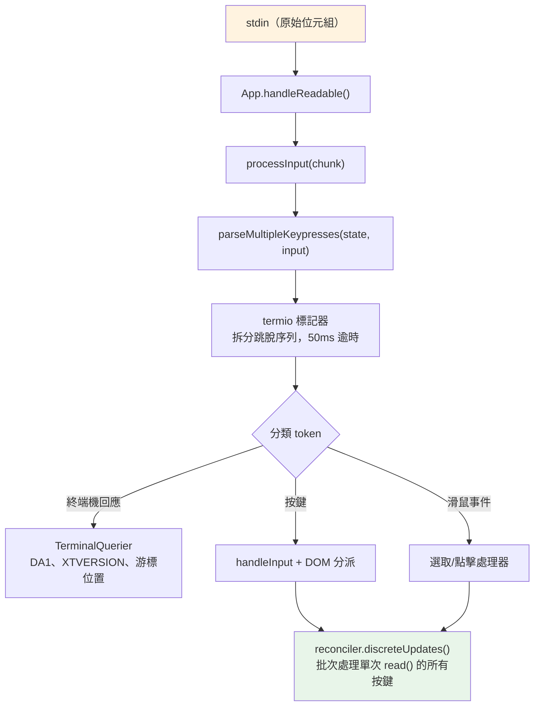
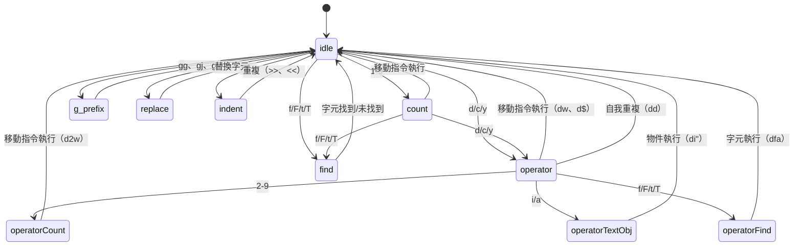

# 第十四章：輸入與互動

## 原始位元組，有意義的動作

當你在 Claude Code 中按下 Ctrl+X 再按 Ctrl+K 時，終端機會發送兩段位元組序列，中間大約間隔 200 毫秒。第一段是 `0x18`（ASCII CAN）。第二段是 `0x0B`（ASCII VT）。這兩個位元組本身不帶有除了「控制字元」以外的任何固有意義。輸入系統必須辨識出這兩個在逾時視窗內依序到達的位元組，構成了組合鍵 `ctrl+x ctrl+k`，對應到動作 `chat:killAgents`，終止所有正在執行的子代理。

從原始位元組到被終止的代理之間，六個系統依序啟動：一個標記器拆分跳脫序列，一個解析器跨五種終端機協定進行分類，一個按鍵綁定解析器根據上下文特定的綁定進行匹配，一個組合鍵狀態機管理多鍵序列，一個處理器執行動作，最後 React 將產生的狀態更新批次合併為一次渲染。

困難之處不在於任何單一系統，而在於終端機多樣性所帶來的組合爆炸。iTerm2 發送 Kitty 鍵盤協定序列。macOS Terminal 發送傳統 VT220 序列。透過 SSH 連線的 Ghostty 發送 xterm modifyOtherKeys。tmux 可能會吃掉、轉換或透傳任何這些序列，取決於它的設定。Windows Terminal 在 VT 模式方面有自己的怪癖。輸入系統必須從所有這些來源產生正確的 `ParsedKey` 物件，因為使用者不應該需要知道他們的終端機使用的是哪種鍵盤協定。

本章追蹤從原始位元組到有意義動作的完整路徑，橫跨這整個生態系統。

設計哲學是漸進增強搭配優雅降級。在支援 Kitty 鍵盤協定的現代終端機上，Claude Code 能獲得完整的修飾鍵偵測（Ctrl+Shift+A 與 Ctrl+A 是不同的）、super 鍵回報（Cmd 快捷鍵），以及無歧義的按鍵識別。在透過 SSH 連線的傳統終端機上，它會回退到最佳可用協定，損失一些修飾鍵區分能力但保持核心功能完整。使用者永遠不會看到關於其終端機不支援的錯誤訊息。他們可能無法使用 `ctrl+shift+f` 進行全域搜尋，但 `ctrl+r` 的歷史搜尋在任何地方都能運作。

---

## 按鍵解析管線

輸入以位元組區塊的形式從 stdin 到達。管線分階段處理它們：



標記器是整個基礎。終端機輸入是一個混合了可列印字元、控制碼和多位元組跳脫序列的位元組串流，沒有明確的框架界定。從 stdin 的一次 `read()` 可能回傳 `\x1b[1;5A`（Ctrl+上箭頭），也可能在一次讀取中回傳 `\x1b`，然後在下一次讀取中回傳 `[1;5A`，取決於位元組從 PTY 到達的速度。標記器維護一個狀態機，緩衝不完整的跳脫序列並產出完整的 token。

不完整序列問題是根本性的。當標記器看到一個孤立的 `\x1b` 時，它無法知道這是 Escape 鍵還是 CSI 序列的開頭。它會緩衝這個位元組並啟動一個 50ms 計時器。如果沒有後續到達，緩衝區會被清空，`\x1b` 成為一個 Escape 按鍵事件。但在清空之前，標記器會檢查 `stdin.readableLength` —— 如果核心緩衝區中有位元組在等待，計時器會重新啟動而非清空。這處理了事件迴圈被阻塞超過 50ms 且後續位元組已經被緩衝但尚未被讀取的情況。

對於貼上操作，逾時延長到 500ms。貼上的文字可能很大且分多個區塊到達。

來自單次 `read()` 的所有已解析按鍵會在一次 `reconciler.discreteUpdates()` 呼叫中被處理。這會批次處理 React 狀態更新，使得貼上 100 個字元只產生一次重新渲染，而非 100 次。這個批次處理是必要的：沒有它，貼上中的每個字元都會觸發一次完整的協調循環 —— 狀態更新、協調、提交、Yoga 排版、渲染、比對、寫入。以每次循環 5ms 計算，100 個字元的貼上需要 500ms 才能處理完。有了批次處理，同樣的貼上只需要一次 5ms 循環。

### stdin 管理

`App` 元件透過引用計數管理原始模式。當任何元件需要原始輸入（提示框、對話框、vim 模式）時，它呼叫 `setRawMode(true)`，將計數器加一。當它不再需要原始輸入時，呼叫 `setRawMode(false)`，將計數器減一。只有當計數器歸零時，原始模式才會被停用。這防止了終端機應用程式中一個常見的 bug：元件 A 啟用原始模式，元件 B 啟用原始模式，元件 A 停用原始模式，然後元件 B 的輸入突然壞掉，因為原始模式被全域停用了。

當原始模式首次啟用時，App 會：

1. 停止早期輸入捕獲（啟動引導階段在 React 掛載前收集按鍵的機制）
2. 將 stdin 設為原始模式（無行緩衝、無回顯、無訊號處理）
3. 附加一個 `readable` 監聽器用於非同步輸入處理
4. 啟用括弧貼上（使貼上的文字可被識別）
5. 啟用焦點回報（使應用程式知道終端機視窗何時獲得/失去焦點）
6. 啟用延伸按鍵回報（Kitty 鍵盤協定 + xterm modifyOtherKeys）

在停用時，以上所有步驟會以相反順序還原。謹慎的順序安排防止了跳脫序列洩漏 —— 在停用原始模式之前先停用延伸按鍵回報，確保終端機不會在應用程式停止解析它們之後繼續發送 Kitty 編碼序列。

`onExit` 訊號處理器（透過 `signal-exit` 套件）確保即使在非預期終止時也會執行清理。如果程序收到 SIGTERM 或 SIGINT，處理器會停用原始模式、還原終端機狀態、退出替代螢幕（如果啟用的話），並在程序退出前重新顯示游標。沒有這個清理，一個崩潰的 Claude Code 工作階段會讓終端機留在原始模式中，沒有游標也沒有回顯 —— 使用者需要盲打 `reset` 來恢復他們的終端機。

---

## 多協定支援

終端機在如何編碼鍵盤輸入方面並沒有共識。像 Kitty 這樣的現代終端機模擬器會發送帶有完整修飾鍵資訊的結構化序列。透過 SSH 連線的傳統終端機發送需要上下文才能解釋的模糊位元組序列。Claude Code 的解析器同時處理五種不同的協定，因為使用者的終端機可能是其中任何一種。

**CSI u（Kitty 鍵盤協定）** 是現代標準。格式：`ESC [ codepoint [; modifier] u`。範例：`ESC[13;2u` 是 Shift+Enter，`ESC[27u` 是無修飾鍵的 Escape。碼位無歧義地識別按鍵 —— Escape 按鍵和 Escape 作為序列前綴之間沒有歧義。修飾鍵字組將 shift、alt、ctrl 和 super（Cmd）編碼為各自的位元。Claude Code 在啟動時透過 `ENABLE_KITTY_KEYBOARD` 跳脫序列在支援的終端機上啟用此協定，並在退出時透過 `DISABLE_KITTY_KEYBOARD` 停用它。協定透過查詢/回應握手進行偵測：應用程式發送 `CSI ? u`，終端機以 `CSI ? flags u` 回應，其中 `flags` 指示支援的協定等級。

**xterm modifyOtherKeys** 是用於像透過 SSH 連線的 Ghostty 這類終端機的備用方案，在這些環境中 Kitty 協定無法協商。格式：`ESC [ 27 ; modifier ; keycode ~`。注意參數順序與 CSI u 相反 —— 修飾鍵在鍵碼之前，然後是鍵碼。這是解析器 bug 的常見來源。此協定透過 `CSI > 4 ; 2 m` 啟用，當終端機的 TERM 識別未被偵測到時（在 SSH 上 `TERM_PROGRAM` 未被轉發時很常見），由 Ghostty、tmux 和 xterm 發出。

**傳統終端機序列** 涵蓋其他所有情況：透過 `ESC O` 和 `ESC [` 序列的功能鍵、方向鍵、數字鍵盤、Home/End/Insert/Delete，以及 40 年終端機演進中累積的 VT100/VT220/xterm 變體的完整動物園。解析器使用兩個正規表達式來匹配這些：`FN_KEY_RE` 用於 `ESC O/N/[/[[` 前綴模式（匹配功能鍵、方向鍵及其帶修飾鍵的變體），`META_KEY_CODE_RE` 用於 meta 鍵碼（`ESC` 後跟一個英數字元，傳統的 Alt+鍵編碼）。

傳統序列的挑戰在於歧義性。`ESC [ 1 ; 2 R` 可能是 Shift+F3 或游標位置回報，取決於上下文。解析器透過私有標記檢查來解決這個問題：游標位置回報使用 `CSI ? row ; col R`（帶有 `?` 私有標記），而帶修飾鍵的功能鍵使用 `CSI params R`（不帶標記）。這個消歧義是 Claude Code 請求 DECXCPR（延伸游標位置回報）而非標準 CPR 的原因 —— 延伸形式是無歧義的。

終端機識別增加了另一層複雜性。在啟動時，Claude Code 發送一個 `XTVERSION` 查詢（`CSI > 0 q`）來發現終端機的名稱和版本。回應（`DCS > | name ST`）能在 SSH 連線中存活 —— 不像 `TERM_PROGRAM` 那樣，它是一個不會透過 SSH 傳播的環境變數。知道終端機身分讓解析器能處理終端機特定的怪癖。例如，xterm.js（VS Code 的整合終端機使用的）與原生 xterm 有不同的跳脫序列行為，而識別字串（`xterm.js(X.Y.Z)`）讓解析器能考慮這些差異。

**SGR 滑鼠事件** 使用格式 `ESC [ < button ; col ; row M/m`，其中 `M` 是按下，`m` 是釋放。按鈕碼編碼動作：0/1/2 對應左/中/右鍵點擊，64/65 對應滾輪上/下（0x40 OR 上一個滾輪位元），32+ 對應拖曳（0x20 OR 上一個移動位元）。滾輪事件被轉換為 `ParsedKey` 物件，使它們流經按鍵綁定系統；點擊和拖曳事件成為 `ParsedMouse` 物件，路由到選取處理器。

**括弧貼上** 將貼上的內容包裹在 `ESC [200~` 和 `ESC [201~` 標記之間。標記之間的所有內容成為一個帶有 `isPasted: true` 的單一 `ParsedKey`，無論貼上的文字可能包含什麼跳脫序列。這防止貼上的程式碼被解釋為命令 —— 當使用者貼上包含 `\x03`（作為原始位元組的 Ctrl+C）的程式碼片段時，這是一個關鍵的安全特性。

解析器的輸出型別形成一個清晰的判別式聯合：

```typescript
type ParsedKey = {
  kind: 'key';
  name: string;        // 'return'、'escape'、'a'、'f1' 等
  ctrl: boolean; meta: boolean; shift: boolean;
  option: boolean; super: boolean;
  sequence: string;    // 原始跳脫序列，用於除錯
  isPasted: boolean;   // 在括弧貼上內
}

type ParsedMouse = {
  kind: 'mouse';
  button: number;      // SGR 按鈕碼
  action: 'press' | 'release';
  col: number; row: number;  // 1-indexed 終端機座標
}

type ParsedResponse = {
  kind: 'response';
  response: TerminalResponse;  // 路由到 TerminalQuerier
}
```

`kind` 判別式確保下游程式碼明確處理每種輸入型別。一個按鍵不可能被意外地當作滑鼠事件處理；一個終端機回應不可能被意外地解釋為按鍵。`ParsedKey` 型別還攜帶原始 `sequence` 字串用於除錯 —— 當使用者回報「按 Ctrl+Shift+A 沒有反應」時，除錯日誌能顯示終端機究竟發送了什麼位元組序列，使得診斷問題究竟出在終端機的編碼、解析器的識別還是按鍵綁定的設定成為可能。

`ParsedKey` 上的 `isPasted` 旗標對安全性至關重要。當括弧貼上啟用時，終端機將貼上的內容包裹在標記序列中。解析器在產生的按鍵事件上設定 `isPasted: true`，按鍵綁定解析器會跳過對已貼上按鍵的綁定匹配。沒有這個機制，貼上包含 `\x03`（原始位元組的 Ctrl+C）或跳脫序列的文字會觸發應用程式命令。有了它，貼上的內容無論其位元組內容為何都被視為字面文字輸入。

解析器也識別終端機回應 —— 終端機自身對查詢的回答所發送的序列。這些包括裝置屬性（DA1、DA2）、游標位置回報、Kitty 鍵盤旗標回應、XTVERSION（終端機識別）和 DECRPM（模式狀態）。這些被路由到 `TerminalQuerier` 而非輸入處理器：

```typescript
type TerminalResponse =
  | { type: 'decrpm'; mode: number; status: number }
  | { type: 'da1'; params: number[] }
  | { type: 'da2'; params: number[] }
  | { type: 'kittyKeyboard'; flags: number }
  | { type: 'cursorPosition'; row: number; col: number }
  | { type: 'osc'; code: number; data: string }
  | { type: 'xtversion'; version: string }
```

**修飾鍵解碼** 遵循 XTerm 慣例：修飾鍵字組為 `1 + (shift ? 1 : 0) + (alt ? 2 : 0) + (ctrl ? 4 : 0) + (super ? 8 : 0)`。`ParsedKey` 中的 `meta` 欄位對應到 Alt/Option（位元 2）。`super` 欄位是獨立的（位元 8，macOS 上的 Cmd）。這個區別很重要，因為 Cmd 快捷鍵由作業系統保留，終端機應用程式無法捕獲 —— 除非終端機使用 Kitty 協定，它會回報其他協定默默吞掉的 super 修飾鍵。

一個 stdin 間隙偵測器會在距上次輸入 5 秒無輸入後觸發終端機模式重新宣告。這處理了 tmux 重新附加和筆電喚醒情境，在這些情境中終端機的鍵盤模式可能已被多工器或作業系統重置。當重新宣告觸發時，它會重新發送 `ENABLE_KITTY_KEYBOARD`、`ENABLE_MODIFY_OTHER_KEYS`、括弧貼上和焦點回報序列。沒有這個機制，從 tmux 工作階段分離後重新附加會默默地將鍵盤協定降級為傳統模式，在剩餘的工作階段中破壞修飾鍵偵測。

### 終端機 I/O 層

解析器之下是 `ink/termio/` 中的結構化終端機 I/O 子系統：

- **csi.ts** —— CSI（控制序列引導器）序列：游標移動、清除、捲動區域、括弧貼上啟用/停用、焦點事件啟用/停用、Kitty 鍵盤協定啟用/停用
- **dec.ts** —— DEC 私有模式序列：替代螢幕緩衝區（1049）、滑鼠追蹤模式（1000/1002/1003）、游標可見性、括弧貼上（2004）、焦點事件（1004）
- **osc.ts** —— 作業系統命令：剪貼簿存取（OSC 52）、分頁狀態、iTerm2 進度指示器、tmux/screen 多工器包裝（DCS 透傳，用於需要穿越多工器邊界的序列）
- **sgr.ts** —— 選擇圖形再現：ANSI 樣式碼系統（顏色、粗體、斜體、底線、反轉）
- **tokenize.ts** —— 有狀態的標記器，用於跳脫序列邊界偵測

多工器包裝值得一提。當 Claude Code 在 tmux 內執行時，某些跳脫序列（如 Kitty 鍵盤協定協商）必須透傳到外部終端機。tmux 使用 DCS 透傳（`ESC P ... ST`）來轉發它不理解的序列。`osc.ts` 中的 `wrapForMultiplexer` 函式偵測多工器環境並適當地包裝序列。沒有這個機制，Kitty 鍵盤模式會在 tmux 內默默失敗，使用者永遠不會知道為什麼他們的 Ctrl+Shift 綁定停止運作了。

### 事件系統

`ink/events/` 目錄實作了一個相容於瀏覽器的事件系統，具有七種事件型別：`KeyboardEvent`、`ClickEvent`、`FocusEvent`、`InputEvent`、`TerminalFocusEvent` 和基礎 `TerminalEvent`。每個都攜帶 `target`、`currentTarget`、`eventPhase`，並支援 `stopPropagation()`、`stopImmediatePropagation()` 和 `preventDefault()`。

包裝 `ParsedKey` 的 `InputEvent` 是為了與傳統 `EventEmitter` 路徑的向後相容性，較舊的元件可能仍在使用。新元件使用 DOM 風格的鍵盤事件分派，帶有捕獲/冒泡階段。兩條路徑都從同一個已解析的按鍵觸發，所以它們始終一致 —— 到達 stdin 的一個按鍵產生恰好一個 `ParsedKey`，它同時產生一個 `InputEvent`（給傳統監聽器）和一個 `KeyboardEvent`（給 DOM 風格分派）。這個雙路徑設計允許從 EventEmitter 模式到 DOM 事件模式的漸進式遷移，而不會破壞現有元件。

---

## 按鍵綁定系統

按鍵綁定系統分離了三個經常被糾纏在一起的關注點：什麼按鍵觸發什麼動作（綁定）、動作觸發時發生什麼（處理器），以及哪些綁定現在是活躍的（上下文）。

### 綁定：宣告式設定

預設綁定定義在 `defaultBindings.ts` 中，作為 `KeybindingBlock` 物件陣列，每個都限定在一個上下文中：

```typescript
export const DEFAULT_BINDINGS: KeybindingBlock[] = [
  {
    context: 'Global',
    bindings: {
      'ctrl+c': 'app:interrupt',
      'ctrl+d': 'app:exit',
      'ctrl+l': 'app:redraw',
      'ctrl+r': 'history:search',
    },
  },
  {
    context: 'Chat',
    bindings: {
      'escape': 'chat:cancel',
      'ctrl+x ctrl+k': 'chat:killAgents',
      'enter': 'chat:submit',
      'up': 'history:previous',
      'ctrl+x ctrl+e': 'chat:externalEditor',
    },
  },
  // ... 另外 14 個上下文
]
```

平台特定的綁定在定義時處理。圖片貼上在 macOS/Linux 上是 `ctrl+v`，但在 Windows 上是 `alt+v`（因為 `ctrl+v` 是系統貼上）。模式循環切換在支援 VT 模式的終端機上是 `shift+tab`，但在沒有 VT 模式的 Windows Terminal 上是 `meta+m`。功能旗標綁定（快速搜尋、語音模式、終端機面板）是條件式包含的。

使用者可以透過 `~/.claude/keybindings.json` 覆寫任何綁定。解析器接受修飾鍵別名（`ctrl`/`control`、`alt`/`opt`/`option`、`cmd`/`command`/`super`/`win`）、按鍵別名（`esc` -> `escape`、`return` -> `enter`）、組合鍵表示法（以空格分隔的步驟，如 `ctrl+k ctrl+s`），以及 null 動作來解除預設按鍵的綁定。null 動作與不定義綁定不同 —— 它明確阻止預設綁定的觸發，這對於想要回收某個按鍵給終端機使用的使用者很重要。

### 上下文：16 個活動範圍

每個上下文代表一種互動模式，其中一組特定的綁定適用：

| 上下文 | 何時活躍 |
|---------|------------|
| Global | 始終 |
| Chat | 提示輸入獲得焦點時 |
| Autocomplete | 自動完成選單可見時 |
| Confirmation | 權限對話框顯示時 |
| Scroll | 替代螢幕中有可捲動內容時 |
| Transcript | 唯讀對話記錄檢視器 |
| HistorySearch | 反向歷史搜尋（ctrl+r） |
| Task | 背景任務正在執行時 |
| Help | 說明覆蓋層顯示時 |
| MessageSelector | 回溯對話框 |
| MessageActions | 訊息游標導航 |
| DiffDialog | 差異檢視器 |
| Select | 通用選擇列表 |
| Settings | 設定面板 |
| Tabs | 分頁導航 |
| Footer | 頁尾指示器 |

當按鍵到達時，解析器從目前活躍的上下文（由 React 元件狀態決定）建立一個上下文列表，去重複同時保持優先順序，然後搜尋匹配的綁定。最後一個匹配的綁定勝出 —— 這就是使用者覆寫如何優先於預設值的方式。上下文列表在每次按鍵時重建（這很廉價：最多 16 個字串的陣列串接和去重複），所以上下文變更會立即生效，不需要任何訂閱或監聽器機制。

上下文設計處理了一個棘手的互動模式：巢狀模態。當權限對話框在執行中的任務期間出現時，`Confirmation` 和 `Task` 上下文可能都是活躍的。`Confirmation` 上下文取得優先權（它在元件樹中較晚註冊），所以 `y` 觸發「批准」而非任何任務層級的綁定。當對話框關閉時，`Confirmation` 上下文停用，`Task` 綁定恢復。這個堆疊行為自然而然地從上下文列表的優先順序中浮現 —— 不需要特殊的模態處理程式碼。

### 保留快捷鍵

並非一切都可以重新綁定。系統強制執行三層保留：

**不可重新綁定**（硬編碼行為）：`ctrl+c`（中斷/退出）、`ctrl+d`（退出）、`ctrl+m`（在所有終端機中與 Enter 相同 —— 重新綁定它會破壞 Enter）。

**終端機保留**（警告）：`ctrl+z`（SIGTSTP）、`ctrl+\`（SIGQUIT）。這些技術上可以被綁定，但在大多數設定中終端機會在應用程式看到它們之前就攔截掉。

**macOS 保留**（錯誤）：`cmd+c`、`cmd+v`、`cmd+x`、`cmd+q`、`cmd+w`、`cmd+tab`、`cmd+space`。作業系統在它們到達終端機之前就攔截了。綁定它們會建立一個永遠不會觸發的快捷鍵。

### 解析流程

當按鍵到達時，解析路徑是：

1. 建立上下文列表：元件註冊的活躍上下文加上 Global，去重複同時保持優先順序
2. 針對合併的綁定表呼叫 `resolveKeyWithChordState(input, key, contexts)`
3. `match`：清除任何待處理的組合鍵，呼叫處理器，對事件執行 `stopImmediatePropagation()`
4. `chord_started`：儲存待處理的按鍵，停止傳播，啟動組合鍵逾時
5. `chord_cancelled`：清除待處理的組合鍵，讓事件繼續冒泡
6. `unbound`：清除組合鍵 —— 這是明確的解除綁定（使用者將動作設為 `null`），所以傳播被停止但不執行處理器
7. `none`：繼續冒泡到其他處理器

「最後者勝出」的解析策略意味著，如果預設綁定和使用者綁定都在 `Chat` 上下文中定義了 `ctrl+k`，使用者的綁定取得優先權。這在匹配時透過按定義順序迭代綁定並保留最後一個匹配來評估，而非在載入時建立覆寫映射。優點是：上下文特定的覆寫自然地組合。使用者可以覆寫 `Chat` 中的 `enter` 而不影響 `Confirmation` 中的 `enter`。

---

## 組合鍵支援

`ctrl+x ctrl+k` 綁定是一個組合鍵：兩個按鍵共同構成一個單一動作。解析器透過一個狀態機來管理它。

當按鍵到達時：

1. 解析器將它附加到任何待處理的組合鍵前綴
2. 它檢查是否有任何綁定的組合鍵以此前綴開頭。如果有，它回傳 `chord_started` 並儲存待處理的按鍵
3. 如果完整的組合鍵精確匹配一個綁定，它回傳 `match` 並清除待處理狀態
4. 如果組合鍵前綴不匹配任何東西，它回傳 `chord_cancelled`

一個 `ChordInterceptor` 元件在組合鍵等待狀態期間攔截所有輸入。它有一個 1000ms 的逾時 —— 如果第二個按鍵沒有在一秒內到達，組合鍵會被取消且第一個按鍵會被丟棄。`KeybindingContext` 提供一個 `pendingChordRef` 用於同步存取待處理狀態，避免 React 狀態更新延遲，那可能導致第二個按鍵在第一個按鍵的狀態更新完成之前就被處理。

組合鍵設計避免了遮蔽 readline 編輯鍵。沒有組合鍵的話，「終止代理」的按鍵綁定可能是 `ctrl+k` —— 但那是 readline 的「刪除到行尾」，使用者在終端機文字輸入中預期會有這個功能。透過使用 `ctrl+x` 作為前綴（匹配 readline 自身的組合鍵前綴慣例），系統獲得了一個不與單鍵編輯快捷鍵衝突的綁定命名空間。

實作處理了一個大多數組合鍵系統都遺漏的邊緣情況：當使用者按了 `ctrl+x` 但接著輸入一個不屬於任何組合鍵的字元時會發生什麼？如果處理不當，那個字元會被吞掉 —— 組合鍵攔截器消耗了輸入，組合鍵被取消，字元就消失了。Claude Code 的 `ChordInterceptor` 在這種情況下回傳 `chord_cancelled`，這導致待處理輸入被丟棄，但允許不匹配的字元繼續冒泡到正常的輸入處理。字元不會遺失；只有組合鍵前綴被丟棄。這與使用者從 Emacs 風格組合鍵前綴中預期的行為一致。

---

## Vim 模式

### 狀態機

Vim 實作是一個帶有窮舉型別檢查的純狀態機。型別即文件：

```typescript
export type VimState =
  | { mode: 'INSERT'; insertedText: string }
  | { mode: 'NORMAL'; command: CommandState }

export type CommandState =
  | { type: 'idle' }
  | { type: 'count'; digits: string }
  | { type: 'operator'; op: Operator; count: number }
  | { type: 'operatorCount'; op: Operator; count: number; digits: string }
  | { type: 'operatorFind'; op: Operator; count: number; find: FindType }
  | { type: 'operatorTextObj'; op: Operator; count: number; scope: TextObjScope }
  | { type: 'find'; find: FindType; count: number }
  | { type: 'g'; count: number }
  | { type: 'operatorG'; op: Operator; count: number }
  | { type: 'replace'; count: number }
  | { type: 'indent'; dir: '>' | '<'; count: number }
```

這是一個具有 12 個變體的判別式聯合。TypeScript 的窮舉檢查確保每個對 `CommandState.type` 的 `switch` 語句都處理所有 12 種情況。向聯合中添加新狀態會導致每個不完整的 switch 產生編譯錯誤。狀態機不可能有死狀態或遺漏的轉換 —— 型別系統禁止了這些。

注意每個狀態如何恰好攜帶下一次轉換所需的資料。`operator` 狀態知道哪個操作符（`op`）以及前面的計數。`operatorCount` 狀態增加了數字累加器（`digits`）。`operatorTextObj` 狀態增加了範圍（`inner` 或 `around`）。沒有任何狀態攜帶它不需要的資料。這不僅是好品味 —— 它防止了一整類 bug，其中處理器讀取前一個命令的過期資料。如果你處於 `find` 狀態，你有一個 `FindType` 和一個 `count`。你沒有操作符，因為沒有操作符在等待中。型別使不可能的狀態無法被表達。

狀態圖說明了一切：



從 `idle`，按下 `d` 進入 `operator` 狀態。從 `operator`，按下 `w` 以 `w` 移動指令執行 `delete`。再按 `d`（`dd`）觸發行刪除。按 `2` 進入 `operatorCount`，所以 `d2w` 變成「刪除接下來 2 個字」。按 `i` 進入 `operatorTextObj`，所以 `di"` 變成「刪除引號內的內容」。每個中間狀態恰好攜帶下一次轉換所需的上下文 —— 不多不少。

### 轉換即純函式

`transition()` 函式根據當前狀態型別分派到 10 個處理器函式之一。每個回傳一個 `TransitionResult`：

```typescript
type TransitionResult = {
  next?: CommandState;    // 新狀態（省略 = 留在當前狀態）
  execute?: () => void;   // 副作用（省略 = 尚無動作）
}
```

副作用被回傳，而非執行。轉換函式是純的 —— 給定一個狀態和一個按鍵，它回傳下一個狀態以及可選的執行動作的閉包。呼叫者決定何時執行副作用。這使得狀態機的測試變得微不足道：餵入狀態和按鍵，對回傳的狀態進行斷言，忽略閉包。這也意味著轉換函式不依賴編輯器狀態、游標位置或緩衝區內容。那些細節在建立時被閉包捕獲，而非在轉換時被狀態機消耗。

`fromIdle` 處理器是入口點，涵蓋完整的 vim 詞彙表：

- **計數前綴**：`1-9` 進入 `count` 狀態，累積數字。`0` 是特殊的 —— 它是「行首」移動指令，不是計數數字，除非已經有數字被累積
- **操作符**：`d`、`c`、`y` 進入 `operator` 狀態，等待移動指令或文字物件來定義範圍
- **尋找**：`f`、`F`、`t`、`T` 進入 `find` 狀態，等待要搜尋的字元
- **G 前綴**：`g` 進入 `g` 狀態，用於複合命令（`gg`、`gj`、`gk`）
- **替換**：`r` 進入 `replace` 狀態，等待替換字元
- **縮排**：`>`、`<` 進入 `indent` 狀態（用於 `>>` 和 `<<`）
- **簡單移動指令**：`h/j/k/l/w/b/e/W/B/E/0/^/$` 立即執行，移動游標
- **即時命令**：`x`（刪除字元）、`~`（切換大小寫）、`J`（合併行）、`p/P`（貼上）、`D/C/Y`（操作符快捷鍵）、`G`（跳到末尾）、`.`（點重複）、`;/,`（尋找重複）、`u`（復原）、`i/I/a/A/o/O`（進入插入模式）

### 移動指令、操作符與文字物件

**移動指令** 是將按鍵映射到游標位置的純函式。`resolveMotion(key, cursor, count)` 將移動指令套用 `count` 次，如果游標停止移動則短路（你無法向左移動超過第 0 欄）。這個短路對於在行尾的 `3w` 很重要 —— 它停在最後一個字而非換行或報錯。

移動指令按其與操作符的互動方式分類：

- **排他的**（預設） —— 目的地的字元**不**包含在範圍中。`dw` 刪除到下一個字的第一個字元之前（但不包含它）
- **包含的**（`e`、`E`、`$`） —— 目的地的字元**包含**在範圍中。`de` 刪除到當前字的最後一個字元（含）
- **行範圍的**（`j`、`k`、`G`、`gg`、`gj`、`gk`） —— 與操作符一起使用時，範圍擴展到涵蓋整行。`dj` 刪除當前行和下面一行，而非僅僅兩個游標位置之間的字元

**操作符** 作用於一個範圍。`delete` 移除文字並儲存到暫存器。`change` 移除文字並進入插入模式。`yank` 複製到暫存器但不做修改。`cw`/`cW` 特殊情況遵循 vim 慣例：change-word 移動到當前字的末尾，而非下一個字的開頭（與 `dw` 不同）。

一個有趣的邊緣情況：`[Image #N]` 晶片吸附。當一個字移動指令落在圖片參考晶片（在終端機中渲染為單一視覺單元）內部時，範圍擴展到涵蓋整個晶片。這防止了使用者感知為原子元素的部分刪除 —— 你無法刪除 `[Image #3]` 的一半，因為移動指令系統將整個晶片視為單一個字。

額外的命令涵蓋了完整的預期 vim 詞彙表：`x`（刪除字元）、`r`（替換字元）、`~`（切換大小寫）、`J`（合併行）、`p`/`P`（帶有行範圍/字元範圍感知的貼上）、`>>` / `<<`（以 2 個空格為單位的縮排/取消縮排）、`o`/`O`（在下方/上方開啟新行並進入插入模式）。

**文字物件** 在游標周圍尋找邊界。它們回答的問題是：「游標所在的『東西』是什麼？」

字物件（`iw`、`aw`、`iW`、`aW`）將文字分段為字素，將每個分類為字詞字元、空白或標點符號，並將選取範圍擴展到字邊界。`i`（inner）變體僅選取字本身。`a`（around）變體包含周圍的空白 —— 優先選取尾隨空白，如果在行尾則回退到前導空白。大寫變體（`W`、`aW`）將任何非空白序列視為一個字，忽略標點邊界。

引號物件（`i"`、`a"`、`i'`、`a'`、`` i` ``、`` a` ``）在當前行尋找成對的引號。配對按順序匹配（第一和第二個引號形成一對，第三和第四個形成下一對，依此類推）。如果游標在第一和第二個引號之間，那就是匹配。`a` 變體包含引號字元；`i` 變體排除它們。

括號物件（`ib`/`i(`、`ab`/`a(`、`i[`/`a[`、`iB`/`i{`/`aB`/`a{`、`i<`/`a<`）對匹配的定界符進行深度追蹤搜尋。它們從游標向外搜尋，維護一個巢狀計數，直到在深度零找到匹配的配對。這正確處理了巢狀括號 —— 在 `foo((bar))` 內的 `d i (` 刪除 `bar`，而非 `(bar)`。

### 持久狀態與點重複

Vim 模式維護一個 `PersistentState`，它在命令之間存續 —— 這是讓 vim 感覺像 vim 的「記憶」：

```typescript
interface PersistentState {
  lastChange: RecordedChange;   // 用於點重複
  lastFind: { type: FindType; char: string };  // 用於 ; 和 ,
  register: string;             // 複製緩衝區
  registerIsLinewise: boolean;  // 貼上行為旗標
}
```

每個會修改的命令都將自身記錄為一個 `RecordedChange` —— 一個涵蓋插入、操作符+移動指令、操作符+文字物件、操作符+尋找、替換、刪除字元、切換大小寫、縮排、開啟新行和合併行的判別式聯合。`.` 命令從持久狀態重播 `lastChange`，使用記錄的計數、操作符和移動指令在當前游標位置重現完全相同的編輯。

尋找重複（`;` 和 `,`）使用 `lastFind`。`;` 命令在相同方向重複最後一次尋找。`,` 命令翻轉方向：`f` 變成 `F`，`t` 變成 `T`，反之亦然。這意味著在 `fa`（向前尋找 'a'）之後，`;` 向前尋找下一個 'a'，而 `,` 向後尋找下一個 'a' —— 使用者不需要記住他們搜尋的方向。

暫存器追蹤複製和刪除的文字。當暫存器內容以 `\n` 結尾時，它被標記為行範圍的，這會改變貼上行為：`p` 在當前行下方插入（而非游標之後），`P` 在上方插入。這個區別對使用者是不可見的，但對於 vim 使用者經常依賴的「刪除一行，在別處貼上」工作流程至關重要。

---

## 虛擬捲動

長時間的 Claude Code 工作階段會產生冗長的對話。一個繁重的除錯工作階段可能產生 200 多條訊息，每條包含 markdown、程式碼區塊、工具使用結果和權限記錄。沒有虛擬化，React 會在記憶體中維護 200 多個元件子樹，每個都有自己的狀態、副作用和記憶化快取。DOM 樹會包含數千個節點。Yoga 排版會在每一幀都遍訪所有節點。終端機會變得無法使用。

`VirtualMessageList` 元件透過只渲染可視區域中可見的訊息加上上方和下方的小緩衝區來解決這個問題。在一個有數百條訊息的對話中，這是掛載 500 個 React 子樹（每個都帶有 markdown 解析、語法高亮和工具使用區塊）與掛載 15 個之間的差異。

元件維護：

- 每條訊息的**高度快取**，在終端機欄數改變時失效
- 用於對話記錄搜尋導航的**跳轉控制柄**（跳到索引、下一個/上一個匹配）
- 帶有暖快取支援的**搜尋文字萃取**（當使用者輸入 `/` 時預先將所有訊息轉小寫）
- **黏性提示追蹤** —— 當使用者從輸入處捲離時，他們最後的提示文字作為上下文出現在頂部
- **訊息動作導航** —— 基於游標的訊息選取，用於回溯功能

`useVirtualScroll` hook 基於 `scrollTop`、`viewportHeight` 和累積訊息高度計算要掛載哪些訊息。它在 `ScrollBox` 上維護捲動箝制邊界，以防止在突發的 `scrollTo` 呼叫超過 React 的非同步重新渲染時出現空白螢幕 —— 這是虛擬化列表中的經典問題，捲動位置可能跑在 DOM 更新前面。

虛擬捲動與 markdown token 快取之間的互動值得注意。當一條訊息捲出可視區域時，它的 React 子樹會卸載。當使用者捲回時，子樹重新掛載。沒有快取的話，這意味著每條使用者捲過的訊息都要重新解析 markdown。模組級的 LRU 快取（500 個項目，以內容雜湊為鍵）確保昂貴的 `marked.lexer()` 呼叫對每個唯一的訊息內容最多發生一次，無論元件掛載和卸載多少次。

`ScrollBox` 元件本身透過 `useImperativeHandle` 提供命令式 API：

- `scrollTo(y)` —— 絕對捲動，中斷黏性捲動模式
- `scrollBy(dy)` —— 累積到 `pendingScrollDelta`，由渲染器以封頂速率消耗
- `scrollToElement(el, offset)` —— 透過 `scrollAnchor` 將位置讀取延遲到渲染時
- `scrollToBottom()` —— 重新啟用黏性捲動模式
- `setClampBounds(min, max)` —— 約束虛擬捲動視窗

所有捲動變更直接操作 DOM 節點屬性並透過微任務排程渲染，繞過 React 的協調器。`markScrollActivity()` 呼叫通知背景定時器（旋轉動畫、計時器）跳過它們的下一個 tick，減少活躍捲動期間的事件迴圈爭用。這是一種協作式排程模式：捲動路徑告訴背景工作「我正在執行延遲敏感的操作，請讓步。」背景定時器在排程下一個 tick 之前檢查此旗標，如果捲動正在進行則延遲一幀。結果是即使多個旋轉動畫和計時器在背景執行，捲動也始終保持平滑。

---

## 實踐應用：建構上下文感知的按鍵綁定系統

Claude Code 的按鍵綁定架構為任何具有模態輸入的應用程式提供了範本 —— 編輯器、IDE、繪圖工具、終端機多工器。關鍵洞察：

**將綁定與處理器分離。** 綁定是資料（哪個按鍵對應哪個動作名稱）。處理器是程式碼（動作觸發時發生什麼）。將它們分開意味著綁定可以序列化為 JSON 供使用者自訂，而處理器則留在擁有相關狀態的元件中。使用者可以將 `ctrl+k` 重新綁定到 `chat:submit` 而不需要碰任何元件程式碼。

**上下文作為一等概念。** 不是使用一個扁平的鍵映射，而是定義根據應用程式狀態啟用和停用的上下文。當對話框開啟時，`Confirmation` 上下文啟用，其綁定優先於 `Chat` 綁定。當對話框關閉時，`Chat` 綁定恢復。這消除了散布在事件處理器中的 `if (dialogOpen && key === 'y')` 條件湯。

**組合鍵狀態作為明確的機器。** 多鍵序列（組合鍵）不是單鍵綁定的特殊情況 —— 它們是一種不同類型的綁定，需要帶有逾時和取消語意的狀態機。使這一點明確化（透過專用的 `ChordInterceptor` 元件和 `pendingChordRef`）可以防止微妙的 bug，例如組合鍵的第二個按鍵被不同的處理器消耗，因為 React 的狀態更新尚未傳播完畢。

**及早保留，清楚警告。** 在定義時而非解析時識別無法重新綁定的按鍵（系統快捷鍵、終端機控制字元）。當使用者嘗試綁定 `ctrl+c` 時，在設定載入期間顯示錯誤，而非默默接受一個永遠不會觸發的綁定。這是一個能運作的按鍵綁定系統與一個產生神秘 bug 回報的系統之間的差異。

**為終端機多樣性設計。** Claude Code 的按鍵綁定系統在綁定層級而非處理器層級定義平台特定的替代方案。圖片貼上根據作業系統是 `ctrl+v` 或 `alt+v`。模式循環切換根據 VT 模式支援是 `shift+tab` 或 `meta+m`。每個動作的處理器是相同的，無論哪個按鍵觸發它。這意味著測試涵蓋每個動作一條程式碼路徑，而非每個平台-按鍵組合一條。當新的終端機怪癖出現時（例如 Windows Terminal 在 Node 24.2.0 之前缺少 VT 模式），修復是綁定定義中的一個條件式，而非散布在處理器程式碼中的一組 `if (platform === 'windows')` 檢查。

**提供逃生口。** null 動作解除綁定機制雖小但很重要。在終端機多工器內執行 Claude Code 的使用者可能會發現 `ctrl+t`（切換待辦事項）與他們的多工器的分頁切換快捷鍵衝突。透過在他們的 keybindings.json 中添加 `{ "ctrl+t": null }`，他們完全停用該綁定。按鍵穿過到多工器。沒有 null 解除綁定，使用者唯一的選擇是將 `ctrl+t` 重新綁定到他們不想要的其他動作，或重新設定他們的多工器 —— 兩者都不是好的體驗。

Vim 模式實作增加了另一個教訓：**讓型別系統強制執行你的狀態機**。12 個變體的 `CommandState` 聯合使得在 switch 語句中遺忘一個狀態成為不可能。`TransitionResult` 型別將狀態變更與副作用分離，使機器可以作為純函式進行測試。如果你的應用程式有模態輸入，將模式表達為判別式聯合，讓編譯器驗證窮舉性。花在定義型別上的時間會以消除的執行時 bug 來回報自身。

考慮替代方案：一個使用可變狀態和命令式條件的 vim 實作。`fromOperator` 處理器會是一堆 `if (mode === 'operator' && pendingCount !== null && isDigit(key))` 檢查的巢狀結構，每個分支都修改共享變數。添加新狀態（比如巨集錄製模式）需要審查每個分支以確保新狀態被處理。有了判別式聯合，編譯器會執行審查 —— 添加新變體的 PR 在每個 switch 語句處理它之前不會建置通過。

這是 Claude Code 輸入系統更深層的教訓：在每一層 —— 標記器、解析器、按鍵綁定解析器、vim 狀態機 —— 架構盡可能早地將非結構化輸入轉換為型別化、窮舉處理的結構。原始位元組在解析器邊界成為 `ParsedKey`。`ParsedKey` 在按鍵綁定邊界成為動作名稱。動作名稱在元件邊界成為型別化的處理器。每次轉換都縮窄了可能狀態的空間，每次縮窄都由 TypeScript 的型別系統強制執行。當按鍵到達應用程式邏輯時，歧義已經消失。不存在「如果按鍵是 undefined 怎麼辦？」不存在「如果修飾鍵組合是不可能的怎麼辦？」型別已經禁止了那些狀態的存在。

這兩章合起來講述一個故事。第十三章展示了渲染系統如何消除不必要的工作 —— 位元傳輸未改變的區域、內化重複值、在儲存格層級比對、追蹤損壞邊界。第十四章展示了輸入系統如何消除歧義 —— 將五種協定解析為一種型別、根據上下文綁定解析按鍵、將模態狀態表達為窮舉聯合。渲染系統回答「你如何每秒 60 次繪制 24,000 個儲存格？」輸入系統回答「你如何在碎片化的生態系統中將位元組串流轉為有意義的動作？」兩個答案遵循相同的原則：將複雜性推到邊界，在那裡它可以被處理一次且正確，使得下游的一切都在乾淨的、型別化的、邊界明確的資料上運作。終端機是混沌。應用程式是有序。邊界程式碼做的是將一個轉換為另一個的艱難工作。

---

## 總結：兩個系統，一個設計哲學

第十三章和第十四章涵蓋了終端機介面的兩半：輸出與輸入。儘管它們的關注點不同，兩個系統遵循相同的架構原則。

**內化與間接引用。** 渲染系統將字元、樣式和超連結內化到池中，在熱路徑中用整數比較替代字串比較。輸入系統在解析器邊界將跳脫序列內化為結構化的 `ParsedKey` 物件，在處理器路徑中用型別化的欄位存取替代位元組層級的模式匹配。

**分層消除工作。** 渲染系統堆疊了五種最佳化（髒旗標、位元傳輸、損壞矩形、儲存格層級差異、修補最佳化），每種都消除一類不必要的計算。輸入系統堆疊了三種（標記器、協定解析器、按鍵綁定解析器），每種都消除一類歧義。

**純函式與型別化狀態機。** Vim 模式是帶有型別化轉換的純狀態機。按鍵綁定解析器是從（按鍵、上下文、組合鍵狀態）到解析結果的純函式。渲染管線是從（DOM 樹、前一個螢幕）到（新螢幕、修補）的純函式。副作用發生在邊界 —— 寫入 stdout、分派到 React —— 而非核心邏輯中。

**跨環境的優雅降級。** 渲染系統適應終端機大小、替代螢幕支援和同步更新協定可用性。輸入系統適應 Kitty 鍵盤協定、xterm modifyOtherKeys、傳統 VT 序列和多工器透傳需求。兩個系統都不需要特定終端機才能運作；兩者都在更有能力的終端機上變得更好。

這些原則不限於終端機應用程式。它們適用於任何必須處理高頻輸入並在多樣化的執行環境中產生低延遲輸出的系統。終端機恰好是一個約束足夠尖銳的環境，違反這些原則會產生立即可見的退化 —— 丟幀、吞掉的按鍵、閃爍。這種尖銳性使它成為一個絕佳的教師。

下一章從 UI 層移到協定層：Claude Code 如何實作 MCP —— 讓任何外部服務成為一等工具的通用工具協定。終端機 UI 處理使用者體驗的最後一哩 —— 將資料結構轉換為螢幕上的像素，將按鍵轉換為應用程式動作。MCP 處理可擴展性的第一哩 —— 發現、連接和執行存在於代理自身程式碼庫之外的工具。在它們之間，記憶系統（第十一章）和技能/鉤子系統（第十二章）定義了智慧和控制層。整個系統的品質上限取決於這四者：再多的模型智慧也無法補償延遲的 UI，再多的渲染效能也無法補償一個無法觸及它所需工具的模型。
