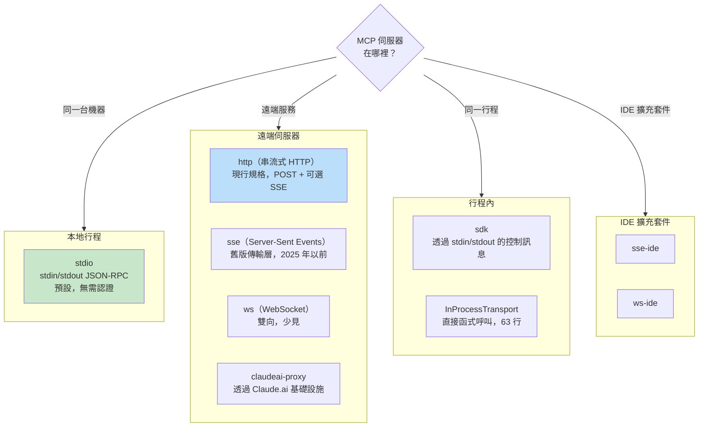
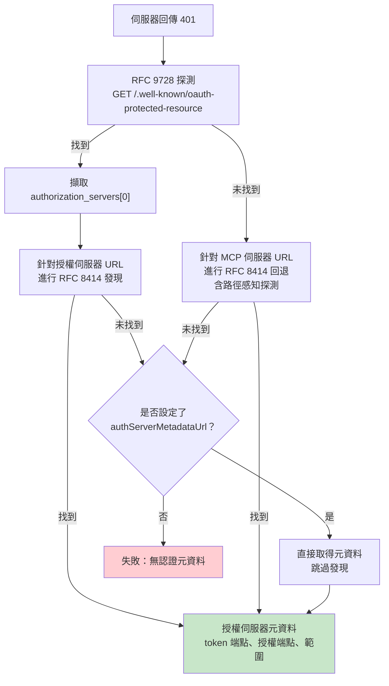

# 第十五章：MCP —— 通用工具協定

## 為何 MCP 的意義超越 Claude Code

本書其他每一章都在討論 Claude Code 的內部機制。這一章不同。模型上下文協定（Model Context Protocol）是一個開放規格，任何代理都能實作，而 Claude Code 的 MCP 子系統是現存最完整的生產環境客戶端之一。如果你正在建構一個需要呼叫外部工具的代理——任何代理、任何語言、任何模型——本章的模式可以直接套用。

核心命題很直接：MCP 定義了一個 JSON-RPC 2.0 協定，用於客戶端（代理）與伺服器（工具提供者）之間的工具發現與調用。客戶端發送 `tools/list` 來發現伺服器提供了什麼，然後用 `tools/call` 來執行。伺服器以名稱、描述和 JSON Schema 輸入參數來描述每個工具。這就是全部的契約。其他一切——傳輸層選擇、認證、設定載入、工具名稱正規化——都是將乾淨的規格變成能在現實世界中存活之物的實作工程。

Claude Code 的 MCP 實作橫跨四個核心檔案：`types.ts`、`client.ts`、`auth.ts` 和 `InProcessTransport.ts`。它們共同支援八種傳輸類型、七個設定範圍、跨兩個 RFC 的 OAuth 發現機制，以及一個讓 MCP 工具與內建工具無法區分的工具封裝層——與第六章介紹的 `Tool` 介面完全相同。本章將逐層講解。

---

## 八種傳輸類型

任何 MCP 整合的第一個設計決策是客戶端如何與伺服器通訊。Claude Code 支援八種傳輸層配置：



有三個設計選擇值得關注。第一，`stdio` 是預設值——當 `type` 被省略時，系統假設是本地子行程。這向下相容最早期的 MCP 設定。第二，fetch 包裝器是堆疊式的：逾時包裝在最外層，步進偵測在中間，基礎 fetch 在最內層。每個包裝器只處理一個關注點。第三，`ws-ide` 分支有 Bun/Node 執行時期的分歧——Bun 的 `WebSocket` 原生支援 proxy 和 TLS 選項，而 Node 需要 `ws` 套件。

**何時使用哪種。** 對於本地工具（檔案系統、資料庫、自訂腳本），用 `stdio`——沒有網路、無需認證，只有管道。對於遠端服務，`http`（串流式 HTTP）是現行規格的建議。`sse` 是舊版但部署廣泛。`sdk`、IDE 和 `claudeai-proxy` 類型是各自生態系統的內部實作。

---

## 設定載入與範圍劃定

MCP 伺服器設定從七個範圍載入，合併後去重：

| 範圍 | 來源 | 信任等級 |
|------|------|----------|
| `local` | 工作目錄中的 `.mcp.json` | 需要使用者核准 |
| `user` | `~/.claude.json` 的 mcpServers 欄位 | 使用者自行管理 |
| `project` | 專案層級設定 | 共享的專案設定 |
| `enterprise` | 受管企業設定 | 由組織預先核准 |
| `managed` | 外掛提供的伺服器 | 自動發現 |
| `claudeai` | Claude.ai 網頁介面 | 透過網頁預先授權 |
| `dynamic` | 執行時期注入（SDK） | 以程式方式加入 |

**去重是基於內容的，而非基於名稱。** 兩個名稱不同但命令或 URL 相同的伺服器會被識別為同一個伺服器。`getMcpServerSignature()` 函式計算出一個正規鍵值：本地伺服器為 `stdio:["command","arg1"]`，遠端伺服器為 `url:https://example.com/mcp`。外掛提供的伺服器若其簽名與手動設定匹配，則會被抑制。

---

## 工具封裝：從 MCP 到 Claude Code

連線成功後，客戶端呼叫 `tools/list`。每個工具定義被轉換為 Claude Code 的內部 `Tool` 介面——與內建工具使用的介面完全相同。封裝完成後，模型無法區分內建工具和 MCP 工具。

封裝過程有四個階段：

**1. 名稱正規化。** `normalizeNameForMCP()` 將無效字元替換為底線。完整限定名稱遵循 `mcp__{serverName}__{toolName}` 格式。

**2. 描述截斷。** 上限為 2,048 個字元。OpenAPI 產生的伺服器曾被觀察到將 15-60KB 傾倒進 `tool.description`——單一工具每回合大約 15,000 個 token。

**3. Schema 直通。** 工具的 `inputSchema` 直接傳遞給 API。封裝時不做轉換、不做驗證。Schema 錯誤在呼叫時才會浮現，而非註冊時。

**4. 註解映射。** MCP 註解映射到行為旗標：`readOnlyHint` 將工具標記為可安全並行執行（如第七章串流執行器中所討論的），`destructiveHint` 觸發額外的權限審查。這些註解來自 MCP 伺服器——惡意伺服器可能將破壞性工具標記為唯讀。這是一個被接受的信任邊界，但值得理解：使用者選擇加入了該伺服器，而惡意伺服器將破壞性工具標記為唯讀確實是一個真實的攻擊向量。系統接受這個取捨，因為替代方案——完全忽略註解——將阻止合法伺服器改善使用者體驗。

---

## MCP 伺服器的 OAuth

遠端 MCP 伺服器通常需要認證。Claude Code 實作了完整的 OAuth 2.0 + PKCE 流程，包含基於 RFC 的發現機制、跨應用程式存取（Cross-App Access）和錯誤回應正規化。

### 發現鏈



`authServerMetadataUrl` 這個逃生口的存在是因為某些 OAuth 伺服器兩個 RFC 都沒有實作。

### 跨應用程式存取（XAA）

當 MCP 伺服器設定中有 `oauth.xaa: true` 時，系統透過身分提供者（Identity Provider）執行聯合 token 交換——一次 IdP 登入即可解鎖多個 MCP 伺服器。

### 錯誤回應正規化

`normalizeOAuthErrorBody()` 函式處理違反規格的 OAuth 伺服器。Slack 對錯誤回應返回 HTTP 200，錯誤訊息埋在 JSON 本體中。該函式會窺探 2xx POST 回應的本體，當本體匹配 `OAuthErrorResponseSchema` 但不匹配 `OAuthTokensSchema` 時，將回應重寫為 HTTP 400。它還會將 Slack 特有的錯誤碼（`invalid_refresh_token`、`expired_refresh_token`、`token_expired`）正規化為標準的 `invalid_grant`。

---

## 行程內傳輸層

不是每個 MCP 伺服器都需要是獨立行程。`InProcessTransport` 類別使 MCP 伺服器和客戶端可以在同一行程中執行：

```typescript
class InProcessTransport implements Transport {
  async send(message: JSONRPCMessage): Promise<void> {
    if (this.closed) throw new Error('Transport is closed')
    queueMicrotask(() => { this.peer?.onmessage?.(message) })
  }
  async close(): Promise<void> {
    if (this.closed) return
    this.closed = true
    this.onclose?.()
    if (this.peer && !this.peer.closed) {
      this.peer.closed = true
      this.peer.onclose?.()
    }
  }
}
```

整個檔案只有 63 行。兩個設計決策值得關注。第一，`send()` 透過 `queueMicrotask()` 傳遞，以防止同步請求/回應循環中的堆疊深度問題。第二，`close()` 會級聯到對等端，防止半開啟狀態。Chrome MCP 伺服器和 Computer Use MCP 伺服器都使用這個模式。

---

## 連線管理

### 連線狀態

每個 MCP 伺服器連線存在於五種狀態之一：`connected`、`failed`、`needs-auth`（帶有 15 分鐘的 TTL 快取，防止 30 個伺服器各自獨立發現同一個過期 token）、`pending` 或 `disabled`。

### 工作階段過期偵測

MCP 的串流式 HTTP 傳輸層使用工作階段 ID。當伺服器重新啟動時，請求會返回 HTTP 404 並帶有 JSON-RPC 錯誤碼 -32001。`isMcpSessionExpiredError()` 函式檢查這兩個訊號——注意它使用字串包含來偵測錯誤碼，這務實但脆弱：

```typescript
export function isMcpSessionExpiredError(error: Error): boolean {
  const httpStatus = 'code' in error ? (error as any).code : undefined
  if (httpStatus !== 404) return false
  return error.message.includes('"code":-32001') ||
    error.message.includes('"code": -32001')
}
```

偵測到後，連線快取清除並重試一次呼叫。

### 批次連線

本地伺服器以每批 3 個連線（產生行程可能耗盡檔案描述符），遠端伺服器以每批 20 個連線。React 上下文提供者 `MCPConnectionManager.tsx` 管理生命週期，將當前連線與新設定進行差異比對。

---

## Claude.ai 代理傳輸層

`claudeai-proxy` 傳輸層展示了一種常見的代理整合模式：透過中介連線。Claude.ai 的訂閱者透過網頁介面設定 MCP「連接器」，而 CLI 透過 Claude.ai 的基礎設施路由，由其處理供應商端的 OAuth。

`createClaudeAiProxyFetch()` 函式在請求時捕獲 `sentToken`，而非在 401 後重新讀取。在多個連接器併發 401 的情況下，另一個連接器的重試可能已經刷新了 token。該函式還會在重新整理處理器返回 false 時檢查併發刷新——即「ELOCKED 競爭」的場景，另一個連接器贏得了鎖定檔案的競爭。

---

## 逾時架構

MCP 的逾時是分層的，每一層防護不同的失敗模式：

| 層級 | 持續時間 | 防護目標 |
|------|----------|----------|
| 連線 | 30 秒 | 無法到達或啟動緩慢的伺服器 |
| 每次請求 | 60 秒（每次請求重新計時） | 過期逾時訊號的程式缺陷 |
| 工具呼叫 | 約 27.8 小時 | 合法的長時間操作 |
| 認證 | 每次 OAuth 請求 30 秒 | 無法到達的 OAuth 伺服器 |

每次請求的逾時值得強調。早期的實作在連線時建立單一的 `AbortSignal.timeout(60000)`。閒置 60 秒後，下一次請求會立即中止——因為訊號已經過期了。修正方式：`wrapFetchWithTimeout()` 為每次請求建立新的逾時訊號。它還會正規化 `Accept` 標頭，作為防止執行時期和代理伺服器丟棄它的最後防線。

---

## 實踐應用：將 MCP 整合到你自己的代理中

**從 stdio 開始，之後再增加複雜度。** `StdioClientTransport` 處理一切：產生行程、管道、終止。一行設定、一個傳輸類別，你就有了 MCP 工具。

**正規化名稱並截斷描述。** 名稱必須匹配 `^[a-zA-Z0-9_-]{1,64}$`。加上 `mcp__{serverName}__` 前綴以避免衝突。描述上限為 2,048 個字元——否則 OpenAPI 產生的伺服器會浪費上下文 token。

**延遲處理認證。** 在伺服器返回 401 之前不要嘗試 OAuth。大多數 stdio 伺服器不需要認證。

**對內建伺服器使用行程內傳輸層。** `createLinkedTransportPair()` 消除了你所控制之伺服器的子行程開銷。

**尊重工具註解並清理輸出。** `readOnlyHint` 啟用並行執行。對回應進行清理以防禦惡意 Unicode（雙向覆寫字元、零寬度連接符），這些可能誤導模型。

MCP 協定刻意保持極簡——兩個 JSON-RPC 方法。在這些方法與生產環境部署之間的一切都是工程：八種傳輸層、七個設定範圍、兩個 OAuth RFC，以及逾時分層。Claude Code 的實作展示了這種工程在規模化時的樣貌。

下一章將探討當代理超越 localhost 時會發生什麼：遠端執行協定讓 Claude Code 在雲端容器中運行、接受來自網頁瀏覽器的指令，並透過注入憑證的代理伺服器建立 API 流量隧道。