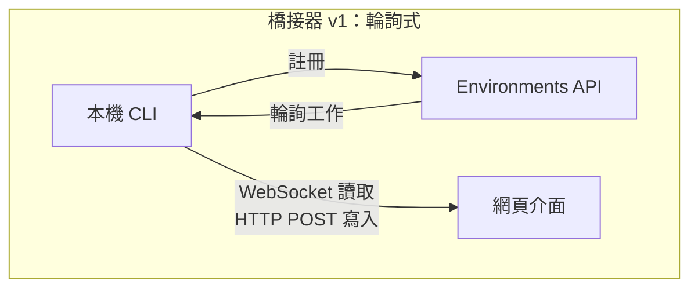
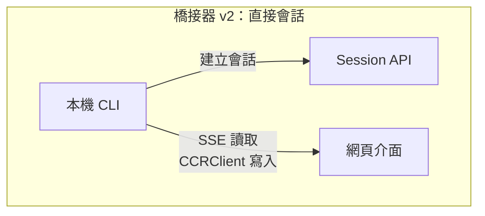
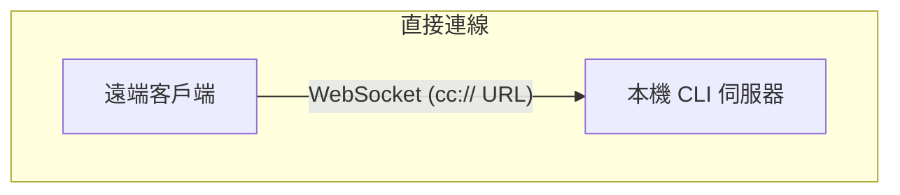
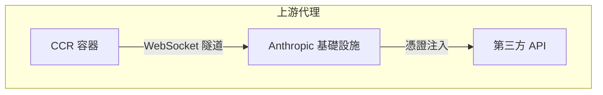

# 第十六章：遠端控制與雲端執行

## 代理延伸到 Localhost 之外

到目前為止，每一章都假設 Claude Code 在程式碼所在的同一台機器上執行。終端機是本機的。檔案系統是本機的。模型回應串流回一個同時掌控鍵盤和工作目錄的程序。

當你想從瀏覽器控制 Claude Code、在雲端容器中執行它，或將它作為區域網路上的服務公開時，這個假設就崩潰了。代理需要一種方式來接收來自網頁瀏覽器、行動應用程式或自動化管線的指令——將權限提示轉發給不在終端機前的人，並將 API 流量通過可能注入憑證或代替代理終止 TLS 的基礎設施進行隧道傳輸。

Claude Code 用四個系統解決這個問題，每個系統處理不同的拓撲結構：

<div class="diagram-grid">









</div>

這些系統共享一個共同的設計哲學：讀取和寫入是非對稱的，重新連線是自動的，失敗會優雅降級。

---

## 橋接器 v1：輪詢、分派、生成

v1 橋接器是基於環境的遠端控制系統。當開發者執行 `claude remote-control` 時，CLI 向 Environments API 註冊、輪詢工作，並為每個會話生成一個子程序。

在註冊之前，會執行一系列預檢查：執行時期功能閘門、OAuth token 驗證、組織政策檢查、過期 token 偵測（在連續三次使用同一過期 token 失敗後的跨程序退避）、以及主動 token 重新整理——消除了大約 9% 原本在首次嘗試時就會失敗的註冊。

註冊完成後，橋接器進入長輪詢迴圈。工作項目以會話（帶有包含會話 token、API 基礎 URL、MCP 設定和環境變數的 `secret` 欄位）或健康檢查的形式到達。橋接器將「無工作」的日誌訊息節流至每 100 次空輪詢記錄一次。

每個會話生成一個子 Claude Code 程序，透過 stdin/stdout 上的 NDJSON 通訊。權限請求透過橋接器傳輸層流向網頁介面，由使用者批准或拒絕。往返必須在大約 10-14 秒內完成。

---

## 橋接器 v2：直接會話與 SSE

v2 橋接器消除了整個 Environments API 層——沒有註冊、沒有輪詢、沒有確認、沒有心跳、沒有取消註冊。動機是：v1 要求伺服器在分派工作之前知道機器的能力。V2 將生命週期壓縮為三個步驟：

1. **建立會話**：使用 OAuth 憑證 `POST /v1/code/sessions`。
2. **連線橋接器**：`POST /v1/code/sessions/{id}/bridge`。回傳 `worker_jwt`、`api_base_url` 和 `worker_epoch`。每次 `/bridge` 呼叫都會遞增 epoch——它本身「就是」註冊。
3. **開啟傳輸層**：SSE 用於讀取，`CCRClient` 用於寫入。

傳輸層抽象（`ReplBridgeTransport`）將 v1 和 v2 統一在一個共同介面之後，因此訊息處理不需要知道它正在與哪一代通訊。

當 SSE 連線因 401 而斷開時，傳輸層透過新的 `/bridge` 呼叫用新鮮憑證重建，同時保留序號游標——不會遺失任何訊息。寫入路徑使用逐實例的 `getAuthToken` 閉包而非程序範圍的環境變數，防止 JWT 在並行會話間洩漏。

### FlushGate

一個微妙的排序問題：橋接器需要在接受來自網頁介面的即時寫入的同時傳送對話歷史。如果在歷史刷新期間到達一個即時寫入，訊息可能會亂序傳遞。`FlushGate` 在刷新 POST 期間將即時寫入排入佇列，並在完成時按序清空它們。

### Token 重新整理與 Epoch 管理

v2 橋接器在 worker JWT 到期前主動重新整理。新的 epoch 告訴伺服器這是同一個 worker，只是帶有新鮮的憑證。Epoch 不匹配（409 回應）會被積極處理：兩個連線都關閉，異常會回溯到呼叫者，防止腦裂情境。

---

## 訊息路由與回音去重

兩代橋接器共享 `handleIngressMessage()` 作為中央路由器：

1. 解析 JSON，正規化控制訊息的鍵。
2. 將 `control_response` 路由到權限處理器，`control_request` 路由到請求處理器。
3. 對照 `recentPostedUUIDs`（回音去重）和 `recentInboundUUIDs`（重新傳遞去重）檢查 UUID。
4. 轉發已驗證的使用者訊息。

### BoundedUUIDSet：O(1) 查詢，O(capacity) 記憶體

橋接器有一個回音問題——訊息可能會在讀取串流上被回音回來，或在傳輸層切換期間被重複傳遞。`BoundedUUIDSet` 是一個由環形緩衝區支撐的 FIFO 有界集合：

```typescript
class BoundedUUIDSet {
  private buffer: string[]
  private set: Set<string>
  private head = 0

  add(uuid: string): void {
    if (this.set.size >= this.capacity) {
      this.set.delete(this.buffer[this.head])
    }
    this.buffer[this.head] = uuid
    this.set.add(uuid)
    this.head = (this.head + 1) % this.capacity
  }

  has(uuid: string): boolean { return this.set.has(uuid) }
}
```

兩個實例並行運作，每個容量為 2000。透過 Set 實現 O(1) 查詢，透過環形緩衝區淘汰實現 O(capacity) 記憶體，無計時器或 TTL。未知的控制請求子類型會收到錯誤回應，而非沉默——防止伺服器等待一個永遠不會來的回應。

---

## 非對稱設計：持久讀取，HTTP POST 寫入

CCR 協定使用非對稱傳輸：讀取透過持久連線（WebSocket 或 SSE）流動，寫入透過 HTTP POST。這反映了通訊模式中的根本性非對稱。

讀取是高頻、低延遲、伺服器發起的——在 token 串流期間每秒數百條小訊息。持久連線是唯一合理的選擇。寫入是低頻、客戶端發起的，且需要確認——每分鐘幾條訊息，而非每秒。HTTP POST 提供可靠傳遞、透過 UUID 的冪等性，以及與負載平衡器的自然整合。

試圖將它們統一在單一 WebSocket 上會產生耦合：如果 WebSocket 在寫入期間斷開，你需要重試邏輯，並且必須區分「未傳送」和「已傳送但確認遺失」。分離的通道讓每個都能被獨立最佳化。

---

## 遠端會話管理

`SessionsWebSocket` 管理 CCR WebSocket 連線的客戶端。其重連策略根據失敗類型進行區分：

| 失敗類型 | 策略 |
|---------|----------|
| 4003（未授權） | 立即停止，不重試 |
| 4001（找不到會話） | 最多重試 3 次，線性退避（壓縮期間的瞬態問題） |
| 其他瞬態錯誤 | 指數退避，最多 5 次嘗試 |

`isSessionsMessage()` 型別守衛接受任何帶有字串 `type` 欄位的物件——刻意寬鬆。硬編碼的允許清單會在客戶端更新之前靜默丟棄新的訊息類型。

---

## 直接連線：本機伺服器

直接連線是最簡單的拓撲結構：Claude Code 作為伺服器運行，客戶端透過 WebSocket 連線。沒有雲端中介，沒有 OAuth token。

會話有五種狀態：`starting`、`running`、`detached`、`stopping`、`stopped`。中繼資料持久化到 `~/.claude/server-sessions.json`，以便在伺服器重啟後恢復。`cc://` URL 方案為本機連線提供了乾淨的定址方式。

---

## 上游代理：容器中的憑證注入

上游代理運行在 CCR 容器內部，解決一個特定問題：將組織憑證注入來自容器的出站 HTTPS 流量——而該容器中的代理可能會執行不受信任的命令。

設定順序經過精心安排：

1. 從 `/run/ccr/session_token` 讀取會話 token。
2. 透過 Bun FFI 設定 `prctl(PR_SET_DUMPABLE, 0)`——阻止同 UID 的 ptrace 存取程序堆積。沒有這個，一個被提示注入的 `gdb -p $PPID` 就能從記憶體中刮取 token。
3. 下載上游代理的 CA 憑證並與系統 CA 套件串接。
4. 在臨時埠上啟動一個本機 CONNECT-to-WebSocket 中繼器。
5. 取消連結 token 檔案——token 現在只存在於堆積中。
6. 為所有子程序匯出環境變數。

每個步驟都以開放失敗方式處理：錯誤會停用代理而非終止會話。這是正確的取捨——代理失敗意味著某些整合將無法運作，但核心功能仍然可用。

### 手動 Protobuf 編碼

通過隧道的位元組被包裝在 `UpstreamProxyChunk` protobuf 訊息中。Schema 很簡單——`message UpstreamProxyChunk { bytes data = 1; }`——Claude Code 用十行程式碼手動編碼，而非引入 protobuf 執行時期：

```typescript
export function encodeChunk(data: Uint8Array): Uint8Array {
  const varint: number[] = []
  let n = data.length
  while (n > 0x7f) { varint.push((n & 0x7f) | 0x80); n >>>= 7 }
  varint.push(n)
  const out = new Uint8Array(1 + varint.length + data.length)
  out[0] = 0x0a  // field 1, wire type 2
  out.set(varint, 1)
  out.set(data, 1 + varint.length)
  return out
}
```

十行程式碼取代了一整個 protobuf 執行時期。單一欄位的訊息不值得引入一個依賴——位元操作的維護負擔遠低於供應鏈風險。

---

## 實踐應用：設計遠端代理執行

**分離讀取和寫入通道。** 當讀取是高頻串流而寫入是低頻 RPC 時，統一它們會產生不必要的耦合。讓每個通道獨立地失敗和恢復。

**限制你的去重記憶體。** BoundedUUIDSet 模式提供固定記憶體的去重。任何至少一次傳遞系統都需要一個有界的去重緩衝區，而非無界的 Set。

**讓重連策略與失敗信號成正比。** 永久性失敗不應重試。瞬態失敗應帶退避重試。模糊的失敗應以低上限重試。

**在對抗性環境中讓秘密只存在於堆積中。** 從檔案讀取 token、停用 ptrace、然後取消連結檔案——同時消除了檔案系統和記憶體檢查的攻擊向量。

**輔助系統以開放方式失敗。** 上游代理以開放方式失敗，因為它提供的是增強功能（憑證注入），而非核心功能（模型推論）。

The remote execution systems encode a deeper principle: the agent's core loop (Chapter 5) should be agnostic about where instructions come from and where results go. The bridge, Direct Connect, and upstream proxy are transport layers. The message handling, tool execution, and permission flows above them are identical regardless of whether the user is sitting at the terminal or on the other side of a WebSocket.

The next chapter examines the other operational concern: performance -- how Claude Code makes every millisecond and token count across startup, rendering, search, and API costs.
