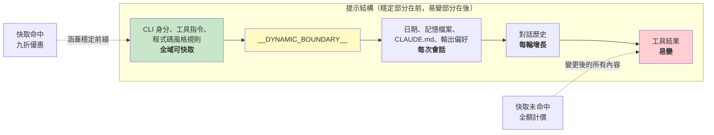

# 第十七章：效能 —— 每一毫秒與每一個 Token 都很重要

## 資深工程師的實戰手冊

代理式系統中的效能最佳化不是單一問題，而是五個：

1. **啟動延遲** —— 從按下按鍵到產出第一個有用輸出的時間。使用者會放棄那些啟動起來感覺很慢的工具。
2. **Token 效率** —— 上下文視窗中有用內容與額外開銷的佔比。上下文視窗是最受限的資源。
3. **API 成本** —— 每一輪對話的美元金額。提示快取可以將此降低 90%，但前提是系統必須在各輪之間維持快取穩定性。
4. **渲染吞吐量** —— 串流輸出期間的每秒幀數。第十三章涵蓋了渲染架構；本章涵蓋讓它保持快速的效能測量與最佳化。
5. **搜尋速度** —— 在每次按鍵時，從一個包含 270,000 個路徑的程式碼庫中找到一個檔案所需的時間。

Claude Code 以從顯而易見（記憶化）到精妙（用 26 位元點陣圖預過濾模糊搜尋）的各種技術來攻克這五大問題。關於方法論的說明：這些不是理論上的最佳化。Claude Code 內建了 50 多個啟動分析檢查點，對 100% 的內部使用者和 0.5% 的外部使用者進行取樣。以下每一項最佳化都是由此儀器化產生的數據所驅動，而非靠直覺。

---

## 在啟動時節省毫秒

### 模組層級的 I/O 並行化

進入點 `main.tsx` 刻意違反了「不要在模組作用域產生副作用」的原則：

```typescript
profileCheckpoint('main_tsx_entry');
startMdmRawRead();       // 啟動 plutil/reg-query 子行程
startKeychainPrefetch();  // 同時啟動兩個 macOS 鑰匙圈讀取
```

兩個 macOS 鑰匙圈項目否則會花費約 65ms 的循序同步子行程啟動。透過在模組層級以即發即忘的 promise 同時啟動兩者，它們與約 135ms 的模組載入並行執行——在此期間 CPU 原本只是閒置的。

### API 預連線

`apiPreconnect.ts` 在初始化期間向 Anthropic API 發出一個 `HEAD` 請求，讓 TCP+TLS 交握（100-200ms）與設定工作重疊。在互動模式下，重疊是無上限的——連線在使用者打字時就已暖機。該請求在 `applyExtraCACertsFromConfig()` 和 `configureGlobalAgents()` 之後發出，因此暖好的連線使用的是正確的傳輸配置。

### 快速路徑分派與延遲匯入

CLI 進入點包含針對專門子命令的提前返回路徑——`claude mcp` 永遠不會載入 React REPL，`claude daemon` 永遠不會載入工具系統。重型模組僅在需要時才透過動態 `import()` 載入：OpenTelemetry（約 400KB + 約 700KB gRPC）、事件記錄、錯誤對話框、上游代理。`LazySchema` 將 Zod schema 的建構延遲到首次驗證時，將成本推移到啟動之後。

---

## 在上下文視窗中節省 Token

### 插槽保留：預設 8K，截斷時升級至 64K

影響最大的單一最佳化：

預設的輸出插槽保留為 8,000 個 token，在截斷時升級至 64,000。API 為模型的回應保留 `max_output_tokens` 的容量。SDK 的預設值為 32K-64K，但生產數據顯示 p99 輸出長度為 4,911 個 token。預設值超額保留了 8-16 倍，每輪浪費 24,000-59,000 個 token。Claude Code 限制在 8K，並在罕見的截斷時（不到 1% 的請求）以 64K 重試。對於一個 200K 的視窗，這是可用上下文 12-28% 的改善——而且是免費的。

### 工具結果預算化

| 限制 | 值 | 用途 |
|------|-----|------|
| 每個工具的字元數 | 50,000 | 超過時將結果持久化到磁碟 |
| 每個工具的 token 數 | 100,000 | 約 400KB 文字上限 |
| 每則訊息的彙總值 | 200,000 字元 | 防止 N 個並行工具在一輪中耗盡預算 |

每則訊息的彙總值是關鍵洞見。沒有它，「讀取 src/ 中的所有檔案」可能產生 10 個並行讀取，每個返回 40K 字元。

### 上下文視窗大小調整

預設的 200K token 視窗可透過模型名稱上的 `[1m]` 後綴或實驗處理擴展至 1M。當使用量接近限制時，4 層壓縮系統會漸進式地摘要較舊的內容。Token 計數以 API 實際的 `usage` 欄位為準，而非客戶端的估算——這涵蓋了提示快取抵扣、思考 token 和伺服器端轉換。

---

## 節省 API 呼叫的費用

### 提示快取架構



Anthropic 的提示快取基於精確的前綴匹配運作。如果前綴中有單一個 token 發生變化，其後的所有內容都是快取未命中。Claude Code 將整個提示結構化，使穩定部分在前、易變部分在後。

當 `shouldUseGlobalCacheScope()` 回傳 true 時，動態邊界之前的系統提示項目會獲得 `scope: 'global'` —— 兩個執行相同 Claude Code 版本的使用者共享前綴快取。當存在 MCP 工具時會停用全域範圍，因為 MCP schema 是每個使用者各自不同的。

### 黏性閂鎖欄位

五個布林欄位使用「一旦開啟就不關閉」的模式——一旦為 true，在整個會話期間保持為 true：

| 閂鎖欄位 | 防止的問題 |
|----------|-----------|
| `promptCache1hEligible` | 會話中途的超額切換改變快取 TTL |
| `afkModeHeaderLatched` | Shift+Tab 切換導致快取失效 |
| `fastModeHeaderLatched` | 冷卻期進出導致快取雙重失效 |
| `cacheEditingHeaderLatched` | 會話中途的配置切換導致快取失效 |
| `thinkingClearLatched` | 在確認快取未命中後翻轉思考模式 |

每個閂鎖對應一個 header 或參數，如果在會話中途變更，將會導致約 50,000-70,000 個已快取提示 token 的快取失效。這些閂鎖犧牲了會話中途的切換能力，以保全快取。

### 記憶化的會話日期

```typescript
const getSessionStartDate = memoize(getLocalISODate)
```

沒有這個，日期會在午夜變更，導致整個已快取前綴失效。日期過期只是外觀問題；快取失效則會重新處理整個對話。

### 區段記憶化

系統提示區段使用兩層快取。大多數內容使用 `systemPromptSection(name, compute)`，快取到 `/clear` 或 `/compact` 為止。核武級選項 `DANGEROUS_uncachedSystemPromptSection(name, compute, reason)` 每輪都重新計算——命名慣例迫使開發者記錄「為什麼」需要破壞快取。

---

## 在渲染中節省 CPU

第十三章深入涵蓋了渲染架構——壓縮的型別陣列、基於池的字串駐留、雙緩衝和儲存格層級的差異比對。這裡我們聚焦於讓它保持快速的效能測量和自適應行為。

終端渲染器透過 `throttle(deferredRender, FRAME_INTERVAL_MS)` 節流在 60fps。當終端失去焦點時，間隔加倍為 30fps。捲動排放幀以四分之一間隔運行，以達到最大捲動速度。這種自適應節流確保渲染永遠不會消耗超過必要的 CPU。

React 編譯器（`react/compiler-runtime`）在整個程式碼庫中自動記憶化元件渲染。手動的 `useMemo` 和 `useCallback` 容易出錯；編譯器從構造上就做對了。預分配的凍結物件（`Object.freeze()`）消除了常見渲染路徑上值的記憶體配置——在替代螢幕模式下每幀省下一次配置，累積到數千幀就很可觀。

完整的渲染管線細節——`CharPool`/`StylePool`/`HyperlinkPool` 字串駐留系統、blit 最佳化、損壞矩形追蹤、OffscreenFreeze 元件——請參閱第十三章。

---

## 在搜尋中節省記憶體和時間

模糊檔案搜尋在每次按鍵時執行，搜尋 270,000 多個路徑。三層最佳化將它保持在幾毫秒以內。

### 點陣圖預過濾器

每個索引路徑都有一個 26 位元的點陣圖，記錄它包含哪些小寫字母：

```typescript
// 虛擬碼——說明 26 位元點陣圖的概念
function buildCharBitmap(filepath: string): number {
  let mask = 0
  for (const ch of filepath.toLowerCase()) {
    const code = ch.charCodeAt(0)
    if (code >= 97 && code <= 122) mask |= 1 << (code - 97)
  }
  return mask  // 每個位元代表 a-z 的某個字母是否存在
}
```

搜尋時：`if ((charBits[i] & needleBitmap) !== needleBitmap) continue`。任何缺少查詢字母的路徑都會立即失敗——一次整數比較，不需要字串操作。拒絕率：對於「test」這類廣泛查詢約 10%，對於包含罕見字母的查詢則超過 90%。成本：每個路徑 4 位元組，270,000 個路徑約 1MB。

### 分數上界拒絕與融合 indexOf 掃描

通過點陣圖的路徑在昂貴的邊界/駝峰式命名評分之前，會先面臨分數上界檢查。如果最佳情況的分數無法超越當前的 top-K 門檻，該路徑就會被跳過。

實際的匹配將位置查找與間隔/連續加分計算融合在一起，使用 `String.indexOf()`，這在 JSC（Bun）和 V8（Node）中都是 SIMD 加速的。引擎最佳化過的搜尋比手動的字元迴圈快得多。

### 可部分查詢的非同步索引

對於大型程式碼庫，`loadFromFileListAsync()` 每約 4ms 的工作後就讓出事件迴圈（基於時間而非數量——適應機器速度）。它回傳兩個 promise：`queryable`（第一個區塊完成時解析，啟用立即的部分結果）和 `done`（完整索引完成）。使用者可以在檔案列表可用後的 5-10ms 內就開始搜尋。

讓出檢查使用 `(i & 0xff) === 0xff` —— 一個無分支的模 256 運算，以分攤 `performance.now()` 的成本。

---

## 記憶相關性旁路查詢

有一個最佳化位於 token 效率和 API 成本的交叉點。如第十一章所述，記憶系統使用一個輕量級的 Sonnet 模型呼叫——而非主要的 Opus 模型——來選擇要包含哪些記憶檔案。其成本（在快速模型上最多 256 個輸出 token）與不包含無關記憶檔案所省下的 token 相比微不足道。單一個無關的 2,000 token 記憶檔案浪費的上下文成本，就超過旁路查詢的 API 呼叫成本。

---

## 推測性工具執行

`StreamingToolExecutor` 在工具串流進來時就開始執行，在完整回應完成之前。唯讀工具（Glob、Grep、Read）可以並行執行；寫入工具需要獨佔存取。`partitionToolCalls()` 函式將連續的安全工具分組為批次：[Read, Read, Grep, Edit, Read, Read] 變成三個批次——[Read, Read, Grep] 並行，[Edit] 序列，[Read, Read] 並行。

結果始終按原始工具順序產出，以確保模型推理的確定性。一個兄弟中止控制器會在 Bash 工具出錯時終止並行子行程，防止資源浪費。

---

## 串流與原始 API

Claude Code 使用原始串流 API 而非 SDK 的 `BetaMessageStream` 輔助工具。該輔助工具在每個 `input_json_delta` 上呼叫 `partialParse()`——在工具輸入長度上是 O(n^2)。Claude Code 累積原始字串，在區塊完成時才解析一次。

串流看門狗（`CLAUDE_STREAM_IDLE_TIMEOUT_MS`，預設 90 秒）會在沒有區塊到達時中止並重試，當代理失敗時回退到非串流的 `messages.create()`。

---

## 實踐應用：代理式系統的效能

**審核你的上下文視窗預算。** 你的 `max_output_tokens` 保留值與實際 p99 輸出長度之間的差距就是被浪費的上下文。設定一個緊湊的預設值，在截斷時再升級。

**為快取穩定性而設計。** 你提示中的每個欄位不是穩定的就是易變的。穩定的放前面，易變的放後面。將對話中途任何對穩定前綴的變更視為一個有美元成本的 bug。

**並行化啟動 I/O。** 模組載入是 CPU 密集的。鑰匙圈讀取和網路交握是 I/O 密集的。在匯入之前啟動 I/O。

**對搜尋使用點陣圖預過濾器。** 在昂貴的評分之前，一個廉價的預過濾器拒絕 10-90% 的候選項，以每個項目 4 位元組的成本就能獲得顯著的效能提升。

**在重要的地方進行測量。** Claude Code 有 50 多個啟動檢查點，內部取樣 100%、外部取樣 0.5%。沒有測量的效能工作就是瞎猜。

---

最後一個觀察：這些最佳化大多不是演算法上多複雜的。點陣圖預過濾器、環形緩衝區、記憶化、字串駐留——這些都是電腦科學的基本功。精妙之處在於知道在哪裡應用它們。啟動分析器告訴你毫秒花在哪裡。API 的 usage 欄位告訴你 token 花在哪裡。快取命中率告訴你錢花在哪裡。先測量，再最佳化，始終如此。